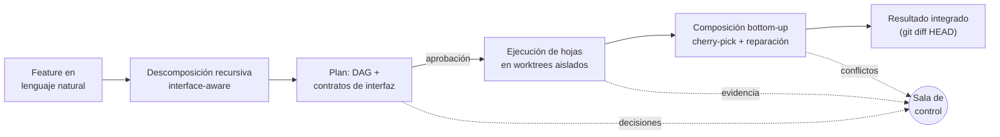
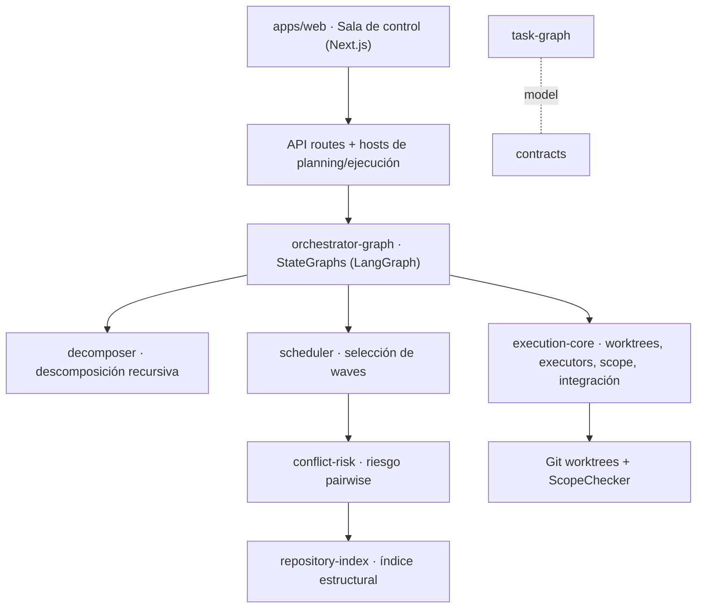

<div align="center">
  
  <p><strong>Sala de control para desarrollar software con múltiples agentes LLM trabajando en paralelo.</strong></p>
  <p>
    
    
    
    
  </p>
</div>

---

Coordinar varios agentes LLM sobre un mismo repositorio es frágil: se pisan los archivos, generan conflictos al integrar y no hay forma clara de supervisar qué está pasando ni por qué. **ManyHands** ataca ese problema con un mecanismo concreto: descompone una feature descrita en lenguaje natural en un **DAG de tareas con contratos de interfaz explícitos**, ejecuta las hojas en **git worktrees aislados**, y recompone el trabajo paralelo **de abajo hacia arriba** con reparación semántica guiada por esos contratos. Todo bajo una sala de control donde el estado se deriva de un log de eventos y las decisiones de alto impacto quedan en manos del desarrollador.

No es un *coding agent*: es la capa que **coordina** agentes — decide qué trabajo existe, qué dependencias hay entre partes, qué archivos puede tocar cada agente, cómo se supervisa el trabajo paralelo y cómo se valida e integra cada resultado.


> [!NOTE]
> Proyecto en desarrollo activo, desarrollado como Trabajo Final de Ingeniería en Sistemas de Información (UNS – Depto. de Cs. e Ingeniería de la Computación).

## Características clave

- **Descomposición recursiva *interface-aware*.** Cada nodo del plan decide si es atómico o se divide; al dividirse produce **contratos de interfaz** (las "costuras") que sus hijos deben honrar. Esos contratos son lo que vuelve seguro el paralelismo.
- **Ejecución aislada de verdad.** Cada tarea hoja corre en su propio **git worktree**, y un `ScopeChecker` valida contra el repo real qué archivos cambió. El límite de seguridad son los worktrees + el scope, no el modo de aprobación del CLI.
- **Composición *contract-aware*.** La integración es `cherry-pick` bottom-up; ante conflicto, un agente de reparación usa el `sharedInterface` y la intención de cada hijo para resolver con contexto en vez de un merge a ciegas.
- **Sala de control derivada de eventos.** La UI reduce un log append-only de `RunEvent` y deriva las vistas con selectores puros: grafo, ejecución, evidencia y un **canal único de decisiones** humanas.
- **`git diff HEAD` como única fuente de verdad.** El orquestador commitea; los agentes no. Lo que cambió se lee del repositorio, no de la salida del modelo.

## Cómo funciona



1. Describís una feature, módulo o cambio en lenguaje natural.
2. El `ClaudeCodeRecursiveDecomposer` la descompone en un `TaskGraph` jerárquico con contratos e interfaces compartidas.
3. Revisás el plan, dependencias y señales de riesgo; aprobás, editás o regenerás.
4. El scheduler selecciona **waves** de hojas que pueden correr en paralelo sin pisarse.
5. Cada hoja se ejecuta aislada; se capturan diff, logs, validación y scope.
6. El Composer integra los hijos completados bottom-up y repara conflictos con contexto.
7. Las decisiones de alto impacto aparecen como *gates* humanos; el resultado final se inspecciona y se acepta.


## Arquitectura

La web app no reimplementa la orquestación: llama a APIs respaldadas por los paquetes y renderiza artefactos validados (`TaskGraph`, `AgentTaskContract`, `RunEvent`, diffs, decisiones).



| Paquete | Responsabilidad | Doc |
|---|---|---|
| [`task-graph`](packages/task-graph) | `TaskNode`, `TaskGraph`, validación de DAG, orden topológico | [README](packages/task-graph/README.md) |
| [`contracts`](packages/contracts) | `AgentTaskContract`, `InterfaceContract`, `ExecutionScope` | [README](packages/contracts/README.md) |
| [`decomposer`](packages/decomposer) | Descomposición recursiva interface-aware | [README](packages/decomposer/README.md) |
| [`orchestrator-graph`](packages/orchestrator-graph) | StateGraphs de planning/ejecución y checkpoints | [README](packages/orchestrator-graph/README.md) |
| [`execution-core`](packages/execution-core) | Worktrees, executors, scope, recorder, integración | [README](packages/execution-core/README.md) |
| [`scheduler`](packages/scheduler) | Selección de waves consciente de scope/riesgo | [README](packages/scheduler/README.md) |
| [`conflict-risk`](packages/conflict-risk) | Predicción de riesgo de conflicto entre tareas | [README](packages/conflict-risk/README.md) |
| [`repository-index`](packages/repository-index) | Índice estructural de TypeScript (grounding) | [README](packages/repository-index/README.md) |
| [`run-store`](packages/run-store) | Persistencia JSON de snapshots de run | [README](packages/run-store/README.md) |
| [`trace-store`](packages/trace-store) | Eventos de traza append-only | [README](packages/trace-store/README.md) |
| [`apps/web`](apps/web) | Sala de control: Command Center + Run Workspace | [README](apps/web/README.md) |

Regla de dependencias: `apps → paquetes específicos → shared`. Nunca se importa desde `apps` dentro de un paquete; `@manyhands/core` es un barrel legacy que el código nuevo no debe usar.

## Inicio rápido

> [!IMPORTANT]
> El executor por defecto es **Gemini CLI**, que debe estar instalado y autenticado (requiere una API key). Es el seam por el que se ejecutan los agentes; ver [`docs/system/06-gemini-executor.md`](docs/system/06-gemini-executor.md).

**Requisitos:** Node.js ≥ 20, [pnpm](https://pnpm.io/) (el repo fija `pnpm@7.29.3` vía `packageManager`; `corepack enable` lo resuelve solo) y Gemini CLI.

```bash
# 1. Instalar dependencias
corepack enable
pnpm install

# 2. Tener Claude Code CLI (y opcionalmente Codex) en el PATH, o apuntar al binario:
export MANYHANDS_CLAUDE_BIN=/ruta/a/claude
# export MANYHANDS_CODEX_BIN=/ruta/a/codex

# 3. Levantar la sala de control (compila los paquetes y arranca Next.js)
pnpm web:dev

# 4. Abrir http://localhost:3000
```

## Uso

1. En el **Command Center** (`/`), describí la feature y elegí workspace, modelo y granularidad.
2. Revisá el plan generado (DAG, contratos, dependencias y riesgo) y aprobá.
3. Seguí la ejecución en el **Run Workspace** (`/runs/[runId]`): waves en paralelo, diffs y validación por hoja.
4. Respondé los *gates* humanos en el **canal de decisiones** cuando aparezcan.
5. Inspeccioná la integración y aceptá (o forkeá) el resultado.

## Estructura del proyecto

```text
manyhands/
├─ apps/
│  └─ web/            # Sala de control (Next.js App Router)
├─ packages/          # Núcleo de orquestación (TypeScript, sin acoplar a la web)
│  ├─ task-graph/     # Modelo de DAG
│  ├─ contracts/      # Contratos e interfaces
│  ├─ decomposer/     # Descomposición recursiva
│  ├─ orchestrator-graph/  # StateGraphs (LangGraph) + checkpoints
│  ├─ execution-core/ # Worktrees, executors, scope, integración
│  ├─ scheduler/      # Selección de waves
│  ├─ conflict-risk/  # Riesgo de conflicto
│  ├─ repository-index/    # Índice estructural
│  ├─ run-store/ · trace-store/   # Persistencia y trazas
│  └─ shared/         # Tipos y helpers base
└─ docs/              # Documentación del sistema, diseño y decisiones
```

## Stack tecnológico

- **Lenguaje:** TypeScript (monorepo con pnpm workspaces).
- **Orquestación:** [LangGraph.js](https://langchain-ai.github.io/langgraphjs/) (StateGraphs con checkpoints JSON para resume/fork).
- **Web:** Next.js 15 (App Router), React 19, Tailwind CSS 4, [@xyflow/react](https://reactflow.dev/) para el canvas del DAG.
- **Validación:** Zod en todas las fronteras de datos.
- **Agentes:** Gemini CLI vía el seam `AgentExecutor`.
- **Tests:** Vitest.

## Documentación

- [`docs/system/`](docs/system/) — cómo funciona el sistema de punta a punta, componente por componente.
- [`docs/design/`](docs/design/) — modelo agent-first de UI y orquestación.
- [`docs/DECISIONS.md`](docs/DECISIONS.md) — decisiones de diseño vigentes.
- [`docs/development/architecture.md`](docs/development/architecture.md) — mapa de arquitectura vivo.
