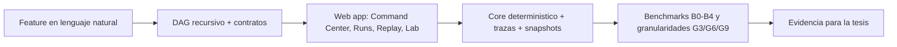

# ManyHands

ManyHands es un producto de tesis para orquestacion visual de agentes LLM en desarrollo de software. Convierte un objetivo de producto en un DAG jerarquico, asigna contratos atomicos a las hojas, ejecuta trabajo aislado o deterministico, y conserva trazas y artefactos para explicar cada decision.

La tesis estudia si una arquitectura basada en descomposicion recursiva, ejecucion paralela aislada y scheduling consciente de conflictos mejora la coordinacion, la trazabilidad y la robustez frente a estrategias monoliticas o paralelas naive.



## Producto actual

La cara visible del proyecto hoy es una web app sobre el core de dominio del monorepo. El objetivo no es solo generar planes, sino hacer visible el sistema de orquestacion completo para que un developer pueda inspeccionar, ejecutar y comparar evidencia.

Las superficies principales son:

- Command Center (`/`): entrada prompt-first para describir una feature y crear una run.
- Workspaces (`/workspaces`): configuracion de repos y contexto de planificacion.
- Runs (`/runs/[runId]`): DAG, inspector, trazas, validaciones y lifecycle de la ejecucion.
- Replay (`/replay/demo`): canvas read-only sobre snapshots deterministas.
- Lab Mode (`/lab`): benchmarks, reports y comparacion de granularidad.

El producto usa el mismo modelo para demo, inspeccion y evidencia de tesis. Lab Mode no es la identidad completa del sistema; es el laboratorio controlado que permite comparar estrategias sin mezclar la varianza del modelo con la varianza de la arquitectura.

## Tesis

La tesis trata a ManyHands como un artefacto de investigacion, no como un simple benchmark runner. El foco esta en evaluar si descomponer una tarea de software en subproblemas atomicos, ejecutar hojas en aislamiento y recomponer resultados bottom-up produce mejor coordinacion que una ejecucion monolitica o naive.

Pregunta de investigacion:

> ¿Puede una arquitectura basada en descomposicion recursiva, ejecucion paralela aislada y scheduling consciente de conflictos mejorar la coordinacion, la trazabilidad y la robustez de agentes LLM de software frente a estrategias monoliticas o paralelas naive?

La evidencia se separa por etapas:

- Evidencia estructural: forma del DAG, profundidad, cantidad de hojas y dependencias.
- Evidencia de ejecucion: batches, conflictos, integraciones, validaciones y diffs.
- Evidencia de producto: claridad del flujo visual, inspeccion y trazabilidad.

Baselines experimentales:

- B0 - single agent
- B1 - sequential DAG
- B2 - parallel naive
- B3 - parallel + integration
- B4 - parallel + risk-aware scheduling + integration

Targets de granularidad:

- G3 - aproximadamente 3 hojas
- G6 - aproximadamente 6 hojas
- G9 - aproximadamente 9 hojas

La metrica de comparacion vive en `GranularityVector` y combina señales pre y post ejecucion: profundidad del arbol, cantidad de hojas, tasa de integracion, tasa de conflicto, duracion total, costo, tests aprobados, cambios realizados y desviaciones de scope.

## Arquitectura del monorepo

```txt
apps/web/                 Next.js web app
packages/task-graph/      DAG, validacion, estados
packages/contracts/       contratos de tarea y validaciones
packages/decomposer/      descomposicion recursiva y mocks
packages/scheduler/       politicas de batching
packages/run-store/       snapshots y patches
packages/trace-store/     trazas de planificacion y ejecucion
packages/evaluator/       metricas y reportes experimentales
packages/execution-core/  contratos y scaffolding de ejecucion real
packages/conflict-risk/    señales estaticas de conflicto
packages/scope-validation/ enforcement de scope
packages/repository-index/ indexado estructural del repositorio
packages/shared/          schemas y helpers compartidos
packages/core/            barrel de compatibilidad heredada
```

La direccion de dependencia buscada es:

```txt
apps -> core -> domain packages -> shared
```

Para mas contexto de arquitectura y roadmap, ver:

- `docs/development/architecture.md`
- `docs/development/web-app-roadmap.md`
- `docs/development/ui-vision.md`
- `docs/development/thesis-plan.md`
- `docs/adr/0012-product-vision-and-roadmap-realignment.md`
- `docs/design/decomposer-composer-redesign.md`

## Estado actual

Hoy el proyecto ya tiene:

- un core deterministico para grafos, contratos, scheduling, snapshots y trazas;
- una app web funcional para Command Center, Workspaces, Replay y Lab Mode;
- reportes y fixtures de benchmark para comparar configuraciones de forma reproducible;
- la base de ejecucion real preparada para worktrees, scope checks, integration y metricas.

Lo que sigue es profundizar la capa de ejecucion real y el flujo agente a agente sin perder la separacion entre producto y evidencia de tesis.

## Comandos utiles

```bash
pnpm install

# Desarrollo
pnpm web:dev

# Validacion
pnpm test
pnpm typecheck
pnpm web:typecheck
pnpm web:lint
pnpm build

# Laboratorio y demos
pnpm demo:plan
pnpm demo:execute:mock
pnpm demo:index:repo
pnpm demo:compare:granularity
pnpm demo:benchmark:mock
pnpm demo:benchmark:conflicts
```

## Documentacion clave

- `docs/development/thesis-plan.md` - framing academico y separacion de evidencias
- `docs/development/web-app-roadmap.md` - roadmap de la app web
- `docs/development/ui-vision.md` - modelo de interaccion y canvas
- `docs/development/architecture.md` - arquitectura actual del producto
- `docs/adr/0012-product-vision-and-roadmap-realignment.md` - decision de realinear el roadmap hacia el producto visual
- `docs/design/decomposer-composer-redesign.md` - redisenio del Decomposer y del Composer