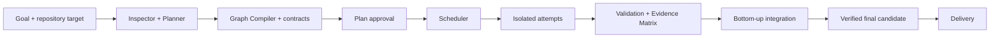

<div align="center">
  
  <p><strong>Coordinar agentes para convertir un objetivo de software en una entrega verificable.</strong></p>
</div>

---

ManyHands es una sala de control para desarrollo de software con múltiples
agentes. El usuario describe un objetivo, revisa un grafo de trabajo grounded en
el repositorio, observa intentos aislados, responde decisiones puntuales y recibe
un candidato integrado con evidencia.

> [!IMPORTANT]
> El proyecto está en transición. [`docs/`](docs/) define la arquitectura
> objetivo; el código actual puede implementar solo una parte. No uses la
> documentación como evidencia de que una capacidad ya funciona.

## Propuesta de producto

- **Grafo híbrido:** raíz orientada al objetivo, composites como límites reales
  de integración y hojas como cambios cohesivos verificables.
- **Relaciones explícitas:** artifacts para flujo material, seams para
  compatibilidad y constraints para riesgo/scheduling.
- **Intentos aislados:** worktree e inputs identificables por ejecución.
- **Recuperación por causa:** timeout, código, contrato, dependencia, entorno e
  integración reciben políticas diferentes.
- **Validación por evidencia:** cada criterio se vincula al commit exacto.
- **Intervención humana local:** una decisión bloquea solo trabajo dependiente.
- **Grafo como centro:** planning y ejecución en una superficie; evidencia y
  entrega toman el centro al final.

## Arquitectura objetivo



La especificación completa está en:

- [`PRODUCT.md`](PRODUCT.md): propósito y principios.
- [`docs/DECISIONS.md`](docs/DECISIONS.md): decisiones objetivo.
- [`docs/system/`](docs/system/): contratos técnicos.
- [`docs/design/`](docs/design/): experiencia y sistema visual.
- [`docs/development/architecture.md`](docs/development/architecture.md): mapa de
  componentes y transición inicial.
- [`docs/plans/2026-07-17-target-architecture-transition.md`](docs/plans/2026-07-17-target-architecture-transition.md):
  plan incremental de implementación.
- [`docs/plans/2026-07-17-multi-agent-orchestration.md`](docs/plans/2026-07-17-multi-agent-orchestration.md):
  manual para coordinar agentes y waves.

## Estado actual del repositorio

El monorepo TypeScript contiene implementaciones existentes que servirán como
punto de partida:

| Área | Ubicación actual |
|---|---|
| Web / run workspace | `apps/web` |
| Grafo de tareas | `packages/task-graph` |
| Contratos | `packages/contracts` |
| Planning recursivo | `packages/decomposer` |
| Control plane | `packages/orchestrator-graph` |
| Worktrees, agentes e integración | `packages/execution-core` |
| Scheduling y riesgo | `packages/scheduler`, `packages/conflict-risk` |
| Grounding estructural | `packages/repository-index` |
| Persistencia y trazas | `packages/run-store`, `packages/trace-store` |

Esta tabla describe ubicación, no conformidad con el target.

## Inicio rápido del sistema actual

Requisitos: Node.js ≥20, pnpm (el repo fija su versión) y Claude Code CLI para
el perfil default actual. Codex CLI es una alternativa disponible.

```bash
corepack enable
pnpm install
pnpm web:dev
```

Abrir `http://localhost:3000`.

Variables actuales:

- `MANYHANDS_CLAUDE_BIN`
- `MANYHANDS_CODEX_BIN`
- `MANYHANDS_DECOMPOSER`

## Verificación

```bash
pnpm test
pnpm -r --filter "./packages/*" typecheck
pnpm --filter @manyhands/web exec tsc --noEmit
pnpm build
pnpm web:build
```

## Alcance

ManyHands no es un IDE, un benchmark runner, un Lab Mode, un sistema de training
ni una plataforma multi-tenant. La prioridad es lograr un run local-first
confiable, observable y capaz de entregar cambios funcionales.
