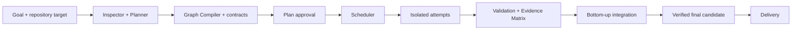

<div align="center">
  
  <p><strong>Coordinar agentes para convertir un objetivo de software en una entrega verificable.</strong></p>
</div>

---

ManyHands es una sala de control para desarrollo de software con múltiples
agentes. El usuario describe un objetivo, revisa un grafo de trabajo grounded en
el repositorio, observa intentos aislados, responde decisiones puntuales y recibe
un candidato integrado con evidencia.

> [!IMPORTANT]
> Esta documentación describe el sistema implementado actualmente. El código,
> los tests y los journals persistidos son la evidencia de que una capacidad
> concreta funciona; los documentos de planes y auditorías no forman parte del
> recorrido principal para comprender la arquitectura.

## Propuesta de producto

- **Grafo híbrido:** raíz orientada al objetivo, composites como límites reales
  de integración y hojas como cambios cohesivos verificables.
- **Relaciones explícitas:** artifacts para flujo material, seams para
  compatibilidad y constraints para riesgo/scheduling.
- **Intentos aislados:** worktree e inputs identificables por ejecución.
- **Recuperación por causa:** timeout, código, contrato, dependencia, entorno e
  integración reciben políticas diferentes.
- **Validación por evidencia:** cada criterio se vincula al commit exacto.
- **Intervención humana local:** una decisión bloquea solo trabajo dependiente.
- **Grafo como centro:** planning y ejecución en una superficie; evidencia y
  entrega toman el centro al final.

## Arquitectura implementada



La ruta productiva separa decisiones de dominio de sus adaptadores. El
`RunCoordinator` valida comandos y pliega eventos; el host web conecta planning,
ejecución, persistencia, Git y streaming sin convertirlos en fuentes de verdad
paralelas.

La documentación principal está en:

- [`PRODUCT.md`](PRODUCT.md): propósito y principios.
- [`docs/DECISIONS.md`](docs/DECISIONS.md): decisiones vigentes.
- [`docs/system/`](docs/system/): contratos técnicos.
- [`docs/design/`](docs/design/): experiencia y sistema visual.
- [`docs/development/architecture.md`](docs/development/architecture.md): guía
  completa del sistema, estrategias, componentes y recorrido de un run.
- [`docs/development/problem-solving-strategies.md`](docs/development/problem-solving-strategies.md):
  riesgos controlados, estrategia, mecanismo y evidencia real de código/tests.
- [`docs/development/library-usage.md`](docs/development/library-usage.md): uso
  efectivo y límites de las librerías principales.

## Mapa actual del repositorio

| Responsabilidad | Implementación actual |
|---|---|
| Web / run workspace | `apps/web` |
| Lifecycle, comandos, eventos y decisiones | `packages/run-coordinator` |
| Grafo tipado y revisiones | `packages/task-graph` |
| Contratos versionados | `packages/contracts` |
| Planner semántico, Graph Compiler y critics | `packages/decomposer` |
| Driver de ejecución | `packages/orchestrator-graph` |
| Worktrees, bases, agentes, validación e integración | `packages/execution-core` |
| Scheduling y riesgo | `packages/scheduler`, `packages/conflict-risk` |
| Grounding estructural | `packages/repository-index` |
| Event journal, snapshots, attempts y artifacts | `packages/run-store` |
| Telemetría diagnóstica | `packages/trace-store` |

`@manyhands/core` no participa en la ruta productiva. React Flow, Git y los CLIs
son adapters activos: no definen el lifecycle persistido. LangChain/LangGraph
siguen declarados en web, pero no tienen imports productivos y no conducen el
control plane actual.

## Inicio rápido

Requisitos: Node.js ≥20, pnpm (el repo fija su versión) y Claude Code CLI para
el perfil default actual. Codex CLI es una alternativa disponible.

```bash
corepack enable
pnpm install
pnpm web:dev
```

Abrir `http://localhost:3000`.

Variables de selección local:

- `MANYHANDS_CLAUDE_BIN`
- `MANYHANDS_CODEX_BIN`
- `MANYHANDS_DECOMPOSER`

## Estado verificado

El flujo de dominio completo —planning compilado, ejecución aislada, adopción,
integración, validación y delivery— tiene cobertura E2E automatizada. Los smokes
manuales con CLIs reales prueban integración operativa, pero un smoke que solo
llega a aprobación no demuestra por sí mismo delivery.

El streaming progresivo de planning está demostrado con Claude Code CLI. El
adapter de Codex consume stdout incremental, pero su granularidad depende de lo
que emita la CLI y se considera soporte parcial hasta una verificación dedicada.

## Verificación

```bash
pnpm test
pnpm -r --filter "./packages/*" typecheck
pnpm --filter @manyhands/web exec tsc --noEmit
pnpm build
pnpm web:build
```

## Alcance

ManyHands no es un IDE, un benchmark runner, un Lab Mode, un sistema de training
ni una plataforma multi-tenant. La prioridad es lograr un run local-first
confiable, observable y capaz de entregar cambios funcionales.
