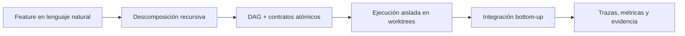

# ManyHands

ManyHands es una aplicación y plataforma experimental para orquestar agentes LLM en tareas de desarrollo de software. Parte de una feature escrita en lenguaje natural, la descompone en un DAG jerárquico de subtareas, asigna contratos de trabajo a las hojas, ejecuta esas hojas de forma aislada y luego integra los resultados de abajo hacia arriba.

El proyecto nace como tesis de Ingeniería en Sistemas. La pregunta central es si existe una granularidad óptima de descomposición que mejore la calidad, coordinación y trazabilidad del trabajo producido por agentes LLM paralelos.



## Qué problema resuelve

Los agentes de código actuales pueden ser muy capaces, pero tienden a fallar cuando una tarea crece en tamaño, ambigüedad o superficie de conflicto. ManyHands explora una hipótesis concreta: en lugar de pedirle a un único agente que haga todo, un orquestador puede dividir el trabajo en subtareas más pequeñas, ejecutar esas subtareas con aislamiento explícito y medir qué tan bien se recomponen los resultados.

El objetivo no es crear otro agente de código. ManyHands es el sistema que coordina agentes: decide qué trabajo existe, qué dependencias hay entre partes, qué archivos puede tocar cada agente, cuándo se puede ejecutar en paralelo, qué conflictos se esperan y cómo se registra la evidencia de cada paso.

## Cómo funciona

El flujo principal del producto es:

1. El usuario describe una feature desde la web app.
2. El decomposer genera un grafo de tareas con nodos `root`, `integrator` y hojas ejecutables.
3. Cada hoja recibe un `AgentTaskContract` con objetivo, criterios de aceptación, scope permitido, paths prohibidos y comandos de validación.
4. El scheduler agrupa hojas listas para ejecutar respetando dependencias y, más adelante, señales de riesgo de conflicto.
5. El execution core crea worktrees, invoca Gemini CLI (`gemini`, headless) para cada hoja, captura `git diff HEAD` como fuente de verdad y valida scope.
6. El orquestador hace commits, integra resultados con cherry-pick y registra trazas, métricas y artefactos.

El diseño separa deliberadamente tres capas: planificación, ejecución e investigación. La aplicación puede mostrar el DAG y el estado de una run; el core puede ejecutar y validar; el laboratorio puede comparar estrategias bajo condiciones controladas.

## La aplicación

La cara visible de ManyHands es una web app en Next.js orientada a inspección y control de runs.

Superficies principales:

- `/`: Command Center para crear runs desde un prompt.
- `/workspaces`: configuración de repositorios y contexto de planificación.
- `/runs/[runId]`: vista canónica de una run, con DAG, inspector, lifecycle y eventos SSE.
- `/replay/demo`: replay determinista de snapshots para demos y regresión visual.
- `/lab`: laboratorio de benchmarks y comparación de estrategias.

El canvas del DAG usa `@xyflow/react` (React Flow). No es "React Canvas": es un grafo interactivo basado en componentes React, con nodos, edges, minimap, filtros e inspector.

## La tesis

ManyHands también es un artefacto académico. La tesis evalúa una arquitectura de orquestación para agentes LLM de software, con foco en granularidad, paralelismo, aislamiento y trazabilidad.

Pregunta de investigación:

> ¿Puede una arquitectura basada en descomposición recursiva, ejecución paralela aislada y scheduling consciente de conflictos mejorar la coordinación, la trazabilidad y la robustez de agentes LLM de software frente a estrategias monolíticas o paralelas naive?

La comparación se organiza alrededor de dos dimensiones:

- Estrategia de ejecución: single agent, DAG secuencial, paralelo naive, paralelo con integración y paralelo risk-aware.
- Granularidad: aproximadamente 3, 6 o 9 hojas ejecutables por feature.

Baselines experimentales:

- `B0`: single agent.
- `B1`: sequential DAG.
- `B2`: parallel naive.
- `B3`: parallel + IntegrationAgent.
- `B4`: parallel + risk-aware + IntegrationAgent.

Targets de granularidad:

- `G3`: alrededor de 3 hojas.
- `G6`: alrededor de 6 hojas.
- `G9`: alrededor de 9 hojas.

La métrica central es `GranularityVector`, que combina señales previas a la ejecución, como profundidad del DAG, cantidad de hojas y dependencias, con señales posteriores, como tasa de éxito de integración, tasa de conflicto, duración, tests aprobados, líneas cambiadas, commits inesperados y violaciones de scope.

## Estado actual

ManyHands ya tiene una base funcional de producto, core de ejecución y los dos artefactos de tesis:

- modelo de grafo con nodos `root`, `integrator` y hojas;
- generación de runs desde prompt en la web app;
- **decomposer recursivo interface-aware** (`GeminiRecursiveDecomposer`) como default del producto, con baselines Anthropic opt-in y fallback determinista para Lab Mode;
- **composer contract-aware** que inyecta los seams de interfaz en las instrucciones de cada hoja;
- **execution core completo** (`@manyhands/execution-core`): `WorktreeManager`, `GeminiCliExecutor` (+ mock determinístico), `ScopeChecker`, `ResultRecorder`, `ValidationRunner`, `IntegrationAgent` (cherry-pick + reparación con Gemini), `BatchScheduler`, `GranularityVector` y `RunExecutor`;
- web app cableada al motor real (`RunExecutor` + `GeminiCliExecutor`) sobre un repo fixture provisionado, con SSE de ejecución y paneles de evidencia (execution summary + granularity vector);
- persistencia JSON de workspaces y runs; canvas DAG read-only compartido entre producto y replay;
- fixtures de benchmark (`task-manager-api`, `expression-calculator`) para experimentos de granularidad.

El siguiente tramo de desarrollo es **la evidencia empírica**: correr la matriz de baselines (B0-B4) y granularidades (G3/G6/G9) con agentes Gemini reales sobre las fixtures y analizar el `GranularityVector` resultante. Hasta ahora la validación es estructural (mock + E2E), no empírica.

## Arquitectura del monorepo

```txt
apps/
  web/                  Next.js App Router UI

packages/
  task-graph/           DAG, nodos, validación y dependencias
  contracts/            contratos de tareas y comandos de validación
  decomposer/           descomposición LLM y determinista
  scheduler/            políticas sequential, naive y risk-aware
  run-store/            snapshots, patches y persistencia de runs
  trace-store/          eventos de planificación y ejecución
  execution-core/       contratos, errores y ejecución real en desarrollo
  conflict-risk/        señales de riesgo de conflicto
  scope-validation/     validación de scope para resultados
  repository-index/     índice estructural del repositorio
  evaluator/            métricas y reportes experimentales
  shared/               schemas y helpers compartidos
  core/                 barrel de compatibilidad heredada

benchmarks/
  task-manager-api/     fixture Express para experimentos

docs/
  adr/                  decisiones de arquitectura
  development/          arquitectura, roadmap y plan de tesis
```

La dirección de dependencia buscada es:

```txt
apps -> packages específicos -> shared
```

`@manyhands/core` existe como barrel de compatibilidad, pero el desarrollo nuevo debe depender de paquetes específicos.

## Principios de diseño

- `graph.dependencies` es la fuente canónica de dependencias; `node.dependencies` es un shortcut sincronizado.
- El campo canónico de intención de tarea es `goal`.
- Gemini CLI (`gemini`, headless) es el executor de subagentes y el step-model del decomposer recursivo.
- `git diff HEAD` es la fuente de verdad del resultado de un agente (el stdout/stderr solo se persiste como diagnóstico).
- El orquestador hace commit; los agentes no deben commitear.
- El aislamiento real lo dan el git worktree aislado + el `ScopeChecker`; el `SandboxMode` del contrato se mapea a `--approval-mode yolo` en Gemini headless.
- La integración se hace con cherry-pick de commits hijo sobre rama padre.
- El límite por defecto es `maxParallel = 3`.
- Los timeouts por defecto son 5 minutos por hoja y 10 minutos para integración.

## Stack

- TypeScript
- pnpm workspaces
- Next.js 15
- React 19
- Tailwind CSS 4
- Zod
- Vitest
- tsup
- `@xyflow/react` para el DAG canvas
- Gemini CLI (`gemini`) para planificación recursiva y ejecución real de subagentes

## Primeros pasos

```bash
pnpm install
pnpm build
pnpm web:dev
```

La web app corre por defecto en `http://localhost:3000`.

## Comandos útiles

```bash
# Tests
pnpm test

# Typecheck de packages
pnpm typecheck

# Typecheck de execution-core
pnpm -F @manyhands/execution-core typecheck

# Typecheck de la web app
pnpm web:typecheck

# Build de packages
pnpm build

# Desarrollo web
pnpm web:dev
```

Comandos de laboratorio y demos:

```bash
pnpm demo:plan
pnpm demo:execute:mock
pnpm demo:index:repo
pnpm demo:compare:granularity
pnpm demo:benchmark:mock
pnpm demo:benchmark:conflicts
```

## Documentación clave

- [`docs/development/architecture.md`](docs/development/architecture.md): arquitectura del producto y paquetes.
- [`docs/development/thesis-plan.md`](docs/development/thesis-plan.md): framing académico y separación de evidencia.
- [`docs/development/web-app-roadmap.md`](docs/development/web-app-roadmap.md): roadmap de la web app.
- [`docs/development/ui-vision.md`](docs/development/ui-vision.md): dirección visual e interacción.
- [`docs/adr/`](docs/adr/): decisiones de arquitectura.
- [`apps/web/README.md`](apps/web/README.md): detalles de rutas, APIs y canvas web.

## Alcance y límites

ManyHands está en desarrollo activo. La capa de planificación, visualización, persistencia de runs, laboratorio determinista y el pipeline de ejecución real (worktrees, Gemini CLI, commits orquestados e integración bottom-up) ya existen y están cableados de punta a punta.

Lo que aún no existe es la **evidencia empírica**: los experimentos de granularidad con agentes Gemini reales todavía no se corrieron. Los resultados mock del laboratorio sirven para validar estructura, reproducibilidad y trazabilidad, pero no deben interpretarse como evidencia final de calidad de código producida por agentes reales. Esa evidencia requiere correr la matriz de baselines y granularidades sobre las fixtures y analizar el `GranularityVector` resultante.
