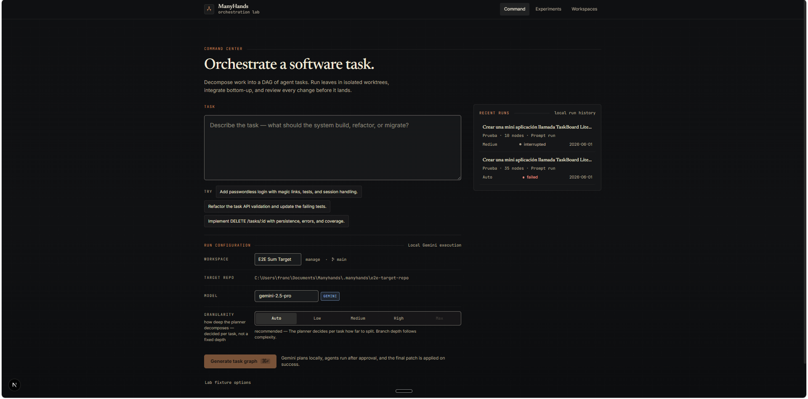
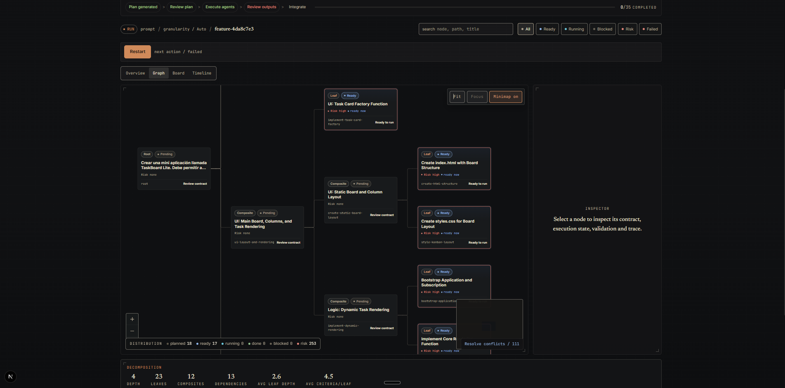

# ManyHands

ManyHands es un sistema de orquestación de agentes LLM para desarrollo de software. Toma una feature descrita en lenguaje natural, la descompone recursivamente en un DAG jerárquico de subtareas con costuras de interfaz explícitas, ejecuta cada hoja en su propio git worktree aislado con Gemini CLI, e integra los resultados de abajo hacia arriba con cherry-pick.

No es un agente de código. Es la capa que coordina agentes: decide qué trabajo existe, qué dependencias hay entre partes, qué archivos puede tocar cada agente, cómo se ejecutan en paralelo sin colisionar, y cómo se valida e integra cada resultado.





---

## El producto

La cara visible es una web app en Next.js orientada a inspección y control de runs.

- **`/`** — Command Center: describir la feature, elegir workspace (repo local), modelo y nivel de granularidad.
- **`/workspaces`** — configurar los repositorios locales donde ManyHands va a ejecutar.
- **`/runs/[runId]`** — vista canónica del run con DAG interactivo, inspector de nodos (contrato, scope, costuras, diff, trazas), timeline y board.

El flujo principal:

1. El usuario describe la feature y crea el run.
2. El **`GeminiRecursiveDecomposer`** genera el DAG con un `sharedInterface` por nivel de descomposición (las firmas TypeScript que los hijos paralelos deben respetar).
3. El usuario revisa el plan en la web app — puede editar nodos, regenerar subárboles, ajustar dependencias — y lo aprueba.
4. El **`RunExecutor`** despacha hojas en batches (default `maxParallel = 3`), cada una en su propio `git worktree`.
5. Por hoja: el **`FileSystemContextPacker`** arma el prompt con los archivos relevantes y las interfaces consumidas; **`GeminiCliExecutor`** invoca Gemini headless (`--approval-mode yolo`); el **`ScopeChecker`** valida que el agente no salió de su scope; el **`ResultRecorder`** captura `git diff HEAD` y el orquestador hace el commit.
6. El **`IntegrationAgent`** integra los hijos de cada composite con cherry-pick. Si hay conflicto, hace un repair semántico con Gemini que recibe el goal del padre, el `sharedInterface` canónico y la intención de cada hijo.
7. Al final del run, se computa el **`GranularityVector`** (17 métricas: 9 pre-ejecución sobre la estructura del DAG, 8 post-ejecución sobre los resultados).

Una explicación más detallada de cada componente está en [`docs/system/`](docs/system/).

## La tesis (en standby como formulación)

ManyHands nace como tesis de Ingeniería en Sistemas. La pregunta de investigación que orientó el diseño es: **¿puede una arquitectura de orquestación basada en descomposición recursiva con costuras de interfaz explícitas, ejecución paralela aislada e integración consciente del contrato mejorar la coordinación, trazabilidad y robustez de agentes LLM de software frente a estrategias monolíticas o paralelas naive?**

La formulación final de la tesis está aún en revisión. Lo que ya está definido y construido son los dos artefactos que el sistema aporta como contribución técnica:

- **Artifact 1 — Decomposer recursivo interface-aware.** En vez de descomponer en una sola llamada al LLM con un objetivo de cantidad de nodos, cada nodo se evalúa localmente con una rúbrica de atomicidad, y cuando se descompone produce un `sharedInterface`: las definiciones de tipos y firmas que los hijos paralelos deben honrar. Esto convierte el paralelismo entre agentes en un problema de contrato, no de adivinanza.
- **Artifact 2 — Composer contract-aware.** Cuando el cherry-pick produce un conflicto, el repair semántico recibe el `sharedInterface` canónico del composite, no solo el texto del conflicto. Los conflictos se resuelven por referencia al contrato, no por merge textual.

La narrativa completa de la evolución del proyecto (incluyendo decisiones que ya no son vigentes) está en [`docs/thesis/project-evolution.md`](docs/thesis/project-evolution.md).

## Estado actual

El pipeline está cableado de punta a punta y los dos artifacts están implementados. Lo que aún **no existe** es la evidencia empírica: el sistema funciona con mocks/E2E estructurales, pero la matriz de experimentos con agentes Gemini reales sobre las fixtures todavía no se corrió. La metodología experimental original (`G3/G6/G9` como targets de profundidad de árbol y `mock-v0`/`conflict-v0` como benchmarks deterministas) fue abandonada — la granularidad se redefinió como **agresividad de descomposición** (`low | medium | high`) que sesga el umbral de atomicidad por nodo, no la forma del árbol. El diseño del nuevo Lab está pendiente.

### Verificación rápida

```bash
pnpm test          # 344 passing, 3 skipped
pnpm build         # todos los packages
pnpm web:typecheck # 0 errores
```

## Arquitectura del monorepo

```
apps/
  web/                  Next.js App Router — Command Center, Run workspace

packages/
  task-graph/           TaskNode, TaskGraph, DAG, validación, topo sort
  contracts/            AgentTaskContract V1+V2, InterfaceContract
  decomposer/           GeminiRecursiveDecomposer (default) + baselines Anthropic
  execution-core/       Pipeline completo: worktree, executor, scope, recorder,
                        integration, scheduler, granularity, RunExecutor
  scheduler/            sequential, naive, risk-aware
  run-store/            RunSnapshot, patches, JSON persistence
  trace-store/          TraceEvent (planning + execution)
  conflict-risk/        Predicción de conflictos entre hojas
  repository-index/     Índice estructural del repo (alimenta conflict-risk)
  shared/               EntityId, IsoTimestamp, helpers
  core/                 Barrel legacy — usar packages específicos para código nuevo

benchmarks/
  expression-calculator/ Fixture con costuras reales (tokenize → parse → evaluate)
  task-manager-api/      Fixture REST API (PUT/DELETE como stubs)

docs/
  system/               Documentación de cada componente del sistema
  adr/                  29 ADRs — registro histórico de decisiones
  design/               Diseño detallado de los artifacts de tesis
  thesis/               Narrativa del proyecto
  development/          Arquitectura, plan de tesis, visión de producto y UI
  DECISIONS.md          Síntesis de decisiones cerradas (referencia para agentes)
```

Dirección de dependencias: `apps → packages específicos → shared`. `@manyhands/core` queda como barrel legacy que la web app aún consume para tipos, pero el código nuevo no debe depender de él.

## Stack

- TypeScript (strict, `exactOptionalPropertyTypes`)
- pnpm workspaces
- Next.js 15, React 19, Tailwind CSS 4
- `@xyflow/react` para el DAG canvas
- Zod para validación de runtime
- Vitest, tsup
- **Gemini CLI** (`gemini`, headless) — ejecución de subagentes y step-model del decomposer recursivo

## Primeros pasos

```bash
pnpm install
pnpm build
pnpm web:dev    # http://localhost:3000
```

Para ejecutar runs reales hace falta tener Gemini CLI instalado y en `PATH` (o configurar `MANYHANDS_GEMINI_BIN`).

## Documentación

| Documento | Para qué sirve |
|-----------|----------------|
| [`docs/system/`](docs/system/) | **Cómo funciona cada componente del sistema** — punto de entrada recomendado para alguien que llega nuevo al proyecto |
| [`docs/DECISIONS.md`](docs/DECISIONS.md) | Síntesis LLM-first de decisiones de arquitectura cerradas |
| [`docs/thesis/project-evolution.md`](docs/thesis/project-evolution.md) | Narrativa completa de cómo evolucionó el proyecto |
| [`docs/design/decomposer-composer-redesign.md`](docs/design/decomposer-composer-redesign.md) | Diseño detallado de los dos artifacts de tesis |
| [`docs/adr/`](docs/adr/) | 29 ADRs — registro histórico de decisiones |
| [`docs/development/architecture.md`](docs/development/architecture.md) | Vista de arquitectura desde el código |
| [`apps/web/README.md`](apps/web/README.md) | Detalles de rutas, APIs y canvas web |
