# ManyHands - Libro técnico para la entrevista

> Objetivo: llegar a la entrevista pudiendo explicar el proyecto con claridad,
> defender sus decisiones técnicas, reconocer sus límites y trasladar sus
> principios a un contexto Python/AWS sin atribuirle capacidades que no tiene.
> La presentación tiene 11 diapositivas principales y 3 de respaldo; el recorrido obligatorio termina en la 11.

Este libro enseña primero el sistema y sus fundamentos. El material para practicar
la exposición aparece después del recorrido técnico integral. Podés leerlo por
capas: comprender el flujo, profundizar los mecanismos y recién entonces ensayar.

## Cómo leer este libro en 24 horas

### Primera pasada - Esencial

Leé los conceptos marcados como esenciales y tratá de reconstruir el flujo de un
run sin mirar. El objetivo es dominar el relato causal, no memorizar clases.

### Segunda pasada - Importante

Profundizá contratos, identidad, concurrencia, validación, integración y recovery.
Usá las preguntas para descubrir dónde tu explicación todavía tiene huecos.

### Tercera pasada - Profundización y evidencia

Revisá fragmentos reales, tests y trade-offs. Separá siempre implementación actual,
historia, smoke observado, fixture, transferencia hipotética y trabajo futuro.

## Mapa de estudio por diapositiva

| Diapositiva | Concepto que debo poder explicar | Dónde estudiarlo |
|---:|---|---|
| 1 | Qué es ManyHands y cuál es la unidad de producto | [Proyecto en tres duraciones](#3-el-proyecto-en-tres-duraciones) |
| 2 | Por qué una funcionalidad grande no es una tarea lineal | [Problema de tesis](#problema-de-tesis) y [pregunta 1](#1-por-qué-no-resolver-todo-con-un-único-agente) |
| 3 | Pregunta, hipótesis, DAG y trade-off de granularidad | [Pregunta e hipótesis](#pregunta-principal), [granularidad](#granularidad-pregunta-exploratoria) y [preguntas 2 a 6](#2-por-qué-un-dag) |
| 4 | Objetivos y alcance local-first/single-host | [Objetivos y alcance](#objetivos-y-alcance) |
| 5 | Vertical slices, ADRs y niveles de evidencia | [Metodología](#metodología) y [evidencia](#19-evidencia-testing-ci-y-límites-de-los-resultados) |
| 6 | Flujo completo de un run | [Recorrido end-to-end](#5-recorrido-end-to-end-que-tenés-que-poder-dibujar) |
| 7 | `RepositorySnapshot`, `WorkBreakdown`, Zod, compiler, grafo y contratos | [Planning](#7-planning-cómo-se-controla-la-salida-del-modelo), [Zod](#8-zod-uso-real-y-límites) y [grafo](#9-grafo-relaciones-y-contratos) |
| 8 | Readiness, waves, bases, worktrees, scope y fingerprints | [Scheduling](#10-readiness-waves-y-decisiones-humanas), [ejecución](#11-agentexecutor-worktrees-git-y-scope) y [freshness](#12-inputfingerprint-y-adopción-exacta) |
| 9 | Evidencia, adopción, integración, delivery y recovery | [Recovery](#14-recovery-por-causa), [Evidence Matrix](#15-validación-y-evidencematrix) e [integración](#16-integración-bottom-up-y-delivery) |
| 10 | Responsabilidad real de cada librería y LangGraph histórico | [Librerías](#18-librerías-y-frameworks-qué-decir-de-cada-uno) |
| 11 | Resultados por nivel de evidencia, conclusión y límites | [Resultados](#resultados-por-nivel-de-evidencia), [evidencia](#19-evidencia-testing-ci-y-límites-de-los-resultados) y [límites](#23-límites-que-conviene-declarar-antes-de-que-te-los-descubran) |
| 12 · R1 | Fingerprint, fold previo al append y delivery exacto | [Cinco mecanismos en código](#24-cinco-mecanismos-que-deberías-poder-explicar-mirando-código) |
| 13 · R2 | Evolución de LangGraph y trade-offs | [LangGraph](#langgraph) |
| 14 · R3 | CAS, leases, fencing, recovery y límites operativos | [Concurrencia durable](#13-event-sourcing-cas-leases-fencing-e-idempotencia) y [recovery](#14-recovery-por-causa) |

# Parte I - Conocimiento técnico integral

## 1. Mapa mental y vocabulario

**Prioridad:** Esencial

**Aparece en:** Diapositivas 1 y 6

### Qué vas a aprender

Vas a construir una imagen completa del sistema antes de mirar sus piezas. El
objetivo es que palabras como *run*, *artifact*, *attempt* o *candidate* no sean
etiquetas aisladas, sino posiciones dentro de un recorrido causal.

### Intuición

ManyHands puede pensarse como una línea de producción verificable. El usuario
declara una meta de software; el sistema inspecciona el repositorio, propone una
división del trabajo, convierte esa propuesta en un plan ejecutable, despacha
unidades aisladas y vuelve a reunir sus resultados. La diferencia con una fábrica
es que aquí los trabajadores son agentes probabilísticos: pueden interpretar mal
una instrucción, producir un cambio vacío o terminar sobre información que ya
cambió. Por eso la coordinación no puede depender solamente de “pedirle bien” al
modelo.

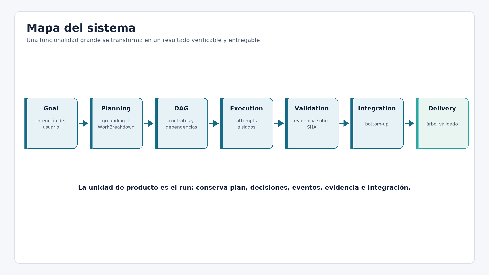

**Cómo dibujarlo en la entrevista:** trazá una flecha de izquierda a derecha desde
`Goal` hasta `Delivery`. Sobre la ida ubicá planning, contracts y execution; sobre
la vuelta ubicá evidence, artifacts e integration.

### Definición técnica

Un **run** es la unidad de producto: una instancia durable que intenta convertir
un objetivo en un resultado entregado. El **goal** describe la intención. El
**RepositorySnapshot** resume el contexto relevante del repositorio. Un **node**
es una unidad del grafo; una **leaf** se ejecuta, mientras que un **composite**
integra resultados de sus descendientes. Un **contract** fija scope, artifacts,
interfaces y validación. Un **attempt** es una ejecución concreta e inmutable de
una hoja. Su resultado puede convertirse en **candidate commit**, pero solo pasa
al **ArtifactRegistry** cuando sigue vigente y satisface las políticas. La
**evidence** vincula criterios con observaciones sobre un SHA exacto. La
**integration** recompone artifacts de abajo hacia arriba. **Delivery** publica el
candidato aprobado y devuelve un receipt que permite derivar `completed`.

### Problema de ingeniería

Sin un vocabulario preciso es fácil juntar estados que representan cosas
distintas. “El agente terminó” no significa “el cambio es válido”; “los tests
pasaron” no significa “todos los criterios están cubiertos”; `result_ready` no
significa “publicado”. Esas confusiones generan adopciones obsoletas, evidencia
ambigua y una UI que parece saber más que el dominio.

### Estrategia

ManyHands separa la intención, la ejecución, la aceptación y la publicación. El
journal conserva hechos; el reducer reconstruye estado; los contracts fijan
obligaciones; Git identifica cambios y commits; los fingerprints prueban vigencia;
la Evidence Matrix prueba cobertura; el receipt prueba entrega. Cada sustantivo
responde una pregunta diferente.

### Implementación en ManyHands

El servicio [`coordinator.ts`](../../packages/run-coordinator/src/coordinator.ts)
acepta commands, carga la historia, valida la transición y agrega eventos. El
[`reducer.ts`](../../packages/run-coordinator/src/reducer.ts) pliega esos eventos
para obtener la proyección actual. La ruta completa puede resumirse así:

```text
Goal -> repository inspection -> planning -> graph compilation -> approval
     -> scheduling -> execution -> validation -> adoption
     -> bottom-up integration -> final validation -> delivery
```

La ida reduce incertidumbre y prepara unidades ejecutables. La vuelta convierte
cambios aislados en un resultado integrado, respaldado por evidencia.

### Evidencia real

[`run-v2-e2e.test.ts`](../../tests/run-v2-e2e.test.ts) recorre compilación,
ejecución de hojas, adopción de artifacts e integración hasta `result_ready`.
[`delivery-state-machine.test.ts`](../../tests/delivery-state-machine.test.ts)
cubre por separado la transición que exige un receipt. Esta combinación permite
afirmar garantías de dominio; no equivale a un smoke real de CLIs hasta delivery.

### Trade-offs y límites

El modelo agrega más conceptos que un script lineal y exige aprender sus límites.
A cambio, vuelve explícitas identidad, autoridad y evidencia. El sistema actual es
local-first y single-host; no ofrece sandbox fuerte, ejecución distribuida ni
multi-tenancy. El mapa describe la arquitectura implementada y sus contratos, no
una promesa de operación cloud.

### Cómo explicarlo en la entrevista

> “ManyHands toma un objetivo de desarrollo y lo convierte en un run durable. En
> la ida inspecciona, planifica, compila y ejecuta unidades aisladas; en la vuelta
> valida commits exactos, adopta artifacts, integra bottom-up y publica solamente
> el candidato aprobado. La clave es que terminar una ejecución, tener un
> resultado válido y completar delivery son estados distintos.”

### Autoevaluación

1. ¿Por qué un attempt no es lo mismo que un node?
2. ¿Qué diferencia existe entre candidate, artifact adoptado y resultado entregado?
3. ¿Por qué la evidencia debe señalar un commit?
4. Escenario: un agente termina correctamente, pero mientras trabajaba cambió un
   artifact que consumía. ¿En qué parte del mapa debe detenerse?
5. Explicalo en voz alta en 45 segundos sin enumerar paquetes.

### Respuestas razonadas

1. El node expresa trabajo y contrato; el attempt registra una ejecución concreta
   con entradas, executor y resultado inmutables. Puede haber varios attempts.
2. Candidate es un commit producido; artifact adoptado es un output elegible y
   vigente que el sistema acepta; entregado exige publicación y receipt.
3. Sin SHA no puede saberse si la evidencia corresponde exactamente al código que
   se adopta o publica.
4. Debe fallar el control de freshness previo a adopción: el fingerprint esperado
   ya no coincide y el resultado se clasifica como stale.

## 2. Software agentic

**Prioridad:** Esencial

**Aparece en:** Diapositivas 2, 6 y 10

### Qué vas a aprender

Vas a diferenciar agente, workflow, tool, executor y orquestador. También vas a
entender por qué ManyHands usa modelos para proponer y mecanismos deterministas
para decidir identidad, lifecycle y aceptación.

### Intuición

Un agente combina un modelo con contexto, herramientas y un bucle de decisión. No
se limita a devolver texto: observa, elige una acción, recibe un resultado y puede
continuar. Un workflow, en cambio, define explícitamente pasos y transiciones. En
la práctica pueden coexistir: un workflow determina cuándo hay que ejecutar una
tarea y un agente decide cómo modificar el código dentro de ese límite.

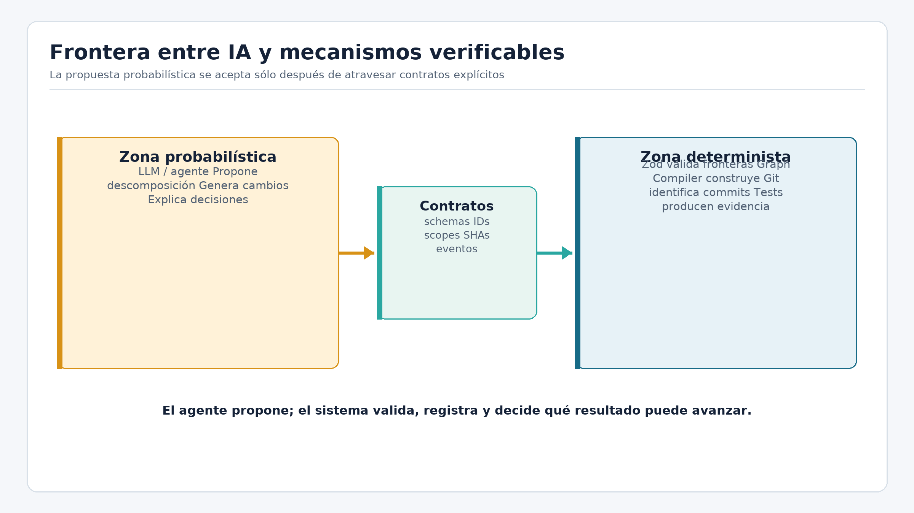

**Cómo dibujarlo en la entrevista:** encerrá al agente dentro de una caja llamada
`AgentExecutor`. Fuera de ella dejá scheduling, worktree, diff, scope, fingerprint
y validation. La caja propone cambios; el sistema decide si los adopta.

### Definición técnica

Una **tool** es una capacidad invocable, por ejemplo leer un archivo o ejecutar un
test. Un **executor** adapta un agente o proceso externo a un puerto estable. La
**orquestación** coordina múltiples unidades, dependencias y fallos. **Autonomía**
describe cuánto puede decidir el agente sin intervención. **No determinismo**
significa que la misma entrada no garantiza exactamente la misma salida. Un
**structured output** obliga a expresar la respuesta en una forma parseable, pero
no garantiza que su significado sea correcto. Una **frontera determinista** toma
esa propuesta y aplica reglas reproducibles.

### Problema de ingeniería

Si el mismo componente probabilístico propone tareas, asigna IDs, modifica el
lifecycle y declara su propio éxito, concentra demasiada autoridad. Una respuesta
plausible podría referir un archivo inexistente, omitir un criterio o declarar
completa una tarea que produjo un diff fuera de scope.

### Estrategia

La estrategia es mantener al modelo en tareas donde aporta comprensión semántica:
descomponer, programar o reparar. Las decisiones que requieren repetibilidad se
implementan en código: schemas, Graph Compiler, scheduler, scope checker,
fingerprints, reducer y validators. Zod valida forma; las políticas de dominio
validan significado y transición.

### Implementación en ManyHands

[`types.ts`](../../packages/execution-core/src/executor/types.ts) define el puerto
`AgentExecutor`. Los perfiles de
[`claude-code.ts`](../../packages/execution-core/src/executor/profiles/claude-code.ts)
y [`codex.ts`](../../packages/execution-core/src/executor/profiles/codex.ts)
traducen configuraciones concretas. El orquestador no confía en stdout para saber
qué cambió: inspecciona Git. Por eso reemplazar una CLI afecta un adapter, pero no
debería cambiar la semántica de attempts, adopción o delivery.

### Evidencia real

[`execution-core-executor-registry.test.ts`](../../tests/execution-core-executor-registry.test.ts)
prueba selección de perfiles. [`execution-core-v2-node-executor.test.ts`](../../tests/execution-core-v2-node-executor.test.ts)
prueba el recorrido que materializa base, invoca el executor, inspecciona el diff
y produce el resultado. Los tests verifican el boundary; no prueban que un modelo
real siempre genere código correcto.

### Trade-offs y límites

Separar dominio y adapters aumenta código explícito, pero reduce acoplamiento con
una CLI o framework. Structured output disminuye ambigüedad sintáctica, no
alucinaciones semánticas. Tampoco todo cambio necesita varios agentes: una tarea
cohesiva y pequeña puede resolverse mejor con uno solo.

### Cómo explicarlo en la entrevista

> “Uso agentes como productores probabilísticos detrás de un puerto. El sistema
> conserva las decisiones de identidad, scheduling, scope, validación y lifecycle.
> Así puedo intercambiar Claude Code y Codex sin convertir su protocolo en el
> dominio ni confiar en que una salida convincente sea un resultado adoptable.”

### Autoevaluación

1. ¿Qué diferencia un agente de una llamada simple a un LLM?
2. ¿Por qué structured output no prueba corrección?
3. ¿Qué ventaja aporta `AgentExecutor`?
4. Escenario: la CLI informa “success”, pero no hay diff. ¿Qué debería decidir el
   sistema?
5. Explicá en 30 segundos por qué un DAG no es lo mismo que LangGraph.

### Respuestas razonadas

1. El agente incorpora herramientas y un ciclo de observación/acción; una llamada
   simple solo produce una respuesta.
2. El schema valida estructura. Un payload puede ser perfectamente válido y aun
   así describir una solución incompleta o archivos equivocados.
3. Aísla protocolos volátiles y permite mantener invariantes del run al cambiar de
   proveedor o CLI.
4. Exit code cero no alcanza. Un diff vacío solo puede aceptarse si se demuestra
   que la base ya satisfacía el contrato; de lo contrario es un fallo o no-op no
   demostrado.
5. El DAG es el plan de trabajo del dominio. LangGraph es un framework posible
   para control flow; ManyHands ya no lo usa en la ruta productiva.

## 3. Problema de tesis e hipótesis

**Prioridad:** Esencial

**Aparece en:** Diapositivas 2, 3 y 4

### Qué vas a aprender

Vas a poder formular el problema, la pregunta principal, la hipótesis de
ingeniería y los límites de lo demostrado sin convertir una contribución de
arquitectura en una afirmación estadística.

### Intuición

“Recuperación de contraseña” parece una sola feature porque el usuario la vive
como un recorrido. Para implementarla hay que coordinar emisión y expiración de
tokens, políticas de sesión, persistencia, email, endpoints, formularios y tests.
El nombre de la feature oculta que varias responsabilidades cambian juntas.

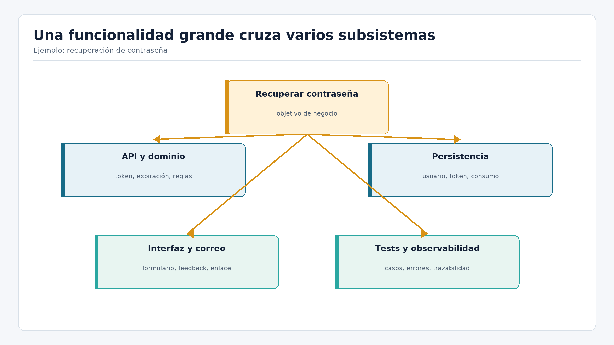

**Cómo dibujarlo en la entrevista:** escribí la feature arriba y cinco columnas
debajo: API, dominio, persistencia, UI y tests. Uní las columnas mediante artifacts
y contratos, no solo con flechas de “depende de”.

### Definición técnica

La pregunta principal es: **¿puede una arquitectura basada en descomposición
jerárquica, ejecución coordinada e integración bottom-up hacer abordables
funcionalidades difíciles de resolver como una única tarea agentic lineal?**

La hipótesis de ingeniería sostiene que representar el trabajo como un DAG
jerárquico con contratos explícitos permite acotar unidades, identificar
dependencias, habilitar paralelismo seguro y recomponer resultados de manera
controlada. Es una hipótesis de diseño y factibilidad, no la predicción de que más
agentes siempre serán más rápidos o productivos.

### Problema de ingeniería

Una ejecución lineal concentra contexto heterogéneo y deja implícito el orden. El
agente puede implementar piezas correctas por separado, pero omitir una seam,
pisar cambios, validar solo localmente o producir un resultado difícil de
integrar. Dividir sin contratos tampoco resuelve el problema: solo distribuye la
ambigüedad.

### Estrategia

La estrategia combina descomposición jerárquica, relaciones con semántica,
ejecución aislada, adopción por identidad, validación sobre commits e integración
bottom-up. Separar propuestas probabilísticas de mecanismos deterministas es una
decisión que implementa la hipótesis; no es la hipótesis central.

### Implementación en ManyHands

El flujo productivo convierte un `Goal` en un `WorkBreakdown`; el Graph Compiler
produce una revisión ejecutable; el scheduler deriva waves; cada hoja trabaja en
una base exacta; la evidencia y los artifacts viajan hacia los composites. La raíz
solo puede convertirse en resultado cuando integra y valida la contribución de
sus descendientes.

### Evidencia real

[`decomposer-work-breakdown.test.ts`](../../tests/decomposer-work-breakdown.test.ts)
verifica la frontera de planning y [`run-v2-e2e.test.ts`](../../tests/run-v2-e2e.test.ts)
recorre el dominio hasta `result_ready`. Tests específicos cubren delivery y crash
recovery. Esa evidencia demuestra que el diseño puede ejecutarse bajo los
escenarios probados; no compara productividad contra un único agente.

### Trade-offs y límites

El costo es más coordinación: contratos, estados, almacenamiento e integración.
Para tareas pequeñas puede ser excesivo. Tampoco está demostrado un óptimo de
granularidad, una mejora estadística de calidad ni operación distribuida. La
conclusión defendible es factibilidad con garantías acotadas.

### Cómo explicarlo en la entrevista

> “Mi tesis parte de que una funcionalidad grande no es una sola tarea. La
> hipótesis es que un DAG jerárquico con contratos permite dividirla, coordinar
> dependencias y recomponer resultados con control. La implementación aporta
> evidencia de factibilidad e invariantes; no demuestra superioridad universal ni
> una granularidad óptima.”

### Autoevaluación

1. ¿Por qué una lista de tareas no expresa todo el problema?
2. ¿Cuál es la hipótesis y cuál es solo una estrategia de implementación?
3. ¿Qué resultado experimental faltaría para afirmar superioridad?
4. Escenario: una feature toca un único módulo y un único test. ¿Conviene siempre
   descomponerla?
5. Formulá pregunta, hipótesis y límite en menos de un minuto.

### Respuestas razonadas

1. La lista no captura ownership jerárquico, flujo de artifacts, compatibilidad ni
   restricciones de conflicto.
2. La hipótesis es DAG jerárquico más contratos para dividir y recomponer. La
   separación probabilístico/determinista es la estrategia usada para sostenerla.
3. Haría falta una comparación controlada con tareas, modelos y criterios
   equivalentes, midiendo calidad, tiempo, costo y fallos de integración.
4. No necesariamente. El costo de coordinación puede superar el beneficio; una
   unidad cohesiva puede quedar como una sola hoja.

## 4. Descomposición, grounding y granularidad

**Prioridad:** Esencial

**Aparece en:** Diapositivas 3, 6 y 7

### Qué vas a aprender

Vas a entender qué información recibe el planner, qué representa un
`WorkBreakdown`, por qué el repositorio forma parte del input y cómo razonar el
trade-off de granularidad sin afirmar que `auto` encuentra un óptimo.

### Intuición

Antes de dividir trabajo hay que conocer el terreno. “Agregar recuperación de
contraseña” significa algo distinto en un monolito Django, una API Next.js o un
repositorio sin autenticación. El grounding funciona como un mapa: no decide el
viaje, pero evita planificar caminos sobre archivos imaginarios.

### Definición técnica

`RepositorySnapshot` es un modelo versionado del estado relevante: estructura,
stack, archivos y señales útiles para planificar. `WorkBreakdown` es una propuesta
semántica de unidades, aceptación, paths, artifacts, seams e incertidumbres. La
**granularidad** es el tamaño y cohesión de esas unidades. Gruesa implica menos
coordinación y más heterogeneidad por tarea; fina implica hojas simples, pero más
contratos, dependencias e integración.

### Problema de ingeniería

Sin grounding, el modelo puede inventar paths o proponer capas incompatibles. Sin
control de granularidad, una hoja puede seguir siendo una feature completa o el
grafo puede explotar en microtareas que no producen artifacts independientes.
“Dividir más” no es automáticamente mejor.

### Estrategia

El planner recibe goal, snapshot, requisitos, respuestas previas y evidencia de
reparación. Produce `WorkBreakdown`, no IDs operativos ni lifecycle. La ruta
recursiva incluye modos `coarse`, `balanced`, `fine` y `auto`, con una rúbrica de
atomicidad local. `auto` ajusta presión por rama; no calcula una función óptima ni
cuenta con evaluación estadística completa.

### Implementación en ManyHands

[`snapshot.ts`](../../packages/repository-index/src/snapshot.ts) construye el
modelo del repositorio. [`work-breakdown.ts`](../../packages/decomposer/src/planner/work-breakdown.ts)
define la frontera productiva del planner. La heurística recursiva vive en
[`step-prompt.ts`](../../packages/decomposer/src/llm/recursive/step-prompt.ts).
Después, un boundary determinista valida y compila; el modelo no asigna por sí
solo la identidad canónica.

### Evidencia real

[`repository-snapshot.test.ts`](../../tests/repository-snapshot.test.ts) verifica el
snapshot; [`decomposer-work-breakdown.test.ts`](../../tests/decomposer-work-breakdown.test.ts)
cubre schemas, prompts y reparación de la salida; [`decomposer-recursive-prompt.test.ts`](../../tests/decomposer-recursive-prompt.test.ts)
demuestra guardrails de granularidad. Estos tests prueban mecanismos, no que una
política `auto` sea mejor en una población de proyectos.

### Trade-offs y límites

Más contexto mejora grounding, pero aumenta tokens, latencia y riesgo de ruido.
Más hojas habilitan paralelismo, pero elevan costo de coordinación. La ruta
productiva basada en `WorkBreakdownPlanner` todavía no demuestra una política
adaptativa end-to-end. La evaluación comparativa de granularidad queda como
trabajo futuro.

### Cómo explicarlo en la entrevista

> “El planner no recibe solo el prompt: trabaja sobre un snapshot versionado del
> repositorio y devuelve un WorkBreakdown semántico. La granularidad es un
> trade-off: gruesa concentra complejidad; fina multiplica coordinación. Existe
> una heurística `auto`, pero no la presento como cálculo óptimo ni resultado
> evaluado estadísticamente.”

### Autoevaluación

1. ¿Qué evita `RepositorySnapshot`?
2. ¿Qué decisiones no debe tomar `WorkBreakdown`?
3. ¿Por qué una tarea muy pequeña también puede ser mala?
4. Escenario: dos hojas modifican el mismo archivo y ninguna produce un artifact
   independiente. ¿Qué señal da sobre la descomposición?
5. Explicá el trade-off gruesa/fina con un ejemplo propio.

### Respuestas razonadas

1. Reduce planes basados en una imagen inexistente o desactualizada del repo.
2. No debe fijar IDs canónicos, lifecycle, wave ni adopción; esas decisiones
   pertenecen a compiler y coordinator.
3. Porque añade contratos e integración sin crear una unidad ejecutable o un
   output separable.
4. Probablemente existe solapamiento de scope o una división artificial. Conviene
   fusionar, serializar o redefinir artifacts y seams.
5. La respuesta debe incluir ambos costos y aclarar que no hay óptimo demostrado.

## 5. DAG, Graph Compiler y contracts

**Prioridad:** Esencial

**Aparece en:** Diapositivas 3 y 7

### Qué vas a aprender

Vas a comprender por qué el planner no produce directamente el plan operativo,
qué significa que el grafo sea jerárquico y acíclico, y cómo contracts y relaciones
tipadas reemplazan dependencias ambiguas.

### Intuición

El planner se parece a un arquitecto que propone ambientes y responsabilidades;
el Graph Compiler se parece al profesional que transforma esa intención en planos
con medidas, identificadores y reglas verificables. La propuesta puede variar; la
compilación de la misma propuesta debe producir la misma estructura.

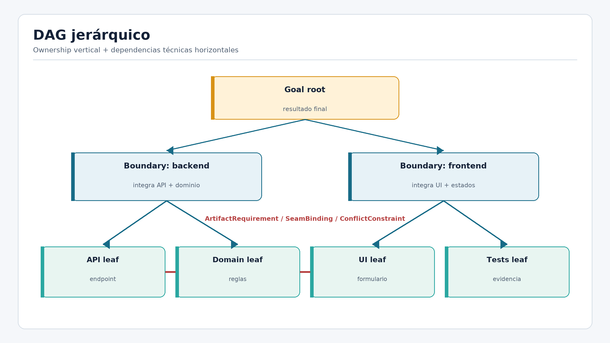

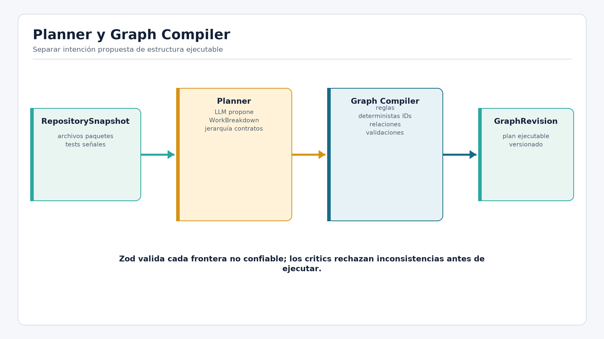

**Cómo dibujarlo en la entrevista:** mostrá primero `RepositorySnapshot ->
WorkBreakdown -> Zod -> Graph Compiler -> GraphRevision`. Debajo del grafo separá
ownership, artifacts, seams y conflicts con cuatro leyendas distintas.

### Definición técnica

Un **DAG** es un grafo dirigido sin ciclos. La dirección permite expresar flujo y
la ausencia de ciclos permite derivar orden. `parentId` expresa pertenencia
jerárquica. `ArtifactRequirement` declara producción y consumo material.
`SeamBinding` congela compatibilidad entre productor y consumidor.
`ConflictConstraint` restringe concurrencia cuando existe interferencia riesgosa.
`GraphRevision` identifica una versión inmutable del plan. Un contract bundle
asocia a una hoja tarea, scope, seams, artifacts y obligaciones de validación.

### Problema de ingeniería

Una arista genérica `dependsOn` no explica si un nodo espera un archivo, una
decisión o una interfaz. Si el modelo asignara identidad y relaciones operativas,
dos respuestas semánticamente equivalentes podrían producir IDs distintos o
referencias rotas, debilitando fingerprints, replay y tests.

### Estrategia

El modelo propone unidades y evidencia. Zod detiene estructuras inválidas. El
compiler asigna identidad estable, resuelve referencias y construye relations y
contracts. Los critics revisan completitud, atomicidad, scopes, criterios y seams.
Así, comprensión probabilística y garantías reproducibles cooperan sin compartir
autoridad.

### Implementación en ManyHands

[`graph-compiler.ts`](../../packages/decomposer/src/compiler/graph-compiler.ts)
recibe el `WorkBreakdown` validado y produce revisión, nodos y bundles. Las
invariantes cross-field viven en
[`contract-bundle.ts`](../../packages/contracts/src/contract-bundle.ts): un
artifact debe referir al productor correcto y cada criterio requerido necesita
una obligación de validación.

### Evidencia real

[`graph-compiler.test.ts`](../../tests/graph-compiler.test.ts) prueba determinismo,
resolución y rechazo de inconsistencias. Esa evidencia permite afirmar que una
propuesta aceptada se transforma reproduciblemente; no demuestra que la división
propuesta por el modelo sea siempre la mejor.

### Trade-offs y límites

El compiler agrega una fase y tipos de relación, pero reduce ambigüedad aguas abajo.
Un DAG facilita orden, aunque no modela por sí solo toda política temporal. Los
critics mejoran calidad, pero siguen siendo controles: no convierten planificación
probabilística en verdad absoluta.

### Cómo explicarlo en la entrevista

> “El planner propone semántica; el Graph Compiler fija identidad y relaciones.
> No uso una dependencia genérica: ownership, artifacts, seams y conflicts
> responden preguntas distintas. La misma propuesta validada genera una
> GraphRevision reproducible y testeable.”

### Autoevaluación

1. ¿Por qué `parentId` no reemplaza `ArtifactRequirement`?
2. ¿Qué gana el sistema al separar planner y compiler?
3. ¿Por qué la aciclicidad importa para integración?
4. Escenario: un artifact referencia un productor de otra revisión. ¿Quién debe
   rechazarlo?

### Respuestas razonadas

1. El padre describe ownership; el requirement describe disponibilidad material.
2. Permite cambiar prompts sin perder IDs reproducibles, invariantes ni tests.
3. Ofrece un orden parcial y evita que dos composites necesiten integrarse
   mutuamente antes de estar listos.
4. El boundary de contracts/compiler debe rechazar la referencia antes de
   scheduling; no corresponde esperar al executor.

## 6. Readiness, waves y decisiones humanas

**Prioridad:** Esencial

**Aparece en:** Diapositivas 6 y 8

### Qué vas a aprender

Vas a explicar cuándo un nodo puede avanzar, cómo se forma una wave y por qué una
decisión humana pendiente debe bloquear solo el trabajo afectado.

### Intuición

Readiness no es una luz verde almacenada para siempre. Es una pregunta que se
recalcula: “con esta revisión, artifacts, decisiones, intentos y conflictos, ¿qué
falta para ejecutar este nodo?”. Una wave es el conjunto que puede despacharse
junto bajo esa respuesta.

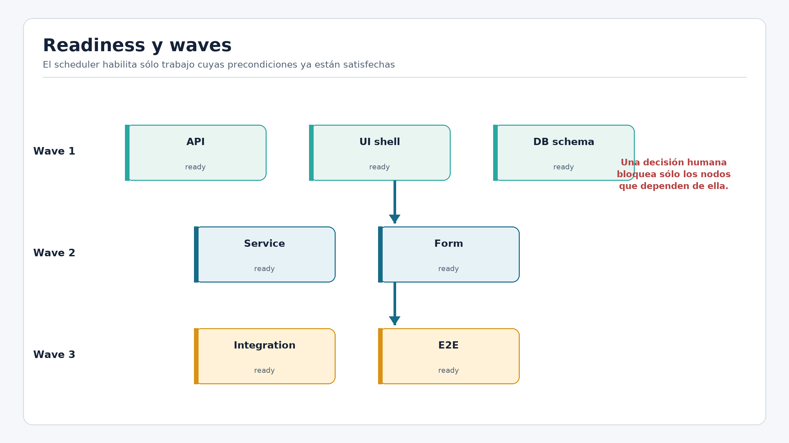

**Cómo dibujarlo en la entrevista:** mostrá tres hojas listas, una bloqueada por
artifact y otra por decisión. Encerrá en una misma wave solo las compatibles y
dibujá la persistencia de la wave antes del dispatch.

### Definición técnica

**Readiness** es una decisión derivada con razones. Una **wave** es una selección
persistida de nodos listos para dispatch concurrente. Una **decisión local** es una
incertidumbre humana cuyo conjunto de nodos afectados está declarado. Los
conflicts restringen simultaneidad aun cuando dependencias y artifacts estén
satisfechos.

### Problema de ingeniería

Si readiness fuera un booleano mutable, podría quedar stale después de un replan o
una decisión. Si toda duda pausara el run, se perdería paralelismo seguro. Si la
wave se registrara después de lanzar procesos, un crash borraría qué trabajo había
sido elegido.

### Estrategia

El scheduler calcula motivos: dependencia pendiente, artifact ausente, contrato
stale, decisión sin resolver, conflicto, intento activo o backoff. Selecciona
nodos compatibles, registra la wave y recién entonces despacha. Las decisiones
humanas bloquean el subgrafo declarado, mientras el resto continúa.

### Implementación en ManyHands

[`readiness-v2.ts`](../../packages/scheduler/src/readiness-v2.ts) deriva estado y
razones. La coordinación usa ese resultado para seleccionar una wave estable.
[`local-decision-readiness.test.ts`](../../tests/local-decision-readiness.test.ts)
muestra que una decisión localizada no congela trabajo independiente.

### Evidencia real

[`scheduler-readiness-v2.test.ts`](../../tests/scheduler-readiness-v2.test.ts)
cubre dependencias, artifacts y estados. [`scheduler-scope-aware-wave.test.ts`](../../tests/scheduler-scope-aware-wave.test.ts)
cubre interferencia de scope. Son garantías de política local, no evidencia de
escalamiento multi-host.

### Trade-offs y límites

Waves más grandes pueden reducir duración, pero aumentan competencia por recursos
y riesgo de conflictos no modelados. Waves pequeñas simplifican observación, pero
desaprovechan paralelismo. La implementación actual coordina en un host; distribuir
scheduling requeriría un mecanismo remoto de ownership y dispatch.

### Cómo explicarlo en la entrevista

> “Readiness es derivado y explicable. El scheduler toma nodos cuyos inputs y
> decisiones están satisfechos, excluye conflictos y persiste la wave antes de
> lanzar procesos. Una decisión humana bloquea solamente los nodos que declara
> afectar.”

### Autoevaluación

1. ¿Por qué readiness no debe persistirse como verdad permanente?
2. ¿Qué diferencia una dependencia de un conflict?
3. ¿Por qué se registra la wave antes del dispatch?
4. Escenario: dos hojas están listas pero escriben el mismo archivo. ¿Qué hacer?

### Respuestas razonadas

1. Porque cambia al resolver decisiones, adoptar artifacts o revisar el grafo.
2. La dependencia ordena por necesidad; el conflict restringe simultaneidad por
   interferencia, aunque ambos nodos tengan inputs.
3. Para que recovery reconstruya la intención si el proceso cae entre selección y
   lanzamiento.
4. El scheduler debe serializarlas o esperar, salvo que el contrato se rediseñe
   para eliminar el recurso compartido.

## 7. ExecutionBase, attempts, AgentExecutor, Git y scope

**Prioridad:** Esencial

**Aparece en:** Diapositiva 8

### Qué vas a aprender

Vas a recorrer un attempt completo y entender por qué worktree, diff y scope son
controles distintos. También vas a separar aislamiento operativo de sandbox de
seguridad.

### Intuición

Una tarea no debería ejecutarse sobre “el repositorio actual”, una base que puede
cambiar mientras trabaja. Debe recibir una fotografía materializada de los inputs
declarados y un espacio Git propio. El agente puede escribir libremente allí; el
orquestador inspecciona qué ocurrió antes de aceptar algo.

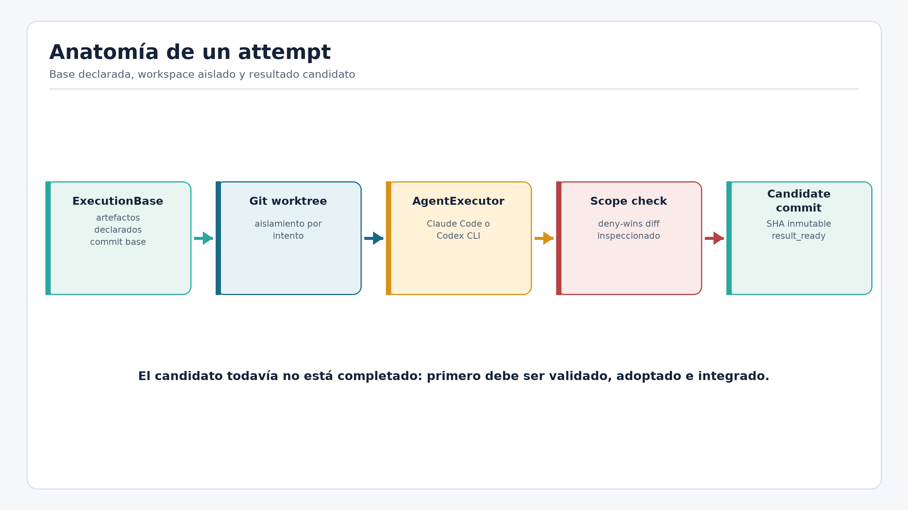

**Cómo dibujarlo en la entrevista:** trazá `ExecutionBase -> worktree -> CLI -> git
diff -> scope -> candidate commit`. Señalá stdout como diagnóstico lateral, no
como fuente de verdad.

### Definición técnica

`ExecutionBase` fija revision, base SHA, contracts y artifacts materializados. Un
**attempt** identifica una invocación concreta con executor y timestamps. Un Git
**worktree** ofrece working directory y branch aislados. `AgentExecutor` es el
puerto hacia una CLI. El **diff** es la lista autoritativa de cambios. El
**ScopeContract** contiene paths permitidos, prohibidos y de coordinación. Un
**candidate commit** es creado por el orquestador, no aceptado desde texto libre.

### Problema de ingeniería

Confiar solo en el prompt para respetar scope es insuficiente. Confiar en stdout
permite que “éxito” o una lista de archivos incorrecta gobiernen el dominio.
Ejecutar todos los agentes en el mismo checkout permite interferencia y dificulta
atribuir diffs.

### Estrategia

La base materializa únicamente inputs declarados. El executor trabaja en su
worktree. Git determina archivos y contenido; el checker aplica deny-wins; el
orquestador verifica estado y crea el commit. Un path explícitamente prohibido es
terminal. Un miss de allow-list puede ser advisory, gate o violation según la
política: no todo “fuera de lista” se descarta de idéntica manera.

### Implementación en ManyHands

[`execution-base-builder.ts`](../../packages/execution-core/src/base/execution-base-builder.ts)
construye la base. [`node-executor.ts`](../../packages/execution-core/src/v2/node-executor.ts)
coordina worktree, executor, diff, scope y candidate. [`checker.ts`](../../packages/execution-core/src/scope/checker.ts)
aplica prohibiciones. Los perfiles concretos de CLI permanecen detrás del puerto.

### Evidencia real

[`execution-base-builder.test.ts`](../../tests/execution-base-builder.test.ts),
[`execution-core-v2-node-executor.test.ts`](../../tests/execution-core-v2-node-executor.test.ts)
y [`execution-core-scope.test.ts`](../../tests/execution-core-scope.test.ts)
ejercitan filesystem y Git. Prueban aislamiento por worktree y políticas de
cambio; un worktree no es un sandbox contra red, secretos o procesos hostiles.

### Trade-offs y límites

Worktrees son livianos y preservan semántica Git, pero comparten host y objetos.
Un container remoto ofrecería seguridad mayor con costo operativo. Scope reduce
daño accidental, pero no reemplaza least privilege ni aislamiento de procesos.

### Cómo explicarlo en la entrevista

> “Cada attempt recibe una ExecutionBase exacta y un worktree. La CLI es un
> adapter: su salida ayuda a diagnosticar, pero Git define el cambio. Después
> aplico scope deny-wins y el orquestador crea el candidate commit. Esto aísla
> cambios; no lo presento como sandbox fuerte.”

### Autoevaluación

1. ¿Por qué stdout no puede ser la autoridad del cambio?
2. ¿Qué aporta un worktree y qué no aporta?
3. ¿Qué significa deny-wins?
4. Escenario: exit code cero y diff vacío. ¿Es éxito?

### Respuestas razonadas

1. Puede ser incompleto, no estructurado o falso; Git observa el estado real.
2. Aísla directory y branch; no aísla red, secretos, CPU o kernel.
3. Una prohibición explícita gana incluso si otra regla permitiría el path.
4. Solo si puede demostrarse que la base ya satisfacía el contrato; de lo
   contrario no hay producción verificable.

## 8. InputFingerprint, vigencia y adopción

**Prioridad:** Esencial

**Aparece en:** Diapositivas 8 y 9

### Qué vas a aprender

Vas a entender cómo el sistema reconoce exactamente qué inputs produjeron un
resultado y por qué finalizar tarde puede convertir un candidate correcto en
inutilizable.

### Intuición

Imaginá resolver un ejercicio mientras otra persona cambia el enunciado. Tu
respuesta puede estar bien para la versión anterior y ser inválida para la nueva.
`InputFingerprint` convierte el “enunciado efectivo” en una identidad comparable.

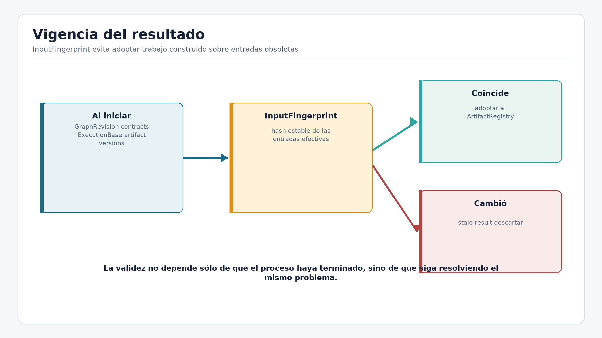

**Cómo dibujarlo en la entrevista:** dibujá dos hashes: expected al iniciar y
actual antes de adoptar. Solo la igualdad, junto con scope y evidencia elegibles,
permite entrar al registry.

### Definición técnica

Un **fingerprint** es un hash estable de inputs canónicos node-locales:
identidad del nodo, contracts, base SHA, artifacts consumidos, contexto, executor
y configuración de validación. La revisión global del grafo **no** es una
entrada: una enmienda ajena no invalida un nodo independiente. **Freshness**
significa que el fingerprint actual coincide con el que
originó el attempt. Un resultado **stale** terminó sobre entradas obsoletas. La
**adopción** es el acto por el cual el coordinator acepta un output elegible como
artifact de la revisión vigente.

### Problema de ingeniería

Si se usara solo node ID, un replan podría conservar el nombre y cambiar scope o
criterios. Si se usara solo commit base, podrían cambiar artifacts o configuración.
Adoptar por “último intento terminado” deja que una respuesta lenta recupere
autoridad después de una reparación más nueva.

### Estrategia

Las entradas se ordenan canónicamente antes de hashear. El candidate conserva su
fingerprint de producción. Justo antes de adoptar se recalcula el esperado. Una
diferencia no intenta “arreglar” el candidate: lo descarta como stale y agenda
trabajo nuevo si corresponde.

### Implementación en ManyHands

[`fingerprint.ts`](../../packages/run-coordinator/src/domain/fingerprint.ts)
construye la identidad. [`artifacts.ts`](../../packages/run-coordinator/src/domain/artifacts.ts)
modela adopción y eligibility. El coordinator compara antes de emitir el hecho de
adopción; el registry no es una carpeta de cualquier output terminado.

### Evidencia real

[`input-fingerprint.test.ts`](../../tests/input-fingerprint.test.ts) prueba orden
canónico y sensibilidad a inputs. [`artifact-registry.test.ts`](../../tests/artifact-registry.test.ts)
prueba adopción y reemplazos. Permiten afirmar protección contra resultados stale
en los escenarios modelados, no consistencia distribuida entre hosts.

### Trade-offs y límites

Fingerprints grandes exigen definir qué input es semánticamente relevante. Omitir
uno permite falsos frescos; incluir timestamps irrelevantes produce falsos stale.
El hash prueba identidad de entradas, no calidad del código.

### Cómo explicarlo en la entrevista

> “Cada attempt queda ligado a un InputFingerprint node-local que resume la
> identidad del nodo, contracts, base, artifacts, contexto, executor y validación
> —no la revisión global del grafo. Antes de adoptar recalculo la
> identidad esperada. Si cambió, el candidate es stale aunque haya terminado bien,
> porque ya no responde al problema vigente.”

### Autoevaluación

1. ¿Por qué base SHA no alcanza como fingerprint?
2. ¿Qué diferencia stale de failed?
3. ¿Qué garantiza un hash y qué no?
4. Escenario: un intento viejo termina después de uno reparado. ¿Cuál se adopta?

### Respuestas razonadas

1. No captura contracts, artifacts, contexto ni configuración del executor.
2. Failed no satisfizo su ejecución o validación; stale puede ser correcto para
   inputs anteriores, pero ya no es elegible.
3. Garantiza comparación de identidad si la canonicalización es correcta; no
   garantiza semántica ni calidad.
4. Solo el que coincida con el fingerprint vigente y sea elegible. El orden de
   finalización no concede autoridad.

## 9. Journal, replay, CAS, leases y fencing

**Prioridad:** Importante

**Aparece en:** Diapositivas 9 y 14

### Qué vas a aprender

Vas a entender cómo el run conserva una historia canónica, cómo reconstruye su
estado y por qué CAS, leases y fencing resuelven problemas relacionados pero no
intercambiables.

### Intuición

En un proceso largo, guardar solo “estado actual = running” pierde la explicación
de cómo se llegó allí. Un journal registra hechos: run creado, revisión aprobada,
wave seleccionada, attempt terminado, artifact adoptado. El estado visible es el
resultado de volver a leer esos hechos en orden.

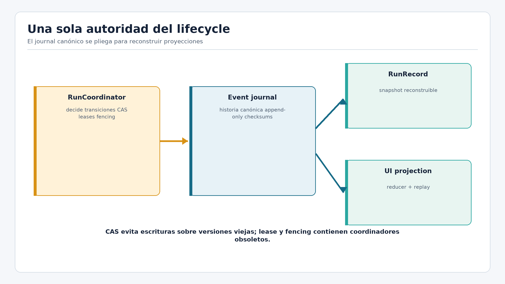

**Cómo dibujarlo en la entrevista:** dibujá una línea append-only de eventos y un
reducer que produce snapshot y UI. Agregá CAS en el append, lease sobre la
operación y fencing token en cada write.

### Definición técnica

Un **command** pide que ocurra algo; un **event** afirma que ocurrió. El **fold** o
reducer aplica eventos para obtener una **projection**. Un **snapshot** acelera
carga, pero puede reconstruirse. **Replay** vuelve a plegar la historia. **CAS**
compara la secuencia esperada para impedir dos appends ganadores. Un **lease**
declara owner temporal. Un **fencing token** monotónico permite que el store
rechace a un owner viejo. **Idempotencia** hace segura la repetición del mismo
hecho externo. El checksum detecta corrupción del envelope persistido.

### Problema de ingeniería

Dos requests pueden leer la misma secuencia y decidir transiciones incompatibles.
Un worker puede perder su lease, seguir usando CPU y terminar tarde. Un crash
puede ocurrir después de publicar pero antes de guardar el receipt. Un snapshot
puede quedar atrasado. Un lock en memoria no resuelve esos casos tras reinicio ni
protege recursos que aceptan escrituras tardías.

### Estrategia

El coordinator carga y pliega antes de decidir. El store agrega con expected
sequence; una colisión obliga a recargar. El lease limita quién debería operar. El
fencing token acompaña writes para que la capa durable rechace al owner anterior.
Los event IDs e idempotency keys reconocen repeticiones. El journal es autoridad;
snapshot, trazas y UI son proyecciones.

### Implementación en ManyHands

[`jsonl-event-store.ts`](../../packages/run-store/src/jsonl-event-store.ts)
persiste envelopes con versión, secuencia y checksum. [`coordinator.ts`](../../packages/run-coordinator/src/coordinator.ts)
pliega antes del append. [`run-operation-lease.ts`](../../apps/web/src/lib/server/runs/run-operation-lease.ts)
supervisa ownership operativo. [`snapshot-store.ts`](../../packages/run-store/src/snapshot-store.ts)
mantiene una optimización reconstruible.

### Evidencia real

[`run-store-event-source.test.ts`](../../tests/run-store-event-source.test.ts),
[`run-store-fencing.test.ts`](../../tests/run-store-fencing.test.ts),
[`run-operation-lease.test.ts`](../../tests/run-operation-lease.test.ts) y
[`run-store-snapshot-rebuild.test.ts`](../../tests/run-store-snapshot-rebuild.test.ts)
cubren secuencia, corrupción, owner viejo y reconstrucción. Prueban seguridad
durable local; no una implementación distribuida con consenso.

### Trade-offs y límites

Event sourcing mejora auditabilidad y recovery, pero exige schemas versionados,
reducers correctos y migraciones. CAS detecta competencia, no elige semánticamente
qué command debería ganar. Lease sin fencing permite writes tardíos; fencing sin
lease no asigna owner. La implementación local usa filesystem y mutexes donde
corresponde, no una base distribuida.

### Cómo explicarlo en la entrevista

> “El journal es la historia canónica y el estado se deriva por replay. CAS evita
> que dos writers ganen la misma secuencia; el lease dice quién debería operar;
> fencing permite rechazar al owner viejo. Son capas complementarias, no nombres
> distintos para un lock.”

### Autoevaluación

1. ¿Qué diferencia un command de un event?
2. ¿Por qué el snapshot no es autoridad?
3. ¿Qué problema queda si hay lease pero no fencing?
4. Escenario: dos procesos intentan append sobre sequence 20. ¿Qué ocurre?

### Respuestas razonadas

1. Command expresa intención y puede rechazarse; event registra un hecho aceptado.
2. Puede estar stale o perderse y se reconstruye desde eventos.
3. El proceso viejo puede terminar tarde y escribir si el recurso no verifica un
   token monotónico.
4. Solo uno satisface el CAS. El otro recarga la nueva historia y reevalúa su
   command; no debe repetir ciegamente el append.

## 10. Validación y EvidenceMatrix

**Prioridad:** Esencial

**Aparece en:** Diapositiva 9

### Qué vas a aprender

Vas a distinguir ejecución, validación y evidencia, y a explicar por qué los
controles deben correr sobre el mismo SHA que se pretende adoptar.

### Intuición

“Tests verdes” es una observación incompleta. Puede referir a un comando sobre otro
checkout, cubrir solo parte de la aceptación o ignorar un control requerido. Una
matriz vuelve explícito qué criterio se probó, con qué obligación y sobre qué
commit.

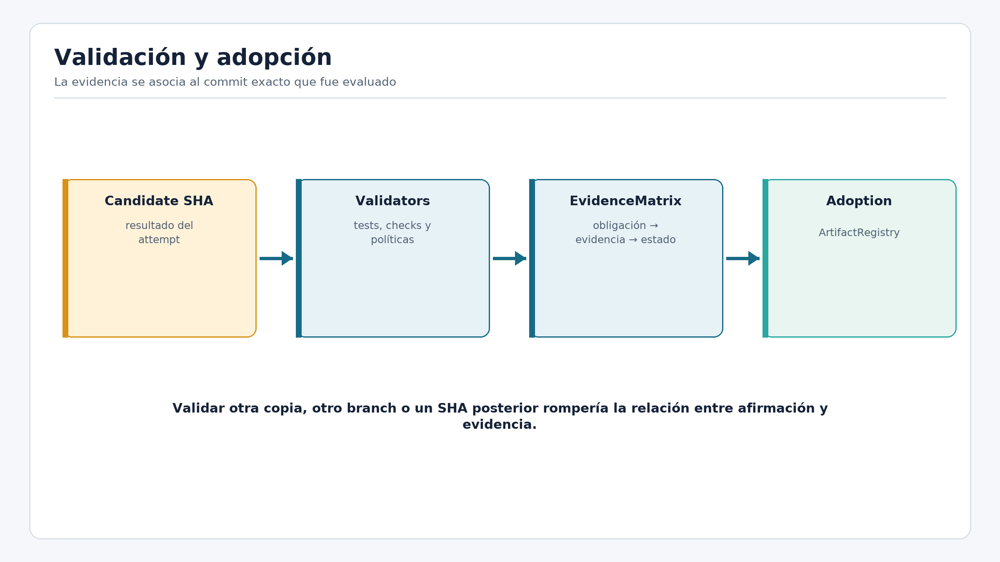

**Cómo dibujarlo en la entrevista:** uní `candidate SHA` con sandbox limpio,
obligaciones y outcomes. Recién una Evidence Matrix elegible pasa al registry.

### Definición técnica

Un **acceptance criterion** expresa comportamiento esperado. Una **validation
obligation** indica cómo obtener evidencia. Un **outcome** registra estado,
justificación y refs. La `EvidenceMatrix` relaciona criterios, obligaciones y
resultados. **Eligible** significa que las políticas requeridas están satisfechas
y no existen hallazgos terminales. La evidencia pertenece al candidate SHA.

### Problema de ingeniería

Si se valida el working tree y luego se crea otro commit, existe una ventana entre
lo probado y lo adoptado. Si solo se guarda exit code, no puede saberse qué
criterio cubrió. Si cada tarea inventa comandos arbitrarios, la evidencia no es
comparable ni auditable.

### Estrategia

El sistema prepara un entorno limpio en el candidate commit, compila recetas,
ejecuta controles y registra refs. Estados distintos permiten diferenciar fallo,
evidencia insuficiente, control no viable y pass. La adopción exige eligibility,
freshness y correspondencia con el mismo commit.

### Implementación en ManyHands

[`evidence-matrix.ts`](../../packages/execution-core/src/validation/evidence-matrix.ts)
construye la matriz. Los validators de `packages/execution-core/src/validation/`
preparan baseline, dependencias, recetas y test integrity. El coordinator recibe
facts de validación; no permite que el executor se autodeclare verificado.

### Evidencia real

[`evidence-matrix.test.ts`](../../tests/evidence-matrix.test.ts) cubre relación de
criterios, estados y refs. [`exact-candidate-validation.test.ts`](../../tests/exact-candidate-validation.test.ts)
ejercita validación real. La evidencia permite describir obligaciones cubiertas;
no prueba ausencia total de bugs ni calidad de requisitos incompletos.

### Trade-offs y límites

Más controles elevan confianza pero también tiempo y costo. Algunos criterios no
tienen control negativo práctico; por eso la política debe distinguir required y
when-feasible. Una matriz precisa no corrige una aceptación mal formulada.

### Cómo explicarlo en la entrevista

> “Valido el candidate SHA exacto en un entorno limpio. La Evidence Matrix liga
> cada criterio con una obligación, outcome, justificación y refs. Eso evita
> resumir todo como ‘tests verdes’ y asegura que la evidencia pertenece al commit
> que después quiero adoptar.”

### Autoevaluación

1. ¿Por qué exit code cero es evidencia insuficiente?
2. ¿Qué diferencia criterio de obligación?
3. ¿Por qué validar antes de crear el candidate rompe identidad?
4. Escenario: todos los unit tests pasan, pero falta una obligación required.

### Respuestas razonadas

1. No identifica criterio, contexto, SHA ni posibles controles omitidos.
2. El criterio define qué debe ser cierto; la obligación define cómo observarlo.
3. Lo probado podría no ser exactamente lo persistido.
4. El resultado no es elegible aunque los tests ejecutados hayan pasado; la matriz
   debe mostrar evidencia incompleta.

## 11. Integración bottom-up y delivery

**Prioridad:** Esencial

**Aparece en:** Diapositivas 6 y 9

### Qué vas a aprender

Vas a seguir el camino desde artifacts adoptados hasta publicación y a defender
por qué `result_ready` y `completed` son estados diferentes.

### Intuición

Completar hojas no completa una feature. Cada resultado debe viajar hacia el
límite que sabe recomponerlo. Un composite integra artifacts de sus hijos, valida
el conjunto y produce un artifact de nivel superior. La raíz repite ese proceso.

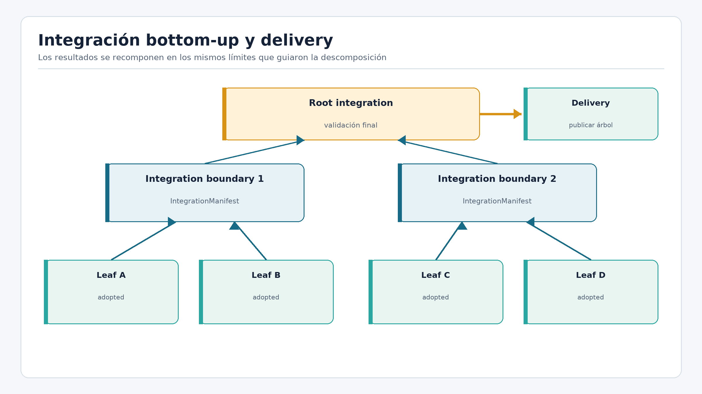

**Cómo dibujarlo en la entrevista:** dibujá seis hojas que convergen en tres
composites y luego en la raíz. Después separá `result_ready`, aprobación congelada,
publicación y receipt.

### Definición técnica

`ArtifactRegistry` contiene outputs adoptados y vigentes. `IntegrationManifest`
enumera inputs, base, estrategia, candidate, seams y validaciones de una
integración. **Bottom-up** significa que un padre usa únicamente resultados
aceptados de sus descendientes. `result_ready` indica un candidato raíz elegible.
La aprobación de delivery congela manifest, SHA, branch, target head y fingerprint.
`DeliveryReceipt` confirma el efecto exacto; recién entonces se deriva `completed`.

### Problema de ingeniería

Mergear todo al final mezcla conflictos sintácticos y semánticos sin ownership.
Publicar desde un working tree permite drift. Marcar completed antes del efecto
externo oculta fallos; marcarlo después sin idempotencia puede duplicar publicación
tras un crash.

### Estrategia

Cada composite materializa artifacts declarados, integra sobre una base controlada
y registra manifest. La raíz se valida nuevamente porque integración puede crear
fallos nuevos. El publisher verifica que branch y head aún coincidan con la
aprobación, usa idempotency key y persiste un receipt que corresponde a la
solicitud congelada.

### Implementación en ManyHands

[`manifest.ts`](../../packages/execution-core/src/integration/manifest.ts) define
la identidad de integración. [`integration.ts`](../../packages/run-coordinator/src/integration.ts)
coordina hechos de integración. [`publisher.ts`](../../packages/execution-core/src/delivery/publisher.ts)
protege target drift, idempotencia y recuperación del side effect.

### Evidencia real

[`integration-manifest.test.ts`](../../tests/integration-manifest.test.ts) verifica
manifest e inputs. [`delivery-state-machine.test.ts`](../../tests/delivery-state-machine.test.ts)
demuestra que `completed` requiere receipt correspondiente. Los tests de Git real
cubren merges; no existe todavía un smoke productivo con CLIs reales hasta
delivery.

### Trade-offs y límites

Integración frecuente detecta seams temprano, pero consume tiempo. Bottom-up
reduce explosión en la raíz, aunque exige contratos de artifacts sólidos. Delivery
transaccional protege exactitud, pero no equivale a desplegar la aplicación ni a
CI/CD completo.

### Cómo explicarlo en la entrevista

> “Solo artifacts adoptados entran a integración. Cada composite produce un
> IntegrationManifest y un candidate validado; la raíz se valida otra vez.
> `result_ready` significa candidato verificado. `completed` exige además que un
> receipt confirme la publicación exacta aprobada.”

### Autoevaluación

1. ¿Por qué terminar hijos no completa al padre?
2. ¿Qué contiene el manifest?
3. ¿Qué protege la aprobación congelada?
4. Escenario: target head cambia después de aprobar delivery.

### Respuestas razonadas

1. El padre todavía debe integrar, resolver seams y validar el conjunto.
2. Inputs, base, estrategia, outputs, candidate y validaciones de la integración.
3. Evita publicar un SHA o target distinto del revisado.
4. El publisher debe fallar cerrado y no publicar; se necesita nueva preparación
   o aprobación sobre el estado vigente.

## 12. Recovery por causa

**Prioridad:** Importante

**Aparece en:** Diapositivas 9 y 14

### Qué vas a aprender

Vas a clasificar fallos y elegir una recuperación compatible con la causa, en vez
de aplicar un número universal de retries.

### Intuición

Reintentar es repetir una apuesta. Funciona si el problema fue un timeout
transitorio; repite daño si el contrato es contradictorio o el candidate está
stale. Recovery seguro comienza preguntando “¿por qué falló?” y “¿qué cambió desde
el intento anterior?”.

### Definición técnica

Una **failure classification** traduce observaciones a causa: transient, env/auth,
code/test, contract, dependency, scope, stale, integration o infrastructure. Un
**retry** conserva intención y crea un attempt nuevo. Una **repair** cambia la
estrategia de código. Una **amendment** cambia el contrato de forma versionada. Un
**replan** cambia el grafo. Una **human decision** resuelve ambigüedad no segura
para automatizar.

### Problema de ingeniería

Sin clasificación, un bucle puede repetir auth inválida, publicar dos veces o
adoptar un resultado viejo. Un retry mutable también borra evidencia del intento
anterior. Recovery después de side effects exige distinguir “no ocurrió” de
“ocurrió pero no llegué a persistirlo”.

### Estrategia

Cada attempt es inmutable. Timeout puede habilitar retry acotado; code/test puede
abrir reparación; contrato necesita amendment; stale y scope terminal se
descartan; dependencia espera nueva evidencia; integración admite reparación
semántica limitada y luego decisión. Delivery reutiliza idempotency key y consulta
el target para recuperar un receipt si el side effect ya ocurrió.

### Implementación en ManyHands

[`recovery-policy.ts`](../../packages/run-coordinator/src/recovery-policy.ts)
mapea causas a acciones permitidas. [`publisher.ts`](../../packages/execution-core/src/delivery/publisher.ts)
implementa recuperación de publicación. El journal conserva cada intento y
decisión; recovery agrega hechos, no reescribe pasado.

### Evidencia real

[`run-v2-crash-recovery.test.ts`](../../tests/run-v2-crash-recovery.test.ts) cubre
crash después del side effect y antes del receipt. Tests de coordinator cubren
retry, reparación y fencing. Demuestran escenarios diseñados; no sustituyen chaos
testing distribuido.

### Trade-offs y límites

Una matriz causal requiere más políticas que `retryCount < 3`, pero evita acciones
incorrectas. La clasificación también puede equivocarse; por eso conserva
evidencia y permite escalamiento humano. El presupuesto limita repetición, pero no
debe decidir semántica por sí solo.

### Cómo explicarlo en la entrevista

> “No tengo un retry universal. Clasifico el fallo y habilito acciones compatibles:
> transitorios reintentan, código se repara, contratos se enmiendan, stale o scope
> se descartan e integración escala. Si delivery cayó después del efecto, recupero
> el receipt con la misma idempotency key sin publicar otra vez.”

### Autoevaluación

1. ¿Por qué retry no sirve para un contrato inválido?
2. ¿Qué diferencia repair de amendment?
3. ¿Cómo se recupera un crash después de publicar?
4. Escenario: falla auth tres veces. ¿Conviene seguir?

### Respuestas razonadas

1. Repite una tarea imposible bajo las mismas obligaciones.
2. Repair cambia implementación manteniendo contrato; amendment versiona la
   obligación o scope.
3. Se reutiliza idempotency key, se consulta el target y se persiste el receipt
   recuperado si coincide con la solicitud.
4. No. Debe suspenderse el recurso o pedir intervención; retries consumen
   presupuesto sin modificar la causa.

## 13. UI como proyección y fixture

**Prioridad:** Importante

**Aparece en:** Diapositivas 6 y 11

### Qué vas a aprender

Vas a entender cómo eventos se convierten en interfaz, qué comparte la fixture con
un run live y por qué la UI nunca debe transformarse en una segunda autoridad.

### Intuición

La UI es como el tablero de un vehículo: muestra velocidad y alertas, pero mover la
aguja no acelera el motor. Del mismo modo, un estado visual se calcula a partir de
hechos; un click debe enviar un command al dominio y esperar un evento confirmado.

### Definición técnica

Un **reducer** es una función que aplica un evento a un estado anterior y obtiene
una nueva proyección. Una **projection** está optimizada para lectura y puede
reconstruirse. **Replay** aplica un prefijo o toda la secuencia. React Flow es el
adapter visual del grafo. La **fixture** es una secuencia determinista de eventos
que usa el mismo reducer y cockpit, pero no ejecuta agents, Git, filesystem, red ni
delivery real.

### Problema de ingeniería

Si la UI cambia lifecycle localmente, puede mostrar `completed` sin receipt. Si
mezcla trazas y eventos canónicos, una línea de stdout puede parecer decisión de
dominio. Si una fixture ejecuta commands o se presenta como backend real, deja de
ser una herramienta de demostración controlada.

### Estrategia

El journal live llega por transporte y alimenta el reducer. La fixture entrega el
mismo tipo de eventos desde memoria y permite elegir cursor o hito. La navegación
retrocede reconstruyendo un prefijo; no deshace side effects. Los controles
productivos están ocultos o no persisten en modo fixture.

### Implementación en ManyHands

[`reducer.ts`](../../apps/web/src/lib/run-model/reducer.ts) proyecta eventos.
[`fixture-playback.ts`](../../apps/web/src/lib/run-model/fixture-playback.ts)
resuelve cursores e hitos. [`fixtures/index.ts`](../../apps/web/src/lib/run-model/fixtures/index.ts)
define el escenario de recuperación de contraseña. El cockpit compartido evita
una UI paralela con semántica diferente.

### Evidencia real

[`run-model-v2-fixture.test.ts`](../../tests/run-model-v2-fixture.test.ts) verifica
69 eventos, 9 hitos y estructura. [`fixture-playback-navigation.test.ts`](../../tests/fixture-playback-navigation.test.ts)
prueba navegación por prefijos. La fixture demuestra reducer, replay y
presentación; no demuestra ejecución real de CLIs ni efectos externos.

### Trade-offs y límites

Compartir componentes reduce drift, pero la fixture sigue siendo datos preparados.
Una UI derivada puede tener cachés y estados efímeros, siempre que no reclamen
autoridad. El autoencuadre es una decisión visual; no pertenece al lifecycle.

### Cómo explicarlo en la entrevista

> “La UI es una proyección del journal. Tanto el run live como la fixture pasan
> eventos por el mismo reducer y cockpit, pero cambia la fuente. La fixture permite
> demostrar replay y decisiones visuales de forma determinista; no la presento
> como ejecución real de agentes, Git o delivery.”

### Autoevaluación

1. ¿Por qué una projection puede descartarse?
2. ¿Qué comparte la fixture con producción?
3. ¿Qué no prueba el replay visual?
4. Escenario: un botón cambia localmente el nodo a completed sin event.

### Respuestas razonadas

1. Porque se reconstruye desde la historia canónica.
2. Tipos de eventos, reducer, modelo de presentación y cockpit.
3. No prueba procesos, filesystem, Git, red, modelos ni publicación real.
4. Es una violación de autoridad: debe enviar un command y esperar el evento
   aceptado por el coordinator.

## 14. Librerías, adapters y LangGraph histórico

**Prioridad:** Esencial

**Aparece en:** Diapositivas 10 y 13

### Qué vas a aprender

Vas a explicar cada tecnología por la responsabilidad concreta que cumple y a
defender por qué LangGraph fue retirado de la ruta productiva sin desacreditar el
framework.

### Intuición

Una librería es una herramienta; no debería definir accidentalmente el dominio.
React Flow dibuja nodos, pero no decide readiness. `simple-git` invoca Git, pero
Git es la autoridad sobre commits. Zod valida datos, pero no decide si una
transición es válida.

### Definición técnica

Un **adapter** traduce entre un puerto estable y una tecnología volátil. Un
**runtime schema** valida datos mientras el programa corre. Un **composition root**
conecta implementaciones concretas. Un **framework boundary** evita que tipos o
lifecycle propios de un framework se filtren al dominio.

### Problema de ingeniería

Si se explica la arquitectura como una lista de logos, no queda claro qué decisión
pertenece a quién. Además, checkpoints de un framework pueden coexistir con
journal, RunRecord y UI, creando múltiples versiones del lifecycle.

### Estrategia

TypeScript aporta tipos estáticos; muchos se derivan con `z.infer`. Zod valida
HTTP, modelo, eventos y disco. Next.js implementa transporte y composition root.
React compone la UI y React Flow proyecta el grafo. Git modela diffs y commits;
`simple-git` es cliente. Claude Code CLI y Codex CLI implementan `AgentExecutor`.
Vitest prueba políticas, adapters y recorridos. JSON guarda records auxiliares y
JSONL conserva el journal append-only.

`StateGraph` y checkpoints participaron en una arquitectura anterior. Al coexistir
con otras autoridades aumentaban riesgo de divergencia. El lifecycle se trasladó
a `RunCoordinator`, el journal quedó canónico y los StateGraphs productivos se
retiraron. LangGraph podría volver como adapter para branching o interrupts si no
duplica estado ni autoridad.

### Implementación en ManyHands

[`apps/web/package.json`](../../apps/web/package.json) declara dependencias web,
incluidas residuales de LangGraph. Los profiles de executor viven en
[`profiles`](../../packages/execution-core/src/executor/profiles/). La evolución
arquitectónica está documentada en
[`0009-framework-and-executor-boundaries.md`](../adr/0009-framework-and-executor-boundaries.md).

### Evidencia real

El commit `c5a4f99` retira la arquitectura productiva anterior. Una búsqueda de
imports en `apps` y `packages` no encuentra `StateGraph` productivo.
[`run-coordinator-boundaries.test.ts`](../../tests/run-coordinator-boundaries.test.ts)
impide importar LangGraph en el coordinator. Las dependencias residuales no son
evidencia de uso actual.

### Trade-offs y límites

Más código propio aumenta responsabilidad de mantenimiento, pero consolida una
autoridad testeable. Un framework puede volver si reduce complejidad sin imponer
su checkpoint como verdad paralela. Zod y TypeScript se complementan; ninguno
reemplaza validación semántica, autorización o tests.

### Cómo explicarlo en la entrevista

> “Relaciono cada tecnología con una responsabilidad. Zod protege boundaries,
> Next compone transporte, React proyecta, Git prueba cambios y los CLIs son
> adapters. LangGraph tuvo uso histórico; lo retiré cuando sus checkpoints podían
> duplicar la autoridad del lifecycle. Podría volver como adapter, no como dominio.”

### Autoevaluación

1. ¿Por qué TypeScript no reemplaza Zod?
2. ¿Por qué `simple-git` no es la autoridad?
3. ¿Por qué se retiró LangGraph?
4. Escenario: querés usar interrupts de LangGraph. ¿Qué condición impondrías?

### Respuestas razonadas

1. Los tipos se borran en runtime y datos externos pueden mentir.
2. Solo traduce comandos; refs, diffs y commits pertenecen a Git.
3. Checkpoints, journal y otras proyecciones podían competir por lifecycle y
   recovery.
4. El interrupt debe traducirse a commands/events del coordinator sin mantener un
   estado autoritativo paralelo.

## 15. Evidencia, resultados y límites

**Prioridad:** Esencial

**Aparece en:** Diapositivas 5 y 11

### Qué vas a aprender

Vas a comunicar resultados con precisión, separar niveles de evidencia y usar los
límites como señal de criterio técnico, no como disculpa.

### Intuición

No toda demostración responde la misma pregunta. Un unit test prueba una política;
un integration test observa colaboración con Git o filesystem; un E2E de dominio
recorre componentes controlados; un smoke con CLI comprueba wiring real; una
fixture demuestra proyección visual. Agruparlos bajo “funciona” destruye
información.

### Definición técnica

La **evidencia automatizada** es repetible y acotada por el escenario. Un **smoke**
recorre la integración productiva con pocas aserciones. Una **fixture** reproduce
hechos preparados. Un resultado **pendiente** no debe inferirse desde tests de
otra capa. Una métrica fechada es una fotografía, no un contador vivo.

### Problema de ingeniería

Las entrevistas premian afirmaciones claras, pero existe tentación de llamar “E2E
completo” a un recorrido que no usa CLIs reales o de presentar 915 tests como
estado actual. También es fácil confundir delivery Git con deployment de una
aplicación.

### Estrategia

La presentación distingue: verificado mediante tests, observado mediante smoke,
fixture y pendiente. Los resultados se redactan con alcance y fecha. Las
conclusiones hablan de factibilidad arquitectónica y garantías, no de superioridad
estadística ni productividad universal.

### Implementación en ManyHands

La metodología usó vertical slices, ADRs, tests unitarios, integración con Git y
filesystem, boundary tests, E2E de dominio, auditorías y smokes. El sistema actual
es local-first, single-host y usa worktrees sin sandbox fuerte. No tiene
multi-tenancy ni infraestructura cloud.

### Evidencia real

La auditoría del 18/07/2026 registró 156 archivos, 915 tests pasados y 1 skipped.
La revalidación del 19/07/2026 observó 163 archivos: 945 pasaron, 2 regresiones UI
fallaron y 1 quedó skipped. El smoke productivo documentado llegó a
`needs_approval`; no existe smoke real completo con CLIs hasta delivery. Streaming
progresivo fuerte se observó con Claude Code CLI; con Codex sigue siendo parcial.

### Trade-offs y límites

Una suite grande no garantiza cobertura significativa. Un smoke exitoso no prueba
recovery. La transparencia puede hacer la conclusión menos espectacular, pero la
vuelve defendible. Los principales pendientes son smoke descartable hasta
delivery, sandbox fuerte, operación distribuida, métricas de costo/latencia y
evaluación comparativa de granularidad.

### Cómo explicarlo en la entrevista

> “Presento resultados por nivel. Los tests verifican el recorrido de dominio y
> mecanismos específicos; el smoke real documentado llegó a needs_approval; la
> fixture demuestra replay y UI. No tengo todavía smoke productivo hasta delivery
> ni evidencia de superioridad frente a un único agente. La contribución es una
> arquitectura factible con garantías explícitas y límites declarados.”

### Autoevaluación

1. ¿Qué diferencia E2E de dominio de smoke productivo?
2. ¿Por qué 915 tests no es una métrica viva?
3. ¿Qué demuestra la fixture?
4. Escenario: delivery-state-machine pasa. ¿Podés afirmar deployment real?

### Respuestas razonadas

1. El primero usa componentes controlados para recorrer políticas; el segundo
   atraviesa wiring y procesos reales.
2. Pertenece a un commit y fecha; el árbol cambia.
3. Eventos, reducer, replay, modelo visual y navegación, no efectos backend.
4. No. Prueba la semántica de delivery modelada, no una publicación real ni el
   despliegue de la aplicación resultante.

## 16. Transferencia a Python y AWS

**Prioridad:** Profundización

**Aparece en:** Preguntas técnicas posteriores a la presentación

### Qué vas a aprender

Vas a trasladar los invariantes de ManyHands a un stack Python/AWS sin realizar
una traducción mecánica ni afirmar que esa infraestructura existe hoy.

### Intuición

Una buena transferencia conserva responsabilidades, no nombres de archivos.
`RunCoordinator` podría ser un servicio Python; Zod podría mapear a Pydantic; el
journal JSONL podría mapear a DynamoDB o PostgreSQL. Lo esencial es mantener
identidad, append condicional, fencing y evidencia.

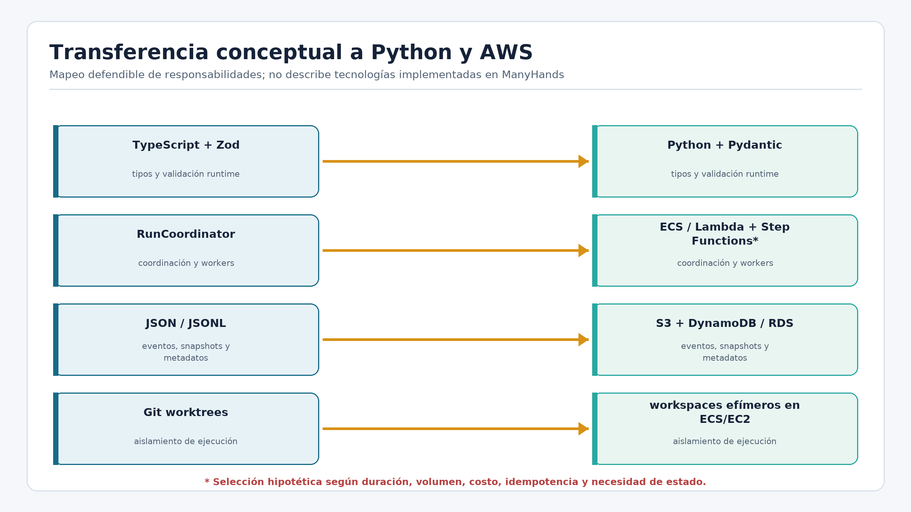

**Cómo dibujarlo en la entrevista:** ubicá FastAPI como transporte, coordinator
como dominio, DynamoDB como journal, SQS como dispatch, ECS como workers y S3 como
artifacts. Marcá EventBridge como señal, no autoridad.

### Definición técnica

Pydantic valida datos runtime y deriva tipos Python. FastAPI expone boundaries
HTTP. `asyncio` ofrece concurrencia estructurada dentro de un proceso. DynamoDB
permite conditional writes por `runId` y sequence; PostgreSQL ofrece transacciones
y consultas relacionales. SQS entrega mensajes al menos una vez, por lo que exige
idempotencia. ECS ejecuta workers aislados; S3 guarda artifacts; IAM limita
capacidades; CDK define infraestructura reproducible.

### Problema de ingeniería

Distribuir componentes antes de fijar autoridad multiplica carreras. Lambda puede
quedar corta para coding agents largos, procesos hijos y worktrees. Una base
vectorial no resuelve lifecycle: sirve para recuperación semántica, no para
secuencia, CAS o commits.

### Estrategia

Mantendría models y events en Pydantic, commands en servicios de dominio y FastAPI
como adapter. Un item `HEAD` de DynamoDB conservaría sequence y fencing token; los
events usarían sort key monotónica. SQS despacharía attempt IDs, no estado mutable.
Workers ECS usarían containers efímeros, IAM mínimo, secretos temporales y egress
controlado. S3 almacenaría bundles dirigidos por manifest.

### Implementación en ManyHands

ManyHands no implementa este stack; la evidencia es de transferencia conceptual.
El puerto [`ports.ts`](../../packages/run-coordinator/src/ports.ts) muestra qué
abstracciones deberían conservarse. Los schemas Zod y event journal permiten
razonar equivalencias con Pydantic y conditional writes sin afirmar paridad de
código.

### Evidencia real

En el proyecto actual no existen tests de AWS. Sí existen tests de las propiedades
que una implementación cloud debería preservar: CAS, fencing, idempotencia,
replay, exact candidate y delivery receipt. La propuesta AWS debe presentarse como
diseño, no resultado.

### Trade-offs y límites

DynamoDB simplifica append condicionado y escala por `runId`, pero complica queries
globales. PostgreSQL ofrece transacciones y reporting, pero exige diseñar
concurrencia. ECS es más adecuado que Lambda para procesos largos, aunque tiene
mayor costo operativo. La distribución agrega observabilidad, seguridad y
consistencia que la versión local no resuelve.

LangChain podría aportar adapters, prompts y tools; LangGraph podría aportar
branching o interrupts. RAG, embeddings y vector stores serían útiles para buscar
contexto semántico en repositorios grandes, pero no reemplazan snapshot versionado,
contracts ni evidencia sobre commits. Su incorporación debería quedar detrás de
ports y dentro del fingerprint efectivo.

### Cómo explicarlo en la entrevista

> “No implementé AWS en ManyHands, pero puedo trasladar sus invariantes. Usaría
> FastAPI/Pydantic en boundaries, DynamoDB con conditional writes para journal y
> fencing, SQS para dispatch, ECS para workers y S3 para artifacts. La elección de
> servicios es secundaria: debo conservar una sola autoridad, idempotencia,
> identidad exacta y evidencia ligada al commit.”

### Autoevaluación

1. ¿Por qué SQS obliga a pensar idempotencia?
2. ¿Cuándo elegirías DynamoDB frente a PostgreSQL?
3. ¿Por qué ECS puede ser mejor que Lambda para agents?
4. ¿Dónde podría aportar RAG y qué no resolvería?
5. Escenario: dos workers reciben el mismo attempt ID.

### Respuestas razonadas

1. La entrega puede repetirse; el consumer debe reconocer la misma operación.
2. DynamoDB para append por partición y conditional writes simples; PostgreSQL si
   predominan transacciones relacionales, joins y reporting.
3. Soporta procesos largos, herramientas, filesystem y recursos controlados sin
   el límite temporal y modelo de ejecución de Lambda.
4. Puede recuperar contexto relevante; no decide lifecycle, freshness, scope ni
   validez del commit.
5. Ambos deben reclamar autoridad con CAS/lease/fencing; solo uno puede producir
   hechos aceptados y la repetición debe ser idempotente.

# Parte II - Referencia técnica ampliada

La sección siguiente conserva el material profundo del manual anterior. Usala
para ampliar un capítulo, revisar preguntas o consultar archivos concretos.

### 1. Cómo estudiar este documento hoy

No intentes memorizar todas las clases ni todos los nombres de archivo. Dominá tres niveles:

1. **Relato principal:** problema → hipótesis → objetivos → metodología → flujo → decisiones técnicas → evidencia → límites.
2. **Modelo mental:** quién puede decidir, qué se persiste y cómo un resultado aislado llega a delivery.
3. **Profundidad para preguntas:** cuatro o cinco mecanismos con código, evidencia y trade-offs.

La presentación principal usa sobre todo las secciones 3 a 5, más una síntesis de 7 a 19. Las secciones 6 a 24 son preparación para preguntas; no intentes decirlas completas en 15 minutos.

### Plan de estudio sugerido

**Primera vuelta - 60 minutos**

- Leer las secciones 2 a 5.
- Repetir sin mirar las explicaciones de 30 segundos y 2 minutos.
- Formular de memoria pregunta principal, hipótesis y límite de granularidad.
- Dibujar el recorrido end-to-end.

**Segunda vuelta - 90 minutos**

- Estudiar las secciones 6 a 16.
- Elegir cinco mecanismos para bajar a código:
  `WorkBreakdown`, Zod, `InputFingerprint`, journal/fencing y `EvidenceMatrix`.

**Tercera vuelta - 60 a 90 minutos**

- Practicar las preguntas de la sección 20 en voz alta.
- Responder primero en 30 segundos y después agregar profundidad.
- Marcar las respuestas donde confundís “implementado”, “observado” y “futuro”.

**Última vuelta - 30 minutos**

- Leer límites, frases a evitar y tarjeta final.
- Ensayar una vez las 11 diapositivas con cronómetro; objetivo `13:35`, máximo de práctica `14:00`.
- Practicar la opción de demo de 2 minutos solo como recurso de Q&A. La demo no forma parte de los 15 minutos.

### 2. Qué probablemente quiera validar el equipo

El equipo va a escuchar un proyecto de tesis, pero también está evaluando capacidad para desarrollar software alrededor de agentes. Es probable que busquen estas señales:

- si convertís un problema amplio en contratos y boundaries concretos;
- si entendés cuándo un único agente deja demasiadas dependencias implícitas;
- si distinguís propuesta probabilística de control determinista;
- si razonás sobre concurrencia, idempotencia, recovery y persistencia;
- si ligás validación al commit y al criterio, no al relato del agente;
- si conocés Zod y LangGraph con uso y trade-offs reales;
- si podés trasladar invariantes a Python, FastAPI y AWS;
- si sos preciso sobre evidencia, seguridad y limitaciones.

Una respuesta sólida sigue esta forma:

> problema concreto → estrategia → implementación → evidencia → trade-off o límite.

Ejemplo:

> “Un attempt puede terminar después de que cambiaron sus entradas. La estrategia es hacer explícita su identidad. `computeInputFingerprint` canoniza inputs node-locales —identidad del nodo, contratos, base, artifacts, contexto, executor y validación—, sin la revisión global del grafo, para que una enmienda ajena no invalide trabajo independiente. La adopción compara el hash producido con el vigente; si difieren, registra `attempt.stale` y no adopta. El costo es mantener revisiones y digests; la ganancia es no integrar trabajo obsoleto.”

### 3. El proyecto en tres duraciones

> **Presentación principal:** estas explicaciones sirven para abrir, resumir o recuperar el relato después de una interrupción.

### Explicación de 30 segundos

> ManyHands aborda funcionalidades que cruzan varios subsistemas y son difíciles de resolver como una única tarea agentic lineal. Inspecciona el repositorio, propone una descomposición, compila un DAG jerárquico con contratos, ejecuta unidades aisladas y recompone sus artifacts bottom-up. Cada resultado se valida sobre el commit exacto y solo se adopta si sus inputs siguen vigentes. La implementación es local-first y muestra factibilidad y garantías acotadas; no demuestra que más agentes sean siempre mejores.

### Explicación de 2 minutos

> Una funcionalidad como recuperación de contraseña cruza API, dominio, persistencia, interfaz y tests. Tratarla como una única ejecución lineal concentra contexto, deja dependencias e interfaces implícitas y hace difícil saber si las piezas realmente se integraron.
>
> La hipótesis de ManyHands es que un DAG jerárquico con contratos explícitos permite dividir el objetivo en unidades acotadas, identificar dependencias, habilitar paralelismo seguro y recomponer resultados de forma controlada. El modelo propone un `WorkBreakdown`, pero Zod protege la frontera y un Graph Compiler determinista produce una `GraphRevision`, contracts y relaciones tipadas. Esa separación entre propuesta probabilística y mecanismos deterministas es una estrategia para implementar la hipótesis.
>
> Tras la aprobación, el scheduler deriva readiness y selecciona waves. Cada attempt recibe una `ExecutionBase` y un Git worktree. Git determina qué cambió, scope deny-wins controla límites y un `InputFingerprint` identifica todas las entradas. Un resultado stale no se adopta.
>
> Los outputs elegibles entran al `ArtifactRegistry`; los composites los integran bottom-up mediante `IntegrationManifest`. La `EvidenceMatrix` vincula criterios con evidencia sobre el SHA exacto. `result_ready` indica candidato verificado y `completed` exige además un receipt confirmado de delivery.
>
> El sistema actual es local-first y single-host. La granularidad `auto` existe como heurística, pero no afirmo que encuentre un óptimo ni que haya sido evaluada estadísticamente.

### Explicación de 5 minutos

> El problema parte de una observación: una funcionalidad grande no es una sola tarea. Recuperación de contraseña, por ejemplo, necesita reglas de tokens y sesiones, persistencia, endpoints, email, interfaz y tests. Una ejecución agentic lineal puede generar código, pero debe sostener demasiado contexto y deja implícitos el orden, los límites de escritura, la compatibilidad entre piezas y la integración final.
>
> La pregunta principal fue si una arquitectura basada en descomposición jerárquica, ejecución coordinada e integración bottom-up puede hacer abordables esas funcionalidades. La hipótesis es que un DAG jerárquico con contratos explícitos permite acotar unidades, identificar dependencias, paralelizar cuando sea seguro y recomponer resultados con control. La granularidad es un trade-off: hojas gruesas reducen coordinación pero concentran complejidad; hojas finas simplifican ejecución pero multiplican contracts e integración. ManyHands tiene modos y una heurística `auto`, pero la política adaptativa completa y su evaluación comparativa siguen pendientes.
>
> El flujo comienza inspeccionando el repositorio. Un `RepositorySnapshot` ofrece evidencia de estructura, stack y paths vinculada al estado del target. El planner usa esa evidencia y produce un `WorkBreakdown` semántico. Como la salida de un modelo es no confiable, Zod la valida en runtime. Un Graph Compiler determinista asigna identidades y genera una `GraphRevision`, bundles de contratos y cuatro relaciones distintas: `parentId` para ownership, `ArtifactRequirement` para flujo material, `SeamBinding` para compatibilidad y `ConflictConstraint` para riesgo. Los critics revisan coherencia y una persona aprueba una revisión concreta.
>
> El scheduler deriva readiness y persiste waves. Cada attempt recibe una base exacta con solo sus artifacts declarados y trabaja en un Git worktree. Claude Code CLI y Codex CLI son adapters del puerto `AgentExecutor`; el sistema no confía en su stdout para saber qué cambió. Inspecciona `git diff`, aplica scope deny-wins y crea el candidate commit. El `InputFingerprint` identifica grafo, contratos, base, artifacts, contexto, executor y validación. Si las entradas cambiaron, el candidate es stale y se descarta aunque haya terminado bien.
>
> La validación corre sobre el SHA exacto en un entorno limpio. Una `EvidenceMatrix` relaciona cada criterio con una obligación, estado, justificación y refs. Si el resultado es elegible y vigente, se adopta como artifact. Los composites integran únicamente artifacts adoptados y producen un `IntegrationManifest`. La raíz se valida nuevamente. Después de `result_ready`, una aprobación de delivery congela manifest, SHA y target; un receipt confirmado recién lleva a `completed`.
>
> La metodología fue incremental, con ADRs, tests unitarios, integración con Git y filesystem reales, boundaries, E2E de dominio y smokes productivos auditados. El corte del 18 de julio registró 156 archivos, 915 tests pasados y uno skipped. Ese número es histórico; lo relevante es el alcance. El smoke con CLI real llegó hasta `needs_approval`, no hasta delivery. La conclusión es que la arquitectura hace viable coordinar e integrar trabajo agentic con garantías explícitas dentro de un sistema local-first; no demuestra superioridad universal ni operación distribuida.

### 4. Marco de tesis: problema, hipótesis, objetivos, metodología y resultados

> **Presentación principal:** esta sección sostiene las diapositivas 2 a 5 y el cierre de la 11.

### Problema de tesis

Una funcionalidad grande suele cruzar API, dominio, persistencia, interfaz y tests. Una única tarea agentic lineal puede encontrar límites por:

- tamaño y heterogeneidad del contexto;
- dependencias materiales e interfaces que quedan implícitas;
- dificultad para sostener una planificación coherente durante toda la ejecución;
- interferencia cuando existe trabajo concurrente sobre el repositorio;
- validación parcial: piezas verdes sin un conjunto funcional;
- integración tardía sin ownership ni estructura explícita.

Los problemas posteriores —resultados stale, procesos tardíos, evidencia incompleta o publicación del commit equivocado— aparecen cuando se intenta operar esa división. ManyHands los trata como invariantes del sistema, no como algo que el modelo deba resolver por confianza.

### Pregunta principal

> ¿Puede una arquitectura basada en descomposición jerárquica, ejecución coordinada e integración bottom-up hacer abordables funcionalidades difíciles de resolver como una única tarea agentic lineal?

### Hipótesis de ingeniería

> Representar el trabajo como un DAG jerárquico con contratos explícitos permite dividir una funcionalidad grande en unidades acotadas, identificar dependencias, habilitar paralelismo seguro y recomponer los resultados de manera controlada.

Separar propuestas probabilísticas de compilación, lifecycle, identidad, scheduling, adopción y validación deterministas es la estrategia arquitectónica usada para implementar la hipótesis. No es la hipótesis principal.

### Granularidad: pregunta exploratoria

La granularidad no tiene una respuesta monotónica:

- **gruesa:** menos coordinación, pero hojas más grandes, heterogéneas y difíciles de validar;
- **fina:** unidades más simples, pero más contratos, dependencias, scheduling e integración;
- **conclusión:** dividir más no siempre es mejor.

El repositorio contiene modos `coarse`, `balanced`, `fine` y `auto`, y el decomposer recursivo usa una rúbrica local de atomicidad. En `auto`, el prompt pide calibrar la presión de división por rama; no fija una profundidad ni un número objetivo de nodos. Sin embargo, la ruta productiva actual basada en `WorkBreakdownPlanner` no demuestra una política adaptativa end-to-end. Lo existente es código heurístico y configuración, no un estimador validado de granularidad óptima.

La política adaptativa completa, una métrica de calidad de descomposición y la comparación controlada contra alternativas siguen como pregunta exploratoria o trabajo futuro. No digas que `auto` fue validado estadísticamente.

### Objetivos y alcance

**Objetivo general**

Diseñar e implementar un sistema que transforme un objetivo de desarrollo en un run planificado, ejecutado, validado, integrado y supervisable.

**Objetivos específicos**

- planificar con evidencia del repositorio;
- producir contratos y un grafo ejecutable;
- coordinar ejecución aislada y concurrente;
- validar, integrar, persistir y recuperar el run.

**Alcance implementado**

- local-first y single-host;
- agentes mediante CLIs;
- aislamiento con Git worktrees;
- persistencia durable local con JSON/JSONL;
- interfaz web de supervisión.

**Fuera del alcance demostrado**

- infraestructura cloud y ejecución distribuida;
- multi-tenancy;
- sandbox fuerte de seguridad;
- evaluación comparativa de productividad;
- política adaptativa completa de granularidad.

### Metodología

- desarrollo incremental por vertical slices, sin big-bang;
- decisiones arquitectónicas y trade-offs registrados en ADRs;
- tests junto a cada cambio de comportamiento;
- unitarios de schemas y políticas;
- integración con filesystem, worktrees y Git temporales reales;
- boundary tests para proteger dependencias;
- E2E de dominio por recorridos explícitos;
- auditorías y smokes manuales de la ruta productiva;
- separación entre tests automatizados, smoke observado, fixture visual y trabajo futuro.

### Resultados por nivel de evidencia

**Verificado mediante tests**

- Planner/Compiler, contratos y relaciones tipadas;
- readiness, waves, ejecución aislada, scope y fingerprints;
- adopción, Evidence Matrix e integración bottom-up;
- recorrido automatizado de dominio hasta `result_ready`;
- delivery, receipt y crash recovery en tests específicos;
- journal, replay, CAS, fencing y límites de paquetes.

**Observado mediante smoke productivo**

- planning greenfield con Claude Code CLI;
- nodos progresivos, decisiones durables y replan;
- llegada hasta `needs_approval`.

**Fotografía fechada de auditoría**

- 18/07/2026: 156 archivos, 915 tests pasados, 1 skipped;
- typechecks, lint web y builds pasaron en ese corte.

**Revalidación del worktree actual - 19/07/2026**

- 163 archivos de test;
- 945 tests pasados, 2 fallidos y 1 skipped;
- `typography-scale.test.ts` detectó dos clases de spacing `2.5` fuera de escala en el cockpit/fixture;
- `run-loading-skeleton.test.ts` detectó drift de clases entre el skeleton y el header actual.

Los dos fallos pertenecen a cambios de UI ya presentes en el worktree y no a estos documentos. La cifra de la diapositiva sigue siendo correcta como auditoría fechada, pero no digas que la suite vigente está completamente verde.

**Pendiente o limitado**

- smoke manual completo con CLIs reales hasta delivery;
- streaming Codex con la granularidad observada en Claude;
- métricas estables de latencia, costo y calidad de descomposición;
- sandbox fuerte, multi-host y multi-tenancy.

### Conclusión

> La implementación aporta evidencia de factibilidad para convertir una funcionalidad grande en unidades coordinables mediante un DAG jerárquico con contratos y recomponer resultados con identidad, integración y validación explícitas. Las garantías están acotadas al dominio y a la operación local probada. No demuestra que múltiples agentes siempre superen a uno ni que la granularidad `auto` sea óptima.

### 5. Recorrido end-to-end que tenés que poder dibujar

> **Presentación principal:** corresponde a la diapositiva 6. **Profundidad para preguntas:** los mecanismos se desarrollan desde la sección 7.

```text
Goal
  → repository inspection / RepositorySnapshot
  → planning / WorkBreakdown
  → graph compilation / GraphRevision + contracts + critics
  → approval
  → scheduling / readiness + wave
  → execution / ExecutionBase + worktree + AgentExecutor
  → Git diff + scope + candidate commit
  → exact validation / EvidenceMatrix
  → freshness check + ArtifactRegistry
  → bottom-up integration / IntegrationManifest
  → final validation / result_ready
  → immutable approval + delivery receipt / completed
```

### Ida y vuelta

- **Ida:** objetivo → evidencia del repositorio → unidades → contratos → ejecución aislada.
- **Vuelta:** candidate commits → evidencia → artifacts → composites → candidato raíz → delivery.

La ida reduce ambigüedad y hace explícitas dependencias. La vuelta compone resultados y agrega evidencia. La captura de la diapositiva 6 es suficiente para el recorrido principal; la fixture queda fuera de los 15 minutos.

---

### 6. Arquitectura y propiedad de decisiones

> **Profundidad para preguntas:** desde esta sección conviene estudiar mecanismos y trade-offs. En la exposición principal se usa solo la síntesis necesaria para las diapositivas 7 a 10.

### Capa web y composition root

`apps/web` es responsable de:

- route handlers de Next.js;
- validación de requests;
- carga de metadata y proyecciones;
- wiring de hosts, stores, schedulers y executors;
- streaming hacia el cliente;
- interfaz con React y React Flow.

No debe decidir qué transición de lifecycle es válida ni qué attempt se adopta.

### Dominio y aplicación

Paquetes principales:

- `run-coordinator`: comandos, eventos, lifecycle, decisions, outcomes, fingerprints y adopción;
- `task-graph`: `GraphRevision`, nodos y relaciones tipadas;
- `contracts`: obligaciones versionadas de tarea, scope, seams, artifacts y validación;
- `decomposer`: planner semántico, compiler y critics.

Estos paquetes no deben depender de Next.js, React, Git, filesystem ni LangGraph. El test [run-coordinator-boundaries.test.ts](../../tests/run-coordinator-boundaries.test.ts) protege esa dirección.

### Infraestructura y adapters

- `run-store`: journal, snapshots, attempts, artifacts y fencing;
- `execution-core`: worktrees, Git, procesos, validation, integration y delivery;
- `orchestrator-graph`: driver que deriva waves y despacha;
- `scheduler` y `conflict-risk`: readiness y restricciones;
- `repository-index`: grounding estructural;
- `trace-store`: diagnósticos sin autoridad de dominio.

### Por qué importa esta separación

El objetivo no es “Clean Architecture” como etiqueta. La separación permite:

- probar el lifecycle con puertos fake;
- cambiar React Flow sin cambiar semántica del grafo;
- cambiar Claude Code por Codex sin cambiar schemas del run;
- retirar LangGraph sin reescribir el dominio;
- implementar otro store sin que el dominio conozca JSONL.

### Concepto clave: port y adapter

Un port expresa qué necesita el dominio; un adapter implementa ese contrato con una tecnología.

Ejemplo: `RunEventJournalPort` pide `load` y `append`. `JsonlRunEventStore` implementa eso con archivos. En una versión AWS, otro adapter podría usar DynamoDB sin cambiar la política de lifecycle.

---

### 7. Planning: cómo se controla la salida del modelo

### Entrada del planner

El planner recibe:

- objetivo del usuario;
- `RepositorySnapshot`;
- criterios o requisitos conocidos;
- contratos existentes si los hay;
- respuestas humanas previas;
- feedback de reparación de intentos anteriores.

### Salida: `WorkBreakdown`

El `WorkBreakdown` es semántico. Describe:

- unidades composite y leaf;
- objetivos y concerns;
- acceptance intents;
- evidencia observada;
- `plannedPaths` futuros;
- artifacts candidatos;
- seams candidatos;
- incertidumbres y preguntas.

No contiene decisiones finales de runtime, IDs arbitrarios del journal ni estado de ejecución.

Código: [planner/schema.ts](../../packages/decomposer/src/planner/schema.ts).

Un fragmento importante es la distinción entre evidencia existente y salida futura:

```ts
const WorkUnitCommonShape = {
  // ...
  evidenceIds: z.array(EntityIdSchema),
  plannedPaths: z.array(RepoRelativePathSchema).optional()
};
```

Después, `superRefine` exige que una hoja tenga al menos evidencia de un path existente o un path planificado. Esto permitió soportar repositorios greenfield sin afirmar que un archivo futuro ya estaba inspeccionado.

### Salida inválida y reparación

[work-breakdown.ts](../../packages/decomposer/src/planner/work-breakdown.ts) usa `safeParse` sobre cada candidato completo. Si falla, reúne issues con sus paths y los envía como `repairIssues` en un intento posterior acotado.

```ts
const parsed = WorkBreakdownSchema.safeParse(output);
if (parsed.success) return parsed.data;
failures.push(
  ...parsed.error.issues.map(
    issue => `${issue.path.join(".") || "root"}: ${issue.message}`
  )
);
```

No todo error se reintenta. Un `NonRetryablePlanningError` representa problemas que un mejor prompt no puede reparar, por ejemplo un protocolo de CLI que cerró sin resultado terminal.

### Streaming progresivo

El planner puede recibir líneas de progreso que representan unidades completas. Cada unidad se valida con `WorkBreakdownProgressUnitSchema` y se publica como `planning.node_discovered`. El grafo provisional de la UI se deriva de esos eventos.

Esto evita dos problemas:

- mostrar texto parcial como si fuera una unidad válida;
- mantener un grafo provisional en un store paralelo.

Si un replan comienza vacío, la UI conserva temporalmente el último grafo provisional completo y lo reemplaza solo cuando el nuevo intento tiene contenido suficiente. Esto es una decisión de presentación, no una segunda autoridad.

### Graph Compiler

[compileGraphRevision](../../packages/decomposer/src/compiler/graph-compiler.ts) vuelve a parsear el breakdown y el snapshot, verifica que sus IDs correspondan y produce:

- nodos con identidad estable;
- `ArtifactRequirement`;
- `SeamBinding`;
- `ConflictConstraint`;
- bundles de contratos;
- trace de cómo cada relación fue compilada.

La idea de “compiler” es útil: el modelo genera una representación de mayor nivel y el sistema la transforma a una representación ejecutable con invariantes más fuertes.

### Critics

Los critics revisan aspectos que no se resuelven con forma JSON:

- completitud;
- atomicidad de hojas;
- coherencia de scope;
- cobertura de aceptación;
- compatibilidad de seams;
- validez del grafo;
- riesgo y conflictos.

Un schema dice “este campo existe y tiene esta forma”. Un critic puede decir “la división es incompleta” o “dos scopes se superponen de una forma riesgosa”.

---

### 8. Zod: uso real y límites

### Por qué hace falta si ya existe TypeScript

TypeScript protege durante compilación, pero no valida JSON de HTTP, disco, SSE o modelos. Cuando se hace un cast sobre datos externos, el tipo puede mentir. Zod convierte un dato desconocido en una estructura validada o produce errores explícitos.

### Patrones utilizados

#### Uniones discriminadas

[events.ts](../../packages/run-coordinator/src/domain/events.ts) define `RunEventSchema` como `z.discriminatedUnion("type", ...)`. Cada `type` selecciona un payload distinto.

Ventajas:

- parseo eficiente y mensajes de error localizados;
- narrowing de TypeScript;
- evita eventos con payloads ambiguos;
- facilita replay y versionado.

#### `.strict()`

Se rechazan campos inesperados. Esto es valioso en contratos de modelos: si el modelo intenta introducir una propiedad que pertenece al compiler o al lifecycle, no entra silenciosamente.

#### `z.infer`

El tipo TypeScript se deriva del schema, reduciendo el riesgo de que definición estática y parser evolucionen por separado.

#### `superRefine`

Se usa para invariantes entre campos. En [contract-bundle.ts](../../packages/contracts/src/contract-bundle.ts), por ejemplo:

- el scope y la validación deben pertenecer al mismo nodo que la tarea;
- las referencias deben resolver con la revisión correcta;
- un artifact producido debe declarar el producer correcto;
- cada criterio requerido debe tener una obligación de validación.

### Qué no debe decirse

Zod no:

- decide transiciones de lifecycle;
- detecta por sí solo ciclos de grafo;
- prueba que una evidencia es suficiente;
- decide freshness;
- reemplaza authorization;
- convierte una salida válida en una salida correcta.

Frase útil:

> “Uso Zod como runtime boundary. Después de parsear, las políticas del dominio todavía deben validar significado y transición.”

### Equivalencia en Python

Pydantic cumple un rol comparable para request models, eventos y persistencia. La misma regla aplica: `BaseModel` valida estructura, pero las invariantes conductuales viven en servicios o entidades de dominio.

---

### 9. Grafo, relaciones y contratos

### Forma híbrida del grafo

- **Root:** representa el objetivo completo.
- **Composite:** representa un límite real de integración.
- **Leaf:** representa una unidad cohesiva ejecutable y verificable.
- **Integrator:** existe como rol explícito cuando corresponde a la representación concreta.

El grafo no fuerza una división frontend/backend. Una hoja puede ser vertical si esa unidad es más coherente y verificable.

### Cuatro relaciones con significados distintos

#### `parentId`

Responde quién posee la integración del resultado. Define jerarquía, no disponibilidad material.

#### `ArtifactRequirement`

Responde qué output material debe existir para ejecutar, validar o integrar otro nodo. Sí afecta readiness.

#### `SeamBinding`

Responde qué productor y consumidores deben cumplir la misma revisión de un contrato. Por sí solo no obliga a ejecutar en un orden; justamente puede habilitar paralelismo contra una interfaz congelada.

#### `ConflictConstraint`

Representa riesgo o exclusión. Puede impedir que dos nodos entren en la misma wave, pero no significa que uno produzca una entrada funcional para el otro.

Código: [relations.ts](../../packages/task-graph/src/relations.ts).

### Por qué no usar una arista genérica `dependency`

Porque cada consumidor interpretaría la arista de manera distinta. El scheduler podría verla como orden; la UI como relación; la integración como artifact. Una semántica genérica desplaza ambigüedad a todas las capas.

### Contract bundle de una hoja

1. `TaskContract`: goal y criterios.
2. `ScopeContract`: paths permitidos, prohibidos y de coordinación.
3. `SeamContract`: interfaces y compatibilidad.
4. `ArtifactContract`: output materializable.
5. `ValidationContract`: obligaciones que deben demostrarse.

Los contratos son versionados porque un cambio de contrato puede invalidar un attempt aunque el título del nodo no cambie.

---

### 10. Readiness, waves y decisiones humanas

### Readiness no es un booleano persistido sin explicación

El sistema deriva por qué un nodo está o no listo. Motivos posibles:

- artifact requerido ausente;
- contrato stale;
- decisión pendiente que lo afecta;
- base no materializable;
- restricción de conflicto;
- presupuesto agotado;
- executor no disponible;
- nodo ya adoptado o con attempt activo.

Esto facilita auditoría y recovery: no alcanza con saber `ready=false`; hay que saber qué condición debe cambiar.

### Waves

Una wave es un conjunto de nodos seleccionados para despacho concurrente. La configuración efectiva contiene `maxParallel`. El driver:

1. calcula readiness;
2. registra `readiness.observed`;
3. selecciona y persiste `wave.selected`;
4. registra `attempt.started`;
5. recién después llama a los executors.

Código: [execution-driver.ts](../../packages/orchestrator-graph/src/v2/execution-driver.ts).

Persistir antes del efecto permite reconstruir la intención de ejecución después de un crash.

### Persistencia de resultados concurrentes

Los agents de una wave pueden terminar en distinto orden. El driver los ejecuta en paralelo, pero serializa el append de facts con una cadena de promesas. Así un nodo rápido no espera a que termine el más lento para dejar evidencia durable, y el journal conserva orden de append.

### Decisiones locales

Una `Decision` declara `affectedNodeIds`. Solamente esos nodos quedan en espera. El run entra en `waiting_for_input` únicamente si no hay trabajo independiente listo.

Ejemplo de la fixture:

- decisión: cerrar o mantener sesiones activas;
- afectados: política de sesiones y confirmación de contraseña;
- independientes: token, solicitud API y formulario;
- resultado: tres tareas comienzan mientras la decisión sigue pendiente.

---

### 11. AgentExecutor, worktrees, Git y scope

### Qué es un `AgentExecutor`

Es el puerto que encapsula una invocación de un agente. Los perfiles concretos actuales incluyen Claude Code CLI y Codex CLI.

Entrada efectiva:

- working directory del worktree;
- archivo de instrucciones derivado del contrato;
- modelo y effort seleccionados;
- timeout;
- signal de cancelación;
- identidad de run/attempt;
- callbacks de output y status para diagnósticos.

Salida:

- exit code;
- stdout y stderr;
- timeout;
- duración;
- uso/costo cuando el provider lo informa;
- metadatos diagnósticos.

Código: [executor/types.ts](../../packages/execution-core/src/executor/types.ts) y [node-executor.ts](../../packages/execution-core/src/v2/node-executor.ts).

### Qué no decide el executor

- lista autoritativa de archivos modificados;
- cumplimiento del scope;
- candidate commit final;
- resultado de validación;
- freshness;
- adopción;
- lifecycle.

### `ExecutionBaseBuilder`

[execution-base-builder.ts](../../packages/execution-core/src/base/execution-base-builder.ts) crea un worktree desde el base commit y materializa solo los artifacts nombrados en el request.

Cada artifact registra:

- commit anterior;
- commit resultante;
- digest e identidad;
- manifest de composición.

El `baseCommit` que usa después el recorder es el commit ya materializado, no necesariamente el commit original del repositorio. Esto hace que el diff del agente se mida contra su base real.

### Git como fuente de verdad

[ResultRecorder](../../packages/execution-core/src/result/recorder.ts) documenta la regla:

```ts
/**
 * `git diff` is the only source of truth;
 * the orchestrator performs the commit on success.
 */
```

Flujo normal:

1. verificar que el agente no haya creado un commit inesperado;
2. stagear excluyendo artifacts generados comunes;
3. obtener `diffCachedNameOnly`;
4. verificar empty diff;
5. aplicar scope;
6. leer el diff;
7. crear el commit desde el orquestador.

### Scope deny-wins

Si un path está permitido por una regla pero prohibido por otra, gana la prohibición. Esto es más seguro que combinar allowlists de manera permisiva.

Un path fuera del scope puede configurarse como advisory, gate o violation; los paths explícitamente prohibidos son terminales.

### Empty diff

Exit code cero con diff vacío no se acepta automáticamente. Solo es un no-op legítimo si el sistema puede demostrar que la base ya satisfacía el contrato, por ejemplo que todos los archivos esperados ya existen y no contienen marcadores de stub.

### Worktree no es sandbox de seguridad

Un worktree aísla branches y cambios de Git. No impide que un proceso lea secretos del host, acceda a red o escriba fuera de su directorio si el sistema operativo se lo permite. Para aislamiento fuerte hacen falta containers, VMs, usuarios restringidos o sandboxes remotos.

---

### 12. `InputFingerprint` y adopción exacta

### Problema

Un attempt puede terminar correctamente y aun así ser inválido porque mientras ejecutaba cambió una de sus entradas node-locales:

- un contrato del nodo;
- el base commit;
- un artifact consumido;
- el contexto del repositorio;
- el perfil del executor;
- la validación requerida.

(La revisión global del grafo no es una entrada: una enmienda ajena no invalida un nodo independiente.)

### Construcción

[fingerprint.ts](../../packages/run-coordinator/src/domain/fingerprint.ts) valida la fuente, ordena referencias y calcula SHA-256:

```ts
const canonical = {
  ...input,
  contractRevisions: [...input.contractRevisions].sort(compareRef),
  consumedArtifacts: [...input.consumedArtifacts].sort(compareRef)
};
return `sha256:${createHash("sha256")
  .update(JSON.stringify(canonical))
  .digest("hex")}`;
```

Ordenar es necesario para que el hash no cambie por orden accidental de arrays.

### Adopción

[attempts.ts](../../packages/run-coordinator/src/domain/attempts.ts) es la puerta productiva única:

1. el attempt debe estar `finished`;
2. debe tener `outputDigest`;
3. el fingerprint debe coincidir con el vigente;
4. recién entonces se crea y registra el artifact.

Si no coincide, se genera `attempt.stale` y el registry no recibe el artifact.

### Por qué no usar solamente base commit

Dos attempts sobre el mismo commit pueden tener contratos o artifacts distintos. El fingerprint captura el significado completo de la entrada, no solo la posición en Git.

### Trade-off

El sistema debe versionar y digerir más inputs. A cambio, puede conservar trabajo independiente y descartar exactamente lo obsoleto, en lugar de invalidar todo el run o integrar resultados dudosos.

---

### 13. Event sourcing, CAS, leases, fencing e idempotencia

### Event sourcing acotado

El sistema no intenta event-sourcear toda la aplicación. Usa eventos como historia canónica del lifecycle dinámico del run.

Ejemplos:

- `run.created`;
- `graph.compiled`;
- `decision.raised`;
- `attempt.started`;
- `artifact.adopted`;
- `integration.completed`;
- `final_candidate.verified`;
- `delivery.published`.

`foldRun(events)` reconstruye la proyección.

### Validar antes de persistir

En [coordinator.ts](../../packages/run-coordinator/src/coordinator.ts):

```ts
const provisional = inputs.map(/* parse + sequence */);
foldRun([...current, ...provisional]);
const appended = await events.append(runId, expectedSequence, inputs);
```

Si el fold detecta una transición ilegal, el append no sucede. El store repite esta validación bajo su lock.

### Compare-and-swap de secuencia

El writer dice: “espero que el journal tenga N eventos”. El store compara esa expectativa con la longitud real. Si otro writer avanzó, lanza `SequenceConflictError`. El coordinator recarga y revalida.

Esto evita lost updates.

### Operation lease

Indica qué operación tiene derecho a trabajar sobre el run. Es una concesión durable que puede expirar o reemplazarse.

### Fencing token

Es un número monotónico asociado a la autoridad. Incluso si un proceso antiguo conserva CPU y termina tarde, su token menor hace que el store rechace sus escrituras.

La diferencia importante:

- el lease dice quién debería ser el owner;
- el fencing token permite que el recurso rechace efectivamente a un owner viejo.

### Idempotencia por event ID

Si se repite el mismo `eventId` con idéntico contenido, el append devuelve el hecho existente. Si el ID aparece con otro contenido, falla. Así un recovery puede volver a registrar una observación sin crear una segunda historia.

### Checksums y corrupción

Cada línea del journal incluye schema version, evento y checksum SHA-256.

- una última línea incompleta puede tratarse como trailing record degradado;
- corrupción intermedia, secuencia incorrecta o checksum inválido falla cerrado;
- un snapshot corrupto se descarta y reconstruye.

### Snapshots

Son caches de proyección para acelerar carga. Nunca pueden introducir un hecho que no exista en el journal.

---

### 14. Recovery por causa

### Por qué un retry universal es incorrecto

Repetir puede ayudar ante un timeout transitorio, pero empeora o es inútil ante:

- credenciales ausentes;
- binario no instalado;
- scope violado;
- contrato equivocado;
- dependencia no declarada;
- conflicto semántico;
- commit inesperado.

### Matriz mental

| Causa | Respuesta |
|---|---|
| transitoria | retry acotado con nuevo attempt |
| auth, binario o entorno | suspender recurso y pedir corrección |
| código/test local | una reparación en el mismo worktree |
| contrato/descomposición | enmienda o replan local |
| artifact no declarado | proponer nueva relación y revisión |
| scope/commit inesperado | descartar candidato |
| integración | reparación semántica acotada; luego decisión |
| infraestructura compartida | suspender solo el alcance afectado |

### Inmutabilidad

Recovery agrega events y attempts. No modifica el attempt fallido para transformarlo en exitoso. Esta propiedad es esencial para explicar qué ocurrió.

### Budget acotado no significa regla universal

Algunas clases tienen un presupuesto concreto, por ejemplo una reparación semántica de integración. La regla global no es “reintentar una vez” o “tres veces”; el presupuesto pertenece a cada política y causa.

---

### 15. Validación y `EvidenceMatrix`

### Por qué “tests verdes” es insuficiente

- podrían ejecutarse sobre otro commit;
- podrían no cubrir un criterio requerido;
- podrían pasar también en el baseline, sin demostrar el cambio;
- podrían haberse debilitado;
- podrían ser flaky;
- podría faltar un test relevante.

### `ValidationContract` versus `ValidationRecipe`

- El contrato congela **qué debe demostrarse**.
- La recipe decide **cómo demostrarlo** según capacidades observadas del repositorio.

Esto evita congelar prematuramente un comando que todavía puede variar legítimamente.

### Validación exacta

[ExactCandidateValidatorV2](../../packages/execution-core/src/v2/exact-candidate-validator.ts):

1. compila la recipe;
2. crea un sandbox Git en el candidate commit;
3. ejecuta los pasos;
4. si hace falta, crea otro sandbox para el baseline;
5. construye una matriz con identidad derivada del candidato, contrato, criterios y outcome.

### Estados de criterio

- `satisfied`: evidencia aceptable pasó en el candidato exacto;
- `failed`: evidencia requerida falló;
- `uncovered`: no existe evidencia aceptable suficiente;
- `flaky`: pasó después de un fallo previo;
- `not_applicable`: se justificó que no aplica.

### Outcome

- `verified`: obligaciones requeridas cubiertas sin hard failures;
- `unverified`: hay requisitos sin cobertura;
- `failed`: hay fallos, flakiness prohibida o integrity findings.

Código: [evidence-matrix.ts](../../packages/execution-core/src/validation/evidence-matrix.ts).

### Baseline y control negativo

- **Baseline:** permite saber si el fallo ya existía o si el cambio introdujo una regresión.
- **Control negativo:** busca demostrar que el test es sensible; por ejemplo, que falla ante una condición deliberadamente incorrecta cuando el contrato lo exige.

No todos los criterios permiten un control negativo práctico, por eso el contrato distingue `required`, `when_feasible` o políticas equivalentes.

---

### 16. Integración bottom-up y delivery

### Por qué bottom-up

Cada composite es responsable de integrar los outputs de sus hijos. Así el árbol de planificación coincide con límites de composición reales.

### `IntegrationManifest`

[manifest.ts](../../packages/execution-core/src/integration/manifest.ts) registra:

- identidad del run y del integration attempt;
- composite y revisión;
- base y fingerprint;
- artifacts hijos disponibles y requeridos;
- artifacts faltantes;
- revisiones de seams;
- operaciones de cherry-pick;
- candidate SHA;
- evidencia del padre;
- output artifact;
- errores y disposition.

El manifest falla si falta un artifact requerido o si la base real no coincide con la declarada.

### Conflicto textual versus compatibilidad semántica

Un cherry-pick limpio solo dice que Git pudo aplicar líneas. El contrato padre puede seguir fallando. Por eso el composite se valida después de aplicar artifacts.

Si hay conflicto, existe una reparación semántica acotada con contexto del padre, seams y artifacts. Si no converge, el resultado es `decision_required`; no se oculta una omisión.

### Candidate final

La raíz produce un candidato y evidencia. El estado `result_ready` significa que existe un final candidate elegible, no que ya se publicó.

### Delivery transaccional

[publisher.ts](../../packages/execution-core/src/delivery/publisher.ts) implementa:

1. fingerprint de la solicitud;
2. claim de idempotency key;
3. recuperación de un side effect previo si hubo crash;
4. inspección del target;
5. rechazo si branch, head o fingerprint cambiaron;
6. rechazo si el target está sucio;
7. publicación;
8. validación estricta del receipt;
9. persistencia del receipt.

Frase central del código:

```ts
if (target changed) {
  throw new Error(
    "The delivery target changed after approval; nothing was published."
  );
}
```

`completed` se deriva únicamente cuando el receipt confirmado corresponde al manifest y SHA aprobados.

---

### 17. UI, React Flow y fixture

### Modelo de UI

El cliente adapta eventos canónicos y llama a un reducer puro. No mantiene `useState` separados para decir que un nodo está “completo” o que una decisión está “resuelta”. El estado local de React se limita a interacción:

- nodo seleccionado;
- lente activa;
- inspector abierto;
- minimapa;
- viewport;
- autoencuadre.

### React Flow como adapter

Código propio calcula:

- layout del árbol;
- relaciones visibles;
- agrupamiento de edges;
- vecindario del nodo;
- estados y etiquetas.

React Flow renderiza `Node[]` y `Edge[]`, maneja pan/zoom y ejecuta acciones de viewport. No decide readiness ni semántica.

### Viewport

El viewport se inicializa una vez. `fitView` ocurre:

- por acción explícita **Encuadrar**;
- con **Autoencuadre** activo, cuando cambia la firma estructural de IDs de nodos.

Cambiar estado, selección, actividad o lente no debe mover la cámara.

### Fixture

La fixture de recuperación de contraseña:

- contiene 69 eventos;
- organiza el recorrido en 9 hitos, con cursores `1, 2, 19, 25, 34, 37, 65, 67, 69`;
- proyecta 10 nodos: una raíz, tres composites y seis hojas;
- contiene 2 `ArtifactRequirement`, 2 `SeamBinding` y 1 `ConflictConstraint`;
- usa el mismo `RunModelView`;
- llama al mismo `buildRunModel` con un prefijo de eventos;
- no usa SSE;
- no renderiza acciones productivas y `command()` retorna sin llamar al backend;
- permite retroceder reconstruyendo por replay.

Los botones de opciones de decisión pueden verse activos, pero su click no persiste nada en modo fixture. La resolución durable se muestra avanzando al evento 38. Por eso la fixture prueba reducer y presentación, no agents, Git, filesystem, red ni delivery reales.

La captura [`docs/img/img2.png`](../img/img2.png), usada en la diapositiva 6, es el recurso visual normal de la exposición. La UI en vivo es opcional y queda fuera de los 15 minutos.

---

### 18. Librerías y frameworks: qué decir de cada uno

> **Presentación principal:** una responsabilidad concreta por tecnología. **Profundidad para preguntas:** detalles de boundaries, equivalencias y trade-offs.

### TypeScript

Es el lenguaje del monorepo. En los límites críticos, los tipos se derivan de schemas runtime con `z.infer` para no mantener por separado parseo y representación estática. No afirmes que absolutamente todos los tipos del repositorio provienen de Zod.

### Zod

Uso productivo transversal para schemas, parsing, uniones discriminadas e invariantes estructurales. No reemplaza dominio.

### Next.js

App Router como capa HTTP y composition root. Route handlers traducen requests a commands y queries. Los tipos de Next no entran al dominio.

### React

Composición del workspace e interacción local. El estado de negocio viene del reducer.

### React Flow

Adapter visual del grafo. Layout y semántica quedan fuera del framework.

### `simple-git` y Git nativo

`simple-git` encapsula operaciones con `cwd` explícito. Para algunos comandos donde exit code no cero es un resultado semántico esperado, se usa un proceso controlado. Git es la autoridad; la librería es un cliente.

### Claude Code CLI y Codex CLI

Implementan perfiles intercambiables del puerto `AgentExecutor`. Reciben working directory, instrucciones, modelo, timeout y cancelación; devuelven outcome y diagnóstico. Ninguna CLI decide qué archivos cambiaron, freshness, adopción o lifecycle.

El streaming progresivo de planning está demostrado de forma fuerte con Claude Code CLI. El host consume stdout incremental de Codex, pero la utilidad de los chunks depende de lo que emita la CLI; esa garantía sigue siendo parcial.

### Vitest

Pruebas de schemas/políticas, adapters reales, boundaries y E2E de dominio.

### JSON y JSONL

JSON representa metadata, snapshots y records auxiliares. El journal de eventos usa envelopes JSONL con schema version, evento y checksum. La historia es append-only en su semántica: cada nuevo hecho extiende la secuencia; los snapshots son caches descartables que se reconstruyen por replay.

### LangGraph

`StateGraph` y checkpoints participaron del flujo productivo de una arquitectura anterior. Al coexistir con `RunRecord`, journal y UI podían crear varias autoridades sobre lifecycle y recovery. El lifecycle se trasladó a un `RunCoordinator` independiente de frameworks; el journal de eventos quedó como historia canónica y los StateGraphs productivos se retiraron en `c5a4f99`.

Hoy una búsqueda de `@langchain`, `StateGraph`, `Annotation` e `interrupt(` en `apps` y `packages` no encuentra imports productivos. El boundary test impide que `run-coordinator` importe LangGraph. Las dependencias fueron removidas de `apps/web/package.json`: ya no hay uso ni deuda de manifest.

No digas simplemente “se quitó porque no servía”. Una respuesta madura es:

> “Aportaba una topología de control útil, pero al evolucionar el producto necesitaba eventos de dominio, CAS, fencing, adopción y delivery con una sola autoridad. Mantener checkpoints como estado paralelo aumentaba el riesgo de divergencia. Lo retiré de la ruta productiva y podría reincorporarlo como adapter si aporta branching o interrupts sin duplicar estado ni lifecycle.”

### LangChain

No hay evidencia de uso productivo actual. Las dependencias `@langchain/core` y `@langchain/langgraph` fueron removidas del manifest. No atribuyas a LangChain parsing, prompts o tools que hoy implementa código propio.

### ¿Por qué las dependencias siguen instaladas?

Porque la retirada de imports y arquitectura ocurrió antes de limpiar el manifest. Esto es deuda explícita, no una feature. La regla del proyecto es que una dependencia solo forma parte de la arquitectura si hay import productivo, responsabilidad delimitada y test del boundary.

---

### 19. Evidencia, testing, CI y límites de los resultados

### Pirámide real de evidencia

#### Schemas y unit tests

Prueban invariantes acotadas:

- fingerprints estables;
- contracts válidos;
- recovery policy;
- lifecycle;
- evidence outcomes.

#### Integration tests

Usan filesystem, repositorios Git y worktrees temporales reales:

- event store;
- fencing;
- scope;
- worktrees;
- integración;
- delivery.

#### Boundary tests

Inspeccionan que paquetes de dominio no importen frameworks o infraestructura prohibida.

#### E2E de dominio

[run-v2-e2e.test.ts](../../tests/run-v2-e2e.test.ts) recorre planificación compilada, ejecución de hojas, artifacts, integración y `result_ready`. Los tests de delivery y crash recovery completan publicación y receipt.

#### Smokes productivos

Ejercitan CLIs reales y wiring web. La auditoría documentada llegó hasta `needs_approval`. No debe presentarse como delivery real completo.

#### Fixture UI

Prueba replay, reducer, presentación y navegación. No prueba execution backend.

### CI

[.github/workflows/ci.yml](../../.github/workflows/ci.yml) ejecuta en Windows y Linux:

- instalación con lockfile;
- build de paquetes;
- typecheck web;
- tests.

El lint existe como señal, pero actualmente es `continue-on-error` por deuda preexistente documentada. No lo presentes como gate estricto.

### Cómo hablar de 915 tests

> “La auditoría del 18 de julio registró 156 archivos y 915 tests pasados. Es una fotografía verificable de ese corte, no una métrica de calidad por sí sola. Al revalidar el worktree actual ejecuté 163 archivos: 945 tests pasaron, dos regresiones UI fallaron y uno quedó skipped. Por eso separo la evidencia histórica verde del estado actual y no oculto los rojos.”

### Qué no está demostrado

- productividad superior a un solo agente;
- confiabilidad estadística de providers;
- costos en producción;
- aislamiento de seguridad fuerte;
- operación multi-host;
- smoke manual completo con CLIs reales hasta delivery;
- streaming Codex con la misma calidad observada en Claude Code.

---

### 20. Preguntas probables y respuestas recomendadas

### 1. ¿Por qué no resolver todo con un único agente?

> Un solo agente reduce coordinación y puede ser la mejor opción para un cambio cohesivo. El problema aparece cuando una feature cruza API, dominio, datos, UI y tests: concentra contexto, deja dependencias implícitas y mezcla implementación, validación e integración. ManyHands no maximiza cantidad de agentes; hace explícito cuándo el trabajo puede separarse y cómo recomponerlo. La tesis no demuestra que varios agentes siempre sean superiores.

Si profundizan:

> La paralelización solo es segura cuando los inputs y seams están suficientemente congelados. Si dos tareas necesitan el mismo artifact mutable o tienen un conflicto de alto riesgo, el scheduler las serializa o espera.

### 2. ¿Por qué un DAG?

> Porque el trabajo tiene jerarquía, flujo material, compatibilidad y restricciones que no se representan bien en una lista. Que sea acíclico permite derivar readiness y un orden de recomposición sin dependencias circulares. No uso una arista genérica: `parentId`, artifacts, seams y conflicts tienen semánticas distintas.

### 3. ¿Cómo se determina la granularidad?

> Hoy existen modos de presión de descomposición y una heurística `auto` en el decomposer recursivo. La rúbrica evalúa atomicidad local y evita una profundidad fija. La ruta productiva de `WorkBreakdownPlanner` no demuestra todavía una política adaptativa end-to-end. Por eso no lo llamo cálculo óptimo; el diseño completo y su evaluación siguen pendientes.

### 4. ¿Qué ocurre si la descomposición es demasiado gruesa?

> Hay menos coordination overhead, pero cada hoja acumula más concerns, contexto, paths y criterios. Se vuelve más difícil aislar fallos, paralelizar y atribuir evidencia. El síntoma no es solamente “un nodo grande”: es un contrato que mezcla responsabilidades y una validación poco focalizada.

### 5. ¿Qué ocurre si la descomposición es demasiado fina?

> Las hojas son simples, pero crecen los contracts, artifacts, decisions, waves e integraciones. También aumenta el riesgo de crear seams artificiales y de pagar más costo de coordinación que de implementación. Por eso “dividir más” no es el objetivo del sistema.

### 6. ¿Qué parte de la granularidad está implementada y cuál es futura?

> Están implementados los modos, la rúbrica local del decomposer recursivo, el control `auto` y guardrails que evitan usar profundidad como objetivo. No está demostrada su integración como política adaptativa completa en el planning productivo, ni una estimación óptima con evidencia comparativa o evaluación estadística contra configuraciones fijas o un único agente. Esa distinción debe quedar explícita.

### 7. ¿Qué diferencia hay entre un nodo y un agente?

> El nodo es una unidad de trabajo del dominio. Un agent executor es una estrategia concreta para intentar resolverla. Un nodo puede tener varios attempts y hasta cambiar de perfil; el agente no es la identidad persistida del trabajo.

### 8. ¿Qué recibe y qué devuelve el planner?

> Recibe goal, snapshot del repositorio, requisitos y respuestas previas. Devuelve un `WorkBreakdown`: unidades semánticas, aceptación, evidencia, paths planificados, artifacts, seams e incertidumbres. No devuelve el lifecycle ni la decisión final de scheduling.

### 9. ¿Qué pasa si el modelo devuelve JSON inválido?

> Zod genera issues con paths. El planner puede reintentar de forma acotada enviando esos issues como feedback de reparación. Si el problema es de protocolo o transporte y no de contenido, se marca no retryable para no repetir la misma causa.

### 10. ¿Cómo evitás que el modelo invente archivos?

> Distingo evidencia observada de outputs planificados. `evidenceIds` debe resolver contra el snapshot; `plannedPaths` declara archivos futuros. El schema y los critics rechazan contradicciones. El compiler usa ambos conceptos sin presentar un planned path como observación existente.

### 11. ¿Por qué separar Planner y Graph Compiler?

> Porque comprender semántica y fijar identidad ejecutable son responsabilidades distintas. El modelo es útil para proponer cortes; un compiler determinista es mejor para IDs, revisiones, scopes, relaciones y contracts. La separación permite testear la misma propuesta y evita que el modelo controle invariantes operativas.

### 12. ¿Qué rol cumple Zod?

> Valida runtime boundaries: HTTP, modelos, eventos, disco y SSE. También expresa invariantes estructurales cross-field. No decide transiciones, freshness ni corrección semántica; esas políticas quedan en el dominio.

### 13. ¿Usás LangChain o LangGraph actualmente?

> No en la ruta productiva actual. LangGraph fue usado en una arquitectura anterior con StateGraphs y checkpoints. Lo retiré cuando empezó a duplicar la autoridad del lifecycle y recovery. Las dependencias ya fueron removidas del manifest y una búsqueda de imports productivos es vacía.

### 14. ¿Por qué retirar LangGraph si el puesto lo usa?

> Haberlo retirado no significa desconocerlo. La decisión muestra que entiendo su rol y sus límites. Lo usaría cuando su control flow aporta branching, interrupts o composición, pero detrás de un adapter y sin convertir checkpoints en una segunda fuente de verdad. En un proyecto donde LangGraph ya sea el runtime canónico, diseñaría la persistencia de dominio para convivir explícitamente con él.

### 15. ¿Usaste RAG o una base vectorial?

> No. El grounding actual es un `RepositorySnapshot` estructural y versionado; no usa embeddings ni vector database. No lo llamaría RAG. Si el repositorio creciera, evaluaría recuperación híbrida de símbolos, paths, texto y embeddings, pero las citas tendrían que incluir commit y digest, y el retrieval entraría como evidencia candidata, no como verdad.

### 16. ¿Cómo probás código que depende de un LLM no determinista?

> Pruebo el boundary, no una frase exacta. Uso modelos deterministas o fakes para verificar prompts, schemas, retries y compiler. Después separo integración real con CLIs mediante smokes. Los invariantes importantes —adopción, scope, lifecycle, evidence y delivery— no dependen de que el modelo responda siempre igual.

### 17. ¿Por qué CLIs y no APIs directas de los providers?

> Los CLIs permitieron integrar capacidades de coding agent y procesos locales con rapidez. El costo es depender de su protocolo de stdout, versionado y disponibilidad. Por eso están detrás de `AgentExecutor`. Una API directa podría mejorar streaming estructurado, telemetría y control, pero cambiaría el adapter, no el dominio.

### 18. ¿Qué evita que un agente modifique cualquier archivo?

> Tres capas: instrucciones de scope, worktree aislado y verificación autoritativa de Git. El `ScopeChecker` aplica deny-wins sobre los archivos realmente modificados. Las instrucciones reducen errores; el diff y la política son la garantía.

### 19. ¿Los worktrees son un sandbox?

> Son aislamiento de Git, no seguridad fuerte. Evitan mezclar branches y permiten atribuir diffs, pero no restringen red, secretos ni filesystem externo. Para producción usaría containers o VMs con permisos mínimos, red controlada y credenciales efímeras.

### 20. ¿Qué es el `InputFingerprint`?

> Es un hash canónico de las entradas node-locales que afectan el significado de un attempt: identidad del nodo, contratos, base, artifacts, contexto, executor y validación. Deliberadamente no incluye la revisión global del grafo, para que una enmienda ajena no invalide un nodo independiente. Antes de adoptar vuelvo a comparar con el vigente. Si cambió, el resultado es stale aunque sus tests hayan pasado.

### 21. ¿Por qué no alcanza con verificar el commit base?

> Porque el mismo base commit puede ejecutarse con un contrato distinto, artifacts distintos o un perfil diferente. Freshness tiene que representar la entrada semántica completa.

### 22. ¿Por qué event sourcing?

> Porque el run atraviesa efectos asíncronos, decisiones y recovery. Necesito saber qué ocurrió y reconstruir el estado sin confiar en caches paralelas. Lo uso acotado al lifecycle del run; no como solución universal para toda la aplicación.

### 23. ¿Cuál es la diferencia entre CAS, lease y fencing?

> CAS evita que dos writers ganen la misma secuencia. El lease designa un owner operativo. El fencing token hace que el store pueda rechazar a un owner viejo que termina tarde. Son problemas relacionados, pero no intercambiables.

### 24. ¿Cómo manejás idempotencia?

> Los facts externos usan event IDs estables: repetir el mismo ID y contenido es idempotente, reutilizarlo con otro contenido falla. Delivery usa una idempotency key vinculada a un fingerprint de la solicitud y acepta solo un receipt que confirme exactamente esa solicitud.

### 25. ¿Qué ocurre si el proceso cae después de publicar pero antes de guardar el receipt?

> En recovery, el publisher reclama la misma idempotency key y pregunta al adapter del repositorio si el side effect ya ocurrió. Si recupera un receipt válido, lo persiste sin publicar otra vez. El test de crash recovery cubre ese escenario.

### 26. ¿Por qué una decisión no bloquea todo el run?

> Porque declara `affectedNodeIds` y readiness se deriva por nodo. Bloquear todo desperdiciaría paralelismo y convertiría una duda local en un gate global. Solo se espera a la persona cuando no queda trabajo independiente.

### 27. ¿Qué significa recovery por causa?

> Primero clasifico evidencia y después elijo una política. Timeout puede reintentarse; código puede repararse; contrato requiere enmienda; scope se descarta; auth suspende el recurso; integración puede repararse una vez y luego escalar. Repetir todo tres veces no es una política segura.

### 28. ¿Cómo sabés que un test demuestra un criterio?

> El `ValidationContract` vincula obligaciones con criterios y tipos de evidencia aceptables. La ejecución produce observaciones con refs. La `EvidenceMatrix` hace explícito si cada criterio está satisfecho, fallido, descubierto o flaky. Un exit code verde sin vínculo no alcanza.

### 29. ¿Por qué validar en otro worktree?

> Para ejecutar sobre el SHA exacto en un entorno limpio, sin depender del estado residual del worktree del agente. Así la evidencia describe el candidato que se va a integrar o entregar.

### 30. ¿Qué agrega el `IntegrationManifest` sobre un cherry-pick?

> Declara qué artifacts eran requeridos, cuáles se aplicaron, sobre qué base, qué operaciones ocurrieron y qué evidencia del padre se obtuvo. Git puede no reportar conflicto y aun así fallar la compatibilidad semántica; el manifest más la validación evita confundir ambos conceptos.

### 31. ¿Qué significa `completed`?

> Existe un final candidate evidence-eligible, una aprobación inmutable y un receipt confirmado que corresponde al mismo manifest, SHA y target. No significa solamente que terminaron tasks.

### 32. ¿Cuál fue el problema técnico más difícil?

Respuesta sugerida:

> Mantener una sola autoridad cuando HTTP, procesos, Git, UI y recovery observan el run en momentos distintos. La solución no fue un lock único: separé eventos canónicos, CAS, leases, fencing e idempotencia. También tuve que cuidar que la UI fuera proyección y que un resultado tardío no recuperara autoridad.

Elegí este ejemplo porque conecta arquitectura, concurrencia y producto.

### 33. ¿Qué decisión salió mal o cambió?

> La primera integración de LangGraph daba una forma conveniente de modelar el control flow, pero con el tiempo sus checkpoints coexistieron con `RunRecord`, journal y UI. Eso hacía posible divergencia. Registré el trade-off, moví lifecycle a `RunCoordinator` y retiré los StateGraphs productivos. El aprendizaje fue que un framework de orquestación no debe convertirse accidentalmente en el dominio.

### 34. ¿Qué mejorarías primero?

> Primero cerraría la brecha operativa: smoke real descartable hasta delivery, métricas de latencia/costo y protocolo de streaming estructurado. Después agregaría aislamiento fuerte de workers. Recién entonces distribuiría persistencia y ejecución. Escalar antes de cerrar evidencia y seguridad multiplicaría ambigüedad.

### 35. ¿Cómo lo implementarías en Python?

> Mantendría contratos y eventos como modelos Pydantic, commands en servicios de dominio, FastAPI como boundary y adapters separados para Git, stores y executors. Para waves usaría concurrencia estructurada con `asyncio`, preservando un append serializado por run. La parte difícil no es traducir TypeScript: es conservar invariantes de identidad y autoridad.

### 36. ¿Cómo lo llevarías a AWS?

> Una opción sería FastAPI en ECS para la API, DynamoDB para eventos con `runId` como partition key y sequence como sort key, conditional writes para CAS/fencing, S3 para artifacts y SQS para dispatch. Workers en ECS ejecutarían agents en containers efímeros. La aprobación y delivery seguirían siendo commands del dominio. CDK definiría recursos e IAM. Es una propuesta de evolución; el proyecto actual no corre así.

### 37. ¿Lambda o ECS para los agentes?

> Para intake o tareas cortas, Lambda puede servir. Para agentes de coding con procesos, repositorios, tiempos variables y necesidad de aislamiento, preferiría ECS/Fargate o workers equivalentes. Mantendría la decisión detrás de un executor adapter.

### 38. ¿DynamoDB o RDS?

> DynamoDB encaja bien con append por `runId` y conditional writes, pero exige diseñar proyecciones e índices. PostgreSQL simplifica consultas y transacciones relacionales. No elegiría por moda: primero definiría volumen, patrones de query, multi-tenancy y requisitos de consistencia. El dominio solo necesita un journal con CAS y fencing.

### 39. ¿Cómo incorporarías RAG?

> Indexaría por commit y guardaría referencias verificables a path/symbol/range. Usaría recuperación híbrida, no solamente vectorial. El planner recibiría evidencia citada; el compiler rechazaría referencias que no resuelvan. El digest del contexto recuperado entraría al fingerprint para que un cambio de grounding invalide correctamente los attempts afectados.

### 40. ¿Cómo controlás costos y rate limits?

> Hoy se registran métricas cuando la CLI las informa, pero no hay una política productiva completa de presupuesto. Agregaría budget como parte de la configuración efectiva del run, rate limiting por provider, backoff solo para causas transitorias, límites de concurrencia y estimación antes de seleccionar waves. Nunca cambiaría silenciosamente de modelo porque alteraría el fingerprint.

### 41. ¿Qué riesgos de seguridad ves?

> Ejecución de comandos, exfiltración de secretos, acceso de red, supply chain, path traversal, publicación no autorizada y contaminación entre tenants. La implementación actual cubre scope de Git, paths, autoridad de proceso y delivery exacto, pero no ofrece sandbox remoto ni multi-tenancy. En producción usaría aislamiento fuerte, IAM mínimo, secretos efímeros, egress controlado y auditoría.

### 42. ¿Qué hay de CI/CD?

> El repositorio tiene GitHub Actions en Windows y Linux para install, build, web typecheck y tests. El lint todavía es no bloqueante por deuda registrada, así que no lo presento como gate completo. Delivery dentro de ManyHands es publicación transaccional al target Git; no equivale por sí sola a desplegar una aplicación.

### 43. ¿Usaste Agile o code reviews?

> Fue una tesis individual, así que no inventaría ceremonias de equipo. Sí trabajé incrementalmente, con backlog de paquetes de trabajo, ADRs, checkpoints de verificación y CI. Puedo explicar cómo esas prácticas se integran a Scrum o a code review, pero no presentaría revisión de pares que no existió.

### 44. El proyecto está en TypeScript; ¿qué demuestra para un puesto Python?

> El lenguaje cambia, pero los problemas del puesto son los mismos: APIs, contratos runtime, agentes, concurrencia, persistence, recovery, testing e integración. Puedo mapear Zod a Pydantic y Next route handlers a FastAPI, pero sobre todo puedo trasladar las invariantes. También soy explícito en que esta implementación no es evidencia de años de producción en Python si no corresponde.

---

### 21. Traslado razonado a Python y AWS

Esta sección no describe la implementación actual. Sirve para responder “¿cómo lo llevarías a nuestro stack?”.

### Mapeo a Python

| ManyHands actual | Posible equivalente Python |
|---|---|
| Zod schemas | Pydantic v2 models y discriminated unions |
| Next.js route handler | FastAPI endpoint/dependency |
| `RunCoordinator` | servicio de aplicación independiente de FastAPI |
| `z.infer` | tipos derivados de `BaseModel` y static checking con mypy/pyright |
| `Promise.all` + serialización de append | `asyncio.TaskGroup` + writer por run |
| `simple-git` adapter | wrapper controlado del CLI Git o librería detrás de port |
| Vitest | pytest + tmp_path + integration markers |
| JSONL store | adapter local; DynamoDB/PostgreSQL en producción |

### Mapeo a AWS

```text
API Gateway / ALB
        │
        ▼
FastAPI en ECS
        │ commands/queries
        ▼
RunCoordinator domain service
        │
        ├── DynamoDB: event journal + conditional sequence/fencing
        ├── S3: artifacts, manifests, evidence y logs grandes
        ├── SQS: dispatch de attempts/waves
        ├── ECS tasks: workers aislados de agentes
        ├── EventBridge: señales operativas, no autoridad de lifecycle
        └── CloudWatch/OpenTelemetry: trazas y métricas
```

### DynamoDB

Posible clave:

- partition key: `RUN#<runId>`;
- sort key: `EVENT#<sequence padded>`;
- item separado para `HEAD` con sequence y fencing token;
- `ConditionExpression` para verificar sequence/token;
- transaction write para head + event cuando haga falta atomicidad.

No hace falta afirmar que ésta es la única solución. Explicá que la propiedad requerida es append ordenado con CAS y fencing.

### S3

Adecuado para:

- patches o bundles grandes;
- logs completos;
- manifests;
- Evidence Matrix exportable;
- artifacts de integración.

Cada referencia debería incluir digest y, si aplica, version ID.

### ECS

Los workers necesitan:

- imagen versionada;
- workspace efímero;
- IAM mínimo;
- red y egress controlados;
- secrets temporales;
- heartbeats y cancelación;
- fencing token en cada write;
- cleanup garantizado.

### RDS/PostgreSQL

Sería razonable si la aplicación necesita consultas relacionales complejas, transacciones multi-entidad o reporting. Podría almacenar events, projections y decisions con optimistic version. No mezcles una proyección mutable con el journal autoritativo sin definir la dirección.

### CDK/IaC

La infraestructura debería codificar:

- tablas/buckets/colas;
- task definitions y autoscaling;
- IAM por rol;
- alarmas y dashboards;
- políticas de retención;
- DLQ;
- parámetros y secretos;
- ambientes y promotion.

La idea transferible de la tesis es que AWS también debe quedar como adapter. Un recurso cloud no debería definir el lifecycle del dominio por accidente.

---

### 22. Señales de una respuesta sólida

Usá frases como:

- “La garantía concreta es…”
- “Ese dato cruza un boundary, por eso se vuelve a parsear.”
- “El modelo propone; el compiler fija…”
- “El journal es autoridad; el snapshot es proyección.”
- “Ese resultado puede estar terminado y aun así no ser adoptable.”
- “La fixture prueba presentación y replay, no effects.”
- “Es una evolución propuesta, no parte de la implementación actual.”
- “El trade-off fue más código de dominio a cambio de una sola autoridad.”

Evitá respuestas absolutas como:

- “Nunca falla.”
- “Es 100 % seguro.”
- “Zod garantiza todo.”
- “LangGraph no sirve.”
- “Los tests prueban producción.”
- “El framework maneja todo.”
- “AWS lo resolvería automáticamente.”

---

### 23. Límites que conviene declarar antes de que te los descubran

- Sistema local-first y single-host.
- Worktrees sin aislamiento de seguridad fuerte.
- Sin multi-tenancy.
- Sin infraestructura AWS implementada.
- Sin RAG ni vector database.
- LangChain/LangGraph sin uso productivo actual.
- Dependencias residuales todavía declaradas.
- Streaming fuerte observado solamente con Claude Code CLI.
- Smoke manual documentado hasta `needs_approval`, no hasta delivery.
- Evaluación técnica de factibilidad, no benchmark estadístico de productividad.
- Lint de CI todavía no bloqueante.

Declarar límites no debilita la presentación si inmediatamente explicás qué propiedad sí está probada y cuál sería el siguiente paso.

---

### 24. Cinco mecanismos que deberías poder explicar mirando código

Si te ofrecen compartir el editor, elegí uno de estos. No recorras archivos al azar.

### 1. Planner y Zod

- [planner/schema.ts](../../packages/decomposer/src/planner/schema.ts)
- [planner/work-breakdown.ts](../../packages/decomposer/src/planner/work-breakdown.ts)

Mostrar: `WorkBreakdownSchema`, `plannedPaths`, `superRefine`, `safeParse`, repair issues.

### 2. Fingerprint y adopción

- [fingerprint.ts](../../packages/run-coordinator/src/domain/fingerprint.ts)
- [attempts.ts](../../packages/run-coordinator/src/domain/attempts.ts)

Mostrar: canonical sort, SHA-256, mismatch a `attempt.stale`, registry solo en branch elegible.

### 3. Coordinator y journal

- [coordinator.ts](../../packages/run-coordinator/src/coordinator.ts)
- [jsonl-event-store.ts](../../packages/run-store/src/jsonl-event-store.ts)

Mostrar: `foldRun` antes de append, expected sequence, event IDs, fencing y checksum.

### 4. Git y scope

- [node-executor.ts](../../packages/execution-core/src/v2/node-executor.ts)
- [result/recorder.ts](../../packages/execution-core/src/result/recorder.ts)

Mostrar: worktree, executor diagnostics, diff cached, scope, orchestrator commit.

### 5. Evidencia y delivery

- [evidence-matrix.ts](../../packages/execution-core/src/validation/evidence-matrix.ts)
- [publisher.ts](../../packages/execution-core/src/delivery/publisher.ts)

Mostrar: statuses por criterio, outcome y rechazo de target drift.

---

### 25. Ensayo final

### Checklist de la noche anterior

- [ ] Puedo explicar ManyHands en 30 segundos.
- [ ] Puedo formular la pregunta principal y la hipótesis sin convertirlas en slogans.
- [ ] Puedo explicar granularidad gruesa versus fina y decir qué parte sigue futura.
- [ ] Puedo dibujar el flujo completo sin mirar.
- [ ] Puedo explicar por qué Planner y Compiler están separados.
- [ ] Puedo explicar Zod sin decir que reemplaza dominio.
- [ ] Puedo explicar LangGraph con contexto, decisión y trade-off.
- [ ] Puedo explicar fingerprint con un ejemplo de stale result.
- [ ] Puedo diferenciar CAS, lease y fencing.
- [ ] Puedo explicar `result_ready` versus `completed`.
- [ ] Puedo decir qué prueba la fixture y qué no.
- [ ] Puedo mapear el diseño a Python/AWS como evolución.
- [ ] Puedo enumerar tres limitaciones sin ponerme a la defensiva.
- [ ] Puedo terminar la diapositiva 11 antes de `14:00` sin abrir los respaldos.

### Método de práctica

1. Primera pasada con guion completo.
2. Segunda pasada mirando solamente las anclas.
3. Tercera pasada con una interrupción simulada después de las diapositivas 5, 7 y 9.
4. Cuarta pasada usando la contingencia abreviada de 9, 10 y 11.
5. Responder diez preguntas aleatorias de la sección 20.
6. Solo si queda energía: practicar la opción de fixture de 2 minutos como Q&A. No agregarla al ensayo de 15 minutos.

### Si una respuesta no la sabés

No improvises una capacidad. Usá esta estructura:

> “No lo implementé en esta versión. Lo que sí está implementado es X. Para agregar Y, preservaría estas invariantes y evaluaría estas alternativas.”

Esa respuesta demuestra más criterio que una afirmación dudosa.

---

### 26. Tarjeta final de estudio

### Tesis

- Problema: una funcionalidad grande cruza subsistemas y no se comporta como una tarea agentic lineal.
- Pregunta: si descomposición jerárquica, ejecución coordinada e integración bottom-up vuelven abordable ese trabajo.
- Hipótesis: un DAG jerárquico con contracts permite acotar, depender, paralelizar e integrar con control.
- Estrategia: el modelo propone; mecanismos deterministas compilan, coordinan, adoptan y validan.
- Granularidad: gruesa versus fina; `auto` es heurística, no óptimo demostrado.
- Objetivo: run completo planificado, ejecutado, validado, integrado y supervisable.
- Método: vertical slices, ADRs, tests por capas y auditorías.
- Alcance: local-first, single-host.

### Arquitectura

- `apps/web`: transporte/composición.
- `run-coordinator`: lifecycle y autoridad.
- `decomposer`: planner + compiler.
- `task-graph` y `contracts`: semántica ejecutable.
- `execution-core`: Git, agents, validation, integration, delivery.
- `run-store`: journal/fencing/snapshots.

### Invariantes

- eventos canónicos, snapshots descartables;
- `foldRun` antes de persistir;
- CAS + lease + fencing;
- worktree + diff + scope;
- fingerprint vigente antes de adoptar;
- Evidence Matrix sobre SHA exacto;
- manifest explícito de integración;
- receipt confirmado para `completed`.

### Librerías

- Zod: sí, productivo y transversal.
- React Flow: sí, adapter visual.
- Next/React: sí, web/composición.
- `simple-git`: sí, adapter Git.
- Vitest: sí, verificación.
- LangGraph: uso histórico, no actual.
- LangChain: sin uso productivo actual.
- RAG/vector DB: no.

### Evidencia y límites

- E2E automatizado: compile graph → leaves → artifacts → integración → `result_ready`; delivery y crash recovery en tests específicos.
- Auditoría 18/07/2026: 156 archivos, 915 tests y 1 skipped en ese corte.
- Revalidación 19/07/2026: 163 archivos; 945 pasaron, 2 fallaron y 1 quedó skipped.
- Smoke manual: hasta `needs_approval`.
- Fixture: replay y UI, no efectos backend.
- Pendiente: smoke productivo hasta delivery y evaluación comparativa de granularidad.
- No AWS actual, no multi-host, no multi-tenancy ni sandbox remoto.

### Frase de cierre

> ManyHands hace explícito el trabajo que una ejecución lineal deja implícito: lo representa como un DAG con contratos, observa cada cambio mediante Git, controla freshness, integra artifacts bottom-up y conserva evidencia del commit que finalmente entrega.

## Fuentes principales para repasar

- [Guía de la implementación actual](../development/architecture.md)
- [Estrategias problema → mecanismo → evidencia](../development/problem-solving-strategies.md)
- [Uso real de librerías](../development/library-usage.md)
- [Decisiones vigentes](../DECISIONS.md)
- [Modelo operativo del run](../design/run-operative-model.md)
- [Fixture de recuperación de contraseña](../design/golden-fixtures.md)
- [Auditoría productiva](../audits/v2-productive-run-audit-2026-07-18.md)
- [Ledger de verificación de la arquitectura](../plans/target-architecture-progress.md)
