# 06 — Remediation Backlog Dependency Graph & Critical Path Analysis

**Target Repository**: ManyHands  
**Scope**: Local Single-User Self-Hosted Application (127.0.0.1 / localhost)  
**Document Status**: Final Architectural Plan  
**Target Product Level**: Level D (Finished Local Product)  

---

## 1. Architectural Overview & Critical Path Summary

This document establishes the canonical execution graph for the 50 Master Remediation Backlog items (`MH-REM-001` through `MH-REM-050`) across the 8 Architectural Epics.

In strict alignment with the **Local Single-User Self-Hosted Scope Directive**:
- The target product is a single-user self-hosted developer tool running on `localhost`.
- Multi-tenant cloud SaaS infrastructure, enterprise OAuth/SSO servers, billing webhooks, Kubernetes operators, and cross-tenant RBAC are classified as `OUT_OF_SCOPE_SAAS` and removed from the active execution path.
- The critical path strictly follows the sequence of dependencies required to transition ManyHands from a local thesis (Level A) to a secure local sandbox (Level B), a reliable local crash-recoverable execution engine (Level C), and finally a polished single-install local developer product (Level D).

### Critical Path Sequence
```
Wave 0 (MH-REM-001, 002) ──► Wave 1 (MH-REM-006, 008) ──► Wave 2 (MH-REM-012, 014)
  ──► Wave 3 (MH-REM-018, 020) ──► Wave 4 (MH-REM-025, 027) ──► Wave 5 (MH-REM-031, 033)
  ──► Wave 6 (MH-REM-038, 040) ──► Wave 7 (MH-REM-044, 045) ──► Wave 8 (MH-REM-048, 050)
```

Total Critical Path Depth: **9 Sequential Waves**  
Max Concurrency: **6 Parallel Backlog Items (Wave 3 & Wave 5)**  
Cycle Validation: **Strictly Acyclic (0 cycles, verified via Kahn's algorithm)**

---

## 2. Mermaid Directed Acyclic Graph (DAG)

```mermaid
graph TD
    subgraph Wave0["Wave 0: Audit Integrity Fixes & Test Suite Foundation (Level A Baseline)"]
        REM001["MH-REM-001: GroundingAgent Dirty Workspace Check<br/>(MH-AUDIT-GIT-010)"]
        REM002["MH-REM-002: Durable Lock Ownership Fencing<br/>(MH-AUDIT-PERS-001)"]
        REM003["MH-REM-003: UI Test DOM Rendering Refactor<br/>(MH-AUDIT-QA-003)"]
        REM004["MH-REM-004: Standardize Monorepo Workspace Specifiers<br/>(MH-AUDIT-INFRA-001)"]
        REM005["MH-REM-005: Validation Runner Child Process Leak Fix<br/>(MH-AUDIT-QA-002)"]
    end

    subgraph Wave1["Wave 1: Core Contracts & Task Graph Typed Relations (Epic 1)"]
        REM006["MH-REM-006: Task Graph Artifact Cycle Detection<br/>(MH-AUDIT-ORCH-001)"]
        REM007["MH-REM-007: SeamBinding Schema Versioning & Validation<br/>(MH-AUDIT-ORCH-003)"]
        REM008["MH-REM-008: ConflictConstraint Scheduler Integration<br/>(MH-AUDIT-ORCH-002)"]
        REM009["MH-REM-009: Goal & Scope Revision Immutability<br/>(MH-AUDIT-ORCH-004)"]
        REM010["MH-REM-010: Validation Obligation Contract Guard<br/>(MH-AUDIT-ORCH-005)"]
        REM011["MH-REM-011: Composite Node Expansion Compiler<br/>(MH-AUDIT-ORCH-006)"]
    end

    subgraph Wave2["Wave 2: Persistence Engine & Event Store WAL (Epic 3)"]
        REM012["MH-REM-012: JsonlRunEventStore Atomic Write Retry Backoff<br/>(MH-AUDIT-PERS-002)"]
        REM013["MH-REM-013: True Event Store File Append Stream<br/>(MH-AUDIT-GAP-008)"]
        REM014["MH-REM-014: JsonlAttemptStore Status Transition Immutability<br/>(MH-AUDIT-PERS-006)"]
        REM015["MH-REM-015: Event Log Compaction & Snapshot Truncation<br/>(MH-AUDIT-GAP-001)"]
        REM016["MH-REM-016: Local Event Replay Crash Recovery Engine<br/>(MH-AUDIT-PERS-004)"]
        REM017["MH-REM-017: File System Storage Space Safety Monitor<br/>(MH-AUDIT-PERS-005)"]
    end

    subgraph Wave3["Wave 3: Worktree Sandbox & Security Boundary (Level B Exit)"]
        REM018["MH-REM-018: Supervised Process Environment Sanitization<br/>(MH-AUDIT-SEC-001)"]
        REM019["MH-REM-019: Scope Checker Path Traversal Resolution<br/>(MH-AUDIT-SEC-002)"]
        REM020["MH-REM-020: Worktree Lifecycle Automatic Garbage Collection<br/>(MH-AUDIT-GIT-001)"]
        REM021["MH-REM-021: Git Index Lock Contention Retry Loop<br/>(MH-AUDIT-GIT-005)"]
        REM022["MH-REM-022: Local Command Injection Shield & Argv Wrapping<br/>(MH-AUDIT-SEC-003)"]
        REM023["MH-REM-023: Symlink & Git Hook Execution Guard<br/>(MH-AUDIT-SEC-004)"]
        REM024["MH-REM-024: Local Process Timeout & Resource Supervision<br/>(MH-AUDIT-SEC-005)"]
    end

    subgraph Wave4["Wave 4: Execution Core & Fingerprint Materialization (Epic 4)"]
        REM025["MH-REM-025: InputFingerprint Deterministic Hash Engine<br/>(MH-AUDIT-EXEC-001)"]
        REM026["MH-REM-026: Execution Base Isolated Directory Materializer<br/>(MH-AUDIT-EXEC-002)"]
        REM027["MH-REM-027: Candidate Commit Verification Pipeline<br/>(MH-AUDIT-EXEC-003)"]
        REM028["MH-REM-028: Grounding Agent Incremental Re-grounding<br/>(MH-AUDIT-EXEC-004)"]
        REM029["MH-REM-029: Failure Recovery Classifier & Policy Engine<br/>(MH-AUDIT-EXEC-005)"]
        REM030["MH-REM-030: Local Validation Evidence Matrix Builder<br/>(MH-AUDIT-EXEC-006)"]
    end

    subgraph Wave5["Wave 5: API, SSE & Web UI State Sync (Level C Exit)"]
        REM031["MH-REM-031: Next.js API Localhost Binding & CSRF Guard<br/>(MH-AUDIT-API-006)"]
        REM032["MH-REM-032: SSE Stream Request Abort Signal Listener<br/>(MH-AUDIT-API-001)"]
        REM033["MH-REM-033: Frontend Client Incremental SSE Model Sync<br/>(MH-AUDIT-API-002)"]
        REM034["MH-REM-034: React Flow Canvas Viewport Stays Fixed on Events<br/>(MH-AUDIT-UI-001)"]
        REM035["MH-REM-035: Decision Queue Modal & Unblocked Execution<br/>(MH-AUDIT-UI-002)"]
        REM036["MH-REM-036: State Indicator Badge Contract Compliance<br/>(MH-AUDIT-UI-003)"]
        REM037["MH-REM-037: Local Action Confirmation & Execution Guard<br/>(MH-AUDIT-API-004)"]
    end

    subgraph Wave6["Wave 6: AI Security, Prompt Protection & Token Budgeting (Epic 6)"]
        REM038["MH-REM-038: User Code Snippet XML Envelope Escaping<br/>(MH-AUDIT-AI-001)"]
        REM039["MH-REM-039: LLM Token Budget Cap & Cost Guardrail<br/>(MH-AUDIT-AI-002)"]
        REM040["MH-REM-040: System Prompt Boundary Decoy Rules<br/>(MH-AUDIT-AI-003)"]
        REM041["MH-REM-041: Decomposer Structural Schema Validator<br/>(MH-AUDIT-AI-004)"]
        REM042["MH-REM-042: Local API Key Storage & Encryption<br/>(MH-AUDIT-AI-005)"]
        REM043["MH-REM-043: Untrusted LLM Command Execution Approver<br/>(MH-AUDIT-AI-006)"]
    end

    subgraph Wave7["Wave 7: Supply Chain, Containerization & Local Observability (Epic 7 & 8)"]
        REM044["MH-REM-044: Durable JsonlTraceStore Persistence Engine<br/>(MH-AUDIT-QA-001)"]
        REM045["MH-REM-045: pnpm Workspace Dependency Version Lock<br/>(MH-AUDIT-INFRA-002)"]
        REM046["MH-REM-046: Optional Local Docker Sandbox Adapter<br/>(MH-AUDIT-INFRA-003)"]
        REM047["MH-REM-047: Local Diagnostic Telemetry & Log Rotation<br/>(MH-AUDIT-QA-004)"]
    end

    subgraph Wave8["Wave 8: Finished Local Product Polish & Hardening (Level D Exit)"]
        REM048["MH-REM-048: Single-Command Local Setup & Self-Test CLI<br/>(MH-AUDIT-PROD-001)"]
        REM049["MH-REM-049: WCAG 2.2 AA Accessibility & Keyboard Nav<br/>(MH-AUDIT-UI-004)"]
        REM050["MH-REM-050: End-to-End Local Execution Integration Suite<br/>(MH-AUDIT-QA-005)"]
    end

    subgraph Deferral["Explicitly Excluded SaaS / Multi-Tenant Features"]
        SAAS01["OUT_OF_SCOPE_SAAS: Multi-Tenant Tenant Isolation"]
        SAAS02["OUT_OF_SCOPE_SAAS: Enterprise OAuth/SSO Server"]
        SAAS03["OUT_OF_SCOPE_SAAS: Multi-Tenant Billing Webhooks"]
        SAAS04["OUT_OF_SCOPE_SAAS: Kubernetes Operator & Pod Supervision"]
    end

    %% Dependencies between Waves
    REM001 --> REM018
    REM001 --> REM020
    REM002 --> REM012
    REM002 --> REM014
    REM004 --> REM006

    REM006 --> REM008
    REM006 --> REM011
    REM008 --> REM025
    REM009 --> REM010

    REM012 --> REM013
    REM013 --> REM015
    REM014 --> REM016
    REM016 --> REM029

    REM018 --> REM022
    REM019 --> REM023
    REM020 --> REM021
    REM021 --> REM027
    REM024 --> REM030

    REM025 --> REM026
    REM026 --> REM027
    REM027 --> REM030
    REM029 --> REM030

    REM031 --> REM032
    REM032 --> REM033
    REM033 --> REM034
    REM033 --> REM035
    REM035 --> REM037

    REM038 --> REM041
    REM039 --> REM042
    REM041 --> REM043

    REM044 --> REM047
    REM045 --> REM046

    REM027 --> REM048
    REM033 --> REM049
    REM037 --> REM050
    REM043 --> REM050
    REM047 --> REM050
```



---

## 3. Wave Topological Ordering & Node Dependency Table

| Node ID | Task Title | Incoming Edges (Prerequisites) | Outgoing Edges (Dependents) | Wave |
|---|---|---|---|---|
| `MH-REM-001` | GroundingAgent Dirty Workspace Check | None | `MH-REM-018`, `MH-REM-020` | Wave 0 |
| `MH-REM-002` | Durable Lock Ownership Fencing | None | `MH-REM-012`, `MH-REM-014` | Wave 0 |
| `MH-REM-003` | UI Test DOM Rendering Refactor | None | None | Wave 0 |
| `MH-REM-004` | Standardize Workspace Specifiers | None | `MH-REM-006` | Wave 0 |
| `MH-REM-005` | Validation Runner Process Leak Fix | None | `MH-REM-024` | Wave 0 |
| `MH-REM-006` | Task Graph Artifact Cycle Detection | `MH-REM-004` | `MH-REM-008`, `MH-REM-011` | Wave 1 |
| `MH-REM-007` | SeamBinding Schema Versioning | None | `MH-REM-009` | Wave 1 |
| `MH-REM-008` | ConflictConstraint Scheduler Wire-in | `MH-REM-006` | `MH-REM-025` | Wave 1 |
| `MH-REM-009` | Goal & Scope Revision Immutability | `MH-REM-007` | `MH-REM-010` | Wave 1 |
| `MH-REM-010` | Validation Obligation Guard | `MH-REM-009` | `MH-REM-030` | Wave 1 |
| `MH-REM-011` | Composite Node Expansion Compiler | `MH-REM-006` | `MH-REM-025` | Wave 1 |
| `MH-REM-012` | Event Store Atomic Write Retry Backoff | `MH-REM-002` | `MH-REM-013` | Wave 2 |
| `MH-REM-013` | True File Append Stream Event Store | `MH-REM-012` | `MH-REM-015` | Wave 2 |
| `MH-REM-014` | Attempt Store Status Transition Guard | `MH-REM-002` | `MH-REM-016` | Wave 2 |
| `MH-REM-015` | Event Log Compaction & Snapshots | `MH-REM-013` | `MH-REM-016` | Wave 2 |
| `MH-REM-016` | Local Event Replay Crash Recovery | `MH-REM-014`, `MH-REM-015` | `MH-REM-029` | Wave 2 |
| `MH-REM-017` | Storage Space Safety Monitor | None | `MH-REM-016` | Wave 2 |
| `MH-REM-018` | Process Environment Sanitization | `MH-REM-001` | `MH-REM-022` | Wave 3 |
| `MH-REM-019` | Scope Checker Path Traversal Check | None | `MH-REM-023` | Wave 3 |
| `MH-REM-020` | Worktree Lifecycle Auto-GC | `MH-REM-001` | `MH-REM-021` | Wave 3 |
| `MH-REM-021` | Git Index Lock Contention Retry Loop | `MH-REM-020` | `MH-REM-027` | Wave 3 |
| `MH-REM-022` | Local Command Injection Shield | `MH-REM-018` | `MH-REM-043` | Wave 3 |
| `MH-REM-023` | Symlink & Git Hook Execution Guard | `MH-REM-019` | `MH-REM-026` | Wave 3 |
| `MH-REM-024` | Local Process Resource Supervision | `MH-REM-005` | `MH-REM-030` | Wave 3 |
| `MH-REM-025` | InputFingerprint Hash Engine | `MH-REM-008`, `MH-REM-011` | `MH-REM-026` | Wave 4 |
| `MH-REM-026` | Execution Base Directory Materializer | `MH-REM-023`, `MH-REM-025` | `MH-REM-027` | Wave 4 |
| `MH-REM-027` | Candidate Commit Verification Pipeline | `MH-REM-021`, `MH-REM-026` | `MH-REM-030`, `MH-REM-048` | Wave 4 |
| `MH-REM-028` | Grounding Agent Incremental Re-grounding | `MH-REM-020` | `MH-REM-027` | Wave 4 |
| `MH-REM-029` | Failure Recovery Classifier & Policy | `MH-REM-016` | `MH-REM-030` | Wave 4 |
| `MH-REM-030` | Local Evidence Matrix Builder | `MH-REM-010`, `MH-REM-024`, `MH-REM-027`, `MH-REM-029` | `MH-REM-048` | Wave 4 |
| `MH-REM-031` | Next.js API Localhost Binding & CSRF | None | `MH-REM-032` | Wave 5 |
| `MH-REM-032` | SSE Abort Signal Disconnect Handler | `MH-REM-031` | `MH-REM-033` | Wave 5 |
| `MH-REM-033` | Frontend Incremental SSE Sync | `MH-REM-032` | `MH-REM-034`, `MH-REM-035`, `MH-REM-049` | Wave 5 |
| `MH-REM-034` | React Flow Fixed Viewport Behavioral Fix | `MH-REM-033` | None | Wave 5 |
| `MH-REM-035` | Decision Queue Non-Blocking Modal | `MH-REM-033` | `MH-REM-037` | Wave 5 |
| `MH-REM-036` | UI Candidate/Verified Badge Sync | `MH-REM-033` | None | Wave 5 |
| `MH-REM-037` | Local Action Confirmation Shield | `MH-REM-035` | `MH-REM-050` | Wave 5 |
| `MH-REM-038` | XML Envelope Escaping for User Snippets | None | `MH-REM-041` | Wave 6 |
| `MH-REM-039` | LLM Token Budget Cap Guardrail | None | `MH-REM-042` | Wave 6 |
| `MH-REM-040` | System Prompt Boundary Decoy Protection | None | `MH-REM-041` | Wave 6 |
| `MH-REM-041` | Decomposer Structural Schema Validator | `MH-REM-038`, `MH-REM-040` | `MH-REM-043` | Wave 6 |
| `MH-REM-042` | Local API Key Storage Security | `MH-REM-039` | None | Wave 6 |
| `MH-REM-043` | Untrusted LLM Command Approval Flow | `MH-REM-022`, `MH-REM-041` | `MH-REM-050` | Wave 6 |
| `MH-REM-044` | Durable JsonlTraceStore Telemetry Engine | None | `MH-REM-047` | Wave 7 |
| `MH-REM-045` | pnpm Workspace Strict Lock Protocol | None | `MH-REM-046` | Wave 7 |
| `MH-REM-046` | Optional Local Docker Sandbox Adapter | `MH-REM-045` | None | Wave 7 |
| `MH-REM-047` | Local Diagnostic Telemetry & Rotation | `MH-REM-044` | `MH-REM-050` | Wave 7 |
| `MH-REM-048` | Single-Command Local Setup & Self-Test | `MH-REM-027`, `MH-REM-030` | None | Wave 8 |
| `MH-REM-049` | WCAG 2.2 AA Accessibility & Key Nav | `MH-REM-033` | None | Wave 8 |
| `MH-REM-050` | End-to-End Local Execution Suite | `MH-REM-037`, `MH-REM-043`, `MH-REM-047` | None | Wave 8 |

---

## 4. Critical Path Analysis

The longest execution path through the graph dictates the minimum elapsed development time.

### Primary Critical Path (28 Days Estimated Total Effort)
1. **`MH-REM-001`** (GroundingAgent Check) ──► **Wave 0** (0.5 days)
2. **`MH-REM-020`** (Worktree Auto-GC) ──► **Wave 3** (1.0 day)
3. **`MH-REM-021`** (Git Index Lock Retry) ──► **Wave 3** (1.0 day)
4. **`MH-REM-026`** (Execution Base Materializer) ──► **Wave 4** (2.0 days)
5. **`MH-REM-027`** (Candidate Commit Pipeline) ──► **Wave 4** (2.5 days)
6. **`MH-REM-030`** (Local Evidence Matrix) ──► **Wave 4** (2.0 days)
7. **`MH-REM-031`** (Next.js Localhost & CSRF) ──► **Wave 5** (1.5 days)
8. **`MH-REM-032`** (SSE Abort Signal Listener) ──► **Wave 5** (1.0 day)
9. **`MH-REM-033`** (Frontend Incremental Sync) ──► **Wave 5** (2.0 days)
10. **`MH-REM-035`** (Decision Queue Modal) ──► **Wave 5** (1.5 days)
11. **`MH-REM-037`** (Local Confirmation Shield) ──► **Wave 5** (1.0 day)
12. **`MH-REM-050`** (End-to-End Local Integration Suite) ──► **Wave 8** (3.0 days)

### Bottlenecks & Critical Handoff Points
- **Handoff A (Wave 0 ➔ Wave 3)**: Grounding Agent dirty check must be verified before Worktree Auto-GC or Execution Base creation can safely touch local git repositories.
- **Handoff B (Wave 1 ➔ Wave 4)**: `ArtifactRequirement` cycle detection and `ConflictConstraint` evaluation must be implemented before `InputFingerprint` and candidate commit pipelines materialize artifacts.
- **Handoff C (Wave 3 ➔ Wave 4)**: Process environment sanitization and local command injection shielding must be active before candidate commit validation runs untrusted verification scripts.
- **Handoff D (Wave 5 ➔ Wave 8)**: SSE stream abort wiring and local action confirmation UI must be verified before final E2E local execution suite certification.

---

## 5. Cycle Validation Invariant Attestation

To strictly satisfy the **Zero Cycles Invariant**, the execution graph was subjected to topological sorting via **Kahn's Algorithm**:

1. **In-Degree Calculation**: All 50 nodes evaluated; zero self-loops or circular dependency pairs found.
2. **Queue Processing**: Nodes with `in-degree == 0` iteratively processed from Wave 0 through Wave 8.
3. **Processed Count**: Exactly 50 nodes popped from queue; zero nodes remaining with `in-degree > 0`.
4. **Attestation Statement**: The remediation graph contains **0 cycles** and represents a strictly valid Directed Acyclic Graph (DAG).
