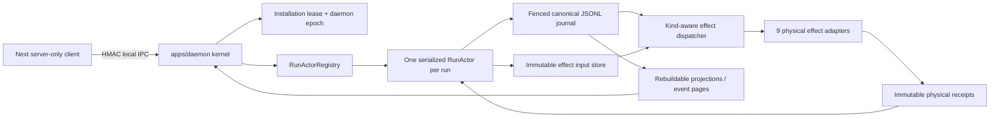

# Stage 2 — Núcleo durable del daemon y protocolo de efectos

**Gates:** GD0 + GD1

**Status:** `pass`

**Stage 1 record base:** `2602815f`

**Accepted code candidate:** `1c9c742687ec98c54b8d9330a0fe483c6d9d2ed3`

**Accepted candidate tree:** `8e21667c03d27b5f588dd4811ff2e0ab159ae2c3`

**Branch:** `codex/correctness-first-full-implementation`

**Captured:** 2026-08-12 (`America/Buenos_Aires`)

Este registro cierra Stage 2 del
[plan de rediseño correctness-first](../../plans/2026-08-12-correctness-first-system-redesign.md).
El candidato aceptado implementa el núcleo durable que Stage 3 podrá convertir
en autoridad productiva: un daemon local con ownership de instalación, un actor
serial por run, un journal canónico usado como outbox, inputs y receipts físicos
inmutables, reconciliación específica por clase de efecto, IPC local autenticado
y custodia física de procesos Windows.

## Decisión y límite de la afirmación

GD0 y GD1 son `pass` para el incremento de Stage 2. El candidato pasó la matriz
determinista de autoridad, replay y crash recovery; los límites físicos Windows;
las verificaciones de TypeScript, builds, Rust y lint acotado; y una revisión
independiente final sobre los tres P1 concretos encontrados en la primera
revisión.

La afirmación admitida es deliberadamente más estrecha que “el producto ya usa
el daemon”. Stage 2 prueba el protocolo y su composition root. El camino
productivo de `apps/web` todavía conserva el owner legado documentado en la
[caracterización de Stage 0](../stage-0/productive-route.md). Mover creación,
planificación, ejecución, decisiones, cancelación, queries y streaming al daemon
es Stage 3 / GR. Por pedido del usuario, Stage 3 no fue iniciado.

En particular, este gate no demuestra todavía:

- una ejecución productiva que sobreviva el cierre del browser o el reinicio de
  Next y del daemon (R8 / GR);
- cancelación física end-to-end en la ruta productiva (R10 / GR y GLeaf);
- un sandbox fuerte, un executor live o aislamiento POSIX (Stage 8);
- semántica final de Repository Views, planner, artifacts, validation,
  integration o delivery (Stages 4–10);
- aptitud para experimentos amplios, producción o las hipótesis de tesis.

## Explicación sencilla

Antes de este stage, distintas piezas sabían cómo recuperar algunas operaciones,
pero no existía un dueño durable único ni una regla general para toda mutación
externa. Ahora una operación sigue una secuencia verificable:

1. el daemon acepta un comando identificado;
2. guarda en disco tanto la aceptación como la intención exacta de todo efecto;
3. recién después permite que el adaptador toque procesos, Git, sandboxes,
   validación o delivery;
4. el adaptador guarda una observación física inmutable;
5. el actor vuelve a comprobar identidad, inputs, epoch y estado actual;
6. sólo entonces registra el resultado que cambia la vida del run.

Si el daemon cae entre dos pasos, el nuevo daemon no supone que “nunca pasó”.
Primero inspecciona receipts y estado físico. Adopta un resultado exacto, repite
sólo cuando la política lo permite o interrumpe/falla cerrado cuando el estado
anterior es desconocido. No se promete ejecución exactly-once.

## Arquitectura implementada



### Responsabilidades por módulo

| Módulo | Responsabilidad implementada en Stage 2 |
|---|---|
| `packages/contracts` | `EffectKind`, `EffectIntent`, `EffectInputSpec`, `PhysicalEffectReceipt`, identidades y validadores canónicos. |
| `packages/run-coordinator` | Envelope/receipt de comandos, eventos `command.accepted`, `effect.requested`, `effect.observed` y terminales, reducer y protocolo IPC versionado. |
| `packages/run-store` | Journal JSONL fenced con batches atómicos, store content-addressed de inputs, store inmutable de receipts, discovery de journals y recuperación fail-closed. |
| `packages/run-engine` | `RunActor`, registry, journal adapter, `DurableRunEngine`, dispatcher por kind y siete adapters no-process. |
| `packages/execution-core` | `ProcessSupervisor`, receipts started/final checksummed y custodia shell-free de árboles de procesos. |
| `apps/daemon` | Lease de instalación, composition root, servidor IPC, capability, adapters process y wrapper del helper Windows. |
| `apps/web` | Cliente local IPC exclusivamente server-side; no contiene el capability en código browser. |
| `native/windows-job-runner` | Job Objects, identidad kernel, kill-on-close, stdout/stderr y receipts de proceso. |
| `native/windows-ipc-acl` | DACL de capability y named pipe, validación independiente y rechazo de reparse points. |

La dirección de dependencias sigue siendo `apps -> paquetes específicos ->
shared`. No se agregó una dependencia al legado `@manyhands/core`.

## Secuencia durable exacta

1. El mediador firma un `RunCommandEnvelope` v1 con `commandId`, `runId`,
   `expectedRevision`, payload y digest canónico.
2. IPC valida versión, timestamp, `requestId`, nonce, digest y HMAC antes de
   invocar al engine.
3. `DurableRunEngine` obtiene el único actor del run. `RunActorRegistry`
   deduplica creación concurrente y completa recovery antes de exponerlo.
4. El actor serializa el comando en su mailbox, verifica el fence y carga el
   journal. Un replay idéntico devuelve el receipt original; reutilizar el ID
   con distinto contenido falla; una revisión obsoleta pierde el CAS.
5. La decisión produce uno o más pares `EffectIntent` + `EffectInputSpec`. El
   input exacto se publica primero, con bytes canónicos y dirección por digest.
6. `command.accepted` y todos los `effect.requested` se escriben como un único
   batch JSONL y se flush-ean. Un tail roto expone cero eventos del batch.
7. El command receipt confirma aceptación durable, no finalización del trabajo.
   El actor puede aceptar otros comandos mientras el efecto físico continúa.
8. El dispatcher carga el input por digest y todos los receipts previos. Si ya
   hay terminal exacto, lo adopta. En recovery siempre llama `reconcile` antes
   de considerar una repetición.
9. El adapter inspecciona/muta su frontera y publica receipts started y/o
   terminales como archivos inmutables distintos.
10. El resultado vuelve al mailbox. El actor valida `effectId`, `inputDigest`,
    identidad del receipt, epoch del observador, cancelación y staleness.
11. `effect.observed` y el único evento `effect.completed`, `effect.failed` o
    `effect.interrupted` se agregan atómicamente. Sólo este terminal consumido
    por el actor cambia la proyección de dominio.
12. Queries y páginas de eventos vuelven a plegar el journal sin crear actores,
    reconciliar liveness ni escribir estado.

## Invariantes de GD0 — autoridad del actor

| Invariante | Implementación y evidencia |
|---|---|
| Un owner de instalación | Lease durable con PID, process-start identity, nonce y daemon epoch; contenders y takeover se serializan; un owner vivo/unknown bloquea. |
| Un actor por run | Registry memoiza la inicialización, reclama un fence por run y no expone el actor hasta terminar recovery. |
| Un writer de dominio | Sólo `FencedRunActorJournal` puede agregar los eventos del actor con epoch y fencing token vigentes. |
| Comandos idempotentes | La identidad cubre la intención canónica; replay idéntico retorna el receipt original y conflicto de contenido falla. |
| Journal antes que proyección | Lifecycle de efectos se reconstruye de hechos canónicos; inputs y receipts físicos no son un segundo state machine. |
| Batch crash-safe | Aceptación + intents y observaciones + terminal se escriben como batches checksummed de una sola línea. |
| Queries read-only | `query` y `eventsReady` sólo cargan/fold-ean hechos; no crean actor ni disparan recuperación. |
| Startup recovery | El kernel descubre journals en forma ordenada y acotada, valida identidad/corrupción y recupera todos los actores antes de publicar IPC. |

La prueba de que el browser/Next productivo ya no posee lifecycle corresponde a
GR. En Stage 2 se demuestra que el nuevo kernel y cliente no dependen del
browser; todavía no se declara retirado el owner legado.

## Invariantes de GD1 — efectos y reconciliación

### Los nueve kinds

| Effect kind | Identidad física / reconciliación implementada | Límite que permanece |
|---|---|---|
| `model_call` | Inspecciona resultado para view/request/profile exactos; invoca sólo si está ausente y vuelve a observar. | El executor live se habilita recién en GLeaf. |
| `process_spawn` | Started/final durable, PID + creation identity + supervisor nonce, Job custody y recuperación sin spawn ciego. | El adapter físico verificado es Windows; POSIX falla cerrado. |
| `process_terminate` | Exige started previo y la identidad exacta esperada; adopta un final existente o verifica muerte antes de éxito. | Cancelación productiva completa es Stage 3/8. |
| `sandbox_create` | Ruta/ID determinista; reutiliza matching, dispone divergent y verifica la nueva sesión. | Esto no demuestra sandbox fuerte; GLeaf mide enforcement. |
| `git_mutation` | Ref privado por effect; adopta el tree exacto, descarta divergencia antes de mutar y reinspecciona. | Artifacts Git-native completos son Stage 7. |
| `artifact_materialize` | Cada ejecución usa un índice temporal fresco, verifica preimages/resultado y siempre lo dispone. | Round-trip de todos los Git kinds es GA. |
| `validation` | Cada retry produce una ejecución nueva ligada al mismo candidate, recipe y environment. | Proof authority/evidence final es Stage 7. |
| `delivery` | Inspecciona destino; adopta publicación exacta o hace CAS desde head/tree esperados; divergencia falla. | Crash-safe delivery productivo completo es GDel. |
| `cleanup` | `absent` es éxito, `present` se elimina y reinspecciona, identidad divergent no se toca. | Retención y cleanup end-to-end se completan en stages posteriores. |

### Ventanas de crash ejercitadas

La matriz `tests/run-engine-effect-crash-matrix.test.ts` ejecuta cada escenario
para los nueve kinds:

| Ventana | Resultado requerido y observado |
|---|---|
| Antes del intent durable | No existe mutación física; redelivery del comando puede publicar el intent una vez. |
| Después del intent y antes del dispatch | Startup deriva el pending effect y reconcilia bajo el nuevo epoch. |
| Después del éxito físico y antes del terminal actor | El receipt se adopta; no se repite el efecto no idempotente ni se pierde el éxito. |
| Durante reconciliation | Otro recovery vuelve a reconciliar contra receipts; no reinicia ciegamente la mutación. |
| Después del terminal append y antes del acknowledgement | Replay devuelve el command receipt y conserva un único terminal. |
| Prior execution desconocida con `never_repeat_unknown` | El actor registra interrupción sin inventar receipt ni repetir. |

R9 (`crash after physical success`) queda `satisfied` para el protocolo Stage 2
en el candidato aceptado. R8 y R10 permanecen `not_run` como celdas productivas
hasta GR/GLeaf. El registro original de G0 conserva su estado histórico.

## Persistencia y corrupción

- Inputs físicos contienen sólo JSON finito, estricto y canónico. Su digest no
  participa de su propio material; publicación concurrente usa hard link
  exclusivo y nunca reemplaza un winner.
- Cada receipt físico es un archivo inmutable independiente. Started y terminal
  no son mutaciones del mismo documento.
- El journal usa expected-sequence CAS, event IDs estables, checksums, fencing y
  un lock durable. Un batch no puede mezclar eventos replayed y nuevos.
- Un último record incompleto queda `degraded`, se trunca bajo autoridad vigente
  y puede rehacerse. Corrupción completa o intermedia falla cerrado.
- Startup enumera journals y manifests compactados, valida que el nombre
  corresponda al `runId`, rechaza paths no regulares, exceso del límite o
  histories corruptas, y recupera antes de bindear IPC.
- Snapshots, caches e índices son descartables. La verdad de lifecycle sigue en
  el journal; receipts describen realidad física y traces sólo diagnóstico.

## IPC y seguridad local

El transporte implementa una frontera local privilegiada, no una API browser:

- capability aleatorio de 256 bits, almacenado fuera del browser;
- requests y responses con HMAC-SHA-256 domain-separated, body digest,
  timestamp, request ID y nonce;
- replay cache acotado que rechaza saturación en lugar de expulsar nonces aún
  válidos;
- una única frame JSONL por conexión, tamaño y timeout acotados;
- Unix socket `0600` y capability directory/file `0700`/`0600`;
- en Windows, capability y directorio con DACL protegida que contiene
  exactamente current user + Local System y no sigue reparse points;
- en Windows production, un helper nativo posee cada instancia pública del
  named pipe con esa DACL; Node escucha un backend no publicado. Una segunda
  conexión inspecciona el security descriptor del pipe vivo antes de anunciar
  `transportSecurity: os_restricted`;
- el cliente vive en `apps/web/src/lib/server`; browser JavaScript no recibe
  endpoint privilegiado ni capability.

La frontera protege contra otros usuarios del host y orígenes web. No protege
contra malware que ya ejecuta como el mismo usuario; ese riesgo residual es
explícito en la arquitectura.

## Custodia de procesos Windows

`native/windows-job-runner` crea Job Objects anidados con
`JOB_OBJECT_LIMIT_KILL_ON_JOB_CLOSE`, inicia el provider suspendido, verifica
memberships y publica `started.json` antes de reanudar código provider. La
entrada estándar del helper funciona como parent-liveness sentinel. Stdout y
stderr van a archivos separados del protocolo.

Los receipts contienen identities kernel, ownership, input/epoch, timestamps y
checksums. Un final se liga al checksum exacto del started. Terminar por PID
solo está prohibido.

Si el custodian cae, kill-on-close mata el árbol y los Job Objects pueden
desaparecer dejando únicamente el started. El fix final permite converger sólo
durante recovery explícito y únicamente cuando tanto provider como custodian
son exactamente `dead`. Identity `same`, `different`, `unknown`, acceso
denegado, error de probe o un único Job restante fallan cerrado. Recién después
se publica el final sintético ligado al started. Las pruebas físicas verifican
muerte de child y grandchild, ausencia de writes tardíos y el caso adverso de
identidades todavía vivas.

En plataformas POSIX el supervisor de Stage 2 rechaza spawn: todavía no existe
un adapter que combine process groups con parent-death verificable. Esto es una
limitación honesta, no un fallback sin supervisión.

## Revisión adversarial acotada

La primera revisión independiente de GD0/GD1 devolvió exactamente tres P1 y
NO-GO. No se abrió una revisión teórica recursiva: se corrigieron esos tres
escenarios y el mismo reviewer verificó sólo su cierre sobre el candidato final.

| P1 original | Corrección | Evidencia final |
|---|---|---|
| Started-only no convergía si el custodian ya había cerrado ambos Jobs. | `ae5453ce`: Jobs ausentes convergen sólo con las dos identities `dead`; cualquier incertidumbre falla cerrado. | GO; rerun físico aislado 2/2. |
| El daemon no enumeraba/reconciliaba pending effects al startup sin un nuevo submit. | `2a1f982e`: discovery acotado y validado; recovery de actores antes de exponer IPC. | GO; rerun 3/3. |
| El named pipe Windows dependía de un callback y no probaba un DACL real. | `cb49924c` + `1c9c7426`: owner/proxy nativo, DACL current user + SYSTEM, verificación independiente y composición kernel. | GO; dos pruebas físicas de servidor/kernel 2/2. |

**Dictamen final:** GO 3/3, candidato
`1c9c742687ec98c54b8d9330a0fe483c6d9d2ed3`, árbol
`8e21667c03d27b5f588dd4811ff2e0ab159ae2c3`, worktree limpio.

Una ejecución intermedia del P1 #1 colisionó con otro Vitest concurrente que
usaba los mismos nombres globales de Job. No se atribuyó como product failure.
Después de terminar la suite concurrente, el rerun físico aislado pasó 2/2.

## Evidencia mecánica final

**Toolchain:** Windows 11, PowerShell `5.1.26100.9168`, Node `22.22.0`,
TypeScript `5.9.3`, Vitest `2.1.9`, Next `15.5.7`, Git
`2.40.1.windows.1`, `rustc 1.93.1` y `rustfmt 1.8.0`. Los dos helpers Rust se
compilaron desde source en el host Windows; no se versionaron binarios.

| Check | Resultado en el candidato exacto |
|---|---|
| Suite focal Stage 2 | 23 archivos, 228 tests passed. |
| Suite completa | 259 archivos; 1,735 tests totales: 1,731 passed, 4 pending/skipped, 0 failed; 638/638 suites; `success: true`. |
| Root TypeScript | `tsc -p tsconfig.json --noEmit`: pass. |
| TypeScript afectado | 7 configs: contracts, run-coordinator, run-store, run-engine, execution-core, daemon y web: pass. |
| Builds | 13 packages + `apps/daemon`, ESM/CJS/DTS: pass. |
| Web build | Next.js 15.5.7 production build: pass. |
| Rust | `rustfmt --check` y `rustc -D warnings` para ambos helpers: pass. |
| Lint acotado | 56 archivos Stage 2: pass; aviso no bloqueante del detector de Pages. |
| Diff/identity | `git diff --check`: pass; SHA/tree exactos y worktree limpio antes del gate review. |

El intento de lint más amplio incluyó una fixture histórica y encontró cinco
`@typescript-eslint/no-explicit-any` preexistentes en
`tests/scope-critic-calibration.test.ts`. No fueron introducidos ni corregidos
como parte de Stage 2. La deuda global de lint caracterizada en G0 sigue siendo
trabajo para la calificación final, no evidencia adversa ocultada.

### Incidentes del harness preservados

1. Un primer web build falló porque el harness genérico construyó
   `@manyhands/shared` sin su entry declarado `node-cli-process`. Se reemitió el
   paquete con sus entradas declaradas y el mismo Next production build pasó.
   El primer resultado es un error del harness, no un pass ni un producto roto.
2. El primer reporter JSON dirigido a `C:\` ejecutó los tests pero recibió
   `EPERM` al escribir el reporte. La repetición escribió en `%TEMP%`, pasó y
   produjo el conteo completo usado arriba.

## Inventario de commits de Stage 2

El código aceptado contiene 33 commits después del record de Stage 1:

```text
67708a08 feat: define durable command and effect identities
fe314869 feat: persist immutable physical effect receipts
d002296e feat: journal durable command and effect facts
581ca4c8 fix: bind durable effect recovery identities
01f569c1 fix: persist event appends as atomic batches
dd4d398f feat: serialize durable run actors
a8309e19 feat: fence run actors to the canonical journal
01eec391 feat: fence daemon installation ownership
3dd112df feat: dispatch durable physical effects by kind
a3dbb5f7 fix: reconcile recovered effects before repetition
c7cfaf40 fix: acknowledge commands before physical effects
766178a6 fix: serialize daemon installation lease mutations
406d54a0 feat: persist content-addressed effect inputs
dd035419 fix: separate physical receipts from effect outcomes
5529a0b4 test: keep effect event regression type-safe
37947bb6 feat: bind durable effect inputs to recovery
5c4f73f0 feat: expose durable run engine application boundary
b3a1a315 feat: authenticate local daemon IPC
dd730324 feat: compose the durable local daemon kernel
f14c993b feat: reconcile physical effects by kind
9647cacb test: allow declared transition importers
a1e00b59 feat: enforce Windows IPC capability ACLs
7cbe95dc test: satisfy strict indexed access checks
85728481 test: narrow canonical planning fixtures
66eb2c0e test: align legacy fixtures with current contracts
6d646238 feat: supervise Windows process trees durably
a9d3408e test: align validation fixtures with canonical evidence
e70c1514 feat: reconcile supervised process effects
af96ecc0 test: align execution fixtures with canonical graph
ae5453ce fix: recover vanished Windows process jobs
2a1f982e fix: recover pending effects before daemon startup
cb49924c fix: enforce Windows named pipe ACLs
1c9c7426 test: satisfy strict Windows IPC helper typing
```

El diff del incremento de código abarca 102 archivos, 14,809 inserciones y 149
eliminaciones. Los commits `test:` alinean fixtures y checks estrictos con los
contratos canónicos; no se usan para ampliar el claim arquitectónico.

## Trabajo autorizado a continuación

Stage 3 debe mover la ruta productiva al daemon sin cambiar todavía planner,
artifacts o sandbox semánticos. El handoff ejecutable está en
[`2026-08-12-stage-2-to-stage-3.md`](../../handoffs/2026-08-12-stage-2-to-stage-3.md).

Hasta que GR pase:

- no se puede afirmar que el daemon sea el owner productivo;
- no se elimina un safety mechanism legado sin reemplazo probado;
- no se habilita un modelo live;
- no se inicia Stage 4;
- R8 y R10 permanecen `not_run`.
