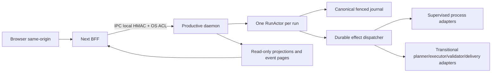

# Stage 3 — Ownership productivo del lifecycle en el daemon

**Gate:** GR

**Status:** `pass`

**Accepted code candidate:** `4e495abd0805c62f7641dc73c19b82ffc7eedc38`

**Accepted candidate tree:** `84a59b1d9db2ee978d87b6a079dafee281e38a64`

**Branch:** `codex/correctness-first-full-implementation`

**Stage 2 accepted base:** `1c9c742687ec98c54b8d9330a0fe483c6d9d2ed3`

**Captured:** 2026-08-13 (`America/Buenos_Aires`)

Este registro cierra exclusivamente Stage 3 del
[plan correctness-first](../../plans/2026-08-12-correctness-first-system-redesign.md).
El daemon y sus `RunActor` son ahora el único owner productivo del lifecycle de
los runs. Next es un BFF server-side sobre IPC local autenticado; browser,
queries y event streaming no poseen ni reparan lifecycle. El planner, executor,
validator y delivery existentes siguen disponibles detrás de adapters
transicionales explícitos del daemon.

Stage 4 no fue iniciado y permanece `not_started` junto con Stages 5–11. No se
usaron modelos live, no se ejecutó el experimento y no se modificó la tesis.

## Dictamen y alcance exacto

GR es `pass` para el candidato y tree indicados arriba. El dictamen combina:

- ruta productiva real por dos procesos Next y el daemon en modo production;
- executor fake determinista con child y grandchild reales bajo Job Objects;
- reinicio de Next y crash/restart del daemon;
- dos clientes concurrentes, queries puras y SSE durable;
- cancelación física con quiescence verificada;
- source scan y reachability del retiro legado;
- preservación de GD0 y GD1;
- una única revisión independiente acotada con resultado final GO.

El [candidate receipt](evidence/candidate-receipt.json) liga el run productivo,
los epochs del daemon, hashes, procesos, toolchain y resultados al SHA exacto.
El journal del run conserva `sourceBaseCommit = 4e495abd...`.

## Arquitectura implementada



### Commands y lifecycle

Las mutaciones `create_run`, `resolve_decision`, `run`, `pause`, `resume`,
`restart`, `cancel` y `deliver` se convierten en `RunCommandEnvelope` durable.
El actor serializa la aceptación, valida `expectedRevision`, fence y command
identity, y publica los intents antes de permitir efectos físicos. Replay
idéntico devuelve el receipt original; reutilizar `commandId` con otro contenido
falla cerrado.

Resume y restart generan una identidad de attempt fresca
`stage3:execution:recovery:N`. Los sidecars de execution se indexan por
`runId + attemptId`; un attempt nuevo no puede adoptar el resultado de uno
anterior.

### Queries y streaming

`GET /api/runs`, `GET /api/runs/:id` y
`GET /api/runs/:id/run-events?after=N` sólo consultan proyecciones o páginas del
journal. No crean actores, no reconcilian liveness, no cancelan procesos y no
agregan eventos. Recovery ocurre únicamente dentro del daemon, por actor, antes
de anunciar readiness.

En el gate productivo, 40 requests alternadas entre list/detail y dos procesos
web conservaron exactamente hash y tamaño del journal. SSE solicitado con
`after=9` reanudó en las sequences 10–17 y quedó abierto después de entregar la
página durable.

### Frontera web y seguridad

Las rutas productivas de runs importan solamente el cliente server-side del
daemon. El browser nunca recibe el endpoint del named pipe ni el capability.
Las mutaciones aplican same-origin, Fetch Metadata, `application/json` no-simple
y la sesión anti-CSRF. En Windows production, Next verifica la protección OS del
capability y el daemon publica el named pipe mediante el helper de ACL current
user + Local System.

### Adapters transicionales

El profile por defecto y usado como oracle del gate es `deterministic_fake`.
El profile `transitional_unsafe` es una elección exacta y explícita del daemon;
compone los planner/executor/validator/delivery actuales sin devolver ownership
a apps/web. No se habilita implícitamente y no fue ejecutado contra un modelo
live.

Planning y delivery primero leen su sidecar durable. Si existe, recovery lo
adopta. Si falta y el intent fue invalidado por cancelación, revalidan ese hecho
inmediatamente antes de `planner.plan` o `delivery.publish` y retornan sin
iniciar trabajo ni inventar receipt.

## Cancelación y recovery

La ruta implementada respeta este orden:

1. el actor persiste `operation.cancel_requested`;
2. invalida los intents afectados y suprime trabajo todavía no iniciado;
3. el dispatcher revalida cancelación después de cargar input/receipts y antes
   de entrar al adapter;
4. `process_spawn` publica started identity durable antes de adoptar el handle;
5. si cancel gana la carrera, termina el handle exacto bajo custodia, nunca un
   PID ciego;
6. recovery reconcilia started-only para inspeccionar o terminar estado físico,
   sin iniciar efectos model/delivery ausentes;
7. cleanup y leases convergen;
8. el actor publica `operation.interrupted` sólo después de quiescence.

El run de gate tuvo dos árboles físicos. El crash del primer daemon cerró su Job
Object y dejó muertos child `27612` y grandchild `40192`. Recovery creó un
attempt fresco con child `38532` y grandchild `6880`. La cancelación terminal
dejó ambos muertos, un solo `operation.cancel_requested`, un solo
`operation.interrupted` y siete receipts físicos.

## Retiro del owner legado

La nueva ruta permitió retirar el ownership productivo de apps/web:

- no queda singleton `globalThis` de runs ni runner state productivo;
- no quedan background promises productivas iniciadas por Next;
- GET/list/SSE no ejecutan liveness ni recovery;
- apps/web no posee procesos, abort registries, operation leases ni execution
  pipelines;
- los antiguos repository/store/presenter, planning/command/execution hosts y
  process supervisors web fueron eliminados físicamente;
- sidebar, list y detail consumen la misma proyección del daemon;
- el importador V1/V2 retenido es offline, dry-run-first e inalcanzable desde
  entrypoints productivos;
- readers históricos retenidos no contienen lifecycle writes.

`tests/stage3-web-productive-boundary.test.ts` recorre imports reales desde
app/middleware, exige ausencia física de los módulos retirados y busca firmas de
producers. Sus 17 regresiones pasaron; la suite completa confirmó la falta de
reachability en ejecución.

## Gate productivo exacto

Run: `run:cf435a9db8dd08f1bf1726c5dbffec4ba203c59c0e5d1e41cee92d6734c96716`.

| Celda GR | Resultado atribuible |
|---|---|
| Crear y comenzar | Dos clientes concurrentes recibieron 201 y el mismo run; un solo `model_call`. |
| Cerrar browser | Lifecycle siguió `running`; child y grandchild continuaron vivos. |
| Reiniciar Next | PID `28588 -> 42196`; sequence 13 y trabajo físico sin duplicación. |
| Reiniciar daemon | Epoch `51f881fd... -> 22889db8...`; recovery alcanzó sequence 17 desde journal/intents/receipts. |
| Dos tabs/clientes | Un run y un planning effect pese a dos POST concurrentes. |
| Dos procesos web | Ports 3357/3358 sirvieron el mismo owner durable sin duplicar efectos. |
| Cancel con descendants | Terminal sequence 29 `interrupted`; child/grandchild recuperados muertos. |
| Queries puras | 40 requests; hash `89B892...` y 11,692 bytes idénticos antes/después. |
| Proyección/SSE | Reanudación durable exacta `id: 10` hasta `id: 17`. |
| Owner legado | Cero producers alcanzables y 25 módulos owner ausentes. |
| GD0/GD1 | 20 archivos, 198 tests passed. |

Las capturas muestran aprobación, running, recovery sincronizado e interrupted:

- [approval](evidence/browser-approval.png)
- [running](evidence/browser-running.png)
- [recovered](evidence/browser-recovered.png)
- [cancelled](evidence/browser-cancelled.png)

Los procesos daemon/Next se detuvieron al finalizar; los ports 3357/3358 y los
cuatro PIDs registrados quedaron libres.

## Verificación mecánica

**Toolchain:** Windows, Node `22.22.0`, pnpm `11.21.0`, Vitest `2.1.9`,
TypeScript `5.9.3`, ESLint `8.57.1`, tsup `8.5.1`, Next `15.5.7`, cargo
`1.93.1` y rustc `1.93.1`.

| Check | Resultado exacto |
|---|---|
| Stage 3 focal | 10 archivos, 38 passed, `--retry=0`. |
| GD0/GD1 | 20 archivos, 198 passed, `--retry=0`. |
| Suite completa | 243 archivos; 1,652 passed, 4 skipped, 0 failed, `--retry=0`. |
| TypeScript | Root, 13 packages, daemon y web: pass. |
| Builds | run-engine y daemon ESM/CJS/DTS; daemon CLI y dos workers: pass. |
| Next | Production build 15.5.7: pass. |
| Rust | `cargo check` y `cargo test --offline` para ambos helpers: pass. |
| Lint acotado | Daemon/run-engine/tests afectados y web src: pass; launcher MJS con `node --check`: pass. |
| Git | Stage 2 accepted SHA es ancestro; `git diff --check`, status y diff HEAD limpios en el candidato. |

### Comandos exactos principales

Todos los Vitest físicos se serializaron para evitar colisiones de Job Objects o
named pipes:

```powershell
$node = 'C:\mh-runtime-c781-09\node-v22.22.0-win-x64\node.exe'

& $node node_modules\vitest\vitest.mjs run `
  tests/stage3-transitional-adapters.test.ts `
  tests/stage3-daemon-restart-physical.test.ts `
  tests/stage3-cancel-dispatch-window.test.ts `
  tests/stage3-web-productive-boundary.test.ts `
  tests/stage3-product-daemon.test.ts `
  tests/stage3-cancellation-physical.test.ts `
  tests/stage3-cancel-before-started.test.ts `
  tests/stage3-run-actor-application.test.ts `
  tests/stage3-resume-restart-identity.test.ts `
  tests/stage3-daemon-entrypoint.test.ts `
  --retry=0 --minWorkers=1 --maxWorkers=1

& $node node_modules\vitest\vitest.mjs run `
  tests/run-engine-actor.test.ts `
  tests/run-engine-physical-effect-adapters.test.ts `
  tests/daemon-local-ipc.test.ts `
  tests/run-engine-effect-dispatcher.test.ts `
  tests/daemon-process-effect-adapters.test.ts `
  tests/run-engine-effect-crash-matrix.test.ts `
  tests/daemon-kernel.test.ts `
  tests/daemon-installation-lease.test.ts `
  tests/process-supervisor-physical.test.ts `
  tests/physical-effect-receipt-store.test.ts `
  tests/effect-input-store.test.ts `
  tests/run-command-envelope.test.ts `
  tests/durable-run-engine.test.ts `
  tests/effect-protocol.test.ts `
  tests/process-supervisor-contract.test.ts `
  tests/run-actor-registry.test.ts `
  tests/run-engine-event-journal.test.ts `
  tests/windows-ipc-acl-physical.test.ts `
  tests/effect-input-contract.test.ts `
  tests/security-env-audit.test.ts `
  --retry=0 --minWorkers=1 --maxWorkers=1

& $node node_modules\vitest\vitest.mjs run `
  --retry=0 --minWorkers=1 --maxWorkers=1

& $node node_modules\typescript\bin\tsc -p tsconfig.json --noEmit
Get-ChildItem packages -Directory | ForEach-Object {
  & $node node_modules\typescript\bin\tsc -p "$($_.FullName)\tsconfig.json" --noEmit
}
& $node node_modules\typescript\bin\tsc -p apps/daemon/tsconfig.json --noEmit
& $node node_modules\typescript\bin\tsc -p apps/web/tsconfig.json --noEmit
```

Los builds ejecutaron los scripts declarados equivalentes a:

```powershell
tsup packages/run-engine/src/index.ts --format esm,cjs --dts --clean
tsup apps/daemon/src/index.ts --format esm,cjs --dts --clean
tsup apps/daemon/src/cli.ts --format cjs --out-dir apps/daemon/dist
tsup apps/daemon/src/deterministic-fake-worker.ts --format esm --out-dir apps/daemon/dist
tsup apps/daemon/src/transitional-unsafe-worker.ts --format esm --out-dir apps/daemon/dist
next build apps/web

cargo check --manifest-path native/windows-job-runner/Cargo.toml --offline
cargo test --manifest-path native/windows-job-runner/Cargo.toml --offline
cargo check --manifest-path native/windows-ipc-acl/Cargo.toml --offline
cargo test --manifest-path native/windows-ipc-acl/Cargo.toml --offline
```

El harness productivo exacto se conserva en [evidence/harness/](evidence/harness/).
Los logs completos están en [evidence/](evidence/), no sólo sus resúmenes.

## Revisión independiente acotada

La revisión fue adversarial pero limitada a GR. No se abrió Stage 4 ni una
cadena recursiva ilimitada de reviewers.

| Candidato | Dictamen y causa |
|---|---|
| `022e38f5` | NO-GO: el primer cutover aún dejaba gaps de composición productiva, retiro y garantías físicas. |
| `cd9f61a8` | NO-GO: cancelación durante awaits del dispatcher y reuse de attempt identity en resume/restart. |
| `0b9a1c21` | NO-GO: quedaba la ventana entre dispatch y publicación/adopción de started. |
| `58dd5e34` | NO-GO: crash después de started + cancel y antes de `handle.terminate`. |
| `b232ea7c` | NO-GO: reconciliar toda invalidación podía iniciar efectos que nunca habían comenzado. |
| `9fcfbba9` | NO-GO: model/delivery transicionales aún podían iniciar trabajo sin sidecar durante recovery cancelado. |
| `4e495abd` | GO final: cero blockers; código, evidencia productiva y retiro inspeccionados. |

Los roots adversos `C:\mh-stage3-gr-cd9f61a8`, `-0b9a1c21`, `-58dd5e34` y
`-b232ea7c` se conservaron en el host. No se reutilizó su evidencia para declarar
PASS del candidato final.

## Incidentes y resultados adversos del harness

Ningún incidente siguiente se contó como PASS:

1. intentos tempranos usaron un campo de respuesta incorrecto, cwd incorrecto o
   un workspace sin `repoPath`; produjeron timeouts/inconclusos;
2. dos procesos Next con tokens de sesión distintos chocaron porque cookies no
   aíslan por port; el gate final usa un token común;
3. un proceso Next production sin `MANYHANDS_WINDOWS_IPC_ACL_HELPER` falló
   cerrado; el gate final configura el helper en ambos;
4. varios comandos PowerShell tuvieron errores de quoting/sintaxis antes de
   ejecutar producto y se reemplazaron por scripts auditables;
5. `--maxWorkers=1` sin reducir también `minWorkers` fue rechazado por Vitest;
   la ejecución válida fija ambos en 1;
6. el primer lint incluyó `scripts/manyhands-dev.mjs` en un parser TypeScript
   cuyo project no contiene MJS. [lint.log](evidence/lint.log) conserva ese
   fallo; [lint-pass.log](evidence/lint-pass.log) conserva ESLint válido y
   `node --check` por separado;
7. una consulta concurrente antes de `run.created` produjo un stack trace en
   [daemon.err](evidence/daemon.err). Falló cerrado y no corrompió el journal;
   mejorar el diagnóstico es deuda no bloqueante.

## Evidencia preservada

- [candidate receipt](evidence/candidate-receipt.json)
- [canonical journal](evidence/canonical-run.events.v2.jsonl)
- [physical receipts](evidence/receipts/)
- [Stage 3 focused log](evidence/stage3-focused.log)
- [GD0/GD1 log](evidence/gd0-gd1.log)
- [full suite log](evidence/full-suite.log)
- [typechecks](evidence/typechecks.log), [builds](evidence/builds.log),
  [Rust](evidence/rust.log) y [lint válido](evidence/lint-pass.log)
- [query purity](evidence/query-purity.json), [recovery](evidence/recovery.json),
  [SSE](evidence/sse-summary.json), [terminal](evidence/terminal.json) y
  [shutdown](evidence/shutdown.json)
- [independent GO review](evidence/review-go.md)
- cuatro capturas browser con hashes incluidos en el candidate receipt

El capability IPC y los ejecutables nativos no se copiaron al repositorio.

## Límites y deuda no bloqueante

- `deterministic_fake` demuestra ownership, restart, deduplicación y
  cancelación, no calidad de planning/execution.
- `transitional_unsafe` conserva los componentes actuales detrás del daemon,
  pero sigue siendo explícito y pre-GLeaf; no se ejecutó contra modelos live.
- POSIX continúa fallando cerrado para supervisión que no pueda probar
  parent-death y quiescence equivalentes a Windows Job Objects.
- La migración de runs históricos permanece offline y dry-run-first.
- El cast parcial de proyección retenido es deuda de transición; no es una
  representación V3 ni otra autoridad de dominio.
- Repository Model, nuevo planner, artifacts, sandbox, integración y delivery
  final pertenecen a Stages 4–10 y siguen `not_started`.
- El gate no autoriza el experimento, claims de tesis ni un modelo live.

## Commits de Stage 3

```text
022e38f5 feat: move productive run ownership to daemon
cd9f61a8 fix: close productive daemon ownership gaps
0b9a1c21 fix: close Stage 3 cancellation races
58dd5e34 fix: linearize supervised cancellation
b232ea7c fix: reconcile invalidated physical effects
9fcfbba9 fix: distinguish cancellation observation from recovery
4e495abd fix: suppress invalidated transitional recovery
```

El incremento de código desde el documentation HEAD de Stage 2 abarca 129
archivos, 7,652 inserciones y 9,644 eliminaciones. La reducción corresponde en
gran parte al retiro físico del owner legado y sus tests exclusivos.

## Disposición

Stage 3 / GR queda cerrado en `pass`. Stage 4 permanece `not_started`. La
ejecución de este objetivo debe detenerse después del commit documental; no hay
autorización para continuar con GRepo.
