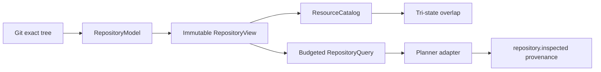

# Stage 4 — Repository Model, views y resource catalog

**Gate:** GRepo

**Status:** `pass`

**Accepted code candidate:** `292daaee3803404cdb473f929c1fbfa36a8b4964`

**Accepted candidate tree:** `8cd98afa812d3e7927985d6edf99c1744e4b5f5d`

**Branch:** `codex/correctness-first-full-implementation`

**Stage 3 accepted base:** `4e495abd0805c62f7641dc73c19b82ffc7eedc38`

**Captured:** 2026-08-13 (`America/Buenos_Aires`)

Este registro cierra exclusivamente Stage 4 del
[plan correctness-first](../../plans/2026-08-12-correctness-first-system-redesign.md).
GRepo es `pass` para el SHA y tree exactos indicados arriba. Stage 5 permanece
`not_started`: no se usaron modelos live, no se ejecutó el experimento y no se
modificó la tesis.

## Resultado

El daemon productivo obtiene ahora grounding desde una verdad de repositorio
versionada y consultable:



- `RepositoryModel` deriva hechos deterministas del tree exacto, con identidad,
  provenance y estado epistémico `unknown | known | partial | conflicting`.
- `RepositoryView` compone overlays inmutables sólo después de validar base,
  identidad y ausencia de duplicados.
- `ResourceCatalog` separa identidad semántica de identidad runtime y modela
  aliases, contención, nesting, symlinks, gitlinks y generated-file policy.
- El overlap es `yes | no | unknown`; incertidumbre o cobertura incompleta
  nunca se convierte en un `no` optimista.
- Las queries requieren presupuesto explícito, limitan resultados, bytes y
  profundidad, y preservan coverage, costo, truncamiento, evidencia y digest.
- Manifests inválidos producen estado `partial` y diagnóstico; no se inventan
  packages conocidos.
- Exports, workspaces, imports entre packages y firmas públicas conservan
  provenance del blob exacto.
- Las lecturas Git de blobs usan como máximo ocho workers y mantienen orden
  determinista.

## Ruta productiva y retiro

`createCurrentPlannerPort` construye el model, view, catalog y query service en
la frontera productiva del daemon. El prompt del planner recibe respuestas
acotadas y `repository.inspected` registra los digests atribuibles al snapshot.
La antigua derivación de evidencia mediante `snapshot.index.files` fue retirada
del adapter productivo.

La regresión `tests/stage4-productive-grounding.test.ts` atraviesa el puerto
productivo real con un CLI fake determinista; comprueba tanto la evidencia que
recibe el planner como el domain fact emitido. El source scan final encontró la
composición y `repository.inspected` en el daemon, y cero usos de
`snapshot.index.files`, `readdir` o `glob` en ese adapter.

Los consumers compatibles que aún alimentan compiler/granularity se conservan
explícitamente. Su retiro pertenece al cutover semántico posterior; Stage 4 no
implementó planner, compiler ni GraphRevision de Stage 5.

## Evidencia determinista sobre ManyHands

Dos procesos Node 22 frescos inspeccionaron de forma independiente el tree
aceptado y produjeron exactamente el mismo resultado:

| Artefacto | Digest |
|---|---|
| Model | `sha256:d3f07567068c0d0cb47fe9f95300fb383c50db84122388701c939441c5c0c064` |
| Base tree | `8cd98afa812d3e7927985d6edf99c1744e4b5f5d` |
| View | `sha256:b5a1feb4b1902fd795708a3c279fb121b869ff070743ec159b485ad663167d82` |
| Resource catalog | `sha256:10e8405e06b892d62aa8aad71f5f7b7e26c433d9fb8aa31dd06cd473998746bc` |
| Query answer | `sha256:d9a3d7190b75716241ad18b5471670090ecdfc14d4ab2bbdde41275895ca8b0f` |

La respuesta fue conservadora (`partial`), con 32 resultados y 32 evidencias
bajo presupuesto `maxResults=32`, `maxBytes=32768`, `maxDepth=2`. Que el
repositorio heterogéneo resulte `partial` reduce precisión sin fabricar
`known/no`.

El [candidate receipt](evidence/candidate-receipt.json) conserva esta identidad
y los resultados mecánicos. El [dictamen independiente](evidence/review-go.md)
registra el GO acotado.

## TDD e incidentes

Antes de modificar producción se reprodujeron REDs para:

- ausencia del model/view y de la composición productiva;
- aliases de module/path que no alcanzaban el recurso canónico;
- manifests malformados tratados como conocidos;
- lecturas Git no acotadas;
- generated files clasificados con certeza inventada;
- pérdida de epistemic state en queries y confianza productiva;
- falta de exports, workspace imports y firmas públicas;
- reachability probada sólo por un helper y no por el puerto productivo.

El primer candidato `ad25d3dfdec75572fe871e494c9ef2b71751d536`
recibió NO-GO independiente por esos casos. Cada blocker obtuvo una regresión
RED y la corrección mínima; el mismo reviewer reexaminó el diff incremental y
emitió GO para `292daaee...`.

Incidentes de tooling, sin ocultarlos:

- un primer comando de build resolvió pnpm 7 desde `PATH`; se detuvo y se usó
  Node 22 explícito con los binarios locales/pnpm 11.21.0;
- un primer intento de Next buscó el binario en root; se corrigió a
  `apps/web/node_modules/next/dist/bin/next`;
- un probe escribió por error un SHA abreviado inexistente (`292daaee0`) y
  falló antes de ejecutar producto; corregido el input, ambos procesos frescos
  convergieron en los digests anteriores;
- `cargo test` creó targets y locks no versionados; `cargo clean` retiró los
  targets y los dos locks generados se eliminaron antes de congelar evidencia.

No se repitió ningún fallo determinista sin cambiar primero su causa.

## Verificación atribuible al candidato

**Toolchain:** Windows; Node `22.22.0`; pnpm `11.21.0`; Vitest `2.1.9`;
TypeScript `5.9.3`; ESLint `8.57.1`; tsup `8.5.1`; Next `15.5.7`; Git
`2.40.1.windows.1`; cargo/rustc `1.93.1`.

| Check | Resultado |
|---|---|
| Stage 4 focal | 4 archivos, 11 passed, `--retry=0`. |
| Stage 3/GR física | 19 archivos, 110 passed, serializada. |
| Suite completa | 247 archivos; 1,663 passed, 4 skipped, 0 failed, `--retry=0`. |
| TypeScript | Root, shared, contracts, repository-index, run-coordinator, daemon y web: pass. |
| Builds | shared, contracts, repository-index, run-coordinator y daemon ESM/CJS/DTS; daemon CLI/workers: pass. |
| Next | Production build 15.5.7: pass. |
| Rust | `cargo test` para ambos helpers Windows: pass. |
| Lint | 14 archivos TS cambiados, `--max-warnings=0`: pass. |
| Git | Stage 3 accepted SHA es ancestro; candidate/tree exactos; diff check y status limpios. |
| Review | Una revisión independiente acotada: GO. |

Comandos principales (todos con runtime explícito cuando aplica):

```powershell
$node = 'C:\mh-runtime-c781-09\node-v22.22.0-win-x64\node.exe'

& $node node_modules\vitest\vitest.mjs run `
  tests/repository-model-view.test.ts `
  tests/repository-resource-catalog.test.ts `
  tests/repository-query.test.ts `
  tests/stage4-productive-grounding.test.ts `
  --retry=0 --minWorkers=1 --maxWorkers=1

& $node node_modules\vitest\vitest.mjs run `
  tests/stage3-transitional-adapters.test.ts `
  tests/daemon-local-ipc.test.ts `
  tests/run-engine-effect-dispatcher.test.ts `
  tests/daemon-process-effect-adapters.test.ts `
  tests/daemon-kernel.test.ts `
  tests/daemon-installation-lease.test.ts `
  tests/stage3-cancel-dispatch-window.test.ts `
  tests/stage3-daemon-restart-physical.test.ts `
  tests/stage3-web-productive-boundary.test.ts `
  tests/stage3-product-daemon.test.ts `
  tests/stage3-cancellation-physical.test.ts `
  tests/stage3-cancel-before-started.test.ts `
  tests/stage3-run-actor-application.test.ts `
  tests/stage3-resume-restart-identity.test.ts `
  tests/run-command-envelope.test.ts `
  tests/durable-run-engine.test.ts `
  tests/stage3-daemon-entrypoint.test.ts `
  tests/run-actor-registry.test.ts `
  tests/windows-ipc-acl-physical.test.ts `
  --retry=0 --minWorkers=1 --maxWorkers=1

& $node node_modules\vitest\vitest.mjs run `
  --retry=0 --minWorkers=1 --maxWorkers=1

& $node node_modules\typescript\bin\tsc -p tsconfig.json --noEmit
& $node ..\..\node_modules\typescript\bin\tsc -p tsconfig.json --noEmit # desde cada paquete/app afectado

& $node ..\..\node_modules\tsup\dist\cli-default.js `
  src/index.ts --format esm,cjs --dts --clean
& $node ..\..\node_modules\tsup\dist\cli-default.js `
  src/index.ts src/node-cli-process.ts --format esm,cjs --dts --clean # shared
& $node ..\..\node_modules\tsup\dist\cli-default.js `
  src/cli.ts --format cjs --out-dir dist # daemon
& $node ..\..\node_modules\tsup\dist\cli-default.js `
  src/deterministic-fake-worker.ts --format esm --out-dir dist # daemon
& $node ..\..\node_modules\tsup\dist\cli-default.js `
  src/transitional-unsafe-worker.ts --format esm --out-dir dist # daemon
& $node apps\web\node_modules\next\dist\bin\next build

cargo test --manifest-path native\windows-job-runner\Cargo.toml
cargo test --manifest-path native\windows-ipc-acl\Cargo.toml

& $node node_modules\eslint\bin\eslint.js --max-warnings=0 <14 changed TS files>
git -c core.whitespace=cr-at-eol diff --check
```

Las pruebas físicas compartiendo Job Objects o named pipes se ejecutaron en un
solo worker. No se invocó un modelo live.

## Revisión independiente

La revisión fue única, read-only y acotada a GRepo. Tras el NO-GO del primer
candidato, el reviewer reabrió solamente los hallazgos concretos y verificó:

- convergencia de aliases antes del overlap;
- propagación de incertidumbre y cobertura;
- manifests parciales y generated policy conservadora;
- exports/workspaces/signatures con provenance;
- ocho workers máximos para blobs;
- ruta productiva y retiro del scan ad hoc;
- igualdad de dos procesos frescos sobre el tree exacto.

El dictamen final fue **GO**, sin blocker remanente.

## Límites y siguiente frontera

- El adapter transicional reduce el estado estructurado de query a una
  confianza numérica para el planner legado; la respuesta y digests conservan
  la epistemología completa.
- La cobertura intencionalmente conservadora puede producir más `partial` y
  `unknown`; esto es preferible a habilitar concurrencia con conocimiento falso.
- El snapshot compatible sigue alimentando consumers de compiler/granularity.
- No existe aún Progressive Planning Engine, SemanticPlan verifier ni compiler
  directo a GraphRevision: son Stage 5.

Con GRepo aprobado, Stage 5 queda elegible pero continúa `not_started`.
