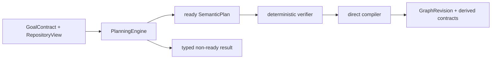

# Stage 5 — Semantic planner offline

**Gates:** GP0 + GP1

**Status:** `pass`

**Accepted code candidate:** `94a3f27d959225643e4e0bdb6f3981c61ef0a7b5`

**Accepted candidate tree:** `6fc75ab60e3f8739e0ad9b9b7c55c040cc8f2eae`

**Branch:** `codex/correctness-first-full-implementation`

**Stage 4 accepted base:** `292daaee3803404cdb473f929c1fbfa36a8b4964`

**Evidence commit:** `a227b816327f2090564390ceac6dfe2d873aff7f`

**Captured:** 2026-08-13 (`America/Buenos_Aires`)

Este registro cierra exclusivamente Stage 5 del
[plan correctness-first](../../plans/2026-08-12-correctness-first-system-redesign.md).
GP0 y GP1 son `pass` para el SHA/tree exactos indicados. La composición
productiva del daemon no cambió: el cutover sigue perteneciendo a Stage 6, que
permanece `not_started`. No se ejecutó el experimento ni se modificó la tesis.

## Resultado

Stage 5 establece una sola representación semántica antes del cutover:



- sólo `ready` contiene un `SemanticPlan` canónico y compilable;
- `needs_input`, `ambiguous`, `unsupported` y `rejected` son resultados
  explícitos, no planes parciales;
- seams, artifacts, validation, integration, ownership, evidence y
  granularity viven en el único `SemanticPlan`;
- el presupuesto unificado limita model calls, queries, bytes, revisions,
  repairs y expansions;
- una revisión equivalente sin cambio causal termina en `no_progress`;
- el verifier bloquea jerarquías/ciclos inválidos, proof authority faltante,
  owners duplicados, overlaps desconocidos, generated writes y frontiers;
- el compiler deriva directamente `TaskContractBundle`, contracts y una
  `GraphRevision`, sin `WorkBreakdown`, modelo ni query;
- el critic del modelo es sólo advisory y no puede aprobar ni rechazar.

La ruta productiva sigue usando los adapters transicionales de Stage 3/4. No
se retiró `RecursivePlanner`, la proyección `WorkBreakdown` ni el compiler
legado porque su retiro productivo pertenece a Stage 6.

## GP0 — corrección estructural

La matriz determinista cubre el fixture pequeño, un plan cross-boundary,
recursos generated, ownership ambiguo, overlap `unknown` (R4) y proof authority
faltante (R5). Las regresiones demuestran:

- aceptación de planes válidos y compilación determinista;
- preservación de artifacts, seams, validation y resource claims;
- rechazo antes del compiler para double writers, cycles, proofs ausentes y
  conocimiento insuficiente;
- terminación tipada de ambiguity, unsupported, budget exhaustion y
  no-progress;
- ausencia de reachability desde el compiler directo hacia modelo, query,
  `PlanningModule`, `RecursivePlanner` o `WorkBreakdown`.

Suite focal final: 8 archivos, 97 tests, todos pass con `--retry=0`.

## GP1 — calidad exploratoria atribuible

Los oráculos se committed antes de cualquier output en
[`preregistration/`](preregistration/). Se fijaron exactamente dos repositorios,
un goal por repositorio, el mismo modelo/profile y topología independiente de
node count:

| Caso | Base exacta | Output Stage 5 | Oráculo Stage 5 | Comparator actual |
|---|---|---|---|---|
| ManyHands canonical planning | commit `963544a7a1b0e46e6faeb285bceff0f322811b86`, tree `d869635b11a2fa49728018883eaf98ed4e988ae8` | `ready`, compiler pass | pass; 7 responsibilities, 4 seams | pass |
| Express request correlation | commit `a3714473feb3d2908add734d340e7755fd85e0a3`, tree `134de344af9d2e7785aae9a991d02fd85b404bcf` | `ready`, compiler pass | pass; 6 responsibilities, 2 seams | rejected por su propio schema |

El comparator actual nunca fue oracle. Su rechazo en Express se conserva como
resultado adverso y no se convirtió en prueba de superioridad. GP1 sólo prueba
que los dos outputs Stage 5 atribuibles satisfacen los oráculos pre-registrados;
no permite inferencia estadística ni una hipótesis compleja.

Se ejecutaron exactamente dos sesiones **iniciales**: una por caso, con
`codex-cli 0.146.0`, `gpt-5.6-sol`, reasoning `high`, `read-only`, `ephemeral` y
sin tools del target. Repeticiones posteriores sólo ocurrieron después de un
cambio causal registrado. El receipt final de ManyHands es
`deterministic_reevaluation`: conserva por separado el digest del prompt visto
por el provider y el del harness final. Express es `deterministic_replay` porque
ambos prompts coinciden.

Evidencia final:

- [ManyHands receipt](evidence/gp1/manyhands/reviewed-candidate-v5/receipt.json) y
  [preview](evidence/gp1/manyhands/reviewed-candidate-v5/preview.html);
- [Express receipt](evidence/gp1/express/reviewed-candidate-v5/receipt.json) y
  [preview](evidence/gp1/express/reviewed-candidate-v5/preview.html);
- [browser receipt](evidence/browser/receipt.json) con desktop `1440x1000` y
  mobile `390x844`, hashes e inspección visual;
- [candidate receipt](evidence/candidate-receipt.json);
- [dictamen independiente](evidence/review-go.md).

Los HTML son standalone/read-only: no contienen `<script>`, `fetch`, `/api/`,
IPC ni capability privilegiada. Las cuatro capturas muestran jerarquía,
responsabilidades, seams, proof coverage, decisiones, procedencia y findings
de forma legible, sin overflow horizontal de página en el viewport móvil.

## TDD e incidentes conservados

La implementación comenzó con REDs de contratos, verifier, compiler, budget,
no-progress, matrices adversas y frontera del runner. GP1 expuso además defectos
reales que se preservaron antes de corregirlos:

- el primer intento shell expiró antes de crear evidencia o invocar provider;
- el preflight de `48,000` bytes no resolvía tres excerpts; el presupuesto fue
  ampliado a `120,000` y committed antes de la primera sesión;
- el output inicial de ManyHands fue schema-invalid por enums no enumerados;
- la repetición `causal-enums` reveló arrays/objects y shapes ambiguas;
- `causal-shapes` pasó schema/verifier pero descubrió que el compiler exigía en
  un composite validaciones delegadas a hijos;
- el evaluator atribuía criteria refinados y ownership por scope amplio de
  forma incorrecta; ambos obtuvieron REDs focales;
- el output inicial de Express inventó claves de granularity porque el prompt
  no enumeraba el objeto completo; `causal-granularity` corrigió esa causa;
- un full-suite paralelo falló una vez con `EPERM` en un takeover claim de
  `workspace-file-lock`; el test focal pasó 10/10 con `singleFork` y la suite
  completa serializada pasó;
- el primer comando tsup desde un package usó una ruta local inexistente; se
  corrigió a `..\..\node_modules`;
- Playwright no navegó `file://` en el primer intento; se usó un loopback
  server Node de sólo lectura y se detuvo tras capturar evidencia.
- la revisión independiente encontró brechas concretas de compileability,
  proof/resource/evidence binding, budget, continuation y no-progress; cada
  una recibió RED/GREEN antes de congelar el candidato aceptado;
- `reviewed-candidate` y `reviewed-candidate-v2` preservan reevaluaciones
  rechazadas; la segunda cargó un `dist` anterior pese a que el source ya
  estaba corregido. Se reconstruyó ESM/CJS/DTS antes de v3, sin nueva sesión;
- la inspección browser detectó overflow y luego provenance ilegible en móvil;
  ambos defectos del renderer offline se corrigieron antes de v5.

No se relabeló una celda adversa como pass ni se repitió un fallo determinista
sin cambiar antes su causa.

## Verificación final

**Toolchain:** Windows; Node `22.22.0`; Git `2.40.1.windows.1`; Codex CLI
`0.146.0`; Vitest `2.1.9`; TypeScript `5.9.3`; ESLint `8.57.1`; tsup `8.5.1`.

| Check | Resultado |
|---|---|
| Stage 5 focal | 8 archivos, 97 passed, `--retry=0`. |
| GRepo | 4 archivos, 11 passed, serializado. |
| Stage 3 + Stage 4 + Stage 5 focal | 19 archivos, 137 passed, `singleFork`. |
| Suite completa | conductor: 255 archivos; 1,760 passed, 4 skipped, 0 failed, `--retry=0`; reporte SHA-256 `2db56c46a3db29140855f832c74ce86727ed4fccd7abb3aa66dd0d4e1ecd4159`. Reviewer: mismos contadores, `singleFork`, 348.84 s. |
| TypeScript | Root, contracts, task-graph, repository-index, decomposer, daemon y web: pass. |
| Builds | contracts, task-graph, repository-index y decomposer ESM/CJS/DTS: pass. |
| Next production build | pass; packages y `apps/web`, rutas productivas incluidas. |
| Lint | Stage 5 source/tests, `--max-warnings=0`; runner MJS con `node --check`: pass. |
| Browser | 2 casos x 2 viewports: pass visual y snapshot. |
| Git | Stage 4 accepted SHA ancestro; diff check pass; Express clone limpio. |
| Review | Una revisión independiente, read-only y acotada: GO. |

Comandos principales:

```powershell
$node = 'C:\mh-runtime-c781-09\node-v22.22.0-win-x64\node.exe'

& $node node_modules\vitest\vitest.mjs run tests/stage5-*.test.ts --retry=0
& $node node_modules\vitest\vitest.mjs run `
  tests/repository-model-view.test.ts tests/repository-resource-catalog.test.ts `
  tests/repository-query.test.ts `
  tests/stage4-productive-grounding.test.ts --retry=0
& $node node_modules\vitest\vitest.mjs run --retry=0 `
  --reporter=json --outputFile=C:\mh-stage5-gr-94a3f27d\full-suite.json

& $node node_modules\typescript\bin\tsc -p tsconfig.json --noEmit
& $node ..\..\node_modules\typescript\bin\tsc -p tsconfig.json --noEmit
& $node ..\..\node_modules\tsup\dist\cli-default.js `
  src/index.ts --format esm,cjs --dts --clean
& $node node_modules\eslint\bin\eslint.js <stage5-files> --max-warnings=0
& $node --check scripts\stage5-gp1-run.mjs
pnpm.cmd web:build
git -c core.whitespace=cr-at-eol diff --check
```

No se ejecutó Rust porque Stage 5 no modifica `.rs`, `Cargo.toml` ni
`Cargo.lock`.

## Límites y siguiente frontera

- GP1 contiene sólo dos casos exploratorios; no mide tasa de éxito ni
  generaliza a otros repositorios/modelos.
- ManyHands conserva findings advisory por coverage parcial y clasificación
  generated desconocida; no autorizan implementación.
- Express deja abierta la definición de validez de un incoming request ID; el
  plan exige que tests deterministas la fijen en Stage 6/implementación.
- El planner actual sigue alcanzable productivamente detrás del daemon por
  diseño transicional.

Stage 6 queda elegible pero `not_started`. El próximo trabajo debe comenzar
desde el [handoff Stage 5 → Stage 6](../../handoffs/2026-08-13-stage-5-to-stage-6.md)
y no desde los outputs experimentales.
