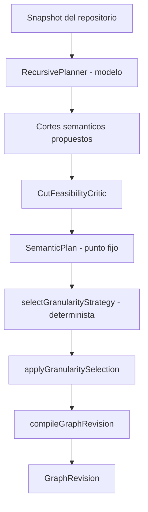

# PILAR 1 — DECOMPOSER: PLANIFICACIÓN SEMÁNTICA Y POLÍTICA DE GRANULARIDAD

> **Ubicación del código**: `packages/decomposer`
> **Responsabilidad**: convertir un objetivo en un plan semántico fundado en el
> repositorio, y decidir de forma determinista qué frontera de ese plan se
> ejecuta.

---

## 1. Las dos patologías de la granularidad

- **Grano grueso.** Un objetivo complejo se asigna como hoja única. El agente
  desborda su ventana de contexto, y un fallo en cualquier parte invalida la
  evidencia de todas las demás.
- **Grano fino.** Una tarea cohesiva se parte en unidades que comparten archivos
  y criterios de aceptación. Se paga coordinación e integración sin comprar
  independencia: ninguna de las partes se puede verificar por separado.

La decisión de granularidad es la elección entre esas dos formas de error.

---

## 2. Quién decide qué

La separación es la contribución central, y es estricta:

**El planificador propone los cortes; la política elige cuáles se ejecutan.**

Una política determinista puede detectar que una unidad no conviene partida, o
que no entra en un intento. No puede decidir *cómo* se parte: un corte es una
decisión sobre qué responsabilidad oculta cada módulo, en el sentido de Parnas,
y no se deriva de un escalar. Fabricar particiones repartiendo rutas produce
unidades cuyo alcance no corresponde a ningún trabajo coherente.

Por eso la política sólo puede **conservar** un corte propuesto, **colapsarlo**,
o **rechazar** el plan por no tener frontera ejecutable. Nunca inventa uno.

---

## 3. La política: `adaptive-utility/3.2.0-pilot`

Para cada composite se compara el beneficio del corte contra su costo:

$$\text{ventaja} = \overline{(\text{alivio de contexto},\ \text{paralelismo},\ \text{aislamiento})} - \overline{(\text{coordinación},\ \text{solape de rutas},\ \text{duplicación de validación},\ \text{incertidumbre})}$$

Se divide cuando la ventaja alcanza `minimumAdvantage`, **o** cuando el
aislamiento es perfecto (§3.2).

### 3.1 Qué mide cada término

| Término | Medida |
|---|---|
| `contextRelief` | Presión de presupuesto que el corte elimina: `(tokens del padre − tokens del hijo mayor) / maxLeafContextTokens`. Anclado al presupuesto, no al padre: sobre un repositorio que entra holgado, partir no alivia nada y el término es correctamente ~0. |
| `parallelism` | Profundidad del orden de producción. `n` unidades en `L` rondas; independientes puntúan 1, una cadena estricta 0. |
| `faultIsolation` | Cuánto se solapan los criterios de aceptación entre hermanos. 1 significa que ninguno comparte criterio con otro. |
| `coordination` | Proporción de pares de hijos que deben coordinar directamente, neta de dependencias que otra ya implica. |
| `pathOverlap` | Jaccard medio de las rutas que los hijos reclaman. |
| `validationDuplication` | Proporción de asignaciones de criterios repetidas entre hijos. |
| `uncertainty` | Cuánto de la superficie declarada no pudo medirse contra el snapshot. |

`parallelism` y `coordination` se calculan sobre **las relaciones que compilan a
un `ArtifactRequirement` bloqueante**. Un seam no compila a ninguno, y un
artefacto `logical` tampoco: cobrarlos sería tasar restricciones que el
scheduler nunca impone, y hacía que declarar un contrato de interfaz empeorara
el score del corte que lo declaraba.

### 3.2 El aislamiento admite un corte por sí solo

Promediado con otros dos beneficios, un aislamiento perfecto se diluye a un
tercio. Pero el trabajo en capas —`domain → application → api`— es una cadena:
su paralelismo es genuinamente cero, y sobre un repositorio chico su alivio de
contexto también. Lo que compra partirlo es que el fallo de una capa no anule la
evidencia verificada de otra.

`minimumFaultIsolation` está en **1**, no en un valor ajustado: es el único
punto de la escala cuyo significado es categórico —cada hijo dueño de criterios
que ningún hermano comparte— y por lo tanto el único que no está calibrado
contra una observación.

### 3.3 Factibilidad de la hoja

Independiente de la ventaja, una unidad no es una hoja ejecutable si excede
`maxLeafContextTokens`, `maxLeafScopePaths` o `maxLeafPlannedPaths`. Leer y
producir son límites distintos: el tercero existe porque una raíz sobre un
repositorio casi vacío pasa los dos primeros y aun así tiene que crear una
aplicación entera.

Si una unidad es infactible y no hay corte semántico que la divida, el run falla
de forma visible en vez de despachar trabajo que la política juzgó imposible.

---

## 4. Condiciones y evidencia

`A` colapsa el objetivo a una hoja por instrucción, `B` expande la frontera
semántica más fina, `C` aplica la política. La condición es configuración que el
run registra sobre sí mismo, no una edición de código entre corridas.

`planning.granularity_strategy_selected` persiste, para cada run:

- el **árbol candidato** que la política recibió,
- la evaluación por unidad —features, beneficio, costo, ventaja, decisión y
  justificación—,
- y las **métricas del árbol que efectivamente compiló**:
  `maxGraphDepth`, `totalLeafCount`, `averageBranchingFactor`.

Entrada y resultado se registran por separado a propósito: sin el árbol
candidato, un colapso no se distingue de un planificador que propuso una sola
unidad, y la decisión deja de ser auditable después del hecho.

---

## 5. Banco de regresión

Todo cambio a la política se mide contra las decisiones que tomaron los runs
reales, sin gastar llamadas al modelo. `tests/granularity-regression-bank.test.ts`
reconstruye los casos desde los journals de `docs/tesis/evidence` y compara
contra una tabla congelada; `UPDATE_GRANULARITY_BANK=1` la regenera y el `git
diff` resultante es la superficie de revisión del cambio.
