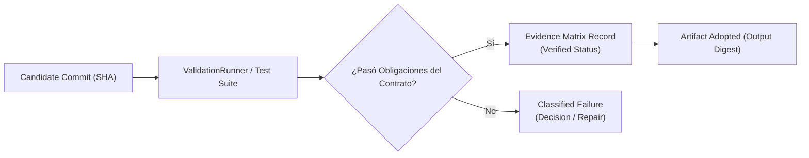
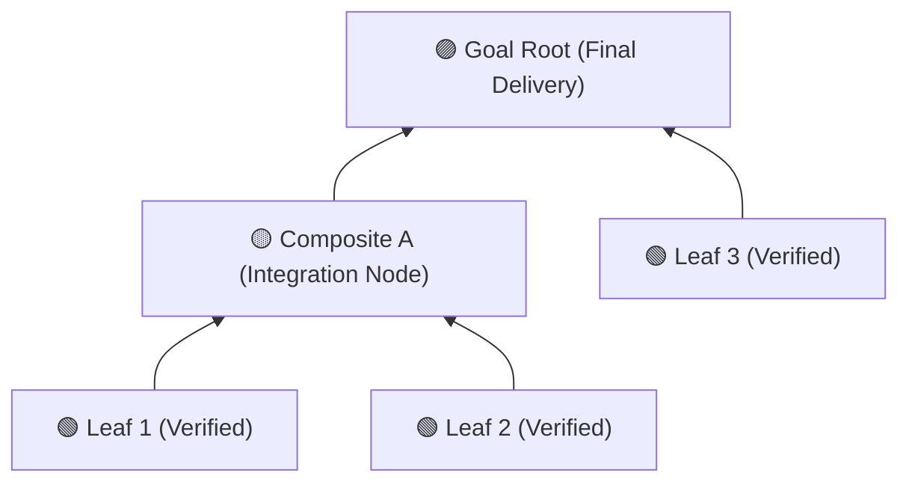

# PILAR 3 — MATRIZ DE EVIDENCIAS, INTEGRACIÓN BOTTOM-UP Y ENTREGA VERIFICADA

> **Ubicación del código**: `packages/execution-core/src/integration`, `packages/contracts`, `packages/orchestrator-graph`  
> **Responsabilidad**: Validar el código producido sobre commits exactos, construir la Matriz de Evidencias, realizar la integración ascendente del árbol y publicar el resultado final en la rama entregada.

---

## 1. LA MATRIZ DE EVIDENCIAS (*EVIDENCE MATRIX*)

ManyHands no asume que el código producido por un agente es correcto porque el proceso haya terminado con exit code 0. La validez de un resultado se demuestra exclusivamente mediante la **Matriz de Evidencias**.

### Principios de la Matriz de Evidencias:
1. **Validación sobre Commits Exactos**: Cada conjunto de pruebas o typechecks se ejecuta estrictamente sobre el SHA del commit candidato en su worktree aislado.
2. **Obligaciones de Validación (`ValidationContract`)**: Define los criterios de aceptación obligatorios (`required`), políticas de baseline, control negativo y manejo de flakiness (`forbid`).
3. **Inmutabilidad del Registro**: Los registros de evidencia se sellan con el `InputFingerprint` del intento y no se pueden mutar retrospectivamente.

---

## 2. MOTOR DE MATERIALIZACIÓN E INTEGRACIÓN BOTTOM-UP

El árbol del DAG se integra de forma **ascendente (Bottom-Up)**, desde las hojas verificadas hacia los nodos composites y finalmente la raíz (*Goal Root*).

### Fases de Integración:
1. **Verificación de Hojas (Leaves)**: Los agentes completan las tareas hojas. Se ejecutan las validaciones y se adoptan sus artefactos individuales.
2. **Materialización de Composites**: El nodo composite padre adopta los artefactos verificados de sus hijos, resuelve *SeamBindings* e integra los parches mediante la estrategia de materialización bottom-up.
3. **Verificación de Integración de Nivel**: Se ejecutan las obligaciones de validación del nivel composite sobre el commit integrado para garantizar que no hay regresiones de interfaz.
4. **Invalidación Selectiva**: Si un nodo hijo o contrato upstream cambia, únicamente el sub-árbol dependiente se marca como `Stale` y se programa para re-evaluación.

---

## 3. MOTOR DE ENTREGA E HISTORIAL AUDITABLE (`Delivery Engine`)

Una vez que la raíz del grafo (`rootId`) adopta todos los artefactos de integración y su Matriz de Evidencias reporta éxito verificado:

1. **Manifest de Entrega (`final_candidate.verified`)**: Se emite el evento canónico de sellado indicando el SHA del commit candidato final.
2. **Publicación en la Rama Entregada**: El motor publica atómicamente el commit verificado en la rama destino del usuario (`main` o `targetBranch`).
3. **Audit Trail Completo**: El resultado final se acompaña del historial inmutable de hechos, decisiones humanas tomadas, matriz de evidencias y trazas diagnósticas redactadas.
