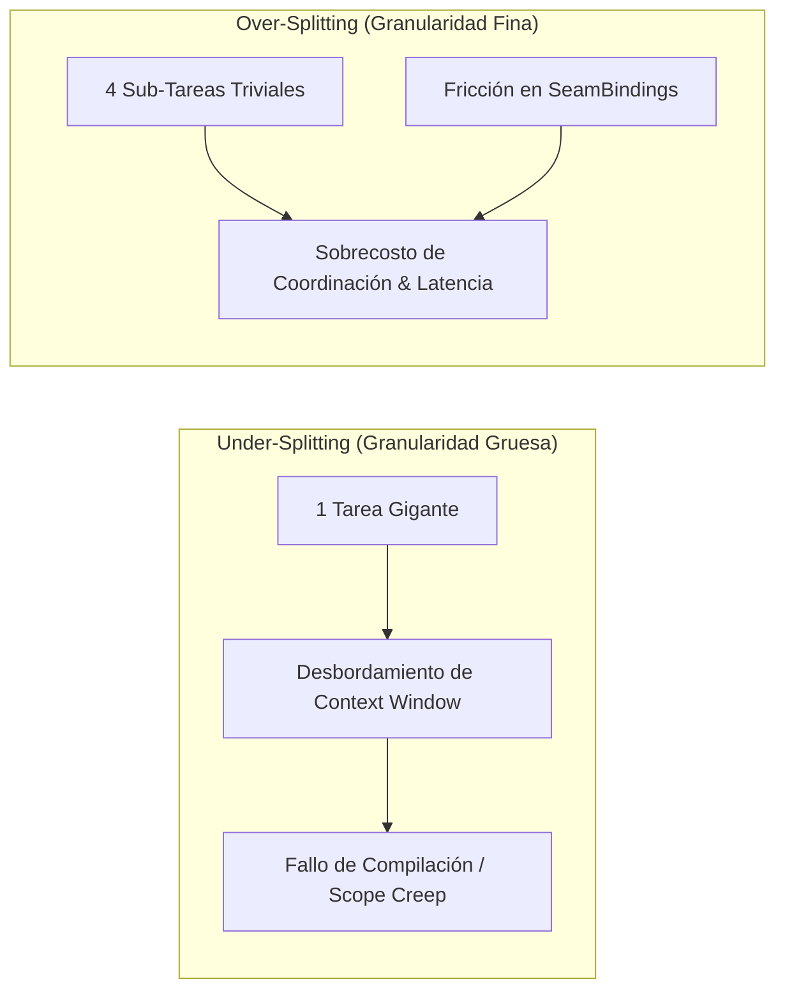

# 03 — MOTOR DE DESCOMPOSICIÓN ADAPTATIVA DE GRANULARIDAD (DECOMPOSER V3)

Este documento especifica la arquitectura, formulación matemática, pipeline en dos fases, críticos deterministas y métricas del **Adaptive Granularity Decomposer Engine V3** en **ManyHands** (`packages/decomposer`).

---

## 1. PROPÓSITO Y LA PARADOJA DE LA GRANULARIDAD

En la orquestación multiagente de código para tareas complejas de software, fijar una profundidad de árbol rígida o descomponer todas las tareas en un número arbitrario de sub-hijos produce fallos sistémicos conocidos como la **Paradoja de la Granularidad**:



### Fallos por Extremos de Granularidad:
1. **Under-splitting (Granularidad excesivamente gruesa)**: Asignar un objetivo amplio a un solo agente consumidor provoca desbordamiento de ventana de contexto, alucinaciones en refactorizaciones extensas y alta tasa de fallos en la Matriz de Evidencias.
2. **Over-splitting (Granularidad excesivamente fina)**: Dividir modificaciones triviales (ej. modificar una constante o exportar un tipo) en múltiples sub-nodos genera sobrecostos masivos de tokens, latencia en la cola de ejecución e innecesarios contratos de interfaz (*SeamBindings*).

**Solución de ManyHands V3**: Resolver dinámicamente el nivel de granularidad óptima para cada tarea mediante una evaluación de complejidad intrínseca, maximizando la tasa de éxito de los agentes y minimizando el costo total.

---

## 2. ARQUITECTURA EN DOS FASES: ARCHITECT PASS + GRAPH COMPILER

El proceso de descomposición desacopla estrictamente la evaluación semántica (impulsada por LLM) de la compilación determinista de contratos y reglas (impulsada por código TypeScript).

```mermaid
flowchart TD
    Goal[Objetivo de Software / User Goal] --> RepoIndex[Snapshot del Repositorio]
    RepoIndex --> ContextComp[Context Compressor & Signature Extractor]
    ContextComp --> ArchitectPass[Fase 1: Architect Pass\n(Evaluación Semántica LLM)]
    
    ArchitectPass --> ComplexityEval[C_task: Índice de Complejidad Intrínseca]
    ComplexityEval --> ThresholdCheck{C_task <= 3.5 ?}
    
    ThresholdCheck -->|Sí| LeafDecision[Declara Leaf Node Cohesivo\n(Detiene División)]
    ThresholdCheck -->|No| BranchFactor[Calcula Factor de Ramificación k* in [2, 5]]
    
    BranchFactor --> SubUnits[Propuesta de Sub-Objetivos]
    SubUnits --> CriticsPhase[Fase 2: Granularity Critics Pass]
    
    CriticsPhase --> OverSplitCheck{¿Sub-tareas triviales sobre mismo scope?}
    OverSplitCheck -->|Sí| Coalesce[Coalescing Critic: Fusión de Hojas]
    OverSplitCheck -->|No| UnderSplitCheck
    
    UnderSplitCheck{¿Hoja con ScopeRadius > 3 módulos?}
    UnderSplitCheck -->|Sí| ReSplit[Under-Splitting Critic: Sub-división Forzada]
    UnderSplitCheck -->|No| CompilerPass
    
    Coalesce & ReSplit & LeafDecision --> CompilerPass[Graph Compiler V3\n(Generador de Contratos Zod & Relaciones)]
    CompilerPass --> FinalGraph[Compiled GraphRevision V3]
```

---

## 3. MODELO DE EVALUACIÓN DE COMPLEJIDAD INTRÍNSECA ($C_{task}$)

Antes de decidir si una tarea debe dividirse, el evaluador de complejidad ([complexity-evaluator.ts](file:///c:/Users/franc/Documents/Proyectos/Manyhands/packages/decomposer/src/granularity/complexity-evaluator.ts)) calcula el **Índice de Complejidad Intrínseca** ($C_{task}$) evaluando 4 dimensiones estructurales:

$$C_{task} = w_1 \cdot S_r + w_2 \cdot I_i + w_3 \cdot V_s + w_4 \cdot T_m$$

### 3.1 Dimensiones de Evaluación ($S_r, I_i, V_s, T_m$)

1. **Scope Radius ($S_r \in [1, 10]$)**: Medida del alcance de archivos, módulos o paquetes afectados o creados por la tarea. Un alcance local a un único archivo equivale a $S_r = 1$, mientras que un cambio multi-módulo alcanza $S_r \ge 7$.
2. **Interface Impact ($I_i \in [1, 10]$)**: Grado de alteración en la API pública, tipos exportados o firmas de funciones (`type`, `interface`, `export function`). Cambios puramente internos tienen bajo $I_i$, mientras que romper contratos públicos incrementa $I_i$.
3. **Validation Surface ($V_s \in [1, 10]$)**: Cantidad y complejidad de obligaciones de validación y suites de prueba (unitarias, integración, linter) requeridas para certificar la corrección.
4. **Context Token Mass ($T_m \in [1, 10]$)**: Masa estimada en tokens de código y contexto necesarios para que el agente ejecutor comprenda y complete la tarea.

### 3.2 Pesos de Ponderación Configurables

Los pesos $w_1, w_2, w_3, w_4$ están normalizados de modo que $\sum_{i=1}^4 w_i = 1.0$:

$$w_1 = 0.35 \quad (\text{Scope Radius}), \quad w_2 = 0.25 \quad (\text{Interface Impact}), \quad w_3 = 0.25 \quad (\text{Validation Surface}), \quad w_4 = 0.15 \quad (\text{Token Mass})$$

### 3.3 Cálculo del Factor de Ramificación Óptimo ($k^*$)

Para nodos declarados como composites ($C_{task} > 3.5$), el factor de ramificación recomendado $k^*$ escala dinámicamente según la complejidad:

$$k^* = \min \left( 5, \, \max \left( 2, \, \lfloor 1 + 0.4 \cdot C_{task} \rfloor \right) \right)$$

---

## 4. UMBRALES DE GRANULARIDAD (*GRANULARITY THRESHOLDING*)

El motor impone una regla de decisión determinista sobre el valor de $C_{task}$:

```typescript
export interface GranularityAssessment {
  nodeId: string;
  complexityScore: number; // 1.0 a 10.0
  isLeaf: boolean;
  rationale: string;
  recommendedBranchingFactor?: number;
}
```

- **Criterio Hoja Atómica ($C_{task} \le 3.5$)**:
  Se marca la tarea con `isLeaf: true`. **Se prohíbe cualquier sub-división adicional**. La tarea se empaqueta como una unidad cohesiva y se despacha directamente a un ejecutor CLI.
- **Criterio Nodo Composite ($C_{task} > 3.5$)**:
  Se marca la tarea con `isLeaf: false`. Se convierte en un nodo composite y se requiere la generación de $k^*$ sub-unidades de trabajo.

---

## 5. CRÍTICOS DE COALESCENCIA Y RE-DIVISIÓN (*CRITICS PASS*)

La segunda fase ejecuta dos críticos deterministas en TypeScript ([review.ts](file:///c:/Users/franc/Documents/Proyectos/Manyhands/packages/decomposer/src/critics/review.ts)) para corregir sesgos del modelo de lenguaje.

### 5.1 Over-splitting Critic (Coalescencia / Fusión de Hojas)

Si la propuesta del Architect incluye dos o más sub-tareas triviales que:
1. Modifican el mismo archivo o un directorio pequeño contenido en la misma carpeta (`allowedPaths` solapados),
2. No poseen dependencias de datos encontradas entre sí (`ArtifactRequirement`),

El **Coalescing Critic** las **fusiona** en una única hoja atómica cohesiva (`LeafNode`), reduciendo la sobrecarga de despacho y coordinación.

### 5.2 Under-splitting Critic (Re-división Forzada)

Si el Architect propone marcar una tarea como `isLeaf: true` pero su **Scope Radius** efectivo abarca más de 3 módulos independientes ($S_r > 3$), el critic rechaza la declaración de hoja, fuerza `isLeaf: false` y exige una descomposición recursiva en 2 sub-composites.

---

## 6. COMPRESIÓN DE CONTEXTO Y RESUMEN DE ALCANCE

Para evitar desbordar la ventana de contexto del LLM y optimizar los costos de invocación, ManyHands implementa un pipeline de compresión de contexto en `packages/decomposer`.

### 6.1 Resumen de Árbol por Alcance (*Scope Tree Summarization*)

En lugar de enviar la totalidad del árbol de archivos del repositorio, el compresor filtra el índice del repositorio ([packages/repository-index](file:///c:/Users/franc/Documents/Proyectos/Manyhands/packages/repository-index)) entregando únicamente las rutas declaradas en el `ScopeContract` del nodo (`allowedPaths`).

### 6.2 Extractor de Firmas de Interfaz (*Interface Signature Extractor*)

Para los archivos importados o declarados como dependencias, el extractor remueve los cuerpos de las funciones e implementaciones de métodos, conservando únicamente las firmas exportadas, interfaces y declaraciones de tipo (`type`, `interface`, `export declare`):

```typescript
// Código Original en Repositorio:
export function processOrder(order: Order): ExecutionResult {
  const validated = validateOrder(order);
  // ... 150 líneas de implementación de lógica de negocio ...
  return result;
}

// Extraído por Signature Extractor:
export function processOrder(order: Order): ExecutionResult;
```

### 6.3 Input Fingerprinting (`InputFingerprint`)

Todas las entradas de prompt del decompositor se procesan mediante un hash SHA-256 inmutable (`InputFingerprint`), permitiendo el uso de caché determinista y la reproducción exacta de ejecuciones previas.

---

## 7. CANALIZACIÓN DE SYSTEM-PROMPTS Y PLANTILLAS LLM

El empaquetado de prompts para el decompositor (en [prompt-template.ts](file:///c:/Users/franc/Documents/Proyectos/Manyhands/packages/decomposer/src/llm/prompt-template.ts)) impone restricciones estrictas al modelo mediante canalización de sistema (*System-Prompt Channeling*):

1. **Definición de Rol**: Principal AI & Graph Compiler Engineer.
2. **Formato JSON Estricto**: Salida requerida en un único bloque JSON conforme al esquema Zod `WorkBreakdownSchema` ([planner/schema.ts](file:///c:/Users/franc/Documents/Proyectos/Manyhands/packages/decomposer/src/planner/schema.ts)).
3. **Invariante de Alcance**: Ninguna sub-tarea puede solicitar rutas fuera de los límites autorizados del objetivo superior.

---

## 8. MÉTRICAS CIENTÍFICAS PARA LA HIPÓTESIS DE TESIS ($GEI$)

ManyHands registra y persiste métricas de rendimiento en cada descomposición para validar cuantitativamente la hipótesis de investigación sobre granularidad adaptativa.

### 8.1 Índice de Eficiencia de Granularidad ($GEI$)

$$\text{GEI} = \frac{\text{Tasa de Éxito de Intentos de Agentes (\%)}}{\text{Tiempo Total de Ejecución (s)} \times \text{Coste de Tokens (\$)}}$$

Un $GEI$ elevado indica un equilibrio óptimo entre granularidad y costo: las tareas son lo suficientemente pequeñas para que los agentes las resuelvan en el primer intento, pero lo suficientemente grandes para no desperdiciar recursos en sobrecostos de coordinación.

### 8.2 Métricas Persistidas por Run (`ThesisMetrics`)

- `max_graph_depth`: Profundidad máxima del árbol en el TaskGraph.
- `total_leaf_count`: Cantidad total de hojas atómicas ejecutables.
- `average_branching_factor`: Factor de ramificación medio ($k_{prom}$).
- `coalesced_units_count`: Cantidad de tareas fusionadas por el Coalescing Critic.
- `attempt_success_rate_by_complexity`: Matriz de tasa de éxito de ejecuciones agrupada por el índice de complejidad $C_{task}$.

---

## 9. MAPA DE PAQUETES Y COMPONENTES EN CÓDIGO

- **Compilador de Grafos V3**: [packages/decomposer/src/compiler/graph-compiler.ts](file:///c:/Users/franc/Documents/Proyectos/Manyhands/packages/decomposer/src/compiler/graph-compiler.ts)
- **Compilador de Contratos Zod**: [packages/decomposer/src/compiler/contract-compiler.ts](file:///c:/Users/franc/Documents/Proyectos/Manyhands/packages/decomposer/src/compiler/contract-compiler.ts)
- **Críticos de Validación**: [packages/decomposer/src/critics/review.ts](file:///c:/Users/franc/Documents/Proyectos/Manyhands/packages/decomposer/src/critics/review.ts)
- **Esquema de Desglose de Trabajo**: [packages/decomposer/src/planner/schema.ts](file:///c:/Users/franc/Documents/Proyectos/Manyhands/packages/decomposer/src/planner/schema.ts)
- **Mapeo de Alcances**: [packages/decomposer/src/scope.ts](file:///c:/Users/franc/Documents/Proyectos/Manyhands/packages/decomposer/src/scope.ts)
