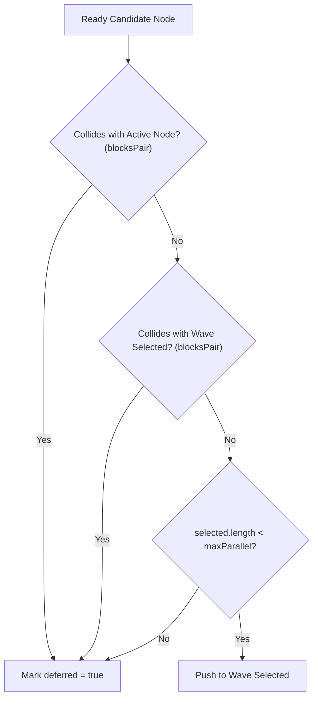

# 04 — ORQUESTACIÓN Y SCHEDULER CONTINUO BASADO EN EVENTOS

Este documento describe la arquitectura detallada del **Scheduler Continuo Basado en Eventos** y del **V2ExecutionDriver** en ManyHands, abarcando la evaluación de disponibilidad (`selectReadyWaveV2`), el aplazamiento simétrico por restricciones de conflicto (`ConflictConstraints`), la cola atómica de registro (`recordQueue`) y la propagación de estado inmutable.

---

## 1. VISIÓN GENERAL DE LA ORQUESTACIÓN

El motor de orquestación de ManyHands opera como un **sistema reactivo basado en eventos de append-only log**. En lugar de depender de cronogramas estáticos o sondeo (*polling*), el ejecutor evalúa el estado del grafo de tareas (`GraphRevision`) a través de proyecciones deterministas (`RunProjection`) derivadas del historial de hechos (`RunEventInput`).

```mermaid
flowchart TD
    subgraph EventLoop ["Continuous Event-Driven Loop (V2ExecutionDriver)"]
        LoadState["RunCoordinator.load(runId)"] --> EvalReadiness["buildReadinessState()"]
        EvalReadiness --> WaveSelector["selectReadyWaveV2()"]
        WaveSelector --> Observe["coordinator.execute('observe_readiness')"]
        Observe --> SelectWave["coordinator.execute('select_wave')"]
        SelectWave --> RecordStart["coordinator.record(attempt.started)"]
        RecordStart --> AsyncExec["Parallel Worker Execution"]
        AsyncExec --> AtomicQueue["Atomic recordQueue (Sequential Dispatch)"]
        AtomicQueue --> RecordFacts["coordinator.record(facts)"]
        RecordFacts --> NextWave["Advance Loop to Next Wave"]
    end
```



---

## 2. ARQUITECTURA DEL SCHEDULER CONTINUO

### 2.1 Principios de Diseño
1. **Determinismo Event-Sourced**: Ningún estado de ejecución se muta *in-place*. Todo avance es la consecuencia de la reducción de hechos inmutables.
2. **Re-evaluación Continua**: En cada iteración (*wave*), el scheduler calcula la frontera de ejecutabilidad basada en los artefactos adoptados y las decisiones resueltas.
3. **Aislamiento de Errores**: La falla de un nodo no invalida la ejecución de ramas independientes en el DAG.

---

## 3. SELECCIÓN DE ONDAS DE EJECUCIÓN (`selectReadyWaveV2`)

El algoritmo `selectReadyWaveV2` identifica qué nodos del grafo están aptos para iniciar su ejecución en la ola (*wave*) actual y los ordena deterministamente por su identificador.

```typescript
export function selectReadyWaveV2(input: {
  graph: GraphRevision;
  nodeIds: string[];
  state: ReadinessStateV2;
  effectiveConfig: { maxParallel: number };
  conflictConstraints: ConflictConstraintEvidence[];
}): { nodeIds: string[]; explanations: ReadinessExplanationV2[] }
```

### 3.1 Estado de Disponibilidad (`ReadinessStateV2`)
Para evaluar si un nodo está listo, el scheduler construye una proyección de estado instantánea:

| Campo | Tipo | Propósito |
|---|---|---|
| `adoptedArtifacts` | `Array<{ artifactId, revision, digest }>` | Artefactos validados y adoptados por el sistema. |
| `pendingDecisions` | `Array<{ decisionId, affectedNodeIds }>` | Decisiones humanas pendientes de resolución. |
| `materializableNodeIds` | `string[]` | Nodos cuyas dependencias base están materializadas. |
| `activeResourceNodeIds` | `string[]` | Nodos que actualmente ocupan recursos o worktrees activos. |
| `budgetAvailable` | `boolean` | Flag de presupuesto global de tokens/costo disponible. |
| `availableExecutorNodeIds` | `string[]` | Nodos con ejecutores asignables disponibles. |
| `adoptedNodeIds` | `string[]` | Nodos cuyo resultado ya fue adoptado exitosamente. |
| `currentContractRevisions` | `Record<string, string>` | Versión activa de contratos de tarea. |

### 3.2 Reglas de Evaluación (`explainReadiness`)
Un nodo es considerado **`ready`** si la lista de razones de bloqueo (`reasons`) está vacía:

```typescript
export function explainReadiness(input: ReadinessInputV2): ReadinessExplanationV2 {
  const node = input.graph.nodes[input.nodeId];
  if (node === undefined) throw new Error(`Unknown graph node ${input.nodeId}.`);
  const reasons: ReadinessReason[] = [];
  
  // 1. Verificación de artefactos requeridos
  const requiredPhases = node.kind === "root" || node.kind === "composite"
    ? new Set(["execution", "integration"])
    : new Set(["execution"]);
    
  for (const req of input.graph.artifactRequirements.filter(
    (item) => item.consumerNodeId === input.nodeId && requiredPhases.has(item.requiredFor)
  )) {
    const adopted = input.adoptedArtifacts.some(
      (a) => a.artifactId === req.artifactContract.id && a.revision === req.artifactContract.revision
    );
    if (!adopted) reasons.push({ code: "missing_artifact", artifactId: req.artifactContract.id, requiredRevision: req.artifactContract.revision });
  }

  // 2. Verificación de frescura de contratos
  for (const contract of input.requiredContractRevisions?.[input.nodeId] ?? []) {
    const current = input.currentContractRevisions[contract.id];
    if (current !== contract.revision) reasons.push({ code: "stale_contract", contractId: contract.id, requiredRevision: contract.revision });
  }

  // 3. Verificación de decisiones pendíentes, recursos, presupuesto y adopción previa
  if (input.pendingDecisions.some((d) => d.affectedNodeIds.includes(input.nodeId))) reasons.push({ code: "unresolved_decision" });
  if (!input.materializableNodeIds.includes(input.nodeId)) reasons.push({ code: "unmaterializable_base" });
  if (input.activeResourceNodeIds.includes(input.nodeId)) reasons.push({ code: "active_resource_constraint" });
  if (!input.budgetAvailable) reasons.push({ code: "budget_exhausted" });
  if (!input.availableExecutorNodeIds.includes(input.nodeId)) reasons.push({ code: "executor_unavailable" });
  if (input.adoptedNodeIds.includes(input.nodeId)) reasons.push({ code: "already_adopted" });

  return { nodeId: input.nodeId, ready: reasons.length === 0, reasons };
}
```

---

## 4. APLAZAMIENTO SIMÉTRICO POR RESTRICCIONES DE CONFLICTO (`ConflictConstraints`)

Cuando dos tareas modifican los mismos archivos o módulos conceptuales con alto riesgo de colisión, ManyHands impone una restricción de conflicto simétrica (`ConflictConstraintEvidence`).

### 4.1 Evaluación de Conflictos (`blocksPair`)
La relación de conflicto es **estrictamente bidireccional**. La función `blocksPair` comprueba ambas permutaciones de nodos `(left, right)` y `(right, left)`:

```typescript
function blocksPair(
  constraints: Array<{ leftNodeId: string; rightNodeId: string; risk: string }>,
  left: string,
  right: string
): boolean {
  return constraints.some((constraint) =>
    ((constraint.leftNodeId === left && constraint.rightNodeId === right) ||
     (constraint.leftNodeId === right && constraint.rightNodeId === left)) &&
    ["unknown", "high", "blocking"].includes(constraint.risk)
  );
}
```

### 4.2 Algoritmo de Aplazamiento
Durante la selección de la ola:
1. Se evalúan los candidatos listos en orden alfabético estable (`sort((a, b) => a.localeCompare(b))`).
2. Se verifica si el candidato colisiona con **nodos activos en ejecución** (`activeResourceNodeIds`).
3. Se verifica si el candidato colisiona con **nodos ya seleccionados en la ola actual** (`selected`).
4. Si existe colisión en cualquiera de los dos casos, el candidato se marca como `deferred = true` y no se incluye en la ola actual.
5. El cupo de ejecución paralela se limita estrictamente por `effectiveConfig.maxParallel`.



---

## 5. COLA ATÓMICA DE REGISTRO EN V2EXECUTIONDRIVER (`recordQueue`)

En entornos de ejecución concurrente, múltiples agentes completan sus tareas de manera asíncrona en paralelo (`Promise.all`). Sin embargo, las actualizaciones en el `RunCoordinator` y la emisión de hechos deben ser estrictamente secuenciales para garantizar la coherencia del estado event-sourced.

### 5.1 Mecanismo de Cadena de Promesas (`recordQueue`)
`V2ExecutionDriver` implementa una cola atómica serializada mediante encadenamiento de promesas JavaScript:

```typescript
// En V2ExecutionDriver.advance():
let latestState = state;
let recordQueue = Promise.resolve();

await Promise.all(attempts.map(async (attempt) => {
  const outcome = await this.options.execute(attempt.executionInput);
  const facts = this.factsForOutcome(input, attempt, outcome);

  let resolveEnqueued!: () => void;
  let rejectEnqueued!: (err: unknown) => void;
  const enqueued = new Promise<void>((resolve, reject) => {
    resolveEnqueued = resolve;
    rejectEnqueued = reject;
  });

  const previousQueue = recordQueue;
  recordQueue = previousQueue.catch(() => {}).then(async () => {
    try {
      latestState = await this.options.coordinator.record(input.runId, facts);
      resolveEnqueued();
    } catch (err) {
      rejectEnqueued(err);
    }
  });

  await enqueued;
}));
```

### 5.2 Garantías Arquitectónicas
- **Orden de Finalización Asíncrono Preservado**: El primer agente que termina su trabajo encolador obtiene la posición inmediata en el log.
- **Sin Carreras de Lectura/Escritura (*Read-Modify-Write Races*)**: `coordinator.record()` procesa los hechos uno a uno en serie, evitando sobreescrituras en la base de datos SQLite WAL / JSONL.
- **Aislamiento de Fallas**: La falla en la grabación de una tarea no corrompe la promesa raíz de la cola (`previousQueue.catch(() => {})`).

---

## 6. PROPAGACIÓN DE ESTADO INMUTABLE Y HUELAS DIGITALES

### 6.1 Huella Digital de Entrada (`computeInputFingerprint`)
Cada intento de ejecución (`PreparedAttempt`) se identifica de forma única e inmutable mediante el hash SHA-256 de todas sus entradas:

$$\text{InputFingerprint} = \text{SHA256}(\text{graphId} \parallel \text{nodeId} \parallel \text{contractRevisions} \parallel \text{baseCommit} \parallel \text{consumedArtifacts} \parallel \text{repoContext} \parallel \text{executorProfile} \parallel \text{validationContract})$$

Cualquier cambio en los contratos, el commit base o los artefactos consumidos altera la huella digital y genera un intento completamente nuevo (`runId:attempt:nodeId:ordinal`).

### 6.2 Ciclo de Vida de Eventos e Hechos Canónicos

```text
attempt.started / integration.started
       │
       ├──► attempt.candidate_created (Candidate Commit SHA)
       │
       ├──► validation.completed (Evidence Matrix Record)
       │
       ├──► artifact.adopted (AdoptedArtifact with Output Digest)
       │
       └──► final_candidate.verified (Root Node Handoff Manifest)
```

1. **`attempt.started` / `integration.started`**: Registra el inicio formal del intento con la huella digital correspondiente.
2. **`attempt.candidate_created`**: Registra el hash Git exacto generado en el worktree del agente.
3. **`validation.completed`**: Asocia la Matriz de Evidencias que valida el commit candidato contra los contratos de prueba.
4. **`artifact.adopted`**: Registra el artefacto resultante para ser consumido por nodos dependientes en olas posteriores.
5. **`final_candidate.verified`**: Emitido únicamente por la raíz (`rootId`), sellando el commit entregable final.

---

## 7. MATRIZ DE INVARIANTES Y SEGUIMIENTO

| Invariante | Garantía de Implementación | Ubicación de Código |
|---|---|---|
| **Límite Parallelo Estricto** | `selected.length < maxParallel` | [wave-selector-v2.ts](file:///c:/Users/franc/Documents/Proyectos/Manyhands/packages/scheduler/src/wave-selector-v2.ts#L21) |
| **Simetría de Conflictos** | `blocksPair` evalúa combinaciones `(A, B)` y `(B, A)` | [wave-selector-v2.ts](file:///c:/Users/franc/Documents/Proyectos/Manyhands/packages/scheduler/src/wave-selector-v2.ts#L28-L34) |
| **Serialización de Hechos** | Encadenamiento de `recordQueue` con `Promise.resolve()` | [execution-driver.ts](file:///c:/Users/franc/Documents/Proyectos/Manyhands/packages/orchestrator-graph/src/v2/execution-driver.ts#L160-L183) |
| **Integridad de Contratos** | Comprobación de versiones `requiredContractRevisions` | [readiness-v2.ts](file:///c:/Users/franc/Documents/Proyectos/Manyhands/packages/scheduler/src/readiness-v2.ts#L14-L17) |
| **Aprobación Estricta** | Coincidencia exacta de `approvedGraphRevision` antes de ejecutar | [execution-driver.ts](file:///c:/Users/franc/Documents/Proyectos/Manyhands/packages/orchestrator-graph/src/v2/execution-driver.ts#L105-L113) |
