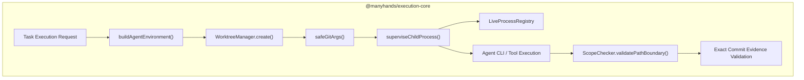
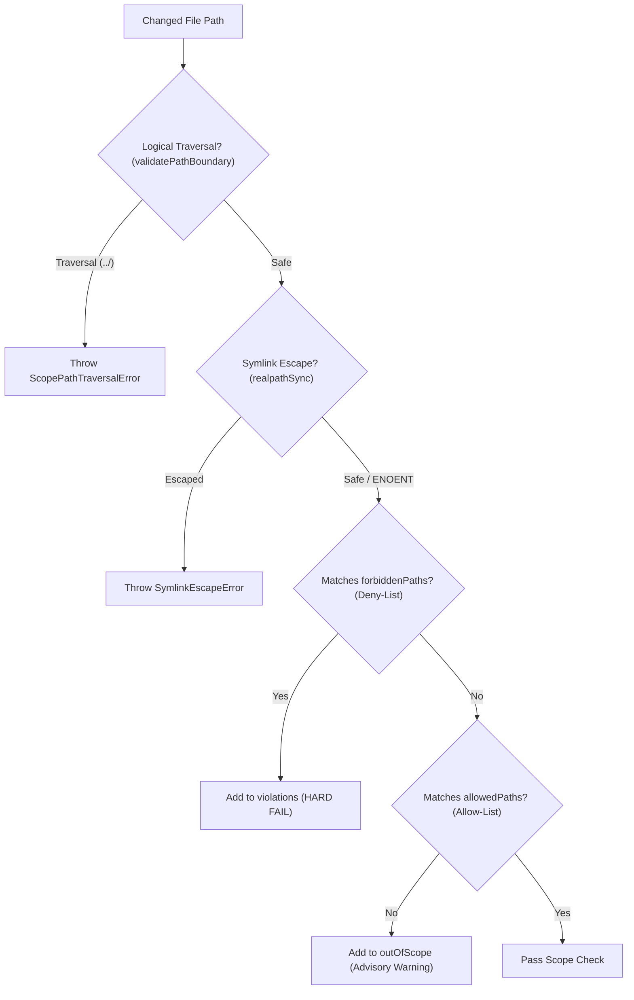

# 05 — CORE DE EJECUCIÓN Y SANDBOXING DE PROCESOS

Este documento detalla la arquitectura de aislamiento, supervision de procesos y seguridad del módulo **Execution Core** (`@manyhands/execution-core`) en ManyHands. Incluye el ciclo de vida del Pool de Worktrees Git, la validación de límites de sistema de archivos (`ScopeChecker` / `validatePathBoundary`), la supervisión de procesos (`LiveProcessRegistry`), el filtrado de secretos (`buildAgentEnvironment()`) y el saneamiento de comandos Git (`safeGitArgs`).

---

## 1. VISIÓN GENERAL DE SANDBOXING Y MODELO DE AISLAMIENTO

ManyHands está diseñado como una aplicación **local, single-user y self-hosted**. Su modelo de sandboxing no busca aislar usuarios maliciosos en contenedores hipervisor (como Docker o microVMs), sino **garantizar que los agentes de código (LLM) operen de forma segura, acotada y reversible** sobre los repositorios locales.



---

## 2. POOL DE RECTICLADO Y GESTIÓN DE WORKTREES (`WorktreeManager`)

El trabajo de cada hoja o composite se ejecuta dentro de un **Git Worktree aislado** dedicado a esa tarea. Esto impide que los agentes modifiquen el árbol de trabajo principal del usuario.

### 2.1 Estructura de Directorios y Control de Rutas en Windows
Las rutas de worktrees siguen el esquema `<worktreesRoot>/<runId>/<taskId>` con ramas nombradas `mh/<runId>/<taskId>`.

Para prevenir fallos en Windows debido al límite `PATH_MAX` (260 caracteres) en `git.exe` (`WINDOWS_GIT_PATH_BUDGET = 220`), ManyHands relocaliza automáticamente el directorio raíz de worktrees si la longitud total excede el presupuesto:

```typescript
export function runWorktreesRootFor(params: WorktreeRootParams): string {
  const root = params.worktreesRoot.replace(/[\\/]+$/, "");
  const runSegment = safeWorktreeSegment(params.runId);
  const candidate = `${root}/${runSegment}`;
  if (process.platform !== "win32") return candidate;
  
  if (candidate.length + WORKTREE_PATH_RESERVE <= WINDOWS_GIT_PATH_BUDGET) {
    return candidate;
  }
  // Relocalización determinista a directorio temporal corto
  const tmpBase = osTmpdir().replace(/[\\/]+$/, "");
  return `${tmpBase}/mh-wt/${runSegment}`;
}
```

### 2.2 Saneamiento de Segmentos (`safeWorktreeSegment`)
Para prevenir errores en el sistema de archivos (especialmente nombres reservados en Windows como `CON`, `PRN`, `NUL`, `COM1-9`, `LPT1-9`), los identificadores de tarea se desinfectan:

- Si el ID contiene caracteres no alfanuméricos, supera los 64 caracteres o coincide con una palabra reservada, se trunca y se añade un hash SHA-256 corto: `${prefix}-${hash}`.

### 2.3 Reciclaje y Limpieza de Worktrees (`restoreManagedWorktree`)
Durante reintentos de reparación de código (*code repair*), el worktree no se elimina por completo. En su lugar, se restablece limpiamente al commit base mediante `restoreManagedWorktree`:

```typescript
async restoreManagedWorktree(cwd: string, ref: string): Promise<void> {
  const git = this.client(cwd);
  await git.raw(["reset", "--hard", ref]);
  await git.raw(["clean", "-fd"]);
}
```

### 2.4 Recolección de Basura (`gcRun`)
Al cancelar o finalizar una corrida:
1. `WorktreeManager.gcRun` remueve todos los worktrees asociados a la corrida.
2. Preserva explícitamente las ramas especificadas en `preserveBranchesFor` (ramas que anclan commits de evidencia registrados para evitar su eliminación por `git gc`).
3. Ejecuta `git worktree prune` y elimina recursivamente el directorio de la corrida.

---

## 3. SCOPECHECKER Y GUARDA DE TRAVERSAL OS-AWARE (`validatePathBoundary`)

El `ScopeChecker` verifica que las modificaciones realizadas por los agentes permanezcan dentro de los límites del worktree y respeten los contratos de alcance.



### 3.1 Guarda contra Path Traversal y Escapes de Symlinks
La función `validatePathBoundary` realiza una verificación en dos niveles:

```typescript
validatePathBoundary(worktreeRoot: string, targetPath: string): void {
  const resolvedRoot = resolve(worktreeRoot);
  const resolvedTarget = resolve(resolvedRoot, targetPath);

  // 1. Verificación lógica de Path Traversal (../)
  if (resolvedTarget !== resolvedRoot && !resolvedTarget.startsWith(resolvedRoot + sep)) {
    throw new ScopePathTraversalError(targetPath, resolvedTarget, resolvedRoot);
  }

  // 2. Verificación física de Symlink Escape (siguiendo enlaces simbólicos reales)
  try {
    const realTarget = realpathSync(resolvedTarget);
    const realRoot = realpathSync(resolvedRoot);
    if (realTarget !== realRoot && !realTarget.startsWith(realRoot + sep)) {
      throw new SymlinkEscapeError(targetPath, resolvedTarget, realRoot, realTarget);
    }
  } catch (error) {
    // Los archivos nuevos (greenfield) lanzan ENOENT en realpathSync, lo cual es permitido
    // siempre que la verificación lógica inicial haya pasado.
    if (error instanceof ScopeViolationError || error instanceof SymlinkEscapeError) throw error;
  }
}
```

### 3.2 Deny-List vs. Allow-List (Regla "Deny Wins" - ADR-0023)
- **Forbidden Paths (Deny-List)**: Representa un límite estricto (*hard boundary*). Si un archivo coincide con un patron prohibido (ej. `.env`, `.git/`), la ejecución falla inmediatamente con `violations`.
- **Allowed Paths (Allow-List)**: Es un límite consultivo (*advisory*). Si un archivo está fuera de la lista permitida pero no está prohibido, se registra en `outOfScope` para visibilidad pero **no hace fallar la corrida**, permitiendo andamiajes (*scaffolding*) de proyectos.

---

## 4. SUPERVISIÓN Y CANCELACIÓN DE PROCESOS (`LiveProcessRegistry`)

Todos los subprocesos generados por ManyHands (CLIs de ejecutores, comandos de compilación/test, shells de terminal, comandos Git) se registran en el `LiveProcessRegistry` bajo su `runId`.

### 4.1 Registro y Contrato de Supervisión
```typescript
export interface SupervisedProcessHandle {
  pid?: number | undefined;
  kill(signal?: NodeJS.Signals | number): unknown;
}

export function superviseChildProcess(
  meta: SupervisedProcessMeta,
  child: SupervisedProcessHandle,
  options: SuperviseOptions = {}
): () => void
```
- Conecta un `AbortSignal` cooperativo al cierre de árbol de procesos (`killProcessTree`).
- Registra el proceso en el mapa en memoria y notifica al hook de evidencia (`ProcessEvidenceSink`).
- Se desregistra automáticamente ante el evento `close` del subproceso.

### 4.2 Eliminación Verificada de Árboles de Procesos (`killProcessTreeVerified`)
Cuando el usuario cancela una corrida o caduca un tiempo de espera (*timeout*), el sistema fuerza la muerte del árbol de procesos y **sondea el sistema operativo hasta verificar que el PID haya desaparecido**:

```typescript
export async function killProcessTreeVerified(
  child: SupervisedProcessHandle,
  spawnFn: SpawnFn,
  timeoutMs = 3_000
): Promise<KillVerification> {
  const pid = child.pid;
  if (typeof pid !== "number" || !isProcessAlive(pid)) {
    return { pid: pid ?? -1, outcome: "dead", waitedMs: 0 };
  }

  // Primer intento de terminación
  await killProcessTree(child, spawnFn);
  if (await waitUntilDead(pid, timeoutMs / 2)) {
    return { pid, outcome: "dead", waitedMs: Date.now() - start };
  }

  // Escalación: segundo intento si el árbol sobrevivió
  execWarn("cancel", "process tree survived first kill — escalating", { pid });
  await killProcessTree(child, spawnFn);
  if (await waitUntilDead(pid, timeoutMs / 2)) {
    return { pid, outcome: "escalated", waitedMs: Date.now() - start };
  }

  return { pid, outcome: "survived", waitedMs: Date.now() - start };
}
```

### 4.3 Barreras por Sistema Operativo (`killCliProcessTree`)
- **Windows**: Invoca `taskkill /pid <pid> /t /f` para eliminar el árbol jerárquico completo. Aguarda hasta que el tirador del proceso original Node.js se cierre y confirme la liberación del PID.
- **POSIX**: Envía la señal `process.kill(-pid, "SIGKILL")` al grupo de procesos desconectado (*process group*).

---

## 5. REDUCCIÓN DE SECRETOS DE ENTORNO (`buildAgentEnvironment()`)

Los subprocesos de los agentes no heredan `process.env` ciegamente. `buildAgentEnvironment()` sanitiza las variables de entorno aplicando una lista blanca estricta (*allowlist*):

```typescript
export function buildAgentEnvironment(options: BuildAgentEnvironmentOptions = {}): Record<string, string>
```

### 5.1 Categorías de Variables Permitidas
1. **System Allowlist**: `PATH`, `COMSPEC`, `SHELL`, `TEMP`, `TMP`, `HOME`, `USERPROFILE`, `APPDATA`, `LOCALAPPDATA`, `LANG`, `NODE_ENV`, `PNPM_HOME`.
2. **Provider Credentials** (Solo para ejecutores de agentes, omitido en terminales humanas): `ANTHROPIC_API_KEY`, `CLAUDE_CODE_OAUTH_TOKEN`, `OPENAI_API_KEY`, `CODEX_API_KEY`.
3. **Escapes del Operador**: Cualquier variable definida explícitamente en la variable de entorno `MANYHANDS_AGENT_ENV_ALLOW` (separada por comas).

> [!IMPORTANT]
> Todas las variables internas `MANYHANDS_*` y las credenciales no declaradas del entorno del servidor son eliminadas completamente antes de lanzar el agente.

---

## 6. SANEAMIENTO DE COMANDOS GIT (`safeGitArgs`)

Para evitar fallos de seguridad y errores de permisos en Windows cuando un repositorio pertenece a otro usuario o se encuentra en una ruta compartida, cada subproceso Git se ejecuta con la opción `-c safe.directory`:

```typescript
export function safeGitArgs(cwd: string, args: readonly string[]): string[] {
  return ["-c", `safe.directory=${gitPath(resolve(cwd))}`, ...args];
}
```

Esta función convierte barras invertidas `\` a barras diagonales `/` e inyecta la configuración de directorio seguro localmente para ese comando, **sin modificar la configuración global `~/.gitconfig` del usuario**.

---

## 7. MATRIZ DE SEGURIDAD E INVARIANTES DE EJECUCIÓN

| Componente | Amenaza Mitigada | Mecanismo de Control | Referencia de Código |
|---|---|---|---|
| **Worktree Pool** | Contaminación del repositorio principal del usuario | Aislamiento en directorios Git Worktree dedicados | [manager.ts](file:///c:/Users/franc/Documents/Proyectos/Manyhands/packages/execution-core/src/worktree/manager.ts#L176-L236) |
| **ScopeChecker** | Path Traversal (`../`) y Symlink Escape fuera del worktree | `validatePathBoundary` con `realpathSync` | [checker.ts](file:///c:/Users/franc/Documents/Proyectos/Manyhands/packages/execution-core/src/scope/checker.ts#L37-L59) |
| **Process Supervisor** | Procesos huérfanos escabullidos tras cancelación | `killProcessTreeVerified` con sondeo Signal-0 | [live-process-registry.ts](file:///c:/Users/franc/Documents/Proyectos/Manyhands/packages/execution-core/src/executor/live-process-registry.ts#L237-L272) |
| **Agent Environment** | Fuga de credenciales internas o variables del sistema | Sanitización por lista blanca en `buildAgentEnvironment` | [agent-env.ts](file:///c:/Users/franc/Documents/Proyectos/Manyhands/packages/execution-core/src/executor/agent-env.ts#L100-L120) |
| **Safe Git Args** | Errores de propiedad de repositorio en Windows | Inyección local `safe.directory=<cwd>` | [runner.ts](file:///c:/Users/franc/Documents/Proyectos/Manyhands/packages/execution-core/src/git/runner.ts#L403-L405) |
