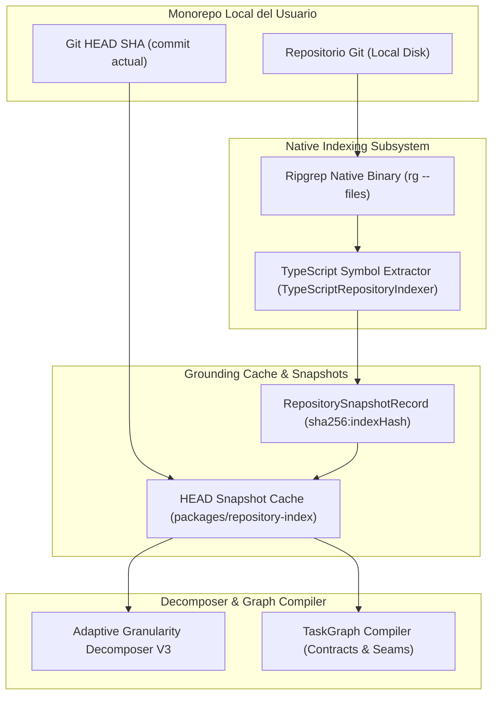
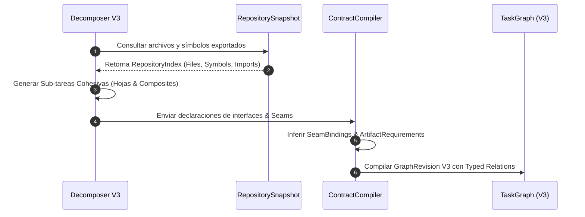

# 07 — GROUNDING Y ANÁLISIS DEL MONOREPO

Este documento define la arquitectura de **Grounding** y extracción de contexto del monorepo dentro del sistema **ManyHands**, abarcando el indexador nativo basado en Ripgrep (`rg --files`), la caché incremental de snapshots por Git HEAD SHA y el extractor de símbolos TypeScript/JavaScript.

---

## 1. VISIÓN GENERAL DE GROUNDING

En ManyHands, el **Grounding** es la capacidad de inspeccionar, comprender y estructurar el estado exacto del código fuente del repositorio local del usuario sin saturar las ventanas de contexto de los modelos de lenguaje (LLMs) ni incurrir en costos excesivos de tokens.

El subsistema `packages/repository-index` expone una representación estructurada, determinista y serializable del monorepo (`RepositorySnapshot`), la cual alimenta directamente al **Adaptive Granularity Decomposer V3** y a las herramientas de ejecución de agentes.



### Invariantes de Grounding:
1. **Indexación Aislada y Segura**: El indexador invoca herramientas del sistema (como `rg`) mediante subprocesos aislados sin interpolación de shell, respetando los límites de directorio del repositorio.
2. **Caché Determinista por Git HEAD**: Dos inspecciones sobre el mismo commit Git HEAD y las mismas opciones producen exactamente el mismo hash de snapshot (`snapshotId = sha256:hash`).
3. **Presupuestos de E/S Estrictos (*Limits*)**: La indexación respeta límites de lectura explícitos (`maxFiles`, `maxBytes`, `maxFileBytes`) para evitar desbordamientos de memoria en monorepos masivos.
4. **Cero Mutación del Workspace**: El Grounding es 100% de solo lectura y nunca modifica archivos, branches ni la directoria `.git` del repositorio host.

---

## 2. INDEXADOR NATIVO ULTRARRÁPIDO CON RIPGREP (`rg --files`)

Para descubrir la topología de archivos en repositorios con decenas de miles de elementos de forma instantánea, ManyHands integra Ripgrep (`rg`) como binario ejecutable nativo.

### 2.1 Modelo de Invocación y Aislamiento

El módulo `listIndexableFiles()` invoca `rg --files --null` o aplica recorridos de directorio nativos procesando reglas de exclusión `.gitignore`.

- **Saneamiento de Argumentos**: Evita cualquier uso de `sh -c` o `cmd.exe /c`. Los argumentos se pasan como un arreglo explícito de strings en `child_process.execFile()`.
- **Soporte Nulo (`--null`)**: Delimita nombres de archivo con bytes nulos (`\0`) para manejar de forma segura rutas con espacios, comillas o caracteres unicode.
- **Normalización de Rutas**: Todas las rutas de archivo devueltas se convierten a formato de barra diagonal POSIX (`path.replaceAll("\\", "/")`) para asegurar consistencia multiplataforma (Windows/Linux/macOS).

```typescript
export interface RepositoryIndexLimits {
  maxFiles: number;       // Predeterminado: 20,000 archivos
  maxBytes: number;       // Predeterminado: 64 MB totales
  maxFileBytes: number;   // Predeterminado: 2 MB por archivo
  maxSymbols: number;     // Predeterminado: 100,000 símbolos
  maxImports: number;     // Predeterminado: 100,000 importaciones
  maxExports: number;     // Predeterminado: 100,000 exportaciones
}
```

### 2.2 Tratamiento de Exclusiones y Enlaces Simbólicos

1. **Exclusiones por Defecto**: Se ignoran automáticamente directorios de construcción e infraestructura:
   `["git", ".manyhands", ".next", "coverage", "dist", "node_modules", "out"]`.
2. **Symlinks**: Los enlaces simbólicos son detectados vía `lstat()` y omitidos de la indexación directa para prevenir bucles de recursión infinitos o accesos no autorizados fuera de la raíz del monorepo (`MH-AUDIT-SEC-002`). Un diagnóstico de advertencia se registra en el snapshot.

---

## 3. CACHÉ INCREMENTAL DE SNAPSHOTS BASADA EN GIT HEAD SHA

Re-indexar completamente un monorepo grande en cada consulta de planificación o ejecución resultaría ineficiente. ManyHands implementa una caché incremental respaldada por el commit SHA actual de Git (`baseCommit`).

### 3.1 Estructura del Registro `RepositorySnapshotRecord`

Cada snapshot consolidado cumple con el esquema `RepositorySnapshotSchema`:

```typescript
export interface RepositorySnapshotRecord {
  schemaVersion: 1;
  snapshotId: string;           // 'sha256:' + hash canónico de identidad
  repositoryId: string;         // Identificador único del repositorio
  rootPath: string;             // Ruta absoluta del repositorio local
  targetFingerprint: string;     // Hash del objetivo de software
  baseCommit: string;            // Git HEAD SHA exacto (40 caracteres)
  indexSchemaVersion: 1;
  capturedAt: string;           // Timestamp ISO-8601
  inspectionDisposition: "complete" | "partial" | "unavailable";
  capabilities: RepositoryCapabilities;
  diagnostics: RepositorySnapshotDiagnostic[];
  indexHash?: string;           // SHA-256 del contenido indexado
  index?: RepositoryIndex;
}
```

### 3.2 Reglas de Invalidación y Búsqueda \(O(1)\)

```text
 Invocación Decomposer / Planner
               │
               ▼
 Obtener Git HEAD SHA actual (git rev-parse HEAD)
               │
               ▼
 ┌──────────────────────────────────────────┐
 │ ¿Existe Snapshot con baseCommit == HEAD? │
 └────────────────────┬─────────────────────┘
                      │
           ┌──────────┴──────────┐
        SÍ │                     │ NO
           ▼                     ▼
 ┌───────────────────┐ ┌───────────────────┐
 │ Reutilizar caché  │ │ Ejecutar Ripgrep  │
 │ de inmediato O(1) │ │ + TS Indexer      │
 └───────────────────┘ └─────────┬─────────┘
                                 │
                                 ▼
                         Guardar Snapshot
                         en Caché con HEAD
```

- **Reutilización Instantánea**: Si `baseCommit === currentGitHead` y el `indexSchemaVersion` coincide, el snapshot se recupera en tiempo constante \(O(1)\) directamente desde la memoria o disco cacheado (`.manyhands/snapshots/`).
- **Invalidación**: La caché se invalida inmediatamente cuando:
  1. El usuario realiza un commit, checkout o rebase (cambia el SHA de HEAD).
  2. Se modifica la versión del esquema del indexador (`REPOSITORY_INDEX_SCHEMA_VERSION`).
  3. El usuario fuerza la re-indexación manual desde la Cockpit UI.

---

## 4. EXTRACTOR DE SÍMBOLOS EXPORTADOS (`TypeScriptRepositoryIndexer`)

Para proveer una semántica profunda de código al `Adaptive Decomposer V3`, ManyHands realiza un análisis sintáctico de AST (Abstract Syntax Tree) utilizando la API oficial de TypeScript Compiler (`typescript`).

### 4.1 Tipos de Símbolos y Clasificación de Archivos

El indexador analiza archivos `.ts`, `.tsx`, `.js`, `.jsx` y `.json`, clasificándolos en categorías y extrayendo símbolos estructurados:

- **Categorías de Archivo (`RepositoryFileKind`)**:
  - `source`: Archivos de lógica y componentes de producción.
  - `test`: Archivos de pruebas unitarias o de integración (`*.test.ts`, `*.spec.ts`).
  - `config`: Configuraciones de proyecto (`package.json`, `tsconfig.json`, `tailwind.config.js`).
  - `schema`: Archivos de definición de esquemas (`*.schema.ts`, `schema.prisma`).
  - `migration`: Migraciones de base de datos (`migrations/*`).

- **Tipos de Símbolos (`RepositorySymbolKind`)**:
  - `function`, `class`, `interface`, `type`, `const`, `component`.

```typescript
export interface RepositorySymbolIndex {
  name: string;             // Nombre del símbolo (ej. 'TaskGraphV3')
  kind: RepositorySymbolKind;
  filePath: string;         // Ruta relativa normalizada (ej. 'packages/task-graph/src/index.ts')
  exported: boolean;        // Indica si posee modificador 'export'
  line?: number;            // Número de línea en el archivo fuente (1-indexed)
}
```

### 4.2 Proceso de Extracción con AST de TypeScript

El extractor utiliza `ts.createSourceFile()` para navegar las declaraciones de nivel superior del archivo:

```typescript
function collectDeclaration(
  statement: ts.Statement,
  sourceFile: ts.SourceFile,
  filePath: string,
  symbols: RepositorySymbolIndex[],
  declaredSymbols: string[],
  exportedSymbols: string[],
  exports: RepositoryExportIndex[]
): void {
  if (ts.isFunctionDeclaration(statement) && statement.name) {
    collectSymbol(
      statement.name.text,
      symbolKindForDeclaration(statement, filePath),
      hasExportModifier(statement),
      statement,
      sourceFile,
      filePath,
      symbols,
      declaredSymbols,
      exportedSymbols,
      exports
    );
    return;
  }

  if (ts.isInterfaceDeclaration(statement)) {
    collectSymbol(
      statement.name.text,
      "interface",
      hasExportModifier(statement),
      statement,
      sourceFile,
      filePath,
      symbols,
      declaredSymbols,
      exportedSymbols,
      exports
    );
    return;
  }
  // Procesamiento idéntico para ClassDeclaration, TypeAliasDeclaration y VariableStatement
}
```

---

## 5. INTEGRACIÓN CON ADAPTIVE GRANULARITY DECOMPOSER V3 Y COMPILACIÓN DE GRAFO

El resultado del Grounding se entrega al **Adaptive Granularity Decomposer V3** para estructurar la descomposición del objetivo en un grafo DAG ordenado.



1. **Empaquetado de Contexto de Planteamiento**: El `WorkBreakdownPlanner` consume las firmas de los símbolos exportados e importados para identificar módulos existentes y evitar la duplicación de tipos o utilidades.
2. **Definición de Fronteras de Trabajo (*Seams*)**: Las interfaces y tipos exportados extraídos se convierten automáticamente en la especificación de los contratos `SeamBinding` entre subárboles concurrentes.
3. **Asignación de Reglas de Conflicto (*ConflictConstraints*)**: Archivos clasificados como `config` o `migration` generan automáticamente restricciones de programación paralela para evitar que dos agentes modifiquen la misma configuración simultáneamente.

---

## 6. TABLA DE ESQUEMAS Y CONTRATOS DE GROUNDING

| Tipo de Esquema Zod | Descripción y Propósito |
|---|---|
| `RepositorySnapshotSchema` | Esquema principal inmutable del snapshot de repositorio. |
| `RepositoryIndexSchema` | Contenedor de archivos, símbolos, importaciones y exportaciones indexadas. |
| `RepositoryFileIndexSchema` | Metadatos por archivo (ruta, clase, hash SHA256 de contenido, símbolos). |
| `RepositorySymbolIndexSchema` | Definición de símbolo fuente (nombre, tipo, línea, visibilidad exportada). |
| `RepositoryCapabilitiesSchema` | Capacidades descubiertas del repositorio (lenguajes, test runners, linters). |
