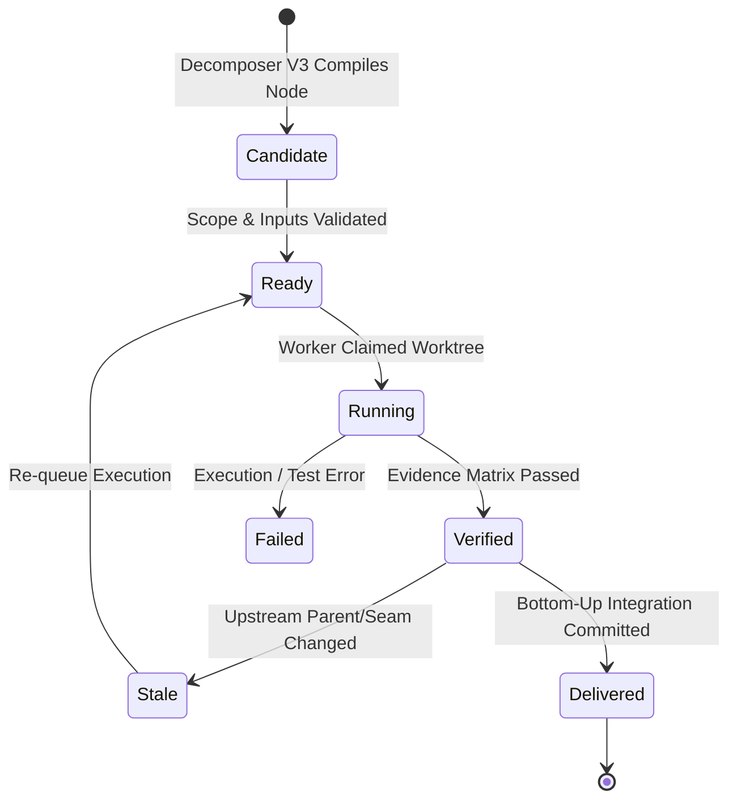
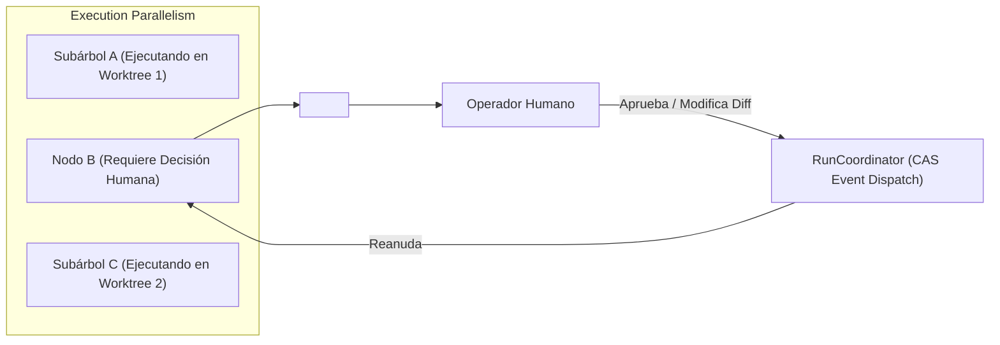

# 08 — MODELO DE INTERACCIÓN Y NAVEGACIÓN EN COCKPIT UI

Este documento define la arquitectura de interfaz de usuario, el modelo de interacción visual y las especificaciones de accesibilidad de la **Cockpit UI** de **ManyHands**, incluyendo los insignias de ciclo de vida de nodos en 5 estados, la cola de decisiones no bloqueante, la inspección interactiva de relaciones tipadas y la regla estricta de estabilidad del viewport.

---

## 1. ARQUITECTURA GENERAL Y FILOSOFÍA VISUAL DE COCKPIT UI

Cockpit UI es el centro de control principal para operar la descomposición, ejecución e integración de agentes de código. A diferencia de las herramientas SaaS tradicionales con navegación por pestañas desacopladas, Cockpit UI sigue un enfoque **agent-first**:

- **Unico Workspace Persistente por Run**: Toda la actividad ocurre en una sola vista estructurada.
- **Estabilidad Espacial**: El usuario mantiene el control total del encuadre y zoom del grafo.
- **Divulgación Progresiva (*Progressive Disclosure*)**: La información avanzada (logs de ejecución, diffs detallados de código, matrices de evidencia) se revela según el contexto seleccionado sin ocultar el mapa global.

```text
┌──────────────────────────────────────────────────────────────────────────────────┐
│ Cockpit Header: Objetivo resumido · Estado global · Pause/Resume · Cola Badge   │
├──────────────────────────────────────────────────────────────────────────────────┤
│ Decision Strip Global: Notificaciones de intervención humana pendientes          │
├────────────────────────────────────────┬─────────────────────────────────────────┤
│ Canvas del Grafo TaskGraph V3          │ Inspector Lateral Progresivo            │
│ (Nodos con 5 Badges de Estado)         │ - Resumen de Nodo seleccionado          │
│                                        │ - Requisitos de Artefactos              │
│ Toolbar: Lentes de Relación &          │ - Seam Binding Contracts                │
│ Switch Autoencuadre (Default OFF)      │ - Historial e Intentos                  │
└────────────────────────────────────────┴─────────────────────────────────────────┘
```

---

## 2. BADGES Y CICLO DE VIDA DE NODOS EN 5 ESTADOS

Cada nodo en el canvas de `TaskGraph V3` muestra una insignia de estado (*Badge*) de alta legibilidad visual que comunica inequívocamente su posición en el pipeline de desarrollo e integración.



### 2.1 Definición Detallada de los 5 Estados

| Badge | Estado Visual | Significado Semántico y Criterio de Transición |
|---|---|---|
| **Candidate** | Borde neutro punteado / Texto gris claro | **Propuesto en Borrador**: El `Adaptive Decomposer V3` ha generado el nodo durante la fase de planificación provisoria. Aún no se ha compilado formalmente en el `GraphRevision` ejecutable. |
| **Verified** | Fondo verde grafito / Borde accent activo | **Ejecución y Evidencia Validadas**: El agente completó el código en su worktree aislado y la Matriz de Evidencias (*Evidence Matrix*) aprobó al 100% las pruebas unitarias y de integración. |
| **Failed** | Fondo rojo grafito / Icono de alerta explícito | **Fallo Técnico o de Validación**: La ejecución del agente crasheó, excedió los presupuestos de tiempo/tokens, o la Matriz de Evidencias reprobó las aserciones de integración. |
| **Stale** | Fondo ámbar grafito / Icono de advertencia | **Candidato Invalidado por Cambio Ascendente**: Un nodo ancestro o una interfaz (*Seam*) fue modificada por una decisión humana o corrección, requiriendo re-evaluación o re-ejecución del nodo. |
| **Delivered** | Fondo verde sólido / Borde doble de integración | **Integrado en Rama Principal**: El resultado del subárbol ha sido fusionado exitosamente mediante la integración Bottom-Up en la rama Git principal del usuario. |

---

## 3. DRAWER DE COLA DE DECISIONES NO BLOQUEANTE (`<DecisionQueueDrawer />`)

Cuando una tarea requiere una decisión humana local (resolución de un conflicto de merge, aprobación de cambios en esquemas de base de datos o aclaración de requisitos), ManyHands no detiene todo el sistema.

### 3.1 Principio de Paralelelismo No Bloqueante

Las ramas del grafo que no dependen del nodo bloqueado continúan ejecutándose y validándose en paralelo en sus respectivos worktrees aislados. La franja global `<DecisionStrip />` notifica al operador sobre la intervención requerida.



### 3.2 Visualización de Diff en Paralelo (`SideBySideDiffViewer`)

Al abrir la decisión desde la franja o el inspector lateral, se despliega el componente `<SideBySideDiffViewer />` integrado en la Cockpit UI:

- **Panel Izquierdo**: Estado base del archivo en la rama principal o commit padre.
- **Panel Derecho**: Cambios propuestos por el candidato del agente.
- **Resaltado Sintáctico Estricto**: Basado en tokens de color con soporte WCAG 2.2 AA.
- **Acciones Disponibles**: `Aprobar candidato`, `Rechazar e intentar de nuevo`, `Editar diff localmente` o `Suministrar parámetros`.

---

## 4. INSPECTORES INTERACTIVOS DE EDGES (SEAMS Y ARTEFACTOS)

El canvas visual no solo representa la jerarquía estructural de tareas, sino también las dependencias materiales y contratos de interfaz a través de conectores (*Edges*) interactivos.

```text
  [ Producer Node ] ════════ (ArtifactRequirement Edge) ═══════> [ Consumer Node ]
                           │
                           └── Click Edge: Abre Inspector de Artefacto Materializado
```

### 4.1 Tipos de Relaciones Tipadas Canónicas en el Grafo

1. **`parentId` (Jerarquía Estructural)**:
   - *Trazo*: Línea continua neutra.
   - *Función*: Define la descomposición de la meta raíz en compositores y hojas.
2. **`ArtifactRequirement` (Flujo de Artefactos)**:
   - *Trazo*: Línea punteada con insignia de artefacto (`.json`, `.ts`, binary).
   - *Inspector*: Muestra la ruta del archivo generado, el hash de contenido SHA256 y la regla de presencia en el worktree del consumidor.
3. **`SeamBinding` (Contrato de Interfaz)**:
   - *Trazo*: Conector de doble color con icono de contrato.
   - *Inspector*: Muestra las funciones, clases e interfaces TypeScript expuestas por el productor que el consumidor está obligado a respetar.
4. **`ConflictConstraint` (Restricción de Recursos)**:
   - *Trazo*: Conector de advertencia en color ámbar/rojo.
   - *Inspector*: Explica la incompatibilidad de ejecución simultánea (ej. modificación concurrente del mismo archivo de configuración).

---

## 5. REGLA ESTRICTA "NO AUTO-FITVIEW" (INVARIANTE 5 DE UI)

Una de las fallas más comunes en las interfaces de grafos dinámicos es la re-centración automática de la cámara cuando cambian los nodos, lo que destruye el mapa mental del usuario.

### 5.1 Especificación del Invariante 5 de UI

```typescript
// INVARIANTE 5: Prohibido invocar fitView() en respuestas a eventos SSE
export function onServerSentEventReceived(event: RunEvent, reactFlowInstance: ReactFlowInstance) {
  // 1. Actualizar el estado del reductor CAS
  applyEventToRunModel(event);

  // 2. MANTENER el viewport exacto del usuario
  // NO LLAMAR NUNCA a: reactFlowInstance.fitView() ni reactFlowInstance.setCenter()
}
```

- **Comportamiento Predeterminado**: La llegada de nuevos eventos SSE (inicio de nodo, fallos, validaciones o creación de candidatos) actualiza los insignias y datos de los nodos en pantalla **sin mover la cámara ni alterar el nivel de zoom**.
- **Acción Manual `Fit Graph`**: El usuario puede presionar el botón explícito `Encuadrar Grafo` en la toolbar para centrar la vista en cualquier momento.
- **Switch `Autoencuadre` (Opt-In Temporal)**: La toolbar incluye un switch llamado `Autoencuadre`. Al activarse manualmente por el operador, la cámara seguirá suavemente la aparición de nuevos nodos. Al desactivarse, devuelve inmediatamente el control exclusivo al usuario.

---

## 6. ACCESIBILIDAD WCAG 2.2 AA Y LENGUAJE VISUAL

Cockpit UI está diseñada bajo la paleta semántica **Ember sobre Grafito**, cumpliendo con los estándares internacionales de accesibilidad WCAG 2.2 Nivel AA.

### 6.1 Estándares de Contraste y Color

- **Ratio de Contraste de Texto**: Todos los textos de etiquetas, nombres de nodos y descripciones mantienen una relación de contraste mínima de **4.5:1** contra el fondo de superficie grafito (`--color-bg`, `--color-surface`).
- **Elementos Gráficos e Indicadores**: Los bordes de nodos y conectores seleccionados cumplen con una relación mínima de **3:1**.
- **Independencia del Color**: Ningún estado se comunica exclusivamente por color. Todos los estados incluyen un icono distintivo y una etiqueta de texto explícita (ej. icono `Check` + texto `Verified`).

### 6.2 Navegación por Teclado y Anuncios Screen-Reader

1. **Focus Ring Visible**: Todos los elementos interactivos (nodos, botones, drawers, tabs del inspector) muestran un anillo de foco bien definido (`--color-accent`).
2. **Navegación por Grafo vía Teclado**: Los nodos del grafo son accesibles secuencialmente usando `Tab` y las flechas de dirección (`←`, `↑`, `→`, `↓`), permitiendo seleccionar nodos e inspeccionar sus detalles sin necesidad de ratón.
3. **Regiones Live de Lectura de Pantalla**: La franja de decisiones y los cambios de estado críticos utilizan `aria-live="polite"` y `role="status"` para anunciar actualizaciones a tecnologías de asistencia.

```html
<!-- Ejemplo de insignia de nodo accesible WCAG 2.2 AA -->
<div
  role="region"
  tabindex="0"
  aria-label="Nodo de tarea: Implementar motor de compactación. Estado: Verified"
  class="node-card state-verified"
>
  <span class="status-badge" role="status">
    <svg aria-hidden="true" class="icon-check"><!-- Icono Check --></svg>
    <span>Verified</span>
  </span>
  <h3 class="node-title">Implementar motor de compactación</h3>
</div>
```

---

## 7. RESUMEN DE COMPONENTES CORE DE COCKPIT UI

| Componente | Archivo de Origen | Responsabilidad de UI |
|---|---|---|
| `<CockpitRunGraph />` | `apps/web/src/app/runs/[runId]/_components/cockpit-run-graph.tsx` | Renderizado del canvas interactivo de `TaskGraph V3` sin auto-fitView. |
| `<DecisionQueueDrawer />` | `apps/web/src/components/decision-queue-drawer.tsx` | Drawer lateral no bloqueante para resolver decisiones humanas. |
| `<SideBySideDiffViewer />` | `apps/web/src/components/side-by-side-diff-viewer.tsx` | Comparador de código fuente y artefactos propuestos. |
| `<RunModelView />` | `apps/web/src/app/runs/[runId]/_components/run-model-view.client.tsx` | Vista contenedora principal del workspace persistente. |
