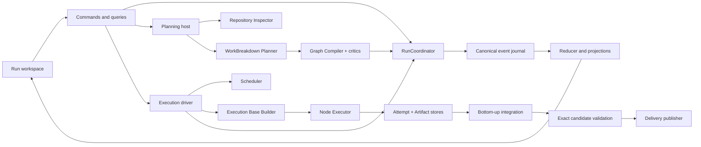
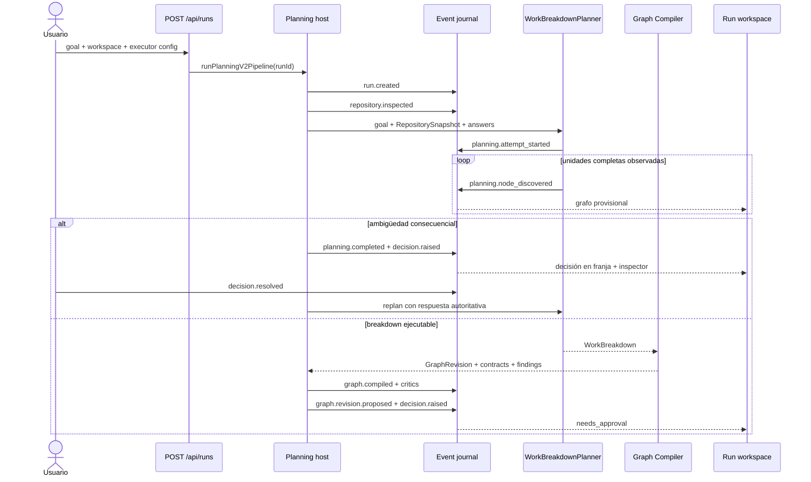
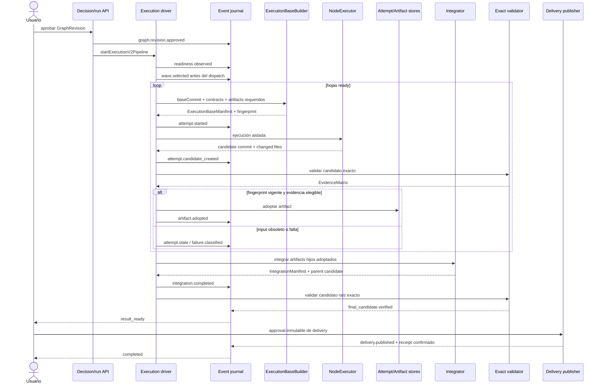

# Guía del sistema implementado

> Este documento explica cómo funciona ManyHands hoy: qué responsabilidad tiene
> cada parte, cómo viaja la información, qué estrategias sostienen sus garantías
> y dónde se puede comprobar cada afirmación en código y tests.

Algunas clases, funciones, archivos persistidos y tests todavía incluyen `V2` o
`v2` en su nombre. En esta guía esos sufijos son identificadores concretos del
código, no una narración de migración ni una segunda arquitectura en ejecución.

Para estudiar cada estrategia como problema, mecanismo y evidencia, ver
[`problem-solving-strategies.md`](problem-solving-strategies.md). Para distinguir
el rol real de frameworks y dependencias, ver
[`library-usage.md`](library-usage.md).

## Qué hace el sistema

ManyHands transforma una intención en una entrega mediante un ciclo auditable:
inspecciona el repositorio, produce un breakdown semántico, compila un grafo,
ejecuta intentos sobre bases exactas, integra artefactos adoptados, valida el
candidato y publica una entrega confirmada.

## Estrategias arquitectónicas principales

| Necesidad del sistema | Estrategia aplicada | Resultado buscado |
|---|---|---|
| Mantener una única verdad sobre el run | comandos + eventos canónicos + reducer puro | replay, auditoría y recuperación sin estados paralelos |
| Convertir una meta abierta en trabajo ejecutable | repository grounding + planner semántico + compiler determinista | el modelo propone intención; el sistema fija identidad y contratos |
| Paralelizar sin mezclar resultados | grafo tipado + readiness derivada + waves persistidas | concurrencia explicable y reproducible |
| Evitar contaminación entre agentes | bases exactas + worktrees aislados + scope deny-wins | cada candidato puede atribuirse a un attempt y a inputs concretos |
| No adoptar resultados obsoletos | `InputFingerprint` + artifacts inmutables | freshness comprobable antes de integrar |
| Demostrar el resultado | `ValidationContract` + `EvidenceMatrix` sobre el commit exacto | cada criterio queda cubierto, fallido o explícitamente descubierto |
| Integrar sin ocultar omisiones | composición bottom-up + `IntegrationManifest` | el padre declara exactamente qué outputs hijos utilizó |
| Entregar lo que se validó | candidato congelado + aprobación + publicación idempotente + receipt | `completed` significa verificado y efectivamente publicado |
| Recuperar de forma segura | clasificación por causa + leases + fencing + CAS | los retries no inventan historia ni devuelven autoridad a procesos viejos |
| Mostrar el sistema sin reinterpretarlo | proyección de eventos + React Flow como adapter visual | la UI explica el dominio, pero no lo gobierna |

## Propiedad de las decisiones

### Dominio y aplicación

`@manyhands/run-coordinator` es dueño de comandos, eventos, lifecycle,
decisions, outcomes, fingerprints y reglas de adopción. `RunCoordinator`
valida una transición plegando la historia antes de persistirla. El paquete no
importa Next.js, React, Git, filesystem ni CLIs.

`@manyhands/task-graph` define `GraphRevision`, ownership por `parentId` y las
relaciones tipadas. `@manyhands/contracts` define las obligaciones versionadas.
`@manyhands/decomposer` separa el `WorkBreakdown` semántico de su compilación
ejecutable.

### Adaptadores productivos

- `apps/web` es el composition root y expone commands/queries.
- `packages/run-store` implementa el journal durable, fencing, snapshots y
  registros de attempts/artifacts.
- `packages/orchestrator-graph` conduce waves de ejecución; no persiste un lifecycle
  alternativo.
- `packages/execution-core` implementa Git, worktrees, procesos, bases,
  validación, integración y delivery.
- `packages/scheduler`, `packages/conflict-risk` y
  `packages/repository-index` calculan readiness, restricciones y grounding.
- `packages/trace-store` conserva telemetría diagnóstica sin autoridad de
  dominio.

React Flow, Git y los executors CLI son adapters activos. Su estado visual,
stdout o exit codes no sustituyen eventos de dominio. LangChain/LangGraph no
intervienen en la ejecución actual y sus dependencias fueron removidas de web;
no existen imports productivos. El detalle verificable está en
[`library-usage.md`](library-usage.md#langchain-y-langgraph).

### Responsabilidades, estrategia y evidencia

| Componente | Responsabilidad | Estrategia de implementación | Código | Evidencia observable |
|---|---|---|---|---|
| Web intake | validar goal, workspace, target y configuración | validar en el boundary y persistir metadata antes del trabajo en background | [`route.ts`](../../apps/web/src/app/api/runs/route.ts) | [`run-create-stage-selection.test.ts`](../../tests/run-create-stage-selection.test.ts) |
| Repository Inspector | producir un snapshot estructural del target | indexar estructura y capacidades contra un Git HEAD identificable | [`packages/repository-index/src/`](../../packages/repository-index/src/) | [`repository-snapshot.test.ts`](../../tests/repository-snapshot.test.ts) |
| Planning host | coordinar snapshot, executor de planning, lease y eventos | side effects en el composition root; hechos durables en el coordinator | [`run-coordinator-host.ts`](../../apps/web/src/lib/server/runs/v2/run-coordinator-host.ts) | [`planning-cli-stream.test.ts`](../../tests/planning-cli-stream.test.ts) |
| Planner | convertir goal, snapshot y feedback en `WorkBreakdown` | salida semántica validada, streaming de unidades completas y retry por clase de fallo | [`work-breakdown.ts`](../../packages/decomposer/src/planner/work-breakdown.ts) | [`decomposer-work-breakdown.test.ts`](../../tests/decomposer-work-breakdown.test.ts) |
| Graph Compiler | crear identidad, relaciones y contratos ejecutables | transformación determinista separada del modelo + critics estructurados | [`graph-compiler.ts`](../../packages/decomposer/src/compiler/graph-compiler.ts) | [`graph-compiler.test.ts`](../../tests/graph-compiler.test.ts) |
| Run Coordinator | validar lifecycle, decisiones, adopción y delivery | command/event, fold previo a persistencia, IDs idempotentes y puertos de side effects | [`coordinator.ts`](../../packages/run-coordinator/src/coordinator.ts) | [`run-coordinator-boundaries.test.ts`](../../tests/run-coordinator-boundaries.test.ts) |
| Scheduler y driver | derivar readiness, seleccionar waves y despachar | persistir readiness, wave y attempts antes de ejecutar en paralelo | [`execution-driver.ts`](../../packages/orchestrator-graph/src/v2/execution-driver.ts) | [`scheduler-readiness-v2.test.ts`](../../tests/scheduler-readiness-v2.test.ts) |
| Execution Base Builder | preparar inputs reproducibles para un nodo | materializar solo base y artifacts requeridos, con manifest y fingerprint | [`execution-base-builder.ts`](../../packages/execution-core/src/base/execution-base-builder.ts) | [`execution-base-builder.test.ts`](../../tests/execution-base-builder.test.ts) |
| Node Executor | ejecutar el agente y producir un candidato inspeccionable | worktree aislado, diff de Git, scope deny-wins y commit del orquestador | [`node-executor.ts`](../../packages/execution-core/src/v2/node-executor.ts) | [`execution-core-worktree.test.ts`](../../tests/execution-core-worktree.test.ts) |
| Validator e Integrator | demostrar criterios y componer artifacts hijos | validación del SHA exacto + Evidence Matrix + manifests bottom-up | [`exact-candidate-validator.ts`](../../packages/execution-core/src/v2/exact-candidate-validator.ts) | [`run-v2-e2e.test.ts`](../../tests/run-v2-e2e.test.ts) |
| Run store | conservar hechos y rechazar writers sin autoridad | JSONL checksummed, sequence CAS, locks, fencing y snapshots descartables | [`jsonl-event-store.ts`](../../packages/run-store/src/jsonl-event-store.ts) | [`run-store-event-source.test.ts`](../../tests/run-store-event-source.test.ts) |
| Web projection | presentar grafo, decisiones, evidencia y actividad | reducer puro compartido; layout y lentes derivados; viewport local | [`reducer.ts`](../../apps/web/src/lib/run-model/reducer.ts) | [`run-canvas-no-auto-fit.test.ts`](../../tests/run-canvas-no-auto-fit.test.ts) |

## Recorrido completo de un run

1. `POST /api/runs` valida goal, workspace, target y configuración efectiva.
2. El servidor persiste metadata del run e inicia `runPlanningV2Pipeline`; ese
   es el nombre concreto de la función actual.
3. El host captura un `RepositorySnapshot` e invoca el executor de planning
   elegido.
4. Cada intento y unidad descubierta produce eventos canónicos. La UI muestra
   el último grafo provisional completo mientras llega un replan.
5. `WorkBreakdownPlanner` entrega una salida semántica; el Graph Compiler crea
   `GraphRevision`, bundles de contratos y findings estructurados.
6. Preguntas consecuenciales crean `Decision` de aclaración. Al resolver la
   última, planning vuelve a ejecutarse con las respuestas como requisitos.
7. La aprobación fija la revisión. El scheduler explica readiness y registra
   una wave antes del dispatch.
8. Cada attempt usa una base materializada con únicamente sus artefactos
   declarados. El orquestador inspecciona diff/scope y crea el candidato.
9. Validación y fingerprints deciden adopción. Un resultado stale no entra al
   registry.
10. Los composites integran artefactos adoptados bottom-up y producen manifests
    explícitos.
11. El candidato raíz se valida en limpio. `result_ready` exige evidencia
    elegible y `completed` exige un delivery receipt confirmado.

### Planning: de prompt a revisión aprobable

El grafo provisional no es una segunda entidad de dominio. Es una proyección de
`planning.node_discovered`. Si comienza un replan vacío, el reducer conserva el
último intento provisional completo para evitar un canvas en blanco; solo lo
reemplaza cuando el nuevo intento entrega un breakdown completo. Al compilar, la
revisión canónica sustituye la proyección provisional.

El host distingue fallos reparables de schema/contenido de fallos de transporte
o protocolo. Un cierre de stream sin resultado terminal exitoso se marca como no
reintentable por el planner: cambiar de intento de modelo no puede reparar un
contrato de CLI roto.

### Ejecución: de aprobación a receipt

## Modelo de grafo y contratos

`GraphRevision` es una revisión inmutable del plan ejecutable. Los nodos solo
guardan identidad, `parentId`, rol, título y goal. Children y profundidad se
derivan; no hay un array duplicado de dependencias que deba sincronizarse.

| Relación | Pregunta que responde | Afecta readiness | Uso visual |
|---|---|---:|---|
| `parentId` | ¿Quién integra y es dueño de este resultado? | composites esperan artifacts de hijos declarados | árbol persistente |
| `ArtifactRequirement` | ¿Qué output material debe existir para ejecutar/integrar? | sí, por ID, revisión y digest | lente Artefactos |
| `SeamBinding` | ¿Qué producer/consumer comparten un contrato compatible? | no por sí sola | lente Contratos |
| `ConflictConstraint` | ¿Qué combinación eleva riesgo o exige exclusión? | puede restringir una wave, no crea dependencia funcional | lente Conflictos |

Cada hoja recibe un bundle con cinco obligaciones separadas:

1. `TaskContract`: goal y criterios de aceptación.
2. `ScopeContract`: paths permitidos, prohibidos y de coordinación.
3. `SeamContract`: interfaces producidas/consumidas.
4. `ArtifactContract`: output que puede materializarse y adoptarse.
5. `ValidationContract`: qué debe demostrarse, sin congelar prematuramente el
   comando exacto.

El `InputFingerprint` canoniza identidad del nodo, revisiones de contratos, base
commit, artifacts consumidos, contexto del repositorio, executor profile y
contrato de validación. Es node-local: la revisión global del grafo no es una
entrada, de modo que una enmienda ajena no invalida un nodo independiente. La
adopción compara el hash producido con el vigente; ningún estado visual puede
omitir esa comparación.

## Readiness, paralelismo y decisiones

Readiness es una explicación, no un booleano almacenado. Un nodo puede quedar
pendiente por artifact ausente, contrato stale, decisión no resuelta, base no
materializable, restricción activa, presupuesto agotado o executor no
disponible. La configuración efectiva aporta `maxParallel`; el scheduler no
inventa un default arquitectónico.

Una `Decision` declara exactamente `affectedNodeIds`. Esos nodos se proyectan
como `waiting`, incluso si existe un attempt activo; siblings y composites no
afectados conservan su estado derivado. El lifecycle solo pasa a
`waiting_for_input` cuando no queda trabajo independiente listo.

## Seguridad, concurrencia e idempotencia

La consistencia se sostiene en capas complementarias:

1. **Operation lease:** una operación web reclama autoridad sobre el run.
2. **Fencing token:** el event store rechaza escrituras de una autoridad vieja,
   incluso si su proceso termina tarde.
3. **CAS de secuencia:** append exige el número de eventos esperado; el
   coordinator vuelve a cargar y revalida ante contención.
4. **Event IDs estables:** repetir una observación externa idéntica es
   idempotente; reutilizar un ID con otro contenido falla.
5. **Lock durable:** serializa writers de filesystem y detecta locks stale.
6. **Worktree aislado:** un executor no escribe sobre el target; el orquestador
   inspecciona `git diff`, aplica scope y crea el commit candidato.
7. **Cancelación en dos fases:** primero invalida autoridad y después detiene
   procesos. `operation.interrupted` exige un receipt con `allDead: true`.
8. **Delivery idempotente:** approval, target fingerprint e idempotency key
   identifican la publicación; solo un receipt confirmado produce `completed`.

Un snapshot corrupto o viejo se descarta y reconstruye. Un journal corrupto
falla cerrado: no se “repara” inventando hechos desde la cache web.

## Recuperación por causa

| Causa clasificada | Respuesta |
|---|---|
| transitorio | retry acotado con nuevo attempt |
| entorno, auth o executor | suspender solo el recurso afectado y pedir corrección |
| código/test local | una reparación dentro del mismo worktree antes de reclasificar |
| contrato o descomposición | enmienda/replan local con evidencia |
| artifact no declarado | propuesta de `ArtifactRequirement` y nueva revisión |
| scope o commit inesperado | descartar candidato; nunca adoptar |
| integración | una reparación semántica; si no converge, decisión humana |
| infraestructura compartida | detener el alcance afectado, no fingir fallo de código |

La recuperación crea historia nueva. No reescribe attempts, evidence matrices ni
revisiones anteriores.

## Persistencia y proyecciones

| Información | Autoridad | Proyecciones o índices |
|---|---|---|
| objetivo, target y config efectiva | metadata inmutable del run | preview/listado web |
| historia dinámica | `*.events.v2.jsonl` | snapshot, lifecycle, nodos, atención |
| fencing de una operación | `*.fence.v2.json` | rechazo de writers tardíos |
| attempts | `*.attempts.v2.jsonl` | estado del nodo e historial |
| artifacts adoptados | `*.artifacts.v2.jsonl` | bases e IntegrationManifest |
| snapshot | `*.snapshot.v2.json` | cache reconstruible desde eventos |
| cambios de un attempt | Git diff y commit del worktree | patch, scope report, evidencia |
| logs y trazas | trace/process stores | diagnóstico bajo demanda |

El `RunRecord` JSON que usa la web para metadata y listados es una cache
compatible, actualizada desde la proyección canónica. No gobierna el lifecycle.

## Modelo del workspace

El cliente adapta eventos del coordinator y los reproduce con un reducer puro.
Planning y ejecución comparten una sola ruta centrada en el grafo; resultado y
delivery pasan al centro cuando existe un candidato verificado.

El layout es un árbol determinista por subárbol. La jerarquía permanece visible
y las relaciones secundarias se revelan con lentes de ejecución, artefactos,
contratos, conflictos o todas. El viewport se inicializa una vez y luego
pertenece al usuario; `Encuadrar` es una acción explícita.

Las decisiones aparecen en una franja global navegable y se resuelven en el
inspector contextual del nodo. Solo los nodos declarados quedan en espera.

La actividad visible separa hechos operativos de diagnósticos. Eventos como
`attempt.started`, `artifact.adopted` o `delivery.published` aparecen en la
historia principal; descubrimientos incrementales, critics y recálculos de
readiness quedan bajo “Detalles técnicos”. Ambas listas provienen del mismo
journal: la distinción es presentación, no autoridad.

## Puntos de entrada para cambios

| Si cambia... | Leer primero |
|---|---|
| lifecycle, commands o events | [`packages/run-coordinator/src/`](../../packages/run-coordinator/src/) y [`../system/04-run-executor.md`](../system/04-run-executor.md) |
| planning o forma del grafo | [`packages/decomposer/src/`](../../packages/decomposer/src/) y [`../system/03-decomposer.md`](../system/03-decomposer.md) |
| relaciones/readiness | [`packages/task-graph/src/`](../../packages/task-graph/src/), [`packages/scheduler/src/`](../../packages/scheduler/src/) y [`../system/12-scheduler.md`](../system/12-scheduler.md) |
| bases, attempts o scope | [`packages/execution-core/src/base/`](../../packages/execution-core/src/base/), [`packages/execution-core/src/v2/`](../../packages/execution-core/src/v2/) y [`../system/05-worktree-layer.md`](../system/05-worktree-layer.md) |
| persistencia o recovery | [`packages/run-store/src/`](../../packages/run-store/src/) y [`../system/security-boundary.md`](../system/security-boundary.md) |
| reducer, layout o decisiones UI | [`apps/web/src/lib/run-model/`](../../apps/web/src/lib/run-model/), [`apps/web/src/components/run-model/`](../../apps/web/src/components/run-model/) y [`../design/interaction-model.md`](../design/interaction-model.md) |

## Límites verificables

- El coordinator se prueba con puertos fake y journal determinista.
- Stores y adapters Git/proceso se prueban con directorios y repositorios
  temporales reales.
- Replay completo y snapshot + tail producen la misma proyección.
- CAS, locks y fencing rechazan escritores tardíos o concurrentes.
- Un candidato final se reconstruye desde commits, manifests y evidencia.
- La UI no aplica overrides de estado ni recentra el canvas por eventos.
- Un registro externo o antiguo no puede afirmar verificación o delivery sin la
  evidencia requerida por los contratos actuales.

## Límites operativos conocidos

- El streaming progresivo está demostrado con Claude Code CLI. Codex puede
  entregar chunks útiles, pero el host no controla la granularidad de su stdout.
- Los smokes manuales de planning hasta `needs_approval` no sustituyen la prueba
  E2E automatizada de ejecución y delivery.
- Un servidor iniciado desde otro checkout o con `dist` desactualizado no es
  evidencia válida de la revisión actual; packages y web deben construirse desde
  una única revisión.

La evidencia automatizada principal está en los tests enlazados desde cada
componente y estrategia. La auditoría manual más reciente está en
[`../audits/v2-productive-run-audit-2026-07-18.md`](../audits/v2-productive-run-audit-2026-07-18.md);
el sufijo del archivo identifica la campaña auditada, no el enfoque de esta guía.
