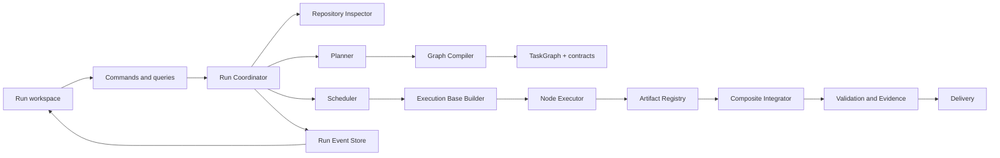

# Arquitectura objetivo

> Esta vista conecta el diseño conceptual con los límites de código. No afirma
> que el monorepo actual ya respete todos estos límites.

## Objetivo arquitectónico

ManyHands transforma una intención en una entrega de software mediante un ciclo
auditable: comprender el repositorio, compilar un grafo ejecutable, construir
bases aisladas, ejecutar intentos, integrar artefactos, validar el candidato
exacto y entregarlo.

## Capas

### Producto

La web envía comandos y proyecta eventos. No decide readiness, adopción de
intentos, invalidación, integración ni verdad terminal. El cliente usa un reducer
puro y selectores.

### Dominio

Define `TaskGraph`, contratos, intentos, artefactos, decisiones, eventos y
outcomes. No importa Next.js, React Flow, LangGraph, git ni procesos CLI.

### Aplicación

El `RunCoordinator` implementa casos de uso y políticas: planning, aprobación,
scheduling, ejecución, recuperación, integración, validación y entrega. Orquesta
puertos; no contiene adaptadores concretos.

### Infraestructura

Git, worktrees, filesystem, procesos, executors, persistencia y streaming son
adaptadores reemplazables. Deben preservar leases, fencing, idempotencia y
eventos de dominio.

## Flujo de datos

1. El usuario crea un run con `goal` y `RunTargetContext` inmutable.
2. `RepositoryInspector` produce un snapshot estructural y un baseline de
   validación.
3. `Planner` produce un `WorkBreakdown`; `GraphCompiler` lo convierte en un
   `TaskGraph` ejecutable y versionado.
4. Los críticos validan el plan. La aprobación fija `approvedGraphRevision`.
5. El scheduler selecciona nodos ready según artefactos, contratos, recursos,
   riesgo y presupuesto.
6. `ExecutionBaseBuilder` materializa la entrada exacta de cada intento.
7. `NodeExecutor` invoca un `AgentExecutor`, inspecciona el diff, aplica scope y
   prepara un commit candidato.
8. La validación decide si el intento puede adoptarse. `ArtifactRegistry`
   registra outputs y evidencia.
9. Los composites integran bottom-up. Cada resultado vuelve a validarse contra
   el contrato del padre.
10. La raíz produce un candidato final; se valida el commit exacto y luego se
    entrega.

## Propiedad de la información

| Información | Dueño | Derivaciones permitidas |
|---|---|---|
| Objetivo y target del run | Run record inmutable | resumen de UI |
| Grafo y contratos aprobados | Graph revision | children, readiness, blast radius |
| Historia dinámica | Run event log | snapshot, estado de UI |
| Cambios de un intento | Git diff del worktree | patch, commit, scope report |
| Artefactos adoptados | Artifact registry | execution bases, integration manifest |
| Evidencia | Evidence matrix | result summary, delivery eligibility |
| Logs y trazas | Trace store | diagnóstico bajo demanda |

## Mapeo inicial al monorepo

El primer plan de transición debe preferir límites internos antes que crear
paquetes nuevos sin necesidad.

| Límite objetivo | Punto de partida actual | Dirección |
|---|---|---|
| TaskGraph | `packages/task-graph` | reemplazar dependencia genérica por relaciones tipadas |
| Contracts | `packages/contracts` | incorporar scope, artifacts y validation obligations |
| Planner + Graph Compiler | `packages/decomposer` | separar salida semántica de compilación ejecutable |
| Run Coordinator | `packages/orchestrator-graph` + hosts web | crear `@manyhands/run-coordinator` como único paquete nuevo de dominio/aplicación y dejar LangGraph como adapter |
| Scheduler | `packages/scheduler` + `conflict-risk` | readiness por artefactos y constraints |
| Attempts, git and validation | `packages/execution-core` | dividir por módulos cohesivos, no necesariamente paquetes |
| Event store and snapshots | `packages/run-store` | consolidar eventos de dominio y proyecciones durables |
| Diagnostics | `packages/trace-store` | separar telemetría de lifecycle |
| Repository model | `packages/repository-index` | ampliar grounding y freshness |
| Product projection | `apps/web` | una ruta de run centrada en grafo/evidencia |

`@manyhands/core` continúa como compatibilidad temporal y no recibe conceptos
nuevos.

La secuencia, los adaptadores temporales y los gates para materializar este mapa
están definidos en el [plan incremental de transición](../plans/2026-07-17-target-architecture-transition.md).

## Límites que deben poder probarse

- El dominio se prueba sin filesystem, red, UI ni CLIs.
- El coordinator se prueba con puertos fake y un event store determinista.
- Los adaptadores git/proceso se prueban con repositorios temporales reales.
- El reducer de UI reproduce exactamente los mismos eventos que el backend.
- Un candidato final se puede reconstruir desde manifests y commits registrados.
- Un takeover con fencing viejo no puede persistir eventos ni resultados.

## Riesgos de la transición

- Confundir eventos actuales de telemetría con eventos de dominio.
- Migrar estados persistidos sin estrategia de compatibilidad.
- Introducir nuevos tipos de relación manteniendo shortcuts duplicados.
- Adoptar artefactos producidos contra inputs obsoletos.
- Cambiar UI antes de que el backend pueda sostener sus promesas.
- Repartir responsabilidades en demasiados paquetes antes de estabilizar los
  contratos.

La transición deberá resolver estos riesgos por slices verticales verificables,
no mediante una reescritura total.
