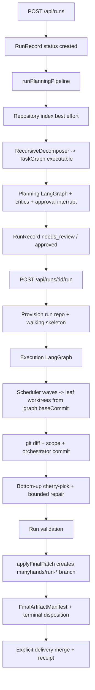
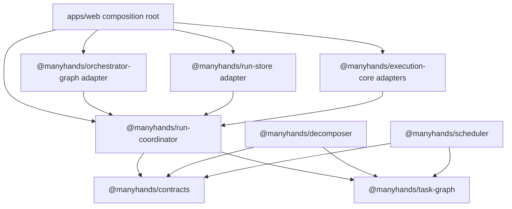
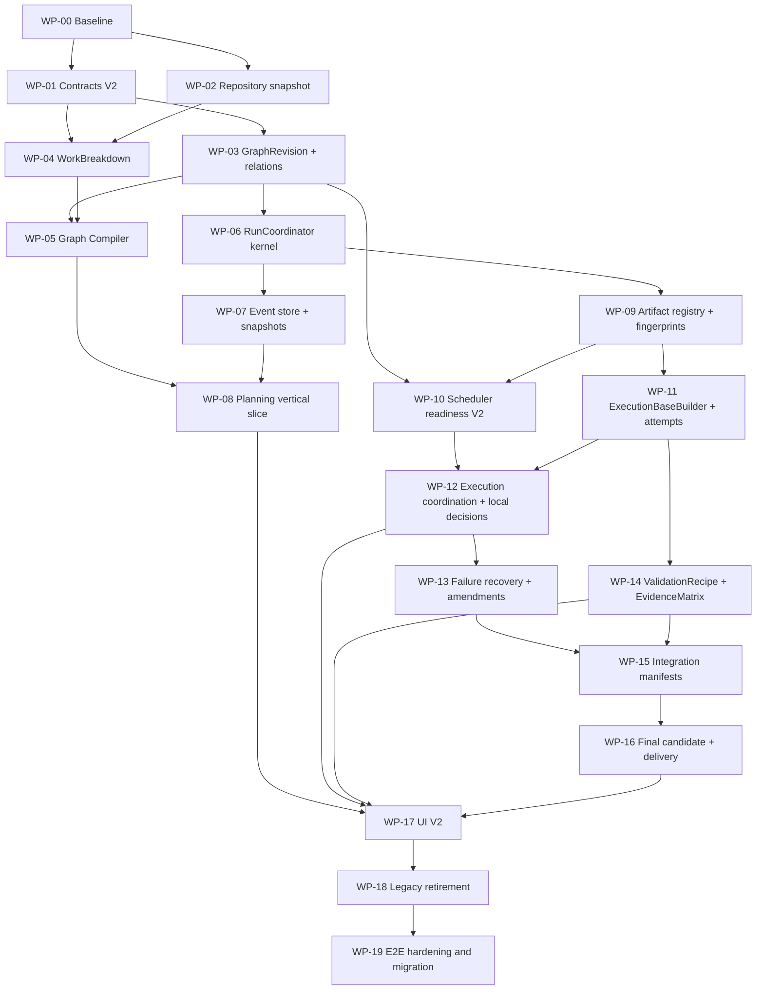

# Target Architecture Transition Implementation Plan

> **For Claude:** REQUIRED SUB-SKILL: Use superpowers:executing-plans to implement this plan task-by-task.

**Goal:** Transformar la implementación actual de ManyHands en la arquitectura objetivo definida en `docs/DECISIONS.md`, conservando las garantías operativas que ya funcionan y entregando slices verticales verificables en cada etapa.

**Architecture:** La transición usa un strangler compatible orientado por eventos. Los contratos y relaciones V2 se introducen junto a adaptadores de lectura para registros V1; un `RunCoordinator` independiente de frameworks pasa a ser dueño del lifecycle y de los eventos; los hosts actuales se migran comando por comando; finalmente se eliminan el estado duplicado, las dependencias genéricas y las superficies legacy. No se hará una reescritura big bang ni una migración puramente paquete por paquete sin un flujo de producto funcional.

**Tech Stack:** TypeScript, Zod, pnpm workspaces, Vitest, Next.js, LangGraph como adapter de control, Git worktrees, JSON/JSONL durable stores, React y React Flow.

---

## 1. Cómo usar este plan

Este documento es el contrato de implementación. Cada `WP-*` es un work packet acotado que un agente puede ejecutar en su propio worktree. El manual complementario [`2026-07-17-multi-agent-orchestration.md`](2026-07-17-multi-agent-orchestration.md) explica cómo asignarlos, integrarlos y verificarlos.

Reglas de ejecución:

1. Leer antes de cambiar: `docs/DECISIONS.md`, el documento de `docs/system/` aplicable y este plan.
2. Trabajar desde el SHA de integración indicado por el orquestador, nunca desde una copia desactualizada.
3. Empezar cada cambio de comportamiento con un test que falle por la razón esperada.
4. No mezclar dos work packets en una rama.
5. No borrar compatibilidad V1 hasta `WP-18`.
6. No declarar un slice completo si la ruta web todavía depende de una escritura paralela no reconciliada.
7. Un agente de desarrollo puede crear commits en su rama. La regla “los agentes no commitean” se refiere a los agentes ejecutados por el producto ManyHands dentro de un run, no a este proceso de desarrollo.

## 2. Definición global de terminado

La migración está terminada cuando se cumplen simultáneamente estas condiciones:

- Un run nuevo se puede crear, planificar, aprobar, ejecutar, integrar, validar y entregar usando únicamente los tipos y comandos V2.
- El lifecycle persistido usa los estados objetivo y separa fase, execution outcome, artifact outcome y delivery outcome.
- El event log de dominio es la historia canónica; snapshots y UI se pueden reconstruir desde él.
- El grafo no persiste una relación genérica `dependency` ni el shortcut duplicado `node.dependencies`.
- Readiness se explica mediante artefactos, contratos, decisiones, recursos y presupuesto.
- Todo resultado adoptado coincide exactamente con su `InputFingerprint`.
- Un nodo solo recibe el base commit, el baseline de contratos y los artefactos que requiere.
- Cada criterio del resultado final aparece en una `EvidenceMatrix` sobre el candidato exacto.
- La entrega sigue `prepare -> validate exact candidate -> approve -> publish -> receipt`.
- Una decisión local no pausa trabajo independiente.
- La ruta principal muestra un único grafo con progressive disclosure; evidencia y entrega pasan al centro en `result_ready`.
- No hay recentrado del canvas provocado por eventos.
- `@manyhands/core`, el bus efímero legacy y las proyecciones V1 dejan de participar en la ruta productiva.
- Los registros V1 soportados se migran o se leen con una política explícita; nunca se reinterpretan silenciosamente.
- Pasan tests, typechecks, builds y los escenarios E2E definidos en `WP-19`.

## 3. Estado actual verificado

Fecha de inspección: 2026-07-17. Las clasificaciones son:

- `keep`: comportamiento correcto que debe preservarse.
- `adapt`: base útil cuya semántica debe evolucionar.
- `replace`: responsabilidad ubicada en el lugar equivocado o con un modelo incompatible.
- `retire`: compatibilidad temporal que debe desaparecer al final.

### 3.1 Flujo productivo actual



Los hechos dinámicos se escriben en dos canales: mutaciones de un `RunRecord` JSON grande y eventos durables destinados principalmente a la proyección web. Además existen un bus efímero legacy y trazas diagnósticas. Por eso el sistema actual necesita backfills y reconciliación entre fuentes que pueden divergir.

### 3.2 Auditoría paquete por paquete

| Área | Estado actual | Veredicto | Destino |
|---|---|---:|---|
| `packages/shared` | IDs, timestamps, helpers y executor registry client-safe | keep/adapt | mantener pequeño; agregar solo primitives de identidad/hash realmente transversales |
| `packages/contracts` | `AgentTaskContract` monolítico e `InterfaceContract`; validación de comandos segura | adapt | cinco contratos versionados, compatibilidad explícita V1/V2 y schemas en boundaries |
| `packages/task-graph` | jerarquía, DAG, topo sort, graft; `graph.dependencies` genérico y shortcut duplicado | replace/adapt | `GraphRevision`, relaciones tipadas y readiness fuera del grafo estructural |
| `packages/repository-index` | índice TypeScript de archivos, símbolos, imports/exports y digest | adapt | `RepositorySnapshot` inmutable con identidad, baseline, capabilities y freshness |
| `packages/decomposer` | descompone recursivamente y produce `TaskGraph`/contratos ejecutables directamente | replace/adapt | separar `WorkBreakdown` semántico de `GraphCompiler`; mantener cache/retry/grounding útiles |
| `packages/conflict-risk` | heurística pairwise basada en paths, símbolos e índice | adapt | producir evidencia de `ConflictConstraint` con incertidumbre; nunca dependencia funcional |
| `packages/scheduler` | readiness por dependencies/status y waves risk-aware; default `maxParallel=6` | replace/adapt | readiness explicable por artifacts/contracts/decisions/resources/budget; límite solo config persistida |
| `packages/execution-core` | worktrees, executors, process supervisor, diff, scope, commits, integración y validación | keep/adapt | conservar adaptadores; agregar bases exactas, fingerprints, evidence y failure policy por causa |
| `packages/orchestrator-graph` | LangGraph posee gran parte del estado y decisiones del flujo | replace/adapt | control-plane adapter que ejecuta comandos del coordinator; checkpoints no gobiernan dominio |
| `packages/run-store` | snapshot schema antiguo y no usado por la ruta productiva | replace | adapter del event store, snapshots, attempts y artifact records V2 |
| `packages/trace-store` | telemetría in-memory tipada | keep/adapt | diagnóstico únicamente; prohibido gobernar lifecycle/readiness |
| `packages/core` | barrel legacy y `MockPlanningFlow` aún usado por web | retire | congelar, migrar imports y eliminar de la ruta productiva |
| `apps/web` server | `RunRecord` agregado gigante, repositorio JSON propio, hosts y adapters mezclados | replace/adapt | composition root, commands/queries, adapters de infraestructura y bridge temporal |
| `apps/web` client | reducer/selectors útiles, pero fases y modos Tasks/Scheduling/Integration/Interfaces legacy | adapt | proyección V2, grafo único, decisiones locales y evidence-first en resultado |

### 3.3 Garantías que no se deben perder

- `RunTargetContext` inmutable.
- Operation lease y repository lease con fencing.
- Cancelación en dos fases y `ProcessSupervisor` verificando `allDead`.
- Wave durable antes del dispatch.
- Worktree por intento y control de scope.
- `git diff HEAD` como única verdad de cambios.
- El orquestador crea commits; el executor no.
- Registro de stdout/stderr solo diagnóstico.
- Integración bottom-up, journal idempotente y un repair semántico acotado.
- Delivery explícito, target confirmado e idempotency receipt.
- Reducer puro y selectors en el cliente.
- Canvas sin recentrado automático después del encuadre inicial.

### 3.4 Incompatibilidades que exigen migración

1. El planner actual no produce `WorkBreakdown`; compila prematuramente un grafo ejecutable.
2. `dependency` solo expresa orden, pero se usa para inferir invalidación y readiness.
3. Todos los leaves parten del mismo `graph.baseCommit`; los artifacts upstream no se materializan selectivamente.
4. El intento no tiene el fingerprint completo ni una regla única de adopción.
5. Una validación leaf “deferred” puede dejar un resultado ejecutado aunque la evidencia no haya pasado.
6. Los gates de LangGraph y el estado `paused` tienden a detener el pipeline completo.
7. `RunRecord`, event log, checkpoint y trace pueden representar estados parcialmente distintos.
8. La entrega construye una rama aplicada antes de completar el flujo objetivo de candidato validado y aprobación.
9. La UI deriva fases legacy y ofrece cuatro modos primarios que ya no pertenecen al producto.

## 4. Arquitectura de transición

Se crea un solo paquete nuevo: `@manyhands/run-coordinator`. Se justifica porque el lifecycle, los comandos, eventos, decisions, attempts, artifacts y puertos no pueden pertenecer a Next.js, LangGraph ni Git. No se crean paquetes separados para cada concepto.



Reglas de dependencia:

- `run-coordinator` solo depende de `shared`, `contracts` y `task-graph`.
- Define puertos; no importa `execution-core`, `run-store`, `orchestrator-graph`, Next.js, Git ni filesystem.
- `apps/web` hace el wiring concreto.
- `orchestrator-graph` puede llamar al coordinator, pero no persistir una semántica paralela.
- `run-store` implementa puertos de persistencia definidos por el coordinator.
- `execution-core` implementa puertos de ejecución/validación/delivery o expone adapters sin invertir la dependencia.

### 4.1 Regla de compatibilidad

Durante `WP-01` a `WP-17`:

- Todo objeto persistido incluye `schemaVersion`.
- Los readers aceptan V1 y V2; los writers nuevos escriben solo V2 desde que el feature flag del slice se activa.
- `LegacyRunProjection` puede proyectar eventos V2 a los campos mínimos del `RunRecord` mientras existan rutas V1.
- No hay dual-write no atómico: el comando persiste eventos V2 y luego actualiza la proyección bajo el mismo lease/fencing; una falla queda reconciliable desde eventos.
- Los datos V1 nunca se convierten implícitamente en evidencia V2. Lo desconocido queda `uncovered`, `legacy_unknown` o requiere revalidación.

### 4.2 Feature flags de migración

Usar configuración interna persistida por run, no environment flags volátiles:

```ts
interface RunArchitectureVersion {
  planning: "v1" | "v2";
  coordination: "v1" | "v2";
  execution: "v1" | "v2";
  evidence: "v1" | "v2";
  delivery: "v1" | "v2";
  uiProjection: "v1" | "v2";
}
```

Los runs nuevos avanzan por slice. Un run no cambia de versión de arquitectura a mitad de una operación activa. El objetivo de `WP-18` es retirar todos los valores V1.

## 5. Grafo de work packets



## 6. Work packets

### WP-00 — Congelar baseline y agregar characterization tests

**Objetivo:** demostrar el comportamiento actual que debe preservarse y aislar los cambios de documentación/fixtures antes de abrir ramas paralelas.

**Owner paths:**

- `tests/architecture-baseline.test.ts` (nuevo)
- `tests/run-current-flow-characterization.test.ts` (nuevo)
- `tests/fixtures/current-run-record-v1.json` (nuevo, sanitizado y mínimo)
- `docs/plans/target-architecture-progress.md` (nuevo ledger operativo)

**No tocar:** producción.

**Pasos TDD:**

1. Escribir un test que cargue un registro V1 representativo y verifique: target inmutable, status actual, planning artifact, lease y final artifact cuando correspondan.
2. Escribir un test de límites que falle si un package importa desde `apps/web` o si se agregan nuevos imports desde `@manyhands/core`.
3. Escribir un test de caracterización del flujo actual `create -> planning -> approve -> execute -> final artifact`, usando fakes en los boundaries existentes.
4. Ejecutar:

   ```bash
   pnpm test -- tests/architecture-baseline.test.ts tests/run-current-flow-characterization.test.ts
   ```

   Resultado esperado: PASS sin cambiar producción.

5. Crear el ledger con columnas: packet, branch, base SHA, owner, status, tests, commit, notes.

**Aceptación:** existe una base reproducible para detectar pérdida de garantías y el árbol de integración está limpio antes de repartir trabajo.

**Commit sugerido:** `test: capture pre-migration run architecture`

---

### WP-01 — Contratos V2 versionados

**Objetivo:** separar obligaciones que hoy están mezcladas en `AgentTaskContract`.

**Owner paths:**

- `packages/contracts/src/task-contract.ts` (nuevo)
- `packages/contracts/src/scope-contract.ts` (nuevo)
- `packages/contracts/src/seam-contract.ts` (nuevo)
- `packages/contracts/src/artifact-contract.ts` (nuevo)
- `packages/contracts/src/validation-contract.ts` (nuevo)
- `packages/contracts/src/legacy-adapter.ts` (nuevo)
- `packages/contracts/src/index.ts`
- `tests/contracts-v2.test.ts` (nuevo)
- `tests/contracts-v1-compatibility.test.ts` (nuevo)

**Modelo mínimo:**

```ts
type ContractRevision = string;

interface TaskContract {
  schemaVersion: 2;
  id: string;
  revision: ContractRevision;
  nodeId: string;
  goal: string;
  acceptanceCriteria: AcceptanceCriterion[];
}

interface ScopeContract {
  schemaVersion: 2;
  id: string;
  revision: ContractRevision;
  allowedPaths: string[];
  forbiddenPaths: string[];
  coordinationPaths: string[];
}

interface SeamContract {
  schemaVersion: 2;
  id: string;
  revision: ContractRevision;
  kind: "api" | "type" | "event" | "data" | "ui" | "command";
  specification: string;
  producerNodeId: string;
  consumerNodeIds: string[];
}

interface ArtifactContract {
  schemaVersion: 2;
  id: string;
  revision: ContractRevision;
  producerNodeId: string;
  artifactType: string;
  materialization: "commit" | "patch" | "files" | "manifest" | "logical";
}

interface ValidationContract {
  schemaVersion: 2;
  id: string;
  revision: ContractRevision;
  obligations: ValidationObligation[];
}
```

**Pasos TDD:**

1. Tests fallidos para parseo válido, campos obligatorios, revisiones y rechazo de estados imposibles.
2. Implementar schemas Zod y tipos inferidos; no duplicar interfaces manuales cuando Zod pueda ser la fuente.
3. Test fallido que convierta un `AgentTaskContract` V1 a un bundle V2, marcando inferencias con `provenance: "legacy_inferred"`.
4. Implementar adapter unidireccional V1 -> V2. No implementar V2 -> V1 salvo una proyección de compatibilidad explícitamente loss-aware.
5. Mantener exports V1 deprecados para consumidores actuales.
6. Ejecutar:

   ```bash
   pnpm test -- tests/contracts-v2.test.ts tests/contracts-v1-compatibility.test.ts tests/contract-boundary-validation.test.ts tests/contracts-interface-contract.test.ts
   pnpm --filter @manyhands/contracts typecheck
   ```

**Aceptación:** los cinco contratos tienen identidad/revisión, validación de boundary y compatibilidad explícita; no cambia aún la ruta productiva.

**Commit sugerido:** `feat(contracts): add versioned execution contracts`

---

### WP-02 — RepositorySnapshot inmutable y baseline

**Objetivo:** convertir el índice best-effort actual en una entrada identificable del planning sin hacer del índice una dependencia silenciosa.

**Owner paths:**

- `packages/repository-index/src/snapshot.ts` (nuevo)
- `packages/repository-index/src/capabilities.ts` (nuevo)
- `packages/repository-index/src/index.ts`
- `tests/repository-snapshot.test.ts` (nuevo)
- `tests/repository-index.test.ts` (nuevo si no existe cobertura directa)

**Contenido del snapshot:** target fingerprint, base commit, digest del índice, archivos/símbolos/imports, package manager, scripts disponibles, stack inferido con confidence, baseline commands descubiertos y diagnostics.

**Pasos TDD:**

1. Test fallido: dos inspecciones del mismo commit y contenido producen el mismo `snapshotId`.
2. Test fallido: cambio de base commit o contenido cambia el snapshot.
3. Test fallido: un repo sin TypeScript sigue produciendo snapshot parcial explícito, no un “ok” vacío.
4. Implementar `RepositorySnapshotBuilder` sobre el indexador actual.
5. Modelar `inspectionDisposition: complete | partial | unavailable`; el caller decide si pregunta, continúa con riesgo o falla.
6. Ejecutar:

   ```bash
   pnpm test -- tests/repository-snapshot.test.ts tests/repository-aware-scheduling.test.ts
   pnpm --filter @manyhands/repository-index typecheck
   ```

**Aceptación:** planning puede referenciar una identidad inmutable y sabe qué información falta.

**Commit sugerido:** `feat(repository-index): add immutable repository snapshots`

---

### WP-03 — GraphRevision y relaciones tipadas

**Objetivo:** introducir el modelo estructural V2 sin borrar aún `TaskGraph` V1.

**Owner paths:**

- `packages/task-graph/src/graph-revision.ts` (nuevo)
- `packages/task-graph/src/relations.ts` (nuevo)
- `packages/task-graph/src/validate-v2.ts` (nuevo)
- `packages/task-graph/src/legacy-adapter.ts` (nuevo)
- `packages/task-graph/src/index.ts`
- `tests/task-graph-v2.test.ts` (nuevo)
- `tests/task-graph-v1-compatibility.test.ts` (nuevo)

**Modelo mínimo:**

```ts
interface GraphRevision {
  schemaVersion: 2;
  graphId: string;
  revision: number;
  rootId: string;
  baseCommit: string;
  repositorySnapshotId: string;
  nodes: Record<string, TaskNodeV2>;
  artifactRequirements: ArtifactRequirement[];
  seamBindings: SeamBinding[];
  conflictConstraints: ConflictConstraint[];
  createdAt: string;
}
```

**Invariantes:**

- `parentId` representa solo jerarquía/ownership.
- `ArtifactRequirement` apunta a un artifact contract y determina materialización/readiness.
- `SeamBinding` exige revisiones compatibles pero no impone orden.
- `ConflictConstraint` afecta scheduling, no validez funcional.
- No existe `node.dependencies` en V2.
- Toda mutación semántica crea `revision + 1`; no modifica una revisión aprobada.

**Pasos TDD:**

1. Tests fallidos para ciclo de jerarquía, root inválido, requisito con producer inexistente, seam sin contrato y constraint con nodos inexistentes.
2. Tests que demuestren que un seam no cambia el topological readiness por sí solo.
3. Implementar validación y queries estructurales puras.
4. Implementar adapter V1 -> V2 que convierta dependencies en artifact requirements solo cuando exista evidencia contractual; el resto queda `legacyOrderingConstraint` deprecado y obliga replan antes de ejecutar V2.
5. Mantener `graftSubtree` V1; agregar `reviseGraph` V2 basado en operations inmutables.
6. Ejecutar:

   ```bash
   pnpm test -- tests/task-graph-v2.test.ts tests/task-graph-v1-compatibility.test.ts tests/task-graph-graft.test.ts
   pnpm --filter @manyhands/task-graph typecheck
   ```

**Aceptación:** hay un grafo V2 válido y versionado; ninguna relación necesita sincronización manual entre dos representaciones.

**Commit sugerido:** `feat(task-graph): add typed graph revisions`

---

### WP-04 — WorkBreakdown semántico

**Objetivo:** impedir que el LLM materialice directamente detalles ejecutables que debe decidir el compiler.

**Owner paths:**

- `packages/decomposer/src/planner/work-breakdown.ts` (nuevo)
- `packages/decomposer/src/planner/schema.ts` (nuevo)
- `packages/decomposer/src/planner/prompt.ts` (nuevo o extracción del prompt actual)
- `packages/decomposer/src/llm/recursive/**` solo para adapter/compatibilidad
- `tests/decomposer-work-breakdown.test.ts` (nuevo)
- `tests/decomposer-recursive-prompt.test.ts`

**WorkBreakdown debe expresar:** objetivo, composites/leaves semánticos, criterio del corte, acceptance intent, seams candidatos, artifacts candidatos, incertidumbres y preguntas. No contiene worktree paths, commands exactos, dependency edges genéricas ni perfiles de executor.

**Pasos TDD:**

1. Test fallido del schema para un breakdown híbrido: un leaf vertical puede cruzar UI/API/tests.
2. Test que rechace profundidad/hijos impuestos como plantilla fija.
3. Test que preserve pregunta humana relevante y repository evidence utilizada.
4. Implementar planner adapter reutilizando cache, bounded retry y normalización actuales.
5. Mantener el decomposer V1 detrás del architecture version; no agregar fallback silencioso.
6. Ejecutar:

   ```bash
   pnpm test -- tests/decomposer-work-breakdown.test.ts tests/decomposer-recursive-prompt.test.ts tests/decomposer-policy.test.ts tests/decomposer-llm-guards.test.ts
   pnpm --filter @manyhands/decomposer typecheck
   ```

**Aceptación:** el planner produce intención semántica validada y evidencia de sus decisiones, no un plan ejecutable final.

**Commit sugerido:** `feat(decomposer): separate semantic work breakdown`

---

### WP-05 — Graph Compiler y critics V2

**Objetivo:** compilar determinísticamente `WorkBreakdown + RepositorySnapshot` en `GraphRevision + contract bundle`.

**Owner paths:**

- `packages/decomposer/src/compiler/graph-compiler.ts` (nuevo)
- `packages/decomposer/src/compiler/contract-compiler.ts` (nuevo)
- `packages/decomposer/src/compiler/validation-obligations.ts` (nuevo)
- `packages/decomposer/src/critics/**` (crear o adaptar)
- `tests/graph-compiler.test.ts` (nuevo)
- `tests/graph-critics-v2.test.ts` (nuevo)

**Critics mínimos:** completitud, atomicidad, contract compatibility, DAG validity, scope isolation, artifact coverage, risk uncertainty y validation coverage.

**Pasos TDD:**

1. Golden test fallido: compilar el mismo input produce bytes semánticamente equivalentes salvo IDs/timestamps inyectados.
2. Test que genere tres siblings con seams sin convertirlos en dependencies.
3. Test que genere `ArtifactRequirement` cuando un consumidor necesita archivos/materialización del producer.
4. Test que rechace una hoja sin validation obligation o con output no consumible.
5. Implementar compiler como función pura con generadores de IDs/clock inyectados.
6. Implementar critics como resultados estructurados, no strings opacos.
7. Ejecutar:

   ```bash
   pnpm test -- tests/graph-compiler.test.ts tests/graph-critics-v2.test.ts tests/decomposer-recursive-planning-flow.test.ts
   pnpm --filter @manyhands/decomposer typecheck
   ```

**Aceptación:** toda relación/contrato ejecutable se puede rastrear a una decisión semántica o evidence del repo.

**Commit sugerido:** `feat(decomposer): compile executable graph revisions`

---

### WP-06 — Kernel framework-independent de RunCoordinator

**Objetivo:** crear el único límite nuevo del monorepo y trasladar allí la semántica del run.

**Owner paths:**

- `packages/run-coordinator/package.json` (nuevo)
- `packages/run-coordinator/tsconfig.json` (nuevo)
- `packages/run-coordinator/src/domain/lifecycle.ts` (nuevo)
- `packages/run-coordinator/src/domain/events.ts` (nuevo)
- `packages/run-coordinator/src/domain/decisions.ts` (nuevo)
- `packages/run-coordinator/src/domain/outcomes.ts` (nuevo)
- `packages/run-coordinator/src/commands.ts` (nuevo)
- `packages/run-coordinator/src/ports.ts` (nuevo)
- `packages/run-coordinator/src/reducer.ts` (nuevo)
- `packages/run-coordinator/src/coordinator.ts` (nuevo)
- `packages/run-coordinator/src/index.ts` (nuevo)
- `vitest.config.ts`
- `tsconfig.json` si los project references lo requieren
- `pnpm-lock.yaml` solo si pnpm lo modifica
- `tests/run-coordinator-lifecycle.test.ts` (nuevo)
- `tests/run-coordinator-boundaries.test.ts` (nuevo)

**Lifecycle objetivo:** `planning`, `needs_approval`, `running`, `waiting_for_input`, `paused`, `cancelling`, `interrupted`, `result_ready`, `delivering`, `completed`, `failed`.

**Pasos TDD:**

1. Test fallido de todas las transiciones legales e ilegales.
2. Test que pruebe que `completed` requiere delivery receipt y final evidence elegible.
3. Test que pruebe que `waiting_for_input` solo deriva cuando no hay trabajo independiente ready.
4. Test de boundary que prohíba imports de LangGraph, React, Next.js, Git, Node filesystem y `execution-core` dentro del paquete.
5. Implementar eventos de dominio discriminados y un reducer puro `foldRun(events)`.
6. Implementar commands que produzcan eventos mediante puertos; no ejecutar efectos inline sin receipt.
7. Agregar paquete al workspace/aliases y ejecutar:

   ```bash
   pnpm test -- tests/run-coordinator-lifecycle.test.ts tests/run-coordinator-boundaries.test.ts
   pnpm --filter @manyhands/run-coordinator typecheck
   pnpm build:packages
   ```

**Aceptación:** el estado completo del run se reconstruye desde eventos sin importar frameworks o infraestructura.

**Commit sugerido:** `feat(run-coordinator): add framework-independent run kernel`

---

### WP-07 — Event store, snapshots y fencing V2

**Objetivo:** convertir `packages/run-store` en adapter productivo del event log y eliminar la necesidad conceptual de dos verdades.

**Owner paths:**

- `packages/run-store/src/event-store.ts` (nuevo)
- `packages/run-store/src/snapshot-store.ts` (nuevo)
- `packages/run-store/src/migrations.ts` (nuevo)
- `packages/run-store/src/jsonl-event-store.ts` (nuevo)
- `packages/run-store/src/index.ts`
- `packages/run-store/package.json`
- `tests/run-store-event-source.test.ts` (nuevo)
- `tests/run-store-fencing.test.ts` (nuevo)
- `tests/run-store-snapshot-rebuild.test.ts` (nuevo)

**Pasos TDD:**

1. Test fallido para append CAS por `expectedSequence` y fencing token.
2. Test: un lease stale no puede append, snapshotear ni registrar receipt.
3. Test: snapshot corrupto o atrasado se descarta y reconstruye desde eventos.
4. Test: línea JSONL parcial final se recupera; corrupción intermedia falla explícitamente.
5. Implementar append atómico e idempotente por `eventId` aprovechando las garantías ya probadas en `apps/web/src/lib/server/runs/run-model-event-log.ts`.
6. Implementar `LegacyRunRecordImporter` como importación auditada, no como lectura silenciosa de domain events ficticios.
7. Reducir dependencies de `run-store`: debe depender de `run-coordinator` y `shared`, no del decomposer/scheduler/conflict-risk.
8. Ejecutar:

   ```bash
   pnpm test -- tests/run-store-event-source.test.ts tests/run-store-fencing.test.ts tests/run-store-snapshot-rebuild.test.ts tests/durable-run-event-log.test.ts tests/durable-run-event-log-windows-lock.test.ts
   pnpm --filter @manyhands/run-store typecheck
   ```

**Aceptación:** eventos son canónicos; snapshot es cache descartable y toda escritura mutable respeta fencing.

**Commit sugerido:** `feat(run-store): persist canonical run events`

---

### WP-08 — Slice vertical de planning V2

**Objetivo:** hacer que un run nuevo llegue de intake a `needs_approval` mediante inspector, planner, compiler, critics, events y snapshot V2.

**Owner paths:**

- `apps/web/src/lib/server/runs/v2/planning-host.ts` (nuevo)
- `apps/web/src/lib/server/runs/v2/run-coordinator-host.ts` (nuevo)
- `apps/web/src/lib/server/runs/v2/legacy-run-projection.ts` (nuevo)
- `apps/web/src/lib/server/runs/schema.ts` solo para architecture version/projection fields
- `apps/web/src/app/api/runs/route.ts`
- rutas de aprobación aplicables bajo `apps/web/src/app/api/runs/[id]/`
- `packages/orchestrator-graph/src/graphs/planning-graph.ts` solo para convertirlo en adapter
- `tests/planning-v2-pipeline.test.ts` (nuevo)
- `tests/planning-v2-approval.test.ts` (nuevo)

**Pasos TDD:**

1. Test fallido E2E de servidor: crear run V2 persiste `run.created`, `repository.inspected`, `planning.completed`, `graph.compiled`, critic events y `decision.raised` de aprobación.
2. Test que una falla LLM emita `planning.failed` y deje estado `failed`, sin fallback de calidad diferente.
3. Test CAS: editar el plan incrementa graph revision, invalida aprobación previa y crea decision revision-specific.
4. Implementar host V2 bajo los leases actuales.
5. Mantener la API response compatible proyectando V2 al DTO existente; no dual-write de semántica.
6. Reducir Planning LangGraph a pasos que llaman commands/ports del coordinator y checkpoint de cursor.
7. Ejecutar:

   ```bash
   pnpm test -- tests/planning-v2-pipeline.test.ts tests/planning-v2-approval.test.ts tests/planning-invocation-service.test.ts tests/run-start-cas.test.ts
   pnpm --filter @manyhands/orchestrator-graph typecheck
   pnpm --filter @manyhands/web exec tsc --noEmit
   ```

**Aceptación:** planning V2 es productivo detrás de `architectureVersion.planning=v2`, auditable y aprobable.

**Commit sugerido:** `feat(web): route new runs through planning v2`

---

### WP-09 — Artifact registry e InputFingerprint

**Objetivo:** establecer identidad, freshness y adopción exacta antes de cambiar ejecución.

**Owner paths:**

- `packages/run-coordinator/src/domain/artifacts.ts`
- `packages/run-coordinator/src/domain/attempts.ts`
- `packages/run-coordinator/src/domain/fingerprint.ts`
- `packages/run-coordinator/src/domain/events.ts`
- `packages/run-coordinator/src/ports.ts`
- `packages/run-store/src/artifact-store.ts` (nuevo)
- `packages/run-store/src/attempt-store.ts` (nuevo)
- `tests/input-fingerprint.test.ts` (nuevo)
- `tests/artifact-registry.test.ts` (nuevo)
- `tests/attempt-adoption.test.ts` (nuevo)

**Fingerprint mínimo:** graph revision, todas las contract revisions del nodo, base commit, artifact IDs+digests consumidos, repository snapshot/context digest, executor profile revision y validation contract revision.

**Pasos TDD:**

1. Tests fallidos: cambiar cualquiera de las entradas cambia el fingerprint; reordenar maps/sets no lo cambia.
2. Test: attempt terminado con fingerprint viejo emite `attempt.stale`, nunca `artifact.adopted`.
3. Test: retry crea un attempt nuevo y conserva evidencia anterior.
4. Test: artifact adoptado es inmutable, tiene digest, producer attempt y contract revision.
5. Implementar canonical serialization y hash estable.
6. Implementar stores append-only e idempotentes.
7. Ejecutar:

   ```bash
   pnpm test -- tests/input-fingerprint.test.ts tests/artifact-registry.test.ts tests/attempt-adoption.test.ts tests/task-attempt-journal.test.ts
   pnpm --filter @manyhands/run-coordinator typecheck
   pnpm --filter @manyhands/run-store typecheck
   ```

**Aceptación:** existe una sola función de elegibilidad para adoptar un resultado y cubre todas las entradas relevantes.

**Commit sugerido:** `feat(run-coordinator): add immutable attempts and artifacts`

---

### WP-10 — Scheduler readiness V2

**Objetivo:** reemplazar readiness basado en dependencies por razones explícitas.

**Owner paths:**

- `packages/scheduler/src/readiness-v2.ts` (nuevo)
- `packages/scheduler/src/wave-selector-v2.ts` (nuevo)
- `packages/scheduler/src/types-v2.ts` (nuevo)
- `packages/scheduler/src/index.ts`
- `packages/conflict-risk/src/constraint-evidence.ts` (nuevo)
- `packages/conflict-risk/src/index.ts`
- `tests/scheduler-readiness-v2.test.ts` (nuevo)
- `tests/conflict-constraint-evidence.test.ts` (nuevo)

**ReadinessReason mínimo:** missing artifact, stale contract, unresolved decision, unmaterializable base, active resource constraint, budget exhausted, executor unavailable, already adopted.

**Pasos TDD:**

1. Test que un seam compatible permita siblings en la misma wave.
2. Test que un artifact requirement bloquee solo al consumer hasta artifact adoptado.
3. Test que una decision bloquee solo su affected set.
4. Test que riesgo desconocido no se degrade a low.
5. Test que `maxParallel` provenga del effective config persistido; ausencia se normaliza en intake, no dentro del scheduler.
6. Implementar `explainReadiness` puro y luego wave selector.
7. Adaptar conflict-risk a `ConflictConstraint` con signals/confidence/expiry.
8. Ejecutar:

   ```bash
   pnpm test -- tests/scheduler-readiness-v2.test.ts tests/conflict-constraint-evidence.test.ts tests/scheduler-scope-aware-wave.test.ts tests/repository-aware-scheduling.test.ts
   pnpm --filter @manyhands/scheduler typecheck
   pnpm --filter @manyhands/conflict-risk typecheck
   ```

**Aceptación:** cada nodo no-ready tiene razones consumibles por coordinator y UI; no depende de una arista genérica.

**Commit sugerido:** `feat(scheduler): explain artifact-aware readiness`

---

### WP-11 — ExecutionBaseBuilder e intentos exactos

**Objetivo:** construir worktrees con solo las entradas declaradas y registrar cómo se compusieron.

**Owner paths:**

- `packages/execution-core/src/base/execution-base-builder.ts` (nuevo)
- `packages/execution-core/src/base/execution-base-manifest.ts` (nuevo)
- `packages/execution-core/src/base/artifact-materializer.ts` (nuevo)
- `packages/execution-core/src/run/executor.ts`
- `packages/execution-core/src/types.ts`
- `apps/web/src/lib/server/runs/task-attempt-journal.ts` solo como adapter temporal
- `tests/execution-base-builder.test.ts` (nuevo)
- `tests/execution-attempt-fingerprint.test.ts` (nuevo)

**Pasos TDD:**

1. Crear repositorio temporal con dos artifacts siblings.
2. Test fallido: el consumer recibe base + artifact requerido A, pero no B.
3. Test: conflicto al materializar base falla antes de invocar executor y produce evidence estructurada.
4. Test: manifest registra base sha, contract baseline, artifact digests, resulting sha y fingerprint.
5. Implementar builder usando worktree/git adapters existentes; no aplicar commits transitivos implícitos.
6. Reservar attempt antes de invocación y validar fingerprint al finalizar.
7. Mantener el `GroundingAgent` solo como productor explícito de un artifact baseline si sigue siendo necesario; eliminar su carácter de base global invisible.
8. Ejecutar:

   ```bash
   pnpm test -- tests/execution-base-builder.test.ts tests/execution-attempt-fingerprint.test.ts tests/execution-core-worktree.test.ts tests/execution-core-recorder.test.ts tests/execution-core-scope.test.ts
   pnpm --filter @manyhands/execution-core typecheck
   ```

**Aceptación:** el contexto físico de cada attempt coincide con su manifest/fingerprint y es reproducible.

**Commit sugerido:** `feat(execution-core): build exact execution bases`

---

### WP-12 — Coordinación de ejecución y decisiones locales

**Objetivo:** ejecutar waves V2 sin convertir cada intervención humana en pausa global.

**Owner paths:**

- `packages/run-coordinator/src/execution.ts`
- `packages/run-coordinator/src/domain/decisions.ts`
- `packages/run-coordinator/src/domain/events.ts`
- `packages/orchestrator-graph/src/graphs/execution-graph.ts`
- `packages/orchestrator-graph/src/state.ts`
- `apps/web/src/lib/server/runs/execution-host.ts`
- `tests/run-coordinator-execution.test.ts` (nuevo)
- `tests/local-decision-readiness.test.ts` (nuevo)
- `packages/orchestrator-graph/src/graphs/execution-graph.test.ts`

**Pasos TDD:**

1. Test fallido: node A levanta decision, B independiente se despacha y el run sigue `running`.
2. Test: si todos los pendientes están bloqueados por decisiones, deriva `waiting_for_input`.
3. Test: resolver decision emite `decision.resolved`, recalcula readiness y no muta status de nodos imperativamente.
4. Test: wave event se persiste antes de cualquier executor dispatch.
5. Implementar loop command-driven en coordinator.
6. Convertir interrupts de LangGraph en suspensión de branch/cursor, no lifecycle global; el coordinator decide el estado de run.
7. Ejecutar:

   ```bash
   pnpm test -- tests/run-coordinator-execution.test.ts tests/local-decision-readiness.test.ts packages/orchestrator-graph/src/graphs/execution-graph.test.ts tests/run-scheduling-audit-events.test.ts
   pnpm --filter @manyhands/run-coordinator typecheck
   pnpm --filter @manyhands/orchestrator-graph typecheck
   ```

**Aceptación:** decisiones son recursos locales con affected nodes y el run solo espera globalmente cuando no queda trabajo independiente.

**Commit sugerido:** `feat(orchestration): keep independent nodes running across decisions`

---

### WP-13 — Failure classifier, recovery policy y amendments V2

**Objetivo:** reemplazar retries/gates genéricos por respuestas según causa e invalidación exacta.

**Owner paths:**

- `packages/run-coordinator/src/domain/failures.ts`
- `packages/run-coordinator/src/recovery-policy.ts`
- `packages/run-coordinator/src/amendments.ts`
- `packages/execution-core/src/run/amendments-engine.ts`
- `apps/web/src/lib/server/runs/replan-service.ts`
- `apps/web/src/lib/server/runs/amendment-approval-service.ts`
- `tests/failure-recovery-policy.test.ts` (nuevo)
- `tests/graph-amendment-v2.test.ts` (nuevo)
- `tests/amendment-fingerprint-invalidation.test.ts` (nuevo)

**Causas mínimas:** transient, environment/auth/executor, code/test, contract/decomposition, undeclared artifact, scope/unexpected commit, integration, shared infrastructure.

**Pasos TDD:**

1. Table-driven test de clasificación -> acción permitida y retry budget.
2. Test: dependency/artifact descubierto genera proposal con evidence y nueva graph revision.
3. Test: solo attempts cuyo fingerprint cambia quedan stale; ancestry por sí sola no invalida leaf independiente.
4. Test: scope violation siempre descarta candidate.
5. Implementar amendments como operations sobre `GraphRevision`, nunca mutación in-place.
6. Adaptar replan actual para consumir breakdown/compiler V2 y conservar trabajo fresh.
7. Ejecutar:

   ```bash
   pnpm test -- tests/failure-recovery-policy.test.ts tests/graph-amendment-v2.test.ts tests/amendment-fingerprint-invalidation.test.ts tests/execution-core-replan-invalidation.test.ts tests/replan-question-gate.test.ts
   pnpm --filter @manyhands/run-coordinator typecheck
   pnpm --filter @manyhands/execution-core typecheck
   ```

**Aceptación:** cada recovery deja una explicación durable y no descarta trabajo por una closure genérica más amplia de lo necesario.

**Commit sugerido:** `feat(recovery): classify failures and revise graphs precisely`

---

### WP-14 — ValidationRecipe y EvidenceMatrix

**Objetivo:** demostrar criterios sobre el candidate exacto y separar obligación estable de comando compilado.

**Owner paths:**

- `packages/execution-core/src/validation/recipe-compiler.ts` (nuevo)
- `packages/execution-core/src/validation/evidence-matrix.ts` (nuevo)
- `packages/execution-core/src/validation/candidate-validator.ts` (nuevo)
- `packages/execution-core/src/validation/baseline.ts` (nuevo)
- `packages/execution-core/src/validation/test-integrity.ts` (nuevo)
- `packages/run-coordinator/src/domain/evidence.ts`
- `tests/validation-recipe.test.ts` (nuevo)
- `tests/evidence-matrix.test.ts` (nuevo)
- `tests/exact-candidate-validation.test.ts` (nuevo)
- `tests/test-weakening-detection.test.ts` (nuevo)

**Estados por criterio:** `satisfied`, `failed`, `uncovered`, `flaky`, `not_applicable` con justificación/evidence refs.

**Pasos TDD:**

1. Test: compilar recipe usa capabilities reales del snapshot y conserva obligation IDs.
2. Test: exit code 0 sin evidencia vinculada no satisface automáticamente un criterio.
3. Test: recipe se ejecuta en sandbox limpio sobre el exact candidate sha.
4. Test: baseline failure preexistente se distingue de regression nueva.
5. Test: test eliminado/debilitado genera integrity finding.
6. Test: pasa solo tras retry -> `flaky`.
7. Test: criterio sin evidence -> `uncovered` y outcome `unverified`.
8. Implementar negative control cuando la obligación lo solicite y sea materializable.
9. Ejecutar:

   ```bash
   pnpm test -- tests/validation-recipe.test.ts tests/evidence-matrix.test.ts tests/exact-candidate-validation.test.ts tests/test-weakening-detection.test.ts tests/execution-core-validation-runner.test.ts tests/terminal-artifact-disposition.test.ts
   pnpm --filter @manyhands/execution-core typecheck
   pnpm --filter @manyhands/run-coordinator typecheck
   ```

**Aceptación:** success nunca se infiere de executor exit 0 o de un validation “deferred”; cada criterio tiene estado honesto.

**Commit sugerido:** `feat(validation): produce criterion-level evidence`

---

### WP-15 — IntegrationManifest bottom-up

**Objetivo:** integrar artifacts adoptados, no resultados implícitos ni listas de commits sin contrato.

**Owner paths:**

- `packages/execution-core/src/integration/manifest.ts` (nuevo)
- `packages/execution-core/src/integration/agent.ts`
- `packages/execution-core/src/integration/operation-journal.ts`
- `packages/run-coordinator/src/domain/artifacts.ts`
- `packages/run-coordinator/src/integration.ts`
- `tests/integration-manifest.test.ts` (nuevo)
- `tests/integration-contract-validation.test.ts` (nuevo)
- `tests/integration-repair-policy.test.ts` (nuevo)

**Manifest mínimo:** composite/node revision, base manifest, child artifact IDs+digests, seam revisions, operations, repair attempt, candidate sha, parent validation/evidence y output artifacts.

**Pasos TDD:**

1. Test: composite aplica solo artifacts fresh y requeridos.
2. Test: cherry-pick limpio seguido de contract validation fallida no es success.
3. Test: manifest registra artifacts omitidos como error; no existe partial success ambiguo.
4. Test: un repair semántico recibe parent goal, contratos, child diffs/evidence y budget uno; segundo conflicto levanta decision.
5. Conservar operation journal, recovery y repos temporales reales.
6. Ejecutar:

   ```bash
   pnpm test -- tests/integration-manifest.test.ts tests/integration-contract-validation.test.ts tests/integration-repair-policy.test.ts tests/execution-core-integration.test.ts tests/integration-operation-recovery.test.ts tests/integration-real-git.test.ts
   pnpm --filter @manyhands/execution-core typecheck
   ```

**Aceptación:** el artifact de cada composite se reconstruye desde un manifest y pasa su validation contract.

**Commit sugerido:** `feat(integration): integrate adopted artifacts with manifests`

---

### WP-16 — Final candidate y delivery transaccional

**Objetivo:** separar preparación, validación, aprobación y publicación.

**Owner paths:**

- `packages/execution-core/src/delivery/candidate-preparer.ts` (nuevo)
- `packages/execution-core/src/delivery/publisher.ts` (nuevo)
- `packages/run-coordinator/src/delivery.ts`
- `apps/web/src/lib/server/runs/final-apply.ts`
- `apps/web/src/lib/server/runs/final-artifact.ts`
- `apps/web/src/lib/server/runs/delivery.ts`
- `apps/web/src/app/api/runs/[id]/deliver/route.ts`
- `tests/final-candidate.test.ts` (nuevo)
- `tests/delivery-state-machine.test.ts` (nuevo)
- `tests/delivery-operation.test.ts`

**Pasos TDD:**

1. Test: preparar candidate no mueve target branch ni publica resultado.
2. Test: exact candidate se valida antes de `result_ready`.
3. Test: delivery approval fija manifest ID, final SHA, target branch/head/fingerprint y actor.
4. Test: target cambió o está dirty -> publish no muta checkout y decision queda resoluble.
5. Test: mismo idempotency key adopta receipt previo; request distinto con misma key se rechaza.
6. Test: solo receipt `delivered` + evidence elegible produce `completed`.
7. Refactorizar `applyFinalPatch`: crear candidate branch/commit en repo aislado es preparación; merge/update target es publisher.
8. Ejecutar:

   ```bash
   pnpm test -- tests/final-candidate.test.ts tests/delivery-state-machine.test.ts tests/delivery-operation.test.ts tests/terminal-artifact-disposition.test.ts tests/run-receipt.test.ts
   pnpm --filter @manyhands/execution-core typecheck
   pnpm --filter @manyhands/web exec tsc --noEmit
   ```

**Aceptación:** `result_ready` significa candidate exacto validado; `completed` significa publicación confirmada.

**Commit sugerido:** `feat(delivery): validate candidates before publishing`

---

### WP-17 — Workspace web V2 centrado en grafo y evidencia

**Objetivo:** proyectar events V2 en una experiencia simple y honesta.

**Owner paths:**

- `apps/web/src/lib/run-model/types.ts`
- `apps/web/src/lib/run-model/reducer.ts`
- `apps/web/src/lib/run-model/selectors.ts`
- `apps/web/src/lib/run-model/sse-adapter.ts`
- `apps/web/src/lib/run-model/workspace-view.ts`
- `apps/web/src/components/run-model/minimal-run-graph.tsx`
- nuevos componentes bajo `apps/web/src/components/run-model/decision-*`
- nuevos componentes bajo `apps/web/src/components/run-model/evidence-*`
- `apps/web/src/app/runs/[runId]/_components/run-workspace-surfaces.client.tsx`
- `tests/run-model-v2-reducer.test.ts` (nuevo)
- `tests/run-model-local-decisions.test.ts` (nuevo)
- `tests/run-model-result-ready.test.ts` (nuevo)
- `tests/run-canvas-no-auto-fit.test.ts` (nuevo)

**Comportamiento:**

- planning/running: grafo central, nodo seleccionado y progressive overlays.
- decision: tarjeta horizontal asociada al nodo, modal accesible y queue global compacta.
- `result_ready`: EvidenceMatrix y delivery toman el centro; grafo queda como provenance.
- sin destinos primarios Tasks/Planning/Integration/Interfaces.
- sin recentrado por node/event/status; solo acción explícita del usuario. Se permite el encuadre inicial una vez si no existe viewport guardado.

**Pasos TDD:**

1. Reducer test: replay de events V2 produce el mismo model que snapshot.
2. Test: decision local muestra affected nodes y no etiqueta todo el run como paused.
3. Test: outcome unverified muestra criterios uncovered y bloquea delivery approval.
4. Test: cada evento posterior al encuadre inicial conserva viewport.
5. Implementar selectors antes de componentes; no agregar lógica de dominio en React.
6. Migrar toolbar/surfaces y mantener diagnostics bajo disclosure.
7. Verificar accesibilidad de modal: focus trap, Escape, labels, keyboard y retorno de foco.
8. Ejecutar:

   ```bash
   pnpm test -- tests/run-model-v2-reducer.test.ts tests/run-model-local-decisions.test.ts tests/run-model-result-ready.test.ts tests/run-canvas-no-auto-fit.test.ts tests/run-model-reducer.test.ts tests/run-model-selectors.test.ts
   pnpm --filter @manyhands/web exec tsc --noEmit
   pnpm web:build
   ```

**Aceptación:** la UI no inventa estado, no recenter, permite responder decisiones por nodo y explica el resultado a usuarios no técnicos.

**Commit sugerido:** `feat(web): center run workspace on graph and evidence`

---

### WP-18 — Retirar compatibilidad y fuentes duplicadas

**Objetivo:** completar la transición; no dejar V2 como una segunda arquitectura opcional.

**Owner paths:** se asignan por subpacket para evitar conflictos.

#### WP-18A — Graph/contracts legacy

- Eliminar `node.dependencies`, generic dependency writers y sync helpers.
- Eliminar lectura productiva de `AgentTaskContract` V1 e `InterfaceContract` como contrato universal.
- Migrar tests/fixtures que sigan construyendo V1 salvo fixtures de migration.

#### WP-18B — Planning/core legacy

- Migrar todos los imports productivos de `@manyhands/core` a paquetes específicos.
- Eliminar `MockPlanningFlow` de la ruta productiva y renombrar conceptos que ya no sean mocks.
- Retirar fallback/flows V1 no soportados.

#### WP-18C — Persistence/events legacy

- Retirar el repositorio JSON `RunRecord` como writer canónico.
- Retirar el bus efímero como fuente de UI y los backfills que existen solo por dual truth.
- Reducir checkpoints a cursor/adapter state y trace-store a diagnóstico.

#### WP-18D — UI legacy

- Eliminar phases Foundation/Supervision/Reconciliation/Disposition.
- Eliminar modos primarios tasks/scheduling/integration/interfaces.
- Eliminar status V1 y selectors duplicados.

**Tests obligatorios:**

```bash
rg -n "node\.dependencies|syncNodeDependencies|TASK_DEPENDENCY_EXECUTION_SEMANTICS" packages apps/web/src
rg -n "@manyhands/core" apps/web/src packages --glob "*.ts" --glob "*.tsx"
rg -n "completed_with_accepted|needs_review|failed_artifact|needs_delivery" apps/web/src packages --glob "*.ts" --glob "*.tsx"
```

Resultado esperado: cero matches productivos; solo migration fixtures/documentación histórica permitida y anotada.

Luego:

```bash
pnpm test
pnpm -r --filter "./packages/*" typecheck
pnpm --filter @manyhands/web exec tsc --noEmit
pnpm build
pnpm web:build
```

**Aceptación:** existe una sola arquitectura productiva y ninguna escritura dual.

**Commits sugeridos:** uno por subpacket, por ejemplo `refactor(task-graph): retire legacy dependencies`.

---

### WP-19 — Migración, E2E y hardening final

**Objetivo:** demostrar la operación completa, recuperación y compatibilidad de datos.

**Owner paths:**

- `apps/web/src/lib/server/runs/v2/migrate-run.ts`
- `scripts/migrate-runs-v2.mjs` (nuevo; dry-run default)
- `tests/run-v2-e2e.test.ts` (nuevo)
- `tests/run-v2-crash-recovery.test.ts` (nuevo)
- `tests/run-v2-cancellation.test.ts` (nuevo)
- `tests/run-v2-migration.test.ts` (nuevo)
- `docs/plans/target-architecture-progress.md`

**Escenarios E2E obligatorios:**

1. Happy path con siblings unidos por seams y ejecución paralela.
2. Consumer con `ArtifactRequirement` materializado desde producer.
3. Decision local mientras otro branch sigue ejecutando.
4. Fallo de código con un repair y evidencia posterior.
5. Dependencia no declarada -> amendment -> nueva revision -> invalidación por fingerprint.
6. Integration conflict -> repair semántico -> éxito; variante no convergente -> decision.
7. Validation uncovered/flaky/test weakening que impide resultado verificado.
8. Cancelación con proceso vivo, fencing invalidado y rechazo de resultado tardío.
9. Crash después de side effect y antes de event/snapshot reconciliation.
10. Delivery target changed y retry idempotente con receipt.
11. Importación V1: no inventa evidence y solicita revalidación cuando sea necesario.

**Pasos:**

1. Implementar migrator con `--dry-run`, backup explícito, reporte por run y no-op idempotente.
2. No migrar runs activos; exigir `paused/interrupted/terminal` o detenerlos primero.
3. Ejecutar todos los escenarios con repos temporales reales donde haya Git effects.
4. Correr suite completa dos veces para detectar flakiness.
5. Ejecutar smoke manual en `/runs/:runId` y documentar evidence en el ledger.

**Verificación final:**

```bash
pnpm test
pnpm test
pnpm -r --filter "./packages/*" typecheck
pnpm --filter @manyhands/web exec tsc --noEmit
pnpm lint
pnpm build
pnpm web:build
```

**Aceptación:** todos los escenarios pasan, el migrator es seguro/idempotente y el ledger no contiene blockers abiertos.

**Commit sugerido:** `test: prove target architecture end to end`

## 7. Matriz de paralelización segura

| Wave | Packets paralelos | Gate para integrar |
|---|---|---|
| 0 | `WP-00` | baseline verde y SHA fijado |
| 1 | `WP-01`, `WP-02` | schemas/repository snapshot APIs congeladas |
| 2 | `WP-03`, `WP-04` | adapters V1/V2 y WorkBreakdown verdes |
| 3 | `WP-05`, `WP-06` | GraphRevision final + event vocabulary review |
| 4 | `WP-07` | event store/fencing verde |
| 5 | `WP-08`, `WP-09` con ownership disjunto | planning V2 usable; fingerprint API congelada |
| 6 | `WP-10`, `WP-11` | readiness/base manifests integrados |
| 7 | `WP-12` | slice execution V2 funcional |
| 8 | `WP-13`, `WP-14` con paths disjuntos | recovery y EvidenceMatrix verdes |
| 9 | `WP-15` | composite artifact reproducible |
| 10 | `WP-16` | result_ready/delivery state machine verde |
| 11 | `WP-17` | UI consume solo events/snapshots V2 |
| 12 | `WP-18A`, `18B`, `18C`, `18D` en ramas secuenciadas por ownership | búsqueda legacy cero + suite completa |
| 13 | `WP-19` | release candidate |

No paralelizar packets que modifican el mismo barrel, package manifest o schema central. En esos casos los agentes agregan módulos sin exportarlos y un integration owner realiza el wiring en un commit pequeño.

## 8. Gates arquitectónicos

### Gate G1 — Contratos ejecutables estables

Después de `WP-05` no se cambia la semántica pública de contracts/relations sin un change proposal. Los agentes downstream deben poder confiar en revision IDs y schemas.

### Gate G2 — Historia canónica

Después de `WP-08`, un command V2 no puede mutar `RunRecord` sin producir primero hechos de dominio recuperables bajo el mismo lease. Cualquier excepción detiene fan-out.

### Gate G3 — Adopción exacta

Después de `WP-11`, ningún result V2 entra al artifact registry sin fingerprint fresh, scope pass, orchestrator commit y validation eligibility.

### Gate G4 — Verificación honesta

Después de `WP-14`, ningún estado de success puede depender solo de exit code, stdout, cherry-pick limpio o ausencia de exception.

### Gate G5 — Entrega real

Después de `WP-16`, `completed` solo deriva de FinalArtifactManifest elegible y DeliveryReceipt confirmado.

### Gate G6 — Arquitectura única

`WP-18` no termina hasta que los searches legacy, dependency graph y route tracing demuestren que V1 ya no está en el product path.

## 9. Riesgos y mitigaciones

| Riesgo | Detección temprana | Mitigación |
|---|---|---|
| Dual-write divergente | snapshot != fold(events) | events primero, projection rebuild y reconciliation tests |
| Graph schema inestable bloquea fan-out | cambios repetidos de types | congelar G1 antes de scheduler/execution |
| Invalidación excesiva | attempts independientes quedan stale | fingerprint comparison, no ancestry closure genérica |
| Context leakage entre siblings | archivo no requerido aparece en base | execution base negative tests |
| Éxito sin evidence | criterio sin reference aparece satisfied | EvidenceMatrix invariant tests |
| LangGraph sigue gobernando estado | checkpoint cambia lifecycle sin event | boundary test y reducer único |
| UI adelanta promesas backend | selector necesita inventar fallback | UI empieza después de event/readiness/evidence freeze |
| Migración V1 inventa conocimiento | legacy command/test marcado como passed | provenance + `legacy_unknown` + revalidation |
| Agentes paralelos chocan en barrels | conflictos recurrentes | integration owner exclusivo para exports/manifests |
| Suite Git flaky en Windows | locks/handles transitorios | repos temporales únicos, retries solo de infraestructura y doble suite final |

## 10. Qué no hacer

- No crear una base de datos nueva antes de estabilizar event schemas; JSONL puede seguir siendo el primer adapter.
- No mover todo `execution-core` a nuevos paquetes.
- No reimplementar Git/worktrees/process supervision que ya tienen cobertura.
- No tratar `ConflictConstraint` como dependency.
- No materializar todos los commits previos “por seguridad”.
- No marcar legacy evidence como satisfied.
- No usar LangGraph checkpoint como event store.
- No cambiar UI a estados V2 mediante mapping cosmético mientras backend sigue en semántica V1.
- No eliminar adapters V1 antes de completar el migrator y los E2E.
- No agregar diagnostics como nueva navegación primaria.

## 11. Checklist de release de la arquitectura

- [x] G1: contracts y GraphRevision congelados.
- [x] G2: events canónicos en planning y execution.
- [x] G3: attempts/artifacts exactos.
- [x] G4: EvidenceMatrix completa y honesta.
- [x] G5: delivery transaccional.
- [x] Decisiones locales probadas con trabajo paralelo.
- [x] Run target, leases, fencing y cancelación preservados.
- [x] UI V2 sin modos legacy ni auto-fit por evento.
- [x] `@manyhands/core` fuera de product path.
- [x] Migración V1 dry-run y apply verificadas.
- [x] Searches legacy en cero.
- [x] Dos ejecuciones consecutivas de la suite completa en verde.
- [x] Typecheck de paquetes y web en verde.
- [x] Builds de paquetes y web en verde.
- [x] Ledger cerrado con SHA final y evidencia por packet.
