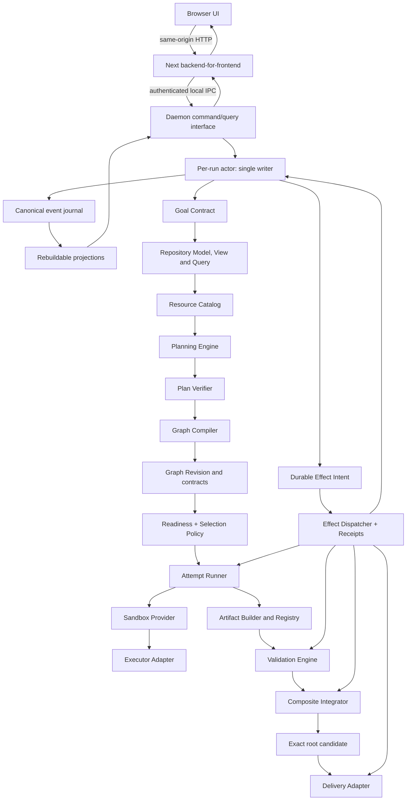

# ManyHands Correctness-First System Redesign Implementation Plan

> **For Claude:** REQUIRED SUB-SKILL: use the repository's TDD and plan-execution
> workflow to implement this plan one stage at a time. Read this document in full
> before changing production code.

**Goal:** Rebuild ManyHands around semantic software boundaries, versioned
resource authority, exact Git-native artifacts, explicit hierarchical
integration, durable effect execution and verifiable outcomes, so that large
task trees are useful only when the work actually supports them.

**Architecture:** ManyHands remains a local modular monolith. A durable run daemon
owns every mutation, persists effect intent before external work and coordinates
pure domain modules for repository modeling, planning, graph compilation,
scheduling, execution, validation and integration. The browser is untrusted; the
Next server is a same-installation backend-for-frontend over authenticated local
IPC. Planning is progressive over immutable repository views; execution
transports declared Git object changes rather than whole child commits; every
attempt runs in an explicitly classified sandbox and every adopted result is
proven on an exact candidate.

**Tech Stack:** TypeScript, Zod, Node.js 22+, pnpm workspace, Vitest, Next.js,
Git object databases and namespaced refs, fsync-backed JSONL event journals,
authenticated Unix-domain-socket/Windows-named-pipe IPC and pluggable local
sandbox/executor adapters.

---

## 0. Authority, status and rules for implementation agents

### 0.1 Authority

This document is the single normative source for the redesign starting on
2026-08-12. It replaces the former architecture decisions, ADRs, system/design
specifications, core-pillar documents and the 2026-08-05 implementation plan.
Those documents were removed because they described mutually incompatible
targets and, in several cases, presented partial behavior as complete.

The remaining sources have narrower authority:

1. `PRODUCT.md` defines product purpose, users and stable experience principles.
2. This document defines target architecture, domain language, implementation
   order and exit criteria.
3. `docs/agents/` defines local agent workflow only.
4. `docs/tesis/` contains academic material and attributable historical
   evidence. It never defines current behavior and must not be rewritten to
   match the new architecture.
5. Source code, tests and persisted runs describe the current implementation,
   not the target. A passing test can characterize legacy behavior without
   making that behavior desirable.
6. The [adversarial review record](../audits/correctness-first-redesign-review.md)
   records the reasoning that produced this revision. It is historical
   evidence, not a second normative specification.

If this plan conflicts with historical evidence, preserve the evidence and
follow this plan for future implementation. If the implementation contradicts
this plan, record the difference as a transition gap; do not weaken the plan to
match the code.

#### Implementation status

| Stage | Status | Attributable evidence | Next-stage disposition |
|---|---|---|---|
| Stage 0 / G0 | `in_progress` | [`../audits/stage-0/`](../audits/stage-0/); candidate `9cf3e87a9a534bd07947cfaedb6d78f88205b642` rejected by independent review because its pnpm 11 lock conversion changed baseline dependency resolutions | Reissue a resolution-preserving candidate, repeat clean-clone verification and obtain independent review. |
| Stage 1 / G1 | `blocked` | none | G0 must pass on the reissued candidate before Stage 1 begins. |
| Stages 2–11 | `not_started` | none | Must execute in normative order. |

### 0.2 Required reading and execution protocol

Before implementing any stage, the agent must:

1. Read this document completely.
2. Confirm the actual Git root and inspect `git status --short` and
   `git diff HEAD`.
3. Read the productive path and tests named by that stage.
4. Write or identify the stage's characterization tests.
5. For every behavioral change, produce a regression that fails for the right
   reason before changing production code.
6. Implement the smallest vertical replacement that satisfies the new
   interface.
7. Remove the superseded path once no productive caller needs it. Compatibility
   code must have a named consumer and an explicit retirement stage.
8. Run the narrow tests, affected typechecks/builds and then `pnpm test` in full
   on the exact tree being handed off.
9. Preserve unrelated modifications and historical evidence. Never use global
   `stash`, `reset` or `clean`.
10. Match each modified file's committed line-ending convention and inspect
    `git diff --numstat` before committing.

### 0.3 Freeze on expensive experiments

No large live-model benchmark, five-run longitudinal series or wide-graph run is
authorized by this plan until Stage 11 says the architecture is eligible. Until
then, development uses pure unit tests, repository fixtures, recorded model
replays, real-Git integration tests and process/sandbox tests. A live model may be
used only by an explicitly opt-in smoke test after its prerequisites are green.

### 0.4 What this plan is not

- It is not a request to maximize node count.
- It is not a rewrite of the entire repository in one branch.
- It is not permission to delete thesis/demo evidence.
- It does not make model output authoritative.
- It does not promise hostile-code isolation until the sandbox capability tests
  pass.
- It does not introduce microservices, a remote queue, Kubernetes or a database
  server. The product is local and single-user.

---

## 1. Executive diagnosis

The failed demonstration was partly an experimental-design failure and mostly a
system-design failure.

The tasks and oracles were too small and mechanical to establish useful graph
scale, architectural coherence or product quality. The successful graphs had
only one or two leaves while token consumption increased sharply. Passing those
oracles demonstrated that selected control-plane paths could produce, validate
and deliver code; it did not demonstrate that ManyHands could design a coherent
application, construct a deep hierarchy, coordinate substantial siblings or
integrate a large result.

The stronger finding is in the implementation. ManyHands currently has a
sophisticated operational shell around an under-specified engineering model:

- planning reduces the repository to a broad path inventory and generic file
  observations;
- a leaf is accepted mainly from path count and the presence of a test;
- relationships and seam descriptions are synthesized from read/write path
  intersections;
- the productive route projects a semantic plan back through a legacy work
  breakdown before compiling;
- contracts advertise artifact kinds that the runtime cannot materialize;
- every output is transported as an entire commit;
- composites integrate late but do not normally own planned shared edits;
- benchmark-specific nouns and methods reached production prompts and
  validation heuristics;
- a Next.js process owns long-running jobs through in-memory promises;
- liveness repair and durable fencing compensate for that process topology;
- agent profiles bypass approvals and can run with host-level access, while a
  worktree is described too loosely as sandboxing.

This is why adjusting a threshold or asking for more children will not fix the
system. It would produce more path partitions and more whole-commit conflicts,
not better software boundaries.

The redesign therefore follows one governing statement:

> ManyHands optimizes for independently implementable and hierarchically
> verifiable product increments. Tree size is an observed consequence of real
> boundaries, never a target or a success metric.

---

## 2. Findings that the redesign must correct

### F1. Repository grounding is structurally shallow

The current productive planning host projects indexed files into generic
observations and initializes the root with an effectively repository-wide read
set. Import relationships are incomplete in the fast index, and useful symbol,
export, test and boundary information is not presented as a queryable model.
Each recursive planning call receives broad evidence again.

**Consequence:** cost scales with repeated inventory, while semantic knowledge
does not. The planner knows file names but cannot reliably reason about public
interfaces, ownership, callers, tests, schemas or integration hotspots.

**Required correction:** build one immutable `RepositoryModel` and expose it to
planning through budgeted queries and stable evidence references. A prompt is a
projection of that model, not the model itself.

### F2. Planning models paths rather than software responsibilities

The current cut contract primarily contains objective, criteria and read/write
paths. Seams, compatibility and validation are then synthesized from those
paths. A source-file extension can determine a seam kind, and a generic
repository validation can stand in for a semantic obligation.

**Consequence:** architectural language in the graph can be post-hoc decoration
over file overlap. It cannot guarantee that siblings agree on behavior,
idempotency, errors, data shape or public API.

**Required correction:** a planned unit must declare an observable outcome,
owned responsibility, grounded repository surface, produced/consumed artifacts,
interface semantics, validation obligations, uncertainty and parent integration
obligation. Exact runtime IDs and mechanics remain the Graph Compiler's job.

### F3. The current leaf predicate forces tiny or arbitrary trees

`RecursivePlanner` stops when scope is below a fixed path budget and the unit
writes a test. Production passes a single path threshold. During the discarded
demonstration, temporary patches also added test paths automatically and inferred
independence from trigger words; those patches were removed during the baseline
cleanup. The model is still not asked whether another architectural cut would
improve verification, risk isolation or parallel delivery.

**Consequence:** small repositories collapse to one leaf, while lowering the
threshold merely creates more arbitrary nodes. Prompt wording and path counts
still substitute for a formal contract that can prove independence.

**Required correction:** leaf feasibility and split desirability are distinct.
A leaf must be coherent, bounded, grounded and verifiable. A split must have an
explicit reason and an integration recipe. Natural-language trigger words never
create independence.

### F4. Planning has multiple competing representations

The productive path creates a recursive tree, projects it to `SemanticPlan`,
projects that plan into a legacy `WorkBreakdown`, applies policy and projects
again for compilation/metrics. The documentation previously claimed one
canonical representation while production still crossed the compatibility
shape.

**Consequence:** defaults and semantics can drift at each translation; agents
cannot tell which shape is authoritative; tests validate adapters rather than
the real boundary.

**Required correction:** `SemanticPlan` is the only planning-domain output.
`GraphRevision` is the only runtime graph output. The Graph Compiler is the one
intentional transformation between those two different domains. No
`SemanticPlan -> WorkBreakdown -> SemanticPlan` path may remain productive.

### F5. The conflict model forbids normal shared work

The current planner expects globally disjoint leaf writes. This avoids textual
collisions but makes shared types, route registries, package manifests, barrels,
migrations and configuration difficult or impossible to allocate. Pairwise
`ConflictConstraint` edges also grow quadratically.

**Consequence:** a real integration concern is either rejected at planning or
discovered late by Git. The architecture says the parent owns integration, but
the parent lacks a normal planned implementation phase for shared files.

**Required correction:** nodes claim named resources. Shared interface work is
performed contract-first; shared integration files belong to the composite.
The scheduler compares resource keys rather than materializing an all-pairs
matrix.

### F6. Artifact contracts and transport disagree

Schemas permit logical, file, manifest and commit artifacts. Runtime
materialization supports logical no-op and whole-commit cherry-pick; integration
rejects non-commit artifacts. One candidate commit is registered for every
produced artifact of a node.

**Consequence:** a contract that names a file subset still transports all
changes in the commit. Transitive changes, duplicate ancestry, empty
cherry-picks and unrelated conflicts cross node boundaries.

**Required correction:** commit SHA is provenance, not artifact kind. Every
materializable artifact has a content-addressed manifest describing exact paths,
preimages and postimages. Execution bases apply only required manifests.

### F7. Integration is a merge step rather than planned engineering work

Composite integration applies child commits, optionally repairs conflicts and
validates. It does not begin with a first-class integration contract that owns
shared edits and seam-level tests.

**Consequence:** clean cherry-pick can be mistaken for compatibility, and shared
work has no normal owner. Large graphs defer semantic incompatibility to the
root, where the repair context and blast radius are largest.

**Required correction:** every composite has an `IntegrationContract`, resource
claims, validation obligations and an immutable integration attempt. It builds a
new candidate from exact child artifacts and proves the composite before its
artifact is adoptable.

### F8. Validation has strong custody but weak semantic attribution

Exact candidate sandboxes, evidence matrices, baselines and negative controls
are valuable. The weakness is upstream: criteria and validation references are
often inferred from paths, so a command can be proven to have passed without
proving that it meaningfully covers the user's requirement.

**Required correction:** acceptance criteria originate in a versioned
`GoalContract`; child obligations refine but never silently replace them. Every
evidence binding identifies criterion, obligation, exact selector and candidate.
Composite and root validation run against the combined result.

### F9. Production contains benchmark-specific policy

The productive executor and test-integrity validator contain special handling
for `backorders` and the exact operation `currentBackorders()`.

**Consequence:** experiment repairs have become global behavior, prompt size
grows, generality is compromised and later thesis evidence is biased.

**Required correction:** production code may not contain benchmark-domain nouns
or expected fixture methods. A source-hygiene test enforces this. Fixtures remain
in tests and evidence only.

### F10. Long-running execution has the wrong process owner

The web application starts background promises stored on `globalThis`. A web
restart loses them. Reads can trigger liveness reconciliation and cancellation.
Leases, fences, heartbeats, process tables, takeovers and cache reconciliation
then compensate for an avoidable ownership topology.

**Required correction:** a dedicated local daemon owns commands, run actors,
processes and journals. The web process is stateless with respect to execution.
Queries have no domain side effects.

### F11. Worktree isolation is not execution sandboxing

The environment allowlist reduces secrets but explicitly does not sandbox the
agent. Current profiles can select `danger-full-access` or skip permission
checks, while host identity directories are forwarded for authentication.

**Required correction:** model four independent guarantees—checkout isolation,
process/resource isolation, filesystem/network permissions and Git input
identity. Executor profiles declare measured sandbox capabilities. Unsafe local
execution is explicit and never described as isolated.

### F12. Legacy and current modules coexist without a retirement boundary

Large legacy planners, executors and integration implementations remain exported
alongside V2 modules. Some package READMEs describe frameworks or pools that are
not on the productive route.

**Required correction:** each migration stage publishes a reachability test and
deletes the superseded implementation after callers move. No permanent V3/V2/V1
stack and no compatibility adapter without an identified historical reader.

### F13. Single-writer ordering does not make effects crash-consistent

The current implementation contains useful local remedies—fenced event appends,
process receipts, integration operation journals and delivery recovery—but the
target design only says that an actor "schedules effects." It does not define the
durable boundary around process spawn, Git mutation, validation, sandbox creation
or delivery.

**Consequence:** a daemon can crash after recording a decision but before the
physical action, or after the action but before recording its result. Duplicate
executors, orphan processes, repeated Git mutations and lost completions remain
possible even with one event writer.

**Required correction:** the canonical journal acts as a durable effect outbox.
Every external mutation has a stable effect identity, a durably appended intent,
kind-specific idempotency/reconciliation rules and a terminal event. Exactly-once
execution is not claimed.

### F14. Repository snapshots alone are insufficient for progressive planning

The immutable base `RepositoryModel` is correct for intake, but later expansion
may depend on interfaces and files produced by already adopted artifacts. Mutating
the base model would destroy attribution; continuing to query only the base would
make later planning stale by construction.

**Consequence:** a local expansion can hallucinate around an interface that now
exists, miss a generated resource, or compile a contract against the wrong
version.

**Required correction:** preserve the base model and derive immutable,
content-addressed `RepositoryView`s from it plus exact adopted manifests. Planning
and resource catalogs bind to a view digest.

### F15. Artifact identity and artifact lifecycle are conflated

The initial manifest shape includes mutable fields such as `status` and an
evidence matrix created after the manifest. It also forces Git trees, file
changes and evidence into one structural shape.

**Consequence:** the same artifact content can acquire different identities as it
moves from candidate to adopted, and a complete tree or evidence bundle carries
meaningless path entries. Reconciliation and caching become ambiguous.

**Required correction:** manifests are immutable discriminated Git-native values.
Verification, adoption, staleness and rejection are separate domain events.
Evidence is not a materializable artifact.

### F16. Repository authority, runtime exclusion and scheduling risk are mixed

A source resource such as a package is semantic ownership. A TCP port or target
branch is a physical lease. Proximity to a public API is a soft integration-risk
signal. Treating all three as one equality-key lock either misses containment or
serializes isolated worktrees for the wrong reason.

**Consequence:** the scheduler can hide double ownership, fail to detect aliasing,
or lose useful parallelism while still making poor high-risk selections.

**Required correction:** use a `ResourceCatalog` and versioned `ResourceClaim`s
for plan authority, provider-owned `RuntimeLeaseClaim`s for physical exclusion,
and an advisory `IntegrationRiskEstimate` only for selection among already-ready
nodes.

### F17. The privileged local transport has no stated security boundary

The daemon can execute processes, use credentials and mutate repositories. A raw
localhost endpoint would be reachable by browser-origin attacks and would leave
authentication, CSRF and origin behavior implicit.

**Consequence:** a malicious site can attempt privileged local commands, or a
browser token can become equivalent to daemon authority.

**Required correction:** browser JavaScript never connects to the daemon. The
Next server mediates commands over user-restricted local IPC and an installation
capability unavailable to the browser. A loopback TCP fallback is opt-in and
enforces the same capability plus strict origin/host policy.

---

## 3. Product and system requirements

### 3.1 Functional requirements

The redesigned system must:

1. Accept a software goal, explicit acceptance criteria, constraints, quality
   attributes and an immutable repository target.
2. Inspect the exact base tree and produce a queryable repository model with
   declared coverage and uncertainty.
3. Derive immutable repository views when adopted artifacts change the surface
   available to later planning, without rewriting the base model.
4. Produce a semantic hierarchical plan whose nodes correspond to real product
   or architecture boundaries.
5. Explain why each unit is a leaf or why each composite is split.
6. Compile exactly one semantic plan revision into exactly one executable graph
   revision and versioned contracts.
7. Support bounded, local plan expansion and amendments without invalidating
   unrelated work.
8. Reject ambiguous or overlapping write authority unless an explicit artifact
   version transition orders it.
9. Dispatch only nodes whose exact inputs, resources, decisions and executor
   capabilities are ready.
10. Select among ready nodes using advisory integration risk without allowing a
    heuristic to create dependencies or weaken safety.
11. Execute every attempt against an exact base in a classified sandbox.
12. Inspect changes from Git, enforce scope/resource ownership and create
   orchestrator-owned candidate commits.
13. Produce immutable Git-native manifests, retain their objects and materialize
    only declared artifacts.
14. Validate leaf, composite, root and delivery candidates against obligations
    appropriate to each level.
15. Refuse plan approval when a required goal criterion has no accepted proof
    authority, and bind human/external judgments to the exact candidate.
16. Integrate bottom-up, including strictly scoped parent-owned edits and seam
    tests; integration cannot silently repair child-owned implementation.
17. Persist effect intent before external mutation and reconcile every
    non-terminal effect after daemon or machine restart.
18. Recover according to observed cause and preserve immutable failed attempts.
19. Continue independent work while a local decision is pending.
20. Survive a web restart without affecting a run and recover deterministically
    from a daemon crash.
21. Authenticate the privileged daemon boundary without exposing daemon
    capability material to browser JavaScript.
22. Present plan, activity, decisions, evidence and delivery without inventing
    state in the UI.
23. Deliver exactly the tree that was finally validated by compare-and-swap
    against the approved destination state.

### 3.2 Non-functional requirements

#### Correctness and reproducibility

- Every adopted result is attributable to an exact input fingerprint.
- Every materialized artifact is verified by digest and preimage.
- Every lifecycle transition is derived from durable facts.
- Replaying an event journal produces the same domain projection.
- An acknowledged command and an effect intent survive process and machine
  restart; incomplete trailing writes are recoverable and complete corruption
  fails closed.
- Re-running a deterministic failed attempt with an identical fingerprint is
  forbidden unless the recovery policy explicitly identifies new evidence.

#### Cost control

- Offline tests and recorded replays are the default development loop.
- Planning context is retrieved per unit under a recorded budget; it is not a
  repeated full-repository dump.
- Fan-out is bounded by useful independence and runtime budget.
- Token, duration, context mass, retries and integration cost are recorded per
  attempt and composite.
- A metric not observed is `unknown`, never zero.

#### Scale

- Repository modeling must handle monorepos without embedding the whole index in
  a prompt.
- Resource overlap and incremental risk selection must use catalog/neighborhood
  indexes, not a materialized all-node-pairs matrix.
- Event append and normal projection updates must not rewrite full history.
- Graph depth has no product target; practical bounds come from planning and
  execution budgets and are reported when reached.

#### Security

- Repository content, model output, paths, commands and browser inputs are
  untrusted.
- No unattended attempt runs under an executor profile below the configured
  minimum sandbox capability.
- Credentials are scoped to one executor/attempt and are absent from prompts,
  diffs and durable logs.
- Validation commands come from operator-approved repository capabilities and
  compiled recipes. Repository-defined shell text and agent prose are untrusted
  until the command policy validates their executable/arguments/environment.
- Delivery publishes only the validated final manifest.
- Browser requests are untrusted; only the authenticated Next server-side
  mediator can reach privileged daemon IPC.

#### Maintainability

- Domain packages do not depend on Next.js, React, a model SDK or a specific CLI.
- Each module has one narrow external interface; internal adapters are not
  re-exported by default.
- There is one representation of each concept at each seam.
- A migration is incomplete while both old and new productive paths remain.

#### User experience

- The graph tells the real causal story of the run.
- Pending human decisions block only affected work.
- Candidate, verified, stale, failed and delivered remain distinct.
- The canvas does not move in response to run activity.
- WCAG 2.2 AA and reduced motion remain required.

---

## 4. Architectural invariants

Each invariant below forbids an observable corruption or false-success state.
Implementation mechanisms may change; the prohibited states may not.

### Domain authority and durability

- **I1 — Immutable run premise.** A run has one current accepted
  `GoalContract` revision and one exact initial repository target. Revisions are
  immutable; a different goal or base creates a successor revision or new run
  with explicit user-approved impact/invalidation, never an in-place edit.
- **I2 — One domain writer.** Exactly one current `RunActor` may append facts for
  a run. No web handler, query, timer, effect worker or recovery scanner writes
  domain state directly.
- **I3 — Idempotent commands.** Reusing a `commandId` with identical content
  returns the original receipt; reusing it with different content is rejected.
- **I4 — Journal before projection.** A lifecycle state that cannot be rebuilt
  from the canonical journal does not exist. Snapshots, indexes, attempt lists,
  artifact lists and UI models are disposable projections.
- **I5 — No duplicate authority.** Operational receipts and trace files may
  describe physical reality, but only actor-consumed journal events can change
  domain lifecycle, adoption or completion.
- **I6 — Presentation/provider independence.** Run state remains fully
  replayable and commandable without a browser, web framework, model SDK or
  executor process. Consequently domain contracts contain none of their types;
  restarting or replacing one cannot change domain meaning.

### Repository knowledge, planning and graph

- **I7 — Exact repository view.** Every planning or validation decision names
  the immutable base model plus exact artifact overlays it observed. A view
  cannot silently float to a newer repository state.
- **I8 — Honest epistemics.** `unknown`, `partial`, `conflicting` and low
  confidence are distinct. Absence of evidence is never encoded as negative
  evidence, empty, zero or low risk.
- **I9 — One representation per seam.** `SemanticPlan` is the sole planning
  output and `GraphRevision` the sole executable graph. Only the deterministic
  Graph Compiler transforms between them.
- **I10 — Goal coverage and proofability.** Every required goal criterion has a
  root obligation and an accepted proof authority before plan approval. Child
  refinements cannot replace or weaken it.
- **I11 — Semantic leaves and cuts.** Path count, prompt wording, test presence,
  desired fan-out or model confidence cannot alone establish a leaf or split.
  Every split has distinct responsibilities and a parent integration recipe.
- **I12 — Acyclic executable dataflow.** Artifact requirements and resource
  version transitions are acyclic. A circular implementation dependency must be
  replaced by a frozen seam/contract-first producer or rejected.
- **I13 — Local evolution.** A new plan/graph revision preserves stable node and
  contract identity where semantics did not change, and invalidates only inputs
  whose referenced digests changed.

### Resource authority and scheduling

- **I14 — Canonical overlap.** Repository resource identity comes from the
  `ResourceCatalog`; aliasing and containment are evaluated by a tri-state
  `overlaps` relation. Raw string equality is never the safety rule.
- **I15 — Unique write authority.** Two unordered nodes cannot own overlapping
  repository writes. Serialization is not a repair for double ownership.
- **I16 — Versioned consumption.** A reader names the base or artifact version it
  consumes. A later writer may run concurrently only when isolation preserves
  that frozen input; consuming the writer requires an `ArtifactRequirement` and
  successor resource version.
- **I17 — Physical leases are separate.** Ports, process slots, target refs and
  other mutable host resources use `RuntimeLeaseClaim`; they never masquerade as
  semantic code ownership.
- **I18 — Heuristics have no safety authority.** Integration-risk estimates may
  change ordering or concurrency among ready nodes only. They cannot create a
  dependency, authorize a write, satisfy readiness or suppress validation.

### Attempts, effects and process custody

- **I19 — Immutable attempts.** Retry, repair and integration create new attempt
  identities and lineage. A terminal attempt or its evidence is never reopened
  or overwritten, and the actor never admits two non-terminal attempts for the
  same node and exact input fingerprint.
- **I20 — Durable intent before mutation.** No external side effect starts until
  its stable `EffectIntent` is durably appended and flushed.
- **I21 — Reconcile before repeat.** A non-terminal effect is inspected against
  physical receipts and the target system before it is retried. Unknown prior
  execution is never treated as “not started.”
- **I22 — No exactly-once fiction.** Effects are at-least-once only when
  idempotent by identity; otherwise recovery proves the prior effect absent,
  adopts its observed result or stops at an explicit decision.
- **I23 — Exact attempt inputs.** Base tree, repository view, consumed manifest
  digests, contract/resource revisions, context, executor and sandbox capability
  are all part of `InputFingerprint`.
- **I24 — Orchestrator-owned candidates.** Agent-created commits, refs or active
  Git operations are never adopted. Git-observed changes are rechecked and the
  orchestrator alone creates the candidate.
- **I25 — Process custody.** Every executor/validator process belongs to one
  effect and attempt, has a durable identity plus daemon epoch, and is either
  supervised to a terminal receipt or verified dead/quarantined before retry.
- **I26 — Cancellation is physical.** `cancelled` is impossible while an owned
  process can still mutate state. A completion racing cancellation is recorded
  but cannot be adopted unless policy and an explicit command permit it.

### Artifacts and Git

- **I27 — Immutable manifests, separate lifecycle.** A manifest contains content
  identity and provenance only. Verification, adoption, rejection and staleness
  are journal facts that bind its digest; they never mutate the manifest.
- **I28 — Scoped transport.** A consumer receives only declared Git object
  changes. Whole commits, transitive ancestry and undeclared paths never cross a
  change-set boundary.
- **I29 — Git fidelity and reachability.** Blob/tree OIDs and modes preserve
  binary files, symlinks, gitlinks, executability and deletions. Every referenced
  object remains reachable under a run-owned ref until retention policy proves it
  disposable.
- **I30 — Supported kinds only.** A materializable manifest kind cannot enter an
  approved graph without an exact round-trip materializer for the repository’s
  Git object format.

### Validation, integration and delivery

- **I31 — Evidence binds exact subjects.** An observation proves nothing unless
  it names criterion, obligation, proof strategy, verifier/environment digest and
  exact candidate tree.
- **I32 — Proof authority cannot be downgraded.** Deterministic checks,
  protected external oracles and candidate-bound human judgments satisfy only
  policies that explicitly accept them. Model opinions are advisory evidence,
  never correctness authority.
- **I33 — Self-authored checks are insufficient alone.** A test created by the
  implementation attempt cannot be the sole proof of a required root criterion
  without an independent oracle, protected baseline/negative control or explicit
  human authority.
- **I34 — Validation is hierarchical.** Leaf success is not transitive. Every
  composite and root proves its exact combined candidate, and changed inputs make
  prior evidence stale.
- **I35 — Integration authority is bounded.** An integration attempt may write
  only explicitly parent-owned resources. A needed child-owned change causes a
  child repair or plan/contract amendment, never an omnipotent integration edit.
- **I36 — Integration is an attempt.** Every composite integration has exact
  inputs, diff, candidate, validation, failure class and immutable lineage. A
  conflict-free composition alone remains unverified.
- **I37 — Exact compare-and-swap delivery.** Delivery checks the approved target
  head and cleanliness immediately before publication, publishes the exact final
  commit/tree without synthesizing a new candidate, and completes only from a
  matching receipt. A moved target is a decision, not an automatic merge.

### Security and operations

- **I38 — Worktree is not sandbox.** Checkout isolation, filesystem/process
  confinement, network policy and credential scope are separate measured
  capabilities.
- **I39 — Privileged local boundary.** Browser JavaScript never possesses daemon
  credentials or direct transport. Authenticated user-restricted IPC mediates all
  privileged commands; host compromise by another process running as the same OS
  user is an explicit residual risk.
- **I40 — Capability honesty.** The journal and UI expose the effective sandbox,
  network, Git and credential policies. Missing proof lowers capability or fails
  closed; it never inherits an optimistic label.
- **I41 — Cause-based recovery.** A retry states what evidence, environment or
  input changed. Deterministic failure with unchanged inputs is not retried.
- **I42 — Read-only queries.** Reading, listing or streaming a run cannot cancel,
  resume, reconcile, repair, dispatch or otherwise advance it.
- **I43 — No benchmark knowledge in production.** Product code and generic
  prompts contain no benchmark-domain nouns, expected fixture methods or oracle
  answers.

---

## 5. Canonical domain language

Use these terms consistently in code, tests, UI and future documentation.

**Goal Contract**

The immutable statement of desired behavior, acceptance criteria, constraints,
quality attributes and protected oracle references for a run. Avoid: raw prompt
when referring to the accepted requirement.

**Repository Snapshot**

The immutable identity of the target repository at one exact commit/tree and
index schema version.

**Repository Model**

The structured, evidence-bearing interpretation of a Repository Snapshot:
packages, modules, symbols, imports, public interfaces, tests, commands,
resources, ownership evidence and coverage. It may inform policy; it does not
grant write authority.

**Repository View**

An immutable planning/validation view composed from one Repository Model plus a
declared ordered set of adopted change-set manifests. It has its own digest and
never mutates the base model.

**Resource Catalog**

The repository-view-scoped canonical identity and containment/alias index for
packages, modules, paths, symbols, schemas and integration hotspots. It answers
`overlaps(a, b)` as `yes | no | unknown`; ownership and version lineage live
in contracts, not in the catalog.

**Planning Evidence**

A stable reference to repository content or analysis that supports a planning
claim. It contains identity and digest; it is not pasted prose.

**Semantic Plan**

The canonical, versioned planning result. It describes outcomes,
responsibilities, boundaries, artifacts, seams, validation and integration
intent without runtime scheduling mechanics.

**Work Unit**

A node in a Semantic Plan. A Work Unit is either a leaf-sized implementation
responsibility or a composite responsibility that owns children and their
integration.

**Leaf**

A Work Unit that one agent can implement as a coherent, bounded and independently
validatable change against exact inputs.

**Composite**

A Work Unit that owns a meaningful product/architecture result assembled from
children. It owns the shared integration surface and validates the combined
result.

**Planning Frontier**

The set of approved but not yet expanded composite units whose contracts permit
local expansion. Avoid: incomplete graph when the incompleteness is deliberate
and represented.

**Graph Revision**

The immutable executable projection of one Semantic Plan revision. It contains
runtime node identities, typed relations and references to versioned contracts.

**Resource Claim**

A node's versioned authority to observe or modify a canonical repository
resource. A write is owned by either implementation or parent integration.
Claims replace pairwise conflict edges as a plan-verification primitive; they
are not physical runtime locks.

**Runtime Lease Claim**

A provider-defined claim over a mutable host resource such as an executor slot,
TCP port, GPU, Git ref or delivery destination. Runtime leases are the
scheduler's hard exclusion primitive.

**Integration Risk Estimate**

An evidence-bearing, explicitly uncertain heuristic used only to order or limit
concurrency among hard-ready nodes. It never creates correctness facts.

**Seam Contract**

The versioned observable agreement that lets separately implemented work meet:
signature/schema plus relevant semantics, compatibility and verification.

**Artifact Contract**

The versioned description of an output that another node can consume. It defines
content selectors and materialization; it is not a commit.

**Artifact Manifest**

An immutable Git-native `ChangeSetManifest` or `CandidateTreeManifest`.
Lifecycle and evidence bindings are separate facts.

**Candidate**

A Git commit/tree created by the orchestrator from one attempt. It is not
adoptable until its contracts and evidence pass.

**Attempt**

One immutable execution against an exact `InputFingerprint`. Implementation,
repair and integration are distinct attempt purposes with explicit lineage.

**Execution Base**

The exact tree constructed from the run base and declared input artifacts for
one attempt.

**Validation Obligation**

A versioned statement of what must be demonstrated for one criterion at one
hierarchy level.

**Proof Strategy**

The predeclared method and authority allowed to satisfy a Validation Obligation:
executable, static, protected external oracle, candidate-bound human review or
controlled observation. Model-assisted review is advisory only.

**Evidence Matrix**

The attribution of exact observations to validation obligations on one exact
candidate.

**Adoption**

The durable decision that a fresh, verified artifact may satisfy graph
requirements. Executor exit code never implies adoption.

**Integration Attempt**

The composite-owned attempt that materializes child artifacts, performs planned
shared edits if necessary and validates the combined candidate.

**Amendment**

A versioned, evidence-backed proposed change to plan, graph or contracts. It
states impact and preserved work before it is applied.

**Run Actor**

The daemon-owned serialized command processor for one run. It is the only domain
writer for that run.

**Effect Intent**

The durably journaled identity, inputs and reconciliation policy for one external
side effect. A pending effect is an intent without a terminal actor-consumed
event.

**Physical Effect Receipt**

Durable operational evidence written by an effect adapter/supervisor. It helps
the Run Actor reconcile physical state but is never lifecycle authority by
itself.

**Diagnostic Trace**

Provider output, prompt references, timings and logs useful for diagnosis but not
authoritative for lifecycle or correctness.

---

## 6. High-level target architecture



### 6.1 Deployment topology

The target is one local installation with two long-lived processes:

- `apps/daemon`: privileged durable process owner, composition root and
  authenticated local IPC endpoint;
- `apps/web`: Next.js backend-for-frontend, presentation process and static
  assets. Browser JavaScript talks only to this process.

All domain logic remains in packages. This is not a network microservice split:
the daemon exists because process ownership is a real seam. Development may run
both from one launcher, but restarting the web process must not restart or take
ownership of runs. On Unix the default transport is a user-owned `0600` Unix
domain socket; on Windows it is a named pipe restricted to the installation
user SID. Both require a random installation capability stored outside browser
reach. The same-user-compromise limitation is explicit.

### 6.2 Dependency direction

```text
apps/web -------------> run query/client contracts
apps/daemon ----------> run-engine + concrete adapters

run-engine -----------> run-coordinator, planner, scheduler,
                         execution-core, run-store, trace-store
run-coordinator ------> task-graph, contracts, shared
decomposer -----------> repository-index, contracts, task-graph, shared
scheduler ------------> task-graph, contracts, shared
execution-core -------> contracts, repository-index, shared, trace-store
task-graph -----------> contracts, shared
repository-index -----> shared
run-store ------------> run-coordinator domain events, shared
```

`apps/web` must stop importing execution adapters and composing the run engine.
`packages/orchestrator-graph` is retired after its useful driver behavior moves
behind the `run-engine` interface. No package may depend on `apps/*`.

### 6.3 Deep modules and their external interfaces

| Module | External interface | Complexity hidden |
|---|---|---|
| Repository Model | `inspect`, `composeView`, `query`, `buildContextPack` | parsing, overlays, caching, relevance, coverage |
| Resource Catalog | `resolve`, `overlaps`, `neighborhood` | canonicalization, aliases, containment, unknowns |
| Planning Engine | `plan`, `expand`, `amend` | model tools, local repair, budgeting |
| Graph Compiler | `compile` | IDs, contracts, resource claims, graph checks |
| Scheduler | `evaluateReadiness`, `selectFrontier` | hard readiness, runtime leases, advisory risk, budgets |
| Run Engine | `submitCommand`, `queryRun` | actors, recovery, dispatch, adoption |
| Effect Dispatcher | `dispatchPending`, `reconcile` | idempotency, physical receipts, process/Git crash windows |
| Attempt Runner | `executeAttempt` | base, sandbox, CLI, Git inspection |
| Validation Engine | `validateCandidate` | recipe, baseline, controls, attribution |
| Composite Integrator | `integrate` | artifact application, shared edits, seam checks |
| Event Store | `append`, `read`, `snapshot` | durability, CAS, upcasting, recovery |

Callers and tests use these interfaces. Internal adapters are injected and are
not exposed merely to make tests easy.

---

## 7. End-to-end run flow

### 7.1 Intake and planning

1. The web sends `create_run` with target, goal, criteria and configuration to
   the daemon.
2. The daemon validates the request, resolves the exact base commit/tree and
   appends `run.created` with a `GoalContract` digest.
3. The Repository Model inspects that exact snapshot, builds its canonical
   Resource Catalog and records coverage, warnings and capability evidence.
4. The Planning Engine queries relevant packages, symbols, tests and boundaries.
   It may ask a human only when an answer changes behavior, architecture, scope,
   risk or acceptance.
5. Planning creates a top-level semantic architecture and expands units until
   the approved execution horizon contains feasible leaves and represented
   planning-frontier composites.
6. The Plan Verifier checks outcome/proof coverage, seam sufficiency, canonical
   resource overlap and version ownership, leaf feasibility, integration
   obligations and uncertainty. Model-assisted findings are advisory until a
   deterministic check or human decision resolves them.
7. The Graph Compiler creates one immutable `GraphRevision` and all referenced
   contracts directly from the accepted `SemanticPlan`.
8. The user reviews and approves that exact revision. The approval includes the
   bounded auto-expansion policy for frontier composites.

### 7.2 Progressive expansion

An unexpanded composite is not an executable leaf. When its parent contract and
available repository knowledge make expansion useful, the run actor composes an
immutable `RepositoryView` from the base plus adopted manifests and invokes
`PlanningEngine.expand(unitId, repositoryViewDigest)`.

The result is auto-adoptable only when it stays inside the approved envelope:

- parent objective and criteria are unchanged;
- no new external seam or protected resource is introduced;
- write/resource envelope does not expand and every referenced resource resolves
  in the view's catalog;
- risk and cost remain within approved policy;
- parent integration obligation remains satisfiable.

Otherwise the expansion becomes an `Amendment` and requires approval. Already
adopted work remains fresh when its fingerprints do not change.

The first implementation may expand the entire plan before execution while the
domain model and events already represent frontiers. Overlapping planning and
execution is a later optimization, not a prerequisite for correctness.

### 7.3 Leaf execution

1. The Readiness Evaluator computes hard-ready nodes from approved graph, fresh
   versioned artifacts, decisions, resource authority, runtime leases, executor
   capability and budget.
2. The Selection Policy chooses among that set using critical path, cost and
   advisory integration risk. Unknown risk may reduce concurrency but never
   invents a dependency.
3. The run actor appends the selection and a stable `EffectIntent` before
   dispatch. A physical adapter cannot start without that durable intent.
4. `ExecutionBaseBuilder` constructs an exact tree from run base plus only the
   required artifact manifests.
5. `AttemptRunner` creates an ephemeral workspace and sandbox, then passes a
   context projection and contract to the selected executor.
6. The agent edits files but does not commit. An agent-created commit, ref move
   or active Git operation rejects the attempt.
7. The orchestrator inspects Git status/diff, validates resource and path scope,
   stages permitted changes and creates a candidate commit.
8. `ArtifactBuilder` extracts exact Git-object manifests from that candidate
   and retains the objects under a run-owned ref.
9. `ValidationEngine` validates the exact candidate in a separate clean
   workspace and builds the Evidence Matrix.
10. The effect adapter writes a physical receipt; the run actor appends the
    terminal effect/attempt facts, reloads current inputs, recomputes freshness
    and either adopts
   the artifacts or records the attempt as stale/rejected.

### 7.4 Composite integration

1. A composite becomes ready when required child artifacts are fresh and its
   integration resources are available.
2. Its exact integration base is built from parent base and declared child
   manifests.
3. Deterministic application checks preimages and ordering. A mismatch is a
   classified integration input failure, not an arbitrary merge failure.
4. If the `IntegrationContract` owns shared edits, an integration executor makes
   only those edits under explicit parent-owned resource claims. A required
   child-owned edit creates a child repair or amendment.
5. The orchestrator creates the composite candidate and validates seam,
   integration and parent criteria on the combined result.
6. The composite produces new scoped artifacts and/or a candidate-tree manifest
   for its parent.

### 7.5 Root and delivery

The root integration attempt builds the complete candidate, runs global build,
regression, end-to-end, protected external and candidate-bound human checks as
required, then emits a `CandidateTreeManifest`. Delivery is a separate durable
effect. It compares the destination with the approved head, fast-forwards or
atomically updates the ref to that exact commit, verifies the destination tree
and appends a matching receipt. A moved or dirty destination blocks explicitly.
Only then is the run `completed`.

---

## 8. Canonical data model

The types below are normative shapes, not copy-paste-complete code. Exact schema
syntax belongs in `packages/contracts` and `packages/task-graph`; fields may be
split into named subtypes while preserving the semantics and single-source rule.

### 8.1 Goal Contract

```ts
type GoalContract = {
  id: string;
  revision: number;
  goal: string;
  acceptanceCriteria: Array<{
    id: string;
    statement: string;
    required: boolean;
    level: "product" | "quality" | "constraint";
    protectedReferences?: string[];
    verification: {
      allowedProofs: Array<{
        mode:
          | "executable" | "static" | "external_oracle"
          | "human_review" | "observational";
        authority:
          | "orchestrator_deterministic"
          | "protected_external_oracle"
          | "operator";
      }>;
      independence:
        | "independent_required"
        | "protected_baseline_or_negative_control"
        | "human_authority"
        | "not_applicable";
    };
  }>;
  constraints: string[];
  qualityAttributes: Array<{
    kind: "security" | "accessibility" | "performance" |
          "compatibility" | "maintainability" | "operability";
    statement: string;
  }>;
  target: {
    repositoryId: string;
    baseCommit: string;
    treeSha: string;
  };
  digest: string;
};
```

Criteria are never created from a test file name. Intake may propose a
verification policy, but the accepted Goal Contract makes it authoritative.
Concrete commands/selectors are resolved later from the Repository View into
Validation Obligations and Proof Strategies. A required criterion with no valid
accepted authority makes planning `needs_input`; a green build cannot substitute.
Child criteria may refine a parent criterion, but the parent remains responsible
for proving the original statement on the integrated result.

### 8.2 Repository Model and evidence

```ts
type RepositoryModel = {
  snapshot: RepositorySnapshotRef;
  packages: PackageBoundary[];
  modules: ModuleBoundary[];
  symbols: SymbolRecord[];
  relationships: ImportRelationship[];
  publicInterfaces: PublicInterfaceRecord[];
  tests: TestRelationship[];
  commands: RepositoryCommand[];
  resources: RepositoryResource[];
  conventions: ConventionRecord[];
  diagnostics: RepositoryDiagnostic[];
  coverage: CoverageReport;
  digest: string;
};

type RepositoryView = {
  baseModelDigest: string;
  appliedManifestDigests: string[];
  treeSha: string;
  contentDigest: string;
  resourceCatalogDigest: string;
  digest: string;
};

type EpistemicAssessment =
  | { state: "unknown"; reason: string; evidenceRefs: [] }
  | {
      state: "known" | "partial" | "conflicting";
      confidence: "high" | "medium" | "low";
      evidenceRefs: string[];
    };

type PlanningEvidenceRef = {
  id: string;
  snapshotId: string;
  kind: "file" | "symbol" | "relationship" | "test" |
        "command" | "convention" | "diagnostic";
  locator: string;
  digest: string;
  epistemic: EpistemicAssessment;
};

type ResourceCatalog = {
  repositoryContentDigest: string;
  resources: Record<string, {
    id: string;
    kind: "package" | "module" | "path" | "symbol" |
          "schema" | "integration_surface";
    canonicalLocator: string;
    evidenceRefs: string[];
  }>;
  contains: Array<{
    containerId: string;
    memberId: string;
    evidenceRefs: string[];
  }>;
  aliases: Array<{ leftId: string; rightId: string; evidenceRefs: string[] }>;
  digest: string;
};
```

`contentDigest` is derived from the immutable base, ordered overlays and exact
tree before catalog construction. The catalog binds to that content digest; the
final view digest then includes `resourceCatalogDigest`. This avoids circular
identity between a view and its catalog while keeping both exact.

The public query seam is budgeted and evidence-returning:

```ts
interface RepositoryQuery {
  searchGoalTerms(input: GoalTermsQuery): Promise<EvidencedResult[]>;
  inspectBoundary(ref: string): Promise<BoundaryView>;
  relatedSymbols(refs: string[]): Promise<SymbolView[]>;
  dependencyNeighborhood(refs: string[], depth: number): Promise<GraphView>;
  relatedTests(refs: string[]): Promise<TestView[]>;
  validationCapabilities(refs: string[]): Promise<ValidationCapabilityView>;
  readExcerpts(refs: ContentRef[], budget: ContextBudget): Promise<Excerpt[]>;
}
```

Every query reports cost, truncation and unknowns. The planner cannot request an
unbounded `allFilesWithContents` operation. `ResourceCatalog.overlaps` is
implemented over canonical IDs, alias equivalence and transitive containment and
returns `unknown` when coverage cannot justify yes/no. Ownership and artifact
versions are deliberately excluded from the catalog so a cached repository fact
cannot silently grant authority.

### 8.3 Semantic Plan

```ts
type SemanticPlan = {
  id: string;
  revision: number;
  goalContract: ContractRef;
  repositorySnapshot: RepositorySnapshotRef;
  repositoryView: { digest: string; treeSha: string; resourceCatalogDigest: string };
  rootUnitId: string;
  units: Record<string, WorkUnit>;
  seams: Record<string, PlannedSeam>;
  artifacts: Record<string, PlannedArtifact>;
  decisions: PlanningDecisionRecord[];
  evidence: PlanningEvidenceRef[];
  status: "ready" | "needs_input" | "rejected";
  digest: string;
};

type WorkUnit = {
  id: string;
  parentId?: string;
  role: "leaf" | "composite";
  title: string;
  objective: string;
  boundary: {
    kind: "application" | "package" | "module" | "domain" |
          "vertical_slice" | "cross_cutting";
    refs: PlanningEvidenceRef[];
  };
  outcomes: PlannedOutcome[];
  criteria: CriterionRefinement[];
  repositorySurface: RepositorySurface;
  resourceIntents: PlannedResourceIntent[];
  consumes: string[];
  produces: string[];
  seamRefs: string[];
  validation: PlannedValidationObligation[];
  uncertainty: PlanningUncertainty[];
  granularity: GranularityDecision;
  expansion: "leaf" | "expanded" | "frontier";
  integration?: PlannedIntegration;
};
```

The plan does not contain scheduler waves, attempt IDs, candidate commits,
runtime artifact digests or duplicated compiled scopes.

### 8.4 Granularity Decision

```ts
type GranularityDecision = {
  disposition: "leaf" | "split" | "frontier";
  feasibility: {
    coherentResponsibility: boolean;
    boundedContext: "yes" | "no" | "unknown";
    boundedChangeSurface: "yes" | "no" | "unknown";
    independentlyValidatable: "yes" | "no" | "unknown";
    unresolvedArchitectureDecision: boolean;
  };
  splitReasons: Array<
    "capacity" | "independent_delivery" | "parallelism" |
    "risk_isolation" | "integration_boundary" | "specialization"
  >;
  expectedBenefits: string[];
  expectedCosts: string[];
  integrationObligationId?: string;
  evidenceRefs: string[];
  epistemic: EpistemicAssessment;
};
```

`split` is invalid without a reason, evidence and parent integration obligation.
`leaf` is invalid when a feasibility field is `no`. `unknown` may produce a
frontier, targeted inspection or human decision; it is never silently treated as
`yes`.

### 8.5 Executable Graph Revision

```ts
type GraphRevision = {
  graphId: string;
  revision: number;
  semanticPlan: { id: string; revision: number; digest: string };
  repositoryView: {
    digest: string;
    treeSha: string;
    resourceCatalogDigest: string;
  };
  rootId: string;
  nodes: Record<string, TaskNode>;
  artifactRequirements: ArtifactRequirement[];
  seamBindings: SeamBinding[];
  resourceClaims: ResourceClaim[];
  runtimeLeaseClaims: RuntimeLeaseClaim[];
  contractRefs: ContractRef[];
  digest: string;
};

type ArtifactRequirement = {
  id: string;
  producerNodeId: string;
  consumerNodeId: string;
  artifactContract: ContractRef;
  consumerInputName: string;
  acceptedManifestKinds: Array<"change_set" | "candidate_tree">;
};

type SeamBinding = {
  id: string;
  producerNodeId: string;
  consumerNodeId: string;
  seamContract: ContractRef;
  artifactRequirementId: string;
  validationObligationIds: string[];
};

type ResourceVersionRef =
  | { kind: "repository_view"; digest: string }
  | { kind: "artifact_contract"; ref: ContractRef };

type ResourceClaim = {
  id: string;
  nodeId: string;
  resourceId: string;
  source: "planner" | "compiler" | "repository_policy";
  evidenceRefs: string[];
  epistemic: EpistemicAssessment;
} & (
  | {
      access: "observe";
      inputVersion: ResourceVersionRef;
    }
  | {
      access: "modify";
      ownerPhase: "implementation" | "integration";
      inputVersion: ResourceVersionRef;
      outputArtifact: ContractRef;
    }
);

type RuntimeLeaseClaim = {
  id: string;
  nodeId: string;
  provider: string;
  resourceKey: string;
  mode: "shared" | "exclusive";
  phase: "implementation" | "validation" | "integration" | "delivery";
};
```

Repository claims reference only IDs in the exact Resource Catalog. Catalog
overlap, not string equality, detects package/file and module/schema aliasing.
Two unordered overlapping `modify` claims are an invalid plan. A deliberate
sequential transformation is valid only when the successor's `inputVersion`
references the predecessor artifact and the graph contains the matching
`ArtifactRequirement`; the scheduler does not repair this by serialization.

Runtime keys such as `tcp:127.0.0.1:3100`, an executor slot or a target Git ref
are defined and normalized by their provider. They protect physical state, not
source ownership. A risk scorer cannot create either kind of claim or a
functional dependency.

### 8.6 Contracts per node

Every executable node references one immutable bundle:

```ts
type NodeContractBundle = {
  task: TaskContract;
  change: ChangeContract;
  context: ContextContract;
  consumes: ArtifactContract[];
  produces: ArtifactContract[];
  seams: SeamContract[];
  validation: ValidationContract;
  integration?: IntegrationContract;
  revision: number;
  digest: string;
};
```

`ChangeContract` owns adoption boundaries and resource claims. `ContextContract`
defines initial context and discovery policy. Reading a newly discovered normal
source file is not the same as gaining permission to modify it. Protected paths,
secrets and oracle files remain hard-denied.

### 8.7 Artifact Contract and Manifest

Artifact contracts describe semantic role (`implementation_change`,
`interface_snapshot`, `composite_change` or `final_tree`) separately from
physical representation. The initial physical union has only two members.
`EvidenceMatrix` and trace/log bundles are separate records, not artifacts.

```ts
type ArtifactManifest = ChangeSetManifest | CandidateTreeManifest;

type ManifestIdentity = {
  id: string;
  contract: ContractRef;
  producerNodeId: string;
  producerAttemptId: string;
  inputFingerprint: string;
  repositoryObjectStoreId: string;
  objectFormat: "sha1" | "sha256";
  sourceCandidate: { commitOid: string; treeOid: string };
  retainedByRef: string;
};

type ChangeSetManifest = ManifestIdentity & {
  kind: "change_set";
  baseTreeSha: string;
  resultTreeSha: string;
  entries: Array<{
    oldPath?: string;
    newPath?: string;
    operation: "add" | "modify" | "delete" | "type_change";
    oldOid?: string;
    newOid?: string;
    oldMode?: string;
    newMode?: string;
    detectedRenameFrom?: string;
  }>;
  manifestDigest: string;
};

type CandidateTreeManifest = ManifestIdentity & {
  kind: "candidate_tree";
  baseCommitOid: string;
  commitOid: string;
  treeOid: string;
  manifestDigest: string;
};
```

Commit OID remains provenance; tree/blob OIDs and modes are content identity.
Git's rename detection is heuristic, so exact transport is a delete plus add;
`detectedRenameFrom` is explanatory metadata only. Modes preserve regular,
executable, symlink and gitlink entries; binaries require no special patch form.
Submodule objects may be referenced but are never fetched or initialized without
an explicit network capability and contract.

Materialization verifies the base/preimage objects, updates a temporary Git index
from declared OIDs, writes the resulting tree and compares it with
`resultTreeSha`. It does not apply textual patches, run filters or traverse
source commit ancestry. Candidate objects are retained under run-owned refs in a
Git object database; ManyHands does not create a parallel blob CAS. Immutable
manifest content excludes evidence and lifecycle status. `artifact.verified`,
`artifact.adopted`, `artifact.stale` and `artifact.rejected` events bind the
manifest digest later.

### 8.8 Attempt and fingerprint

```ts
type InputFingerprintMaterial = {
  executionBase: { repositoryViewDigest: string; treeSha: string };
  consumedArtifactDigests: string[];
  nodeContractDigest: string;
  resourceClaimDigest: string;
  contextDigest: string;
  executorProfileDigest: string;
  sandboxCapabilityDigest: string;
};

type Attempt = {
  id: string;
  runId: string;
  nodeId: string;
  purpose: "implementation" | "repair" | "integration";
  ordinal: number;
  lineage?: { retryOf?: string; repairOf?: string };
  inputFingerprint: string;
  executionBase: { repositoryViewDigest: string; treeSha: string };
  nodeContractDigest: string;
  resourceClaimDigest: string;
  contextDigest: string;
  executorProfileDigest: string;
  sandboxCapabilityDigest: string;
  consumedArtifactDigests: string[];
  state: "prepared" | "running" | "candidate" | "validated" |
         "failed" | "interrupted" | "stale" | "cancelled";
};
```

`inputFingerprint` is the canonical digest of `InputFingerprintMaterial`; its
artifact list is sorted by requirement identity, not incidental completion
order. The fingerprint includes all fields that can change eligibility. The global
graph revision is provenance but does not invalidate an unrelated node by
itself; referenced node/contract/resource revisions do.

Validation executions are separate immutable records keyed by exact candidate,
proof strategy, recipe and environment. Re-running validation produces another
observation; it does not pretend that the engineering attempt itself ran again.

### 8.9 Durable effects

```ts
type EffectIntent = {
  effectId: string;
  runId: string;
  attemptId?: string;
  kind:
    | "model_call" | "process_spawn" | "process_terminate"
    | "sandbox_create" | "git_mutation" | "artifact_materialize"
    | "validation" | "delivery" | "cleanup";
  inputDigest: string;
  daemonEpoch: string;
  idempotency:
    | "repeat_safe"
    | "reconcile_then_repeat"
    | "never_repeat_unknown";
  requestedAt: string;
};

type PhysicalEffectReceipt = {
  receiptId: string;
  effectId: string;
  observation: "started" | "succeeded" | "failed";
  inputDigest: string;
  daemonEpoch: string;
  processIdentity?: {
    pid: number;
    creationIdentity: string;
    supervisorNonce: string;
  };
  resultDigest?: string;
  observedAt: string;
};
```

`effect.requested` is appended with durable flush before dispatch.
`effect.completed`, `effect.failed` or `effect.interrupted` is appended only
by the actor after validating a physical receipt or reconciliation result.
Pending work is derived from the journal; there is no second authoritative
outbox database. Each physical receipt is immutable; a started observation and
a terminal observation have different `receiptId`s. Rewriting one receipt from
started to succeeded would recreate a second mutable lifecycle state and is
forbidden.

### 8.10 Evidence and final result

```ts
type ProofStrategy = {
  id: string;
  goalContractDigest: string;
  criterionId: string;
  obligationId: string;
  mode:
    | "executable" | "static" | "external_oracle"
    | "human_review" | "observational";
  authority:
    | "orchestrator_deterministic"
    | "protected_external_oracle"
    | "operator";
  repositoryViewDigest: string;
  procedureRef: string;
  selectorDigest?: string;
  environmentPolicyDigest: string;
  independence:
    | "independent_required"
    | "protected_baseline_or_negative_control"
    | "human_authority"
    | "not_applicable";
  digest: string;
};
```

A Proof Strategy must be one of the exact mode/authority pairs accepted by the
Goal Contract. Authorities are categorical, not a ranking: an operator cannot
silently substitute for a protected external oracle, or vice versa.

An evidence observation must include exact candidate tree, proof mode/authority,
recipe/verifier digest, selectors, output digest, environment digest and
criterion/obligation IDs. Outcomes are `satisfied`, `failed`,
`inconclusive`, `not_run` or `not_applicable`; none is inferred from a
confidence score. Composite evidence may reuse a physical test execution for
several obligations only when the recipe declared those bindings before
execution.

The final result binds a `CandidateTreeManifest` digest to all adopted root
artifact digests, Goal Contract, graph/contracts, Evidence Matrix and delivery
target. A delivery receipt must echo and verify the same commit/tree without
mutating the manifest.

---

## 9. Detailed module design

### 9.1 Repository Model

**Location:** evolve `packages/repository-index`.

**Responsibility:** turn an exact Git snapshot into a structured base model,
compose immutable views from adopted manifests, build each view's Resource
Catalog and serve bounded evidence queries. It does not decide work units or
grant write authority.

**Required implementation:**

- Preserve exact commit/tree identity and cache by identity plus schema/profile.
- Parse package/workspace manifests and entrypoints.
- Extract TS/JS imports, exports, symbols and public signatures. Add coverage
  metadata for extensions/languages not fully parsed.
- Resolve workspace/package exports, path aliases, framework entrypoints and
  config-derived relationships when evidence is available; dynamic imports and
  unsupported conventions remain explicit unknowns.
- Link tests to source using imports, naming conventions, configured projects and
  explicit test runner metadata.
- Identify schemas, migrations, generated files, shared registries, barrels,
  lockfiles and other integration hotspots as resources.
- Record generated-file provenance and the trusted regeneration command when
  known. A generated output is never treated as an independently owned source
  merely because it exists.
- Canonicalize resource identities and index alias/containment without copying
  ownership or artifact versions into the catalog.
- Record conventions from repository evidence, never from benchmark wording.
- Provide a relevance service seeded by goal terms, affected symbols, dependency
  neighborhoods and tests.
- Return excerpts lazily with byte/token budgets and content digests.
- Keep unknown/partial results explicit and deterministic.
- Compose overlays from exact Git objects and incrementally re-index changed
  surfaces. The ordered manifest digests, resulting tree and model schema define
  the Repository View identity.

**Interface rules:** callers ask questions; they never receive the full model in
one default prompt. Query results return stable evidence references. Index timing
and cache-hit diagnostics are telemetry, not domain semantics.

**Failure behavior:** parser failure degrades only the affected file/language and
records coverage. Missing evidence for a required boundary or resource overlap
blocks approval/expansion or asks for targeted inspection; it never becomes low
risk or false non-overlap.

### 9.2 Planning Engine

**Location:** replace the productive route inside `packages/decomposer`.

**External interface:**

```ts
interface PlanningEngine {
  plan(input: PlanningRequest, signal: AbortSignal): Promise<PlanningResult>;
  expand(input: ExpansionRequest, signal: AbortSignal): Promise<PlanningResult>;
  amend(input: AmendmentPlanningRequest, signal: AbortSignal): Promise<PlanningResult>;
}
```

`PlanningResult` is `ready(SemanticPlan)`, `needs_input(DecisionDraft[])` or
`rejected(PlanningFinding[])`.

**Internal phases:**

1. **Goal analysis:** map product criteria and quality constraints without
   inventing repository facts.
2. **Impact discovery:** query likely modules, public interfaces, tests and
   resources.
3. **Architecture pass:** identify stable boundaries, shared contracts,
   integration hotspots and uncertainties.
4. **Unit expansion:** propose a bounded fan-out, normally 2–5 children, for one
   composite.
5. **Granularity decision:** evaluate leaf feasibility and split value.
6. **Plan verification:** run deterministic and model-assisted critics over the
   complete local proposal.
7. **Local repair:** return exact findings to the same planning context with a
   bounded retry budget. Preserve accepted ancestors/siblings.

The planner may use read-only repository tools. It must not receive every file as
static prompt context, modify the target, execute arbitrary commands or declare
runtime success. Planning on the same contract/view with no new evidence cannot
repeat indefinitely: it must accept, surface a decision, expand the query with a
recorded reason or reject.

### 9.3 Granularity policy

Granularity is a structured decision, not a scalar threshold.

#### Leaf feasibility gate

A unit is feasible as a leaf only when:

- it owns one coherent observable responsibility;
- expected context and change surface are bounded;
- dependencies and public contracts needed to start are available;
- it has at least one meaningful local validation obligation;
- unresolved architecture decisions do not affect siblings or the parent;
- one configured executor can reasonably complete it under budget;
- discarding/retrying it does not invalidate unrelated work.

Tests can be created by the leaf, but a predeclared test path is not required to
prove leafhood. Expected tool trajectory, impacted symbols/modules, repository
mass and uncertainty are better capacity signals than raw path count.

#### Valid split gate

A split is valid only when:

- every child has a distinct responsibility and output;
- parent criteria remain covered by parent integration obligations and child
  refinements;
- every child can begin from declared inputs or an explicit contract-first
  producer;
- resource ownership is unambiguous;
- the parent owns all shared integration work;
- the parent can state how the combined result will be validated;
- expected handoff/integration cost does not obviously dominate the benefit.

#### Decision order

1. If leaf is infeasible, request a semantic split or reject with the exact
   reason.
2. If leaf is feasible and no valid split exists, keep a leaf.
3. If a split enables independent delivery, meaningful parallelism, risk
   isolation or an explicit integration boundary, preserve it.
4. If evidence is insufficient but the parent envelope is stable, create a
   planning frontier and inspect later.
5. Never split simply to reach a depth/fan-out target.

Initially this is categorical and evidence-based. An expected-cost model may be
added only after enough comparable attempts exist. It must use measured units
(tokens, elapsed time, retries, integration attempts), publish calibration data
and retain an `unknown` state. The former uncalibrated utility score may remain
only in historical evidence, not in productive decisions.

### 9.4 Plan Verifier and Graph Compiler

**Location:** `packages/decomposer/src/compiler` initially; expose narrow
`verifyPlan` and `compilePlan` interfaces.

The verifier checks semantic truth available before execution:

- all product criteria have a root obligation;
- every required criterion has an allowed proof strategy and authority;
- child refinements point to known parent criteria;
- leaves are feasible and composites have integration obligations;
- seams contain observable semantics and compatibility checks;
- artifact contracts have producers, consumers and supported kinds;
- all resource IDs resolve in the exact catalog, overlaps are known where writes
  are involved, and no unordered overlapping writers exist;
- contract-first producers precede their consumers;
- protected/oracle paths cannot enter write scopes;
- unknowns are surfaced with appropriate severity;
- planning frontiers remain inside approved envelopes.

Verifier authority is explicit:

| Verifier class | May block compilation? | May satisfy correctness? | Response |
|---|---:|---:|---|
| Schema/reference/graph/resource invariant | yes | no | deterministic error |
| Repository/Git deterministic check | yes | only through a declared proof strategy | exact finding/evidence |
| Model-assisted plan critic | no by itself | never | advisory finding; targeted check, bounded replan or human decision |
| Protected external oracle | when required and unavailable | yes when Goal Contract allows | candidate-bound evidence |
| Human review | when required and unresolved | yes when Goal Contract allows | candidate/rubric-bound decision |

A model finding may suspend auto-progression while its claimed risk is checked,
but `LLM says invalid` is not an invariant violation and `LLM says valid`
never approves a plan.

The compiler performs mechanics:

- stable IDs and revisions;
- node contract bundles;
- `parentId`, `ArtifactRequirement`, `SeamBinding`, `ResourceClaim`;
- exact scope/resource normalization;
- resource version transitions and runtime lease requirements;
- validation obligation identities;
- integration contracts;
- graph acyclicity and reference validation;
- deterministic digesting.

The compiler does not call a model and does not repair semantic omissions. It
returns findings linked to semantic unit/evidence IDs. It never projects through
`WorkBreakdown` or accepts parallel lists of ownership/scopes/artifacts.

### 9.5 TaskGraph and Resource Claims

**Location:** evolve `packages/task-graph`; consume catalog overlap from
`packages/repository-index` through a small pure query port.

The graph retains hierarchy, artifacts and seams. Pairwise
`ConflictConstraint[]` is replaced by versioned `ResourceClaim[]` and
provider-owned `RuntimeLeaseClaim[]` in the new schema.
Compatibility readers may upcast historical graphs into conservative claims for
replay, but productive compilation emits only claims. An upcast graph is
read-only diagnostic state and is never eligible for new execution, adoption or
delivery without replanning into a current Graph Revision.

Plan rule:

```text
observe(base V) + observe(base V)       -> compatible
observe(base V) + modify(base V -> A)   -> compatible in isolated bases
observe(A) + modify(base V -> A)        -> artifact dependency; reader waits
modify(base V -> A) + modify(base V -> B), overlapping -> invalid ownership
modify(A -> B) after modify(base V -> A) -> valid only with explicit artifact/version edge
unknown overlap involving modify         -> block approval or require clarification
```

The important consequence is that worktree isolation already freezes readers:
source `shared_read + exclusive_write` is not a physical lock. If the reader
needs the new value, that is dataflow, not scheduling. `ownerPhase:
integration` scopes parent-owned writes but does not grant authority over child
resources.

Claims are indexed by canonical resource ID and catalog containment. Validation
examines only claim buckets/ancestors that may overlap. Runtime lease providers
index their own exact keys. The graph does not materialize every conflicting
pair. Historical pairwise relations remain readable only in the replay adapter.

### 9.6 Scheduler

**Location:** evolve `packages/scheduler`.

**External interface:**

```ts
interface FrontierScheduler {
  evaluateReadiness(input: SchedulerInput): ReadinessDecision;
  selectFrontier(
    ready: ReadonlyArray<ReadyCandidate>,
    policy: SelectionPolicy
  ): SchedulerDecision;
}
```

The input is a pure snapshot: approved graph, adopted artifact digests,
decisions, active attempts, runtime leases, executor/sandbox capacity, budget,
pause state and circuit breakers. The output lists selected nodes and an
explanation for every non-selected candidate. Hard readiness and soft selection
are different types and functions.

Readiness requires:

- current node/contract revisions;
- all required artifacts fresh and materializable;
- compatible seam baseline where execution can proceed contract-first;
- no pending decision affecting the node;
- an available executor profile meeting required capabilities;
- repository resource versions available exactly as claimed;
- runtime lease claims compatible with active and newly selected nodes;
- budget and wall-clock allowance;
- no prior adoption for the same fingerprint.

Selection maximizes useful critical-path progress under the cap while considering
estimated execution cost and integration risk. Initial trustworthy signals are
limited to evidence-backed public-API change, dependency-neighborhood proximity,
integration hotspot ownership, unknown/partial grounding and failures already
observed in this run. Cross-run historical frequency or learned weights remain
disabled until a calibration dataset exists.

Risk is computed lazily for each ready candidate and incrementally against the
small selected set using catalog/dependency indexes. It is not a persisted
all-pairs matrix. `unknown` is distinct from high risk. A bad estimate may cost
time or parallelism, but artifacts, ownership and validation still enforce
correctness. Selection does not maximize node count or introduce barriers: after
any attempt settles, the actor records facts and recomputes the frontier. The
durable term is `frontier.selection`; `wave` remains only in historical
upcasts.

### 9.7 Artifact Builder, Git Object Store and Execution Base

**Location:** `packages/execution-core/src/artifacts` and `src/base` initially;
metadata persistence remains in `packages/run-store`.

`ArtifactBuilder` compares candidate to exact base using Git objects, selects
only contract-owned entries and produces a canonical manifest. Blob/tree/commit
payload already lives in Git's content-addressed object database. A run-owned
namespaced ref retains the candidate; the manifest store persists small canonical
JSON and its digest. There is no custom content store.

The builder handles add, modify, delete, type/mode change, binary, symlink and
gitlink entries. Rename is optional explanatory detection over exact delete/add
identity. It rejects paths/resources not covered by the contract and rejects an
agent-created commit or active merge/cherry-pick/rebase state.

`ArtifactMaterializer`:

1. verifies manifest schema/digest;
2. verifies required base tree or each preimage blob;
3. populates a temporary index from only declared object IDs without filters,
   hooks or worktree line-ending conversion;
4. writes and verifies the resulting tree, postimage objects and modes;
5. records a composition step;
6. leaves a clean deterministic tree or fails without partial adoption.

`ExecutionBaseBuilder` deduplicates identical manifests by digest and refuses
incompatible preimages. It never traverses predecessor commits looking for
implicit changes. The resulting `ExecutionBaseManifest` is part of the attempt
fingerprint. A complete `candidate_tree` may become an exclusive base or final
delivery subject; it is not overlaid beside sibling change sets.

Retention deletes a namespaced ref only after no active attempt, adopted
artifact, evidence matrix, pending delivery or configured audit window references
it. Garbage collection is maintenance, never part of adoption.

### 9.8 Attempt Runner and executor context

**Location:** deepen `packages/execution-core` behind `AttemptRunner`.

Responsibilities in order:

1. Materialize execution base.
2. Create ephemeral workspace.
3. Provision declared dependencies under policy.
4. Create sandbox and attempt-specific credential context.
5. Build a compact executor context from contracts and evidence refs.
6. Invoke `AgentExecutor` under process supervision.
7. Inspect HEAD, refs, index, operation state and worktree independently of
   stdout; reject agent-created commits or unfinished Git operations.
8. Enforce protected paths, resource claims and change contract.
9. Create orchestrator candidate or classified failure.
10. Build artifact manifests and request validation.
11. Dispose/archive according to evidence policy.

The generic implementation prompt contains principles, not benchmark fixes. It
must tell the agent the observable outcome, constraints, consumed artifacts,
owned resources, validation expectations and exact prior findings for a repair.
It must not prescribe fixture-specific method names.

All orchestrator Git calls use argument arrays and a controlled `GitPolicy`:
hooks, external diff/textconv, unsafe protocols and inherited credential helpers
are disabled; config and identity are explicit; paths are NUL-delimited and
checked without following worktree symlinks. Repository-owned Git configuration
cannot execute code on the host merely because the repository is inspected.

Every executor profile fixes and digests the binary/version, structured output
protocol, turn/cost limits, permission mode, allowed tools, additional
directories, settings sources, hooks, plugins and MCP configuration. Repository
content cannot silently enable provider hooks/tools or widen access. Claude
`--dangerously-skip-permissions` (and equivalent provider bypasses) is permitted
only inside an independently enforced sandbox or an explicit interactive
`unsafe_local` profile; it is never the unattended security boundary.

A repair is a new attempt. The failed candidate may be committed to a quarantined
ref and used as the repair base, making the repair reproducible without adopting
it. Physical workspace reuse is an optimization only if the same logical state
and evidence guarantees are proven; it is not the initial design.

### 9.9 Sandbox, credentials and process supervision

**Location:** new internal modules under
`packages/execution-core/src/sandbox`, then adapters by platform/profile.

```ts
interface SandboxProvider {
  capabilities(): SandboxCapabilities;
  create(input: SandboxRequest): Promise<SandboxSession>;
}
```

Capabilities are factual:

```ts
type SandboxCapabilities = {
  filesystem: "worktree_only" | "declared_mounts" | "host_visible";
  process: "isolated_tree" | "supervised_only";
  network: "none" | "provider_only" | "allowlist" | "host";
  hostIdentity: "ephemeral" | "brokered" | "inherited";
  enforcement: "os" | "executor_native" | "advisory";
};
```

Profiles:

- `strong`: OS/container-enforced files/processes, explicit network and
  ephemeral/brokered identity;
- `workspace`: executor-native workspace confinement and supervised processes;
- `unsafe_local`: host-visible execution, explicit operator opt-in only.

Immediate migration removes unconditional bypass flags. The target default for
unattended writes must meet the configured minimum; an executor without that
capability is unavailable, not silently downgraded.

`CredentialBroker` builds an attempt-specific home/config with only required
provider material. Long-lived host `HOME`/`USERPROFILE` is not forwarded as the
general solution. Secrets are never serialized in events or traces.

The Process Supervisor owns process groups/job objects, timeouts and verified
termination. Each process effect has a small supervisor receipt directory keyed
by `effectId`; the wrapper writes `started` before launching the provider,
captures protocol output separately from diagnostics and writes one final
receipt. The daemon epoch and attempt ID are recorded with every process.

On Windows the adapter uses a Job Object with kill-on-close and records PID plus
creation identity; on Unix it uses a process group plus a parent-liveness
sentinel and the strongest available parent-death mechanism. Startup never trusts
PID alone. If a final receipt exists it is consumed; if the old process is
verified alive it is terminated/quarantined; if physical state is unknowable the
attempt stops for decision rather than spawning a duplicate.

### 9.10 Validation Engine

**Location:** deepen `packages/execution-core/src/validation` behind one
`ValidationEngine` interface.

The engine takes candidate, prior base, `ValidationContract`, Repository View
capabilities and sandbox policy. It resolves a candidate-independent Proof
Strategy and recipe without model-written commands, validates in a separate clean
workspace and returns a complete Evidence Matrix.

Validation may mutate only ephemeral resources owned by that sandbox. A
protected oracle is read-only by default; if an oracle requires an external
mutation, that mutation is a separately declared effect with its own idempotency
and reconciliation policy or the strategy is unsupported.

Evidence layers:

- leaf: change scope, static checks, focused tests and local criteria;
- composite: child artifact integrity, seam compatibility, integration tests and
  parent refinements;
- root: all product criteria, build, regression, end-to-end and required quality
  attributes;
- delivery: selected final checks plus exact tree identity.

Every required obligation declares an accepted proof mode/authority pair,
selector identity, applicability and independence policy. Recipe preparation
verifies that a selector actually selects the intended tests/checks before
candidate execution. Behavioral obligations normally compare the exact baseline
and use a negative control when feasible; a command that passes before the change
cannot by itself prove causation. Build success is quality evidence, not automatic proof
of an unrelated product criterion.

Test integrity remains generic: detect deleted/disabled tests, `only`, unjustified
skip, assertion weakening and baseline behavior. Domain-specific public surfaces
belong in the Goal/Validation Contract or external oracle, never a regex in the
validator.

An external oracle is protected input to the run and executes outside agent
write scope. Its result is attributable to the exact final candidate but does not
rewrite internal evidence retroactively.

Human review uses a declared rubric and exact candidate/tree (plus screenshots or
observations where relevant). A later candidate invalidates the decision.
Model-generated tests are retained as supporting evidence but cannot be the sole
authority for a required root criterion unless the Goal Contract explicitly
delegated final authority to a human who reviews that evidence.

### 9.11 Composite Integrator

**Location:** replace whole-commit behavior in
`packages/execution-core/src/integration`.

The integrator is a deep module with one operation:

```ts
interface CompositeIntegrator {
  integrate(input: IntegrationAttemptInput, signal: AbortSignal):
    Promise<IntegrationAttemptResult>;
}
```

It receives exact parent base, child artifact manifests, parent integration
contract, parent resource claims and validation contract. It materializes child
artifacts deterministically, performs parent-owned shared edits when required,
creates a composite candidate and validates it.

The same change enforcer used for leaves checks the integration diff against
catalog overlap and `ownerPhase: integration`. The executor has no emergency
permission to edit child-owned implementation. If a finding is attributable to
one child, a new child repair consumes the current seam/integration evidence and
the parent integration is retried with the new child artifact. If ownership or
the seam itself is wrong, a local amendment/replan changes contracts explicitly.

Conflict classes and responses:

| Class | Meaning | Response |
|---|---|---|
| preimage | artifact does not apply to declared base | stale/replan; never force |
| resource | ownership contract is inconsistent | graph amendment |
| textual | exact child changes overlap unexpectedly | repair only within parent-owned surface; otherwise amendment |
| seam | public contract/semantics disagree | contract amendment or repair |
| behavioral | combined candidate fails obligations | parent repair, child repair or amendment according to ownership |
| environment | checks could not execute | resource recovery |
| internal | invariant/store/materializer defect | fail closed and diagnose |

A repair gets actual manifests, diffs, seams, obligations and findings. It does
not receive a generic “fix merge” prompt. A second identical deterministic
failure escalates or amends rather than consuming another blind retry.

### 9.12 Run Engine and daemon

**Location:** create `packages/run-engine` and `apps/daemon`.

`RunEngine` is the application module. `apps/daemon` supplies filesystem, Git,
process, executor, sandbox and persistence adapters plus a local transport.

Each run has an actor/mailbox:

```ts
interface RunEngine {
  submit(command: RunCommand): Promise<CommandReceipt>;
  query(runId: string): Promise<RunProjection>;
  events(runId: string, after: number): AsyncIterable<RunEventEnvelope>;
}
```

The daemon acquires one installation lock with PID, process start identity and
nonce. Within it, the run actor serializes commands and event appends. A
repository resource manager prevents incompatible delivery/mutation across runs;
it is not a second writer for run state.

Command handling is idempotent by `commandId`. The receipt means the command was
durably accepted and flushed, not that its long operation completed. When domain
logic requests external work, the actor appends `effect.requested` with stable
`effectId`, input digest and reconciliation policy before the dispatcher can
observe it. The journal is therefore the outbox.

The dispatcher owns no domain state. It writes/validates a physical receipt and
returns an observation through the actor mailbox. The actor checks effect ID,
input digest, daemon epoch, attempt freshness and current cancellation state
before appending a terminal fact. Duplicate receipts are idempotent; a receipt
for different inputs is corruption.

Crash consistency by effect class:

| Effect | Idempotency/reconciliation rule |
|---|---|
| Repository inspection/model query | repeat on exact immutable view |
| Sandbox/workspace creation | deterministic effect path/session ID; inspect then reuse or dispose |
| Executor/model process | consume final supervisor receipt; otherwise verify old tree dead and interrupt attempt before a new attempt |
| Process termination | repeat by PID + creation identity; success requires verified death |
| Git candidate/artifact operation | private worktree/index and effect-scoped ref; inspect ref/tree and adopt exact result or discard |
| Artifact materialization | repeat in a fresh temporary index from exact preimages |
| Validation | repeat creates a new validation execution on the same exact candidate/recipe |
| Delivery | reconcile destination ref/tree first; if still at expected head perform compare-and-swap; never replay over divergence |
| Cleanup | repeat-safe and observable, but cleanup failure cannot fabricate domain success |

No API route calls `startRunBackgroundTask`, stores promises on `globalThis` or
mutates liveness during a GET.

### 9.13 Persistence and crash recovery

**Location:** preserve and simplify `packages/run-store`.

Keep:

- append-only versioned event envelopes;
- expected-sequence/idempotency checks;
- final-line recovery and corruption rejection;
- immutable attempt/artifact records;
- atomic snapshots and upcasters;
- diagnostics separated into `trace-store`.
- fsync-backed acceptance for command and effect-intent events in production;
  incomplete trailing record recovery and fail-closed complete-record corruption.

Change:

- only the daemon actor event-store adapter may append productive events;
- replace `RunRecord` lifecycle authority with a rebuildable run index;
- make attempt/artifact/effect files immutable content or projections, never a
  second lifecycle state machine;
- remove read-path reconciliation side effects;
- remove cross-host fencing once the daemon single-owner invariant and migration
  tests prove it redundant;
- retain a simple durable daemon/installation lock and repository resource lock
  where they protect different real resources.

Daemon startup recovery:

1. acquire and validate installation ownership;
2. mint a new daemon epoch, bind authenticated local IPC and refuse a second
   owner;
3. verify journals, truncate only an incomplete trailing record and load
   snapshots/tails;
4. derive pending effects from intents without terminal events;
5. reconcile physical receipts, process identities, effect-scoped Git refs,
   sandboxes and delivery destinations by effect kind;
6. terminate or quarantine descendants from an older daemon epoch before any
   replacement process starts;
7. append recovered completion when exact evidence exists; otherwise mark the
   attempt interrupted or raise an explicit decision;
8. rebuild projections, object retention and runtime lease ownership;
9. apply cause-specific recovery and recompute the planning/execution frontier;
10. resume only work whose inputs are still exact.

An acknowledged command has logical RPO 0 subject to filesystem/hardware
guarantees. A middle-record checksum/sequence failure is not auto-repaired.
Snapshots may be discarded; the journal may not be guessed.

A web restart has no recovery path because it has no execution ownership.

### 9.14 Recovery policy

Recovery maps observed cause to a change that could alter the outcome:

| Cause | Automatic response |
|---|---|
| provider/network/rate transient | same attempt inputs, bounded retry with backoff |
| auth/binary/sandbox unavailable | suspend affected executor; request environment correction |
| process crash with no candidate | one retry if environment changed or evidence says transient |
| deterministic code/test failure | repair attempt based on failed candidate and exact findings |
| context exhaustion | revise context/granularity, not identical retry |
| wrong contract/decomposition | local amendment and fingerprint invalidation |
| undeclared dependency/resource | amendment with discovery evidence |
| scope violation | reject candidate; amend only with justified authority |
| artifact preimage mismatch | mark stale and rematerialize/replan |
| sibling integration conflict | integration attempt/repair, not leaf reruns by default |
| flaky validation | classify flaky; do not upgrade to clean evidence |
| daemon crash before effect dispatch | execute the already-durable intent |
| daemon crash with final physical receipt | validate receipt and append recovered completion |
| daemon crash with live/unknown process | verify/terminate/quarantine; interrupt attempt before any replacement |
| machine restart | reconcile as no-process startup; consume durable receipts and effect-scoped Git state |
| cancellation | append cancel intent, terminate by physical identity, release leases only after verified quiescence |
| target branch moved | block delivery; require rebase/replan and exact revalidation |
| internal invariant failure | fail closed; no automatic semantic repair |

Every retry records what changed. If nothing changed and the failure is
deterministic, the retry is invalid.

### 9.15 Decisions and amendments

Decisions are durable domain objects with affected scope, evidence, options,
expected revision and impact. They block only nodes whose readiness depends on
them. A validation/human-review decision also binds candidate tree, rubric and
proof authority; it becomes stale with any candidate change.

An amendment contains:

- trigger and evidence;
- prior and proposed semantic plan/graph revisions;
- prior and proposed Repository View/catalog digests when discovery changed the
  modeled surface;
- contract/resource changes;
- attempts/artifacts becoming stale;
- work preserved;
- whether it fits the approved expansion envelope;
- decision options when human judgment is necessary.

Applying an amendment never rewrites old revisions or evidence.

### 9.16 Web application

**Location:** `apps/web` becomes an authenticated server-side daemon client and
projection renderer. Browser code never imports or receives the daemon client,
socket path or installation capability.

The web process may:

- validate same-origin browser intent and submit versioned commands from its
  server-side mediator;
- query snapshots and stream ordered events;
- derive presentation state from shared selectors;
- display graph, contracts, resources, attempts, evidence and decisions;
- request operator actions.

It may not:

- instantiate planner, executor, validator or driver implementations;
- own long-running promises or process registries;
- reconcile liveness during a query;
- infer lifecycle from logs/stdout;
- optimistically mark domain decisions resolved;
- present unsafe local execution as sandboxed.
- expose permissive CORS, accept mutation by GET, or forward a daemon capability
  to browser JavaScript.

Browser-to-Next mutations require same-origin `Origin`/Fetch Metadata, a
SameSite anti-CSRF token and non-simple JSON content type. Next-to-daemon uses the
user-restricted Unix socket/named pipe plus installation capability and request
nonce. A loopback TCP development fallback binds only `127.0.0.1`, rejects
browser origins/hosts, requires the same capability and is never the production
default. TLS and user-account infrastructure are unnecessary for same-host IPC.

Planning UI must show, for each cut, feasibility, split reasons, evidence,
resource ownership and integration obligation. The graph supports hierarchy and
execution/resource lenses without duplicating state. Result UI centers the exact
candidate and Evidence Matrix. Existing no-auto-recenter, accessibility and
truthful-state rules remain.

### 9.17 Observability and cost accounting

Domain events record decisions and identities; traces record verbose provider
details. Required measurements per planning/attempt/integration operation:

- model/executor/profile and prompt/context digest;
- input/output/cache tokens when available;
- wall and active duration;
- context files/bytes/tokens supplied and discovered;
- changed resources and artifact bytes;
- retries/repairs and causes;
- validation duration and command digests;
- integration inputs, conflicts and repair cost;
- ready/selected concurrency and critical-path contribution;
- per-candidate integration-risk signals, unknown state and selection effect;
- sandbox capability actually used.

These metrics are observations. They do not become policy thresholds until a
separate calibration change names its dataset, units and validation.

---

## 10. Contract-first planning and conflict prevention

### 10.1 When a contract-first node is required

Create a contract-first producer when two or more prospective children need a
new or changed public interface before they can work independently. Examples:

- shared TypeScript types or exported interface;
- HTTP route/request/response schema;
- database schema or migration contract;
- event payload;
- plugin/registry interface;
- design-system component contract.

The producer creates an `interface_snapshot` with its contract tests. Consumers
have `ArtifactRequirement`s on that snapshot and may then execute concurrently
if their remaining resource claims are compatible.

Do not create a skeleton task merely to increase depth. Existing stable
interfaces can serve as the baseline directly.

### 10.2 Ownership of shared files

Shared registries, root exports, package manifests and global configuration are
owned by exactly one of:

1. a contract-first producer, when needed before children;
2. the composite integrator, when needed only to combine children;
3. one leaf, when it is genuinely that leaf's responsibility and other nodes do
   not write it.

Two siblings never receive concurrent exclusive ownership. Serializing two
writers is not a fallback: it hides an invalid plan. A deliberate sequential
transformation is represented by versioned output artifact A consumed by the
successor that produces B. Without that edge, overlapping writers are rejected.

### 10.3 Avoiding quadratic constraints

Resource catalog overlap and claims are indexed:

```text
canonical resource id -> claims
container id -> descendant resource ids
alias class -> canonical id
```

Plan verification examines only the relevant resource/ancestor/alias buckets.
A package claim can cover many files without generating pair edges. More precise
symbol/file claims can reduce false rejection when the Repository Model has
known evidence. Runtime lease providers use their own exact indexes. Soft risk is
computed only for ready candidates and the small selected frontier.

### 10.4 Dynamic discoveries

During execution, an agent may discover that it needs an undeclared resource or
artifact. It may read normal code according to context policy but cannot adopt
new writes. It emits `dependency.discovered` or `resource.discovered` with exact
evidence. The run actor composes a new Repository View/catalog when content
changed and decides whether a local amendment is safe. This prevents the planner
from needing omniscience while preserving explicit ownership.

---

## 11. Security design

### 11.1 Trust boundaries

Trust zones:

1. **Browser:** untrusted request origin and presentation runtime. It may hold a
   same-origin anti-CSRF value, never daemon capability material.
2. **Next server:** trusted same-installation mediator for presentation and
   operator intent. Compromise here is privileged, but it owns no run state or
   processes.
3. **Daemon:** privileged single-user control plane. It authenticates the Next
   server over OS-restricted IPC and owns all effects.
4. **Sandbox/executor:** untrusted probabilistic worker with only declared
   attempt capabilities and brokered credentials.
5. **Repository/delivery target:** user-authorized data and Git object store, but
   repository content/config/hooks remain untrusted executable input.

Untrusted inputs include:

- repository content and instructions within it;
- LLM/provider output;
- executor stdout/stderr and status channels;
- paths and commands read from disk or API;
- browser requests;
- candidate changes;
- external tool output.

Trusted only after verification:

- normalized Goal Contract accepted by the user;
- exact Git object identities;
- domain events appended by the current run actor;
- artifact/evidence digests verified at their seams;
- compiled validation recipes from allowed sources.

The installation capability proves possession by the local server process, not
human identity. OS ACLs plus an unexposed capability protect against malicious
web origins and other OS users. They do not protect against malware already
running as the same OS user; strong sandboxing limits damage from repository/model
content but is not a host-compromise boundary.

### 11.2 Required controls

- Argument arrays; no shell interpolation for internal Git/process calls.
- Path normalization, realpath/symlink checks and deny-wins protected paths.
- Controlled Git environment/config: hooks, external diff/textconv, credential
  helpers, unsafe protocols and implicit submodule/filter execution disabled.
- Separate sandbox for attempt and validation.
- Process group/job ownership and verified termination.
- Ephemeral or brokered executor identity.
- Explicit network policy recorded per attempt.
- Secret redaction before persistence plus secret scan before adoption/delivery.
- Orchestrator-owned staging and commits.
- Artifact preimage/postimage verification.
- Exact final-manifest delivery.
- Command IDs, event sequence and daemon epoch checks.
- Unix socket mode/ownership or Windows named-pipe ACL plus installation
  capability, nonce and bounded request framing.
- Same-origin/Fetch Metadata/anti-CSRF checks at the browser-to-Next seam; no
  daemon CORS surface and no mutation on GET.
- Effect intent durability and kind-specific reconciliation before repeat.

### 11.3 Capability honesty during transition

Until a platform adapter proves strong isolation, the product must label the
effective profile accurately. Existing worktree + environment reduction is
`unsafe_local` or, where executor-native confinement is verified, `workspace`.
Documentation, UI and thesis claims must not call it a secure sandbox.

---

## 12. Module disposition: preserve, replace, create and retire

| Current area | Disposition | Target |
|---|---|---|
| `packages/repository-index` | deepen | Repository Model/View + Resource Catalog + query/relevance |
| `packages/decomposer` | replace productive internals | Planning Engine + Verifier + direct Compiler |
| `packages/contracts` | evolve | Goal/node/change/context/seam/artifact/validation/integration contracts |
| `packages/task-graph` | evolve schema | hierarchy + requirements + seams + resource claims |
| `packages/conflict-risk` | absorb useful signals, retire package | optional Integration Risk Estimator; no pairwise matrix product |
| `packages/scheduler` | preserve core, separate policies | hard readiness over versions/leases + advisory selection |
| `packages/execution-core` | deepen and split internally | base, sandbox, attempt, artifacts, validation, integration adapters |
| `packages/orchestrator-graph` | retire | useful driver semantics move to `packages/run-engine` |
| `packages/run-coordinator` | preserve domain | commands/events/reducer/policies; no infrastructure |
| `packages/run-store` | preserve and simplify | daemon-owned journal/effect outbox and rebuildable projections |
| `packages/trace-store` | preserve | diagnostics only |
| web run hosts | remove composition ownership | daemon client adapters |
| `apps/web` | preserve presentation | command/query client and truthful projections |
| — | create | `packages/run-engine` actor/effect application module |
| — | create | `apps/daemon` privileged durable composition root + local IPC |

The table names target ownership, not permission to move everything at once.
Each stage below makes one productive seam real and then deletes the replaced
path.

---

## 13. Implementation strategy

### 13.1 Migration method

Use branch-by-abstraction only at real seams:

1. Characterize the current productive caller.
2. Define the new narrow interface in the owning package.
3. Write an in-memory/fake adapter when a real external seam exists.
4. Implement the new path behind that interface.
5. Move the productive caller.
6. Prove reachability has moved.
7. Delete old implementation and tests that only exercise it.

Do not maintain old and new domain representations with bidirectional syncing.
When compatibility is needed for historical journals/graphs, it is a one-way
reader at the persistence boundary and is forbidden in new writes.

### 13.2 Test pyramid

From cheapest to most expensive:

1. schema and pure invariant tests;
2. repository fixture/model tests;
3. planning stub and recorded-replay tests;
4. graph/compiler property tests;
5. real-Git artifact/materialization tests;
6. process, daemon crash and sandbox escape tests;
7. deterministic end-to-end tests with fake executors;
8. opt-in one-model smoke;
9. controlled product experiments only after eligibility.

Default `pnpm test` must never call a model, install target dependencies from the
network or require a browser.

### 13.3 Per-stage delivery rule

Every stage ends with:

- its new tests green;
- `pnpm test` fully green on the exact tree;
- affected package typechecks;
- package builds when public exports changed;
- web typecheck/build when web consumes changed packages;
- source reachability scan and dead-path deletion;
- updated status section in this plan;
- one focused commit unless the user explicitly requests another structure.

---

## 14. Authoritative implementation stages

These are the only implementation stages. Each stage has a product increment,
deterministic gate and retirement obligation. A unit test alone cannot close a
stage. The sequence separates semantic correctness from durability, hard
readiness from soft selection, offline planning from productive cutover, one
live leaf from parallelism, and normal delivery from crash recovery.

A later stage may add evidence for an earlier invariant, but it must not bypass
an earlier gate or reopen a retired representation.

### Stage 0 — Freeze the baseline and make evidence attributable

**Purpose:** establish reproducible current truth before behavior changes.

**Deliverables**

- Record candidate SHA, dirty-worktree inventory, platform, tool versions, model
  identifiers and commands for every baseline cell.
- Characterize the productive route from `POST /api/runs` through planning,
  scheduling, execution, integration, validation and delivery.
- Preserve adverse evidence and mark unexecuted cells `not_run`.
- Create a transition ledger from every target invariant to its current owner,
  gap, implementation stage and retirement.
- Freeze feature work in legacy planning and lifecycle representations.

**Gate G0 — attributable baseline**

- Clean-clone baseline and productive-route characterization are reproducible.
- Every claim binds to an exact candidate or is `not_run`.
- Every target invariant has an owner, stage and retirement disposition.
- No redesign implementation preceded this gate.

**Retirement:** none.

### Stage 1 — Introduce the canonical correctness kernel

**Purpose:** create one vocabulary for obligations, ownership and evidence
without changing the live path.

**Deliverables**

- Versioned `GoalContract`, verification policy, `ProofStrategy`,
  `SemanticPlan`, `GraphRevision`, `RepositoryViewRef`,
  `ResourceClaim`, `RuntimeLeaseClaim`, `ArtifactRequirement`,
  `SeamBinding`, immutable artifact manifests, `InputFingerprint`,
  `ValidationObligation` and `EvidenceBinding`.
- Pure validators for ownership uniqueness, version-chain legality, proof
  authority, artifact reachability, graph acyclicity and contradictions.
- Compatibility readers at persistence boundaries; no new legacy producer.

**Gate G1 — canonical contracts**

- Contract fixtures round-trip deterministically.
- Double writers, stale evidence, ungrounded proof modes, mutable manifest
  identity and artifact/dataflow cycles fail for the intended reason.
- Dependency direction remains `apps -> specific packages -> shared`.
- No package adds a dependency on legacy `@manyhands/core`.

**Retirement:** prohibit new legacy contract producers.

### Stage 2 — Build the durable daemon kernel and effect protocol

**Purpose:** establish single-writer ownership and recoverable physical effects
before productive cutover.

**Deliverables**

- Local daemon with one fenced actor per run.
- Installation capability, nonce-bound commands and authenticated
  Next-server-to-daemon IPC.
- Durable `EffectIntent` with stable `effectId`, input digest, attempt and
  reconciliation metadata.
- Process, Git-ref, sandbox, validation-command, delivery and cleanup adapters
  with kind-specific reconciliation.
- Windows Job Object or Unix process-group supervision with durable started and
  final receipts.
- Partial-tail journal repair and fail-closed middle-corruption handling.

This stage proves the protocol with deterministic fakes and wraps only the
physical capabilities the current route actually supports. Later stages replace
artifact, sandbox, validation and delivery adapter internals behind the same
effect contract; an adapter stub is not evidence that the later semantic gate
has passed.

**Gate GD0 — actor authority**

- Replay is deterministic; duplicate commands are idempotent; stale fences fail.
- Two daemons cannot own one run.
- Browser or web-process restart is not a lifecycle event.

**Gate GD1 — effect recovery**

For every effect kind, inject crashes before intent, after intent, after
physical success but before authoritative completion, during reconciliation,
and after terminal append but before acknowledgement. Restart must reach one
authoritative outcome without duplicate non-idempotent effects, lost success or
an exactly-once claim.

**Retirement:** no new `globalThis` run ownership or web background runner.

### Stage 3 — Move productive lifecycle ownership to the daemon

**Purpose:** make the daemon the only lifecycle authority while current planner
and executor remain behind adapters.

**Deliverables**

- Run creation becomes a command submitted through the trusted server mediator.
- Queries read daemon projections; GET routes do not mutate lifecycle state.
- Pause, resume, cancel, decisions and shutdown become durable commands.
- Cancellation suppresses pending effects, terminates process groups, reconciles
  cleanup and records the final state.
- Remove the old web runner, route-time recovery and process-local ownership.
- Keep any current live executor available only as an explicitly labelled
  transitional/unsafe profile. The gate oracle uses a deterministic fake
  executor; unattended live model execution is not authorized until GLeaf.

**Gate GR — productive ownership**

- A productive-route run with the deterministic fake executor survives browser
  closure, Next restart and daemon restart.
- Multiple tabs/web processes cannot duplicate planning or execution.
- Cancellation leaves no descendant process or ambiguous run state.
- The legacy productive owner is unreachable.

**Retirement:** delete web-owned orchestration.

### Stage 4 — Build Repository Model, views and resource catalog

**Purpose:** ground planning in queryable, versioned repository truth.

**Deliverables**

- Deterministic facts with provenance and epistemic state:
  `unknown | known | partial | conflicting`.
- Immutable `RepositoryView` overlays exact adopted artifacts on a base.
- View-scoped `ResourceCatalog` with canonical identity, alias/containment and
  tri-state overlap: `yes | no | unknown`.
- Separate semantic resource identity from runtime lease identity.
- Budgeted queries, generated-file policy, gitlink awareness and stable digest.

**Gate GRepo — grounded views**

- Identical base, overlays and budget yield identical digest and answers.
- Rename aliases, nesting, generated files, symlinks and gitlinks have explicit
  outcomes.
- Unknown write overlap fails concurrent readiness.
- No planner claim lacks repository provenance.

**Retirement:** remove ad hoc planner scans once their queries exist.

### Stage 5 — Verify the semantic planner offline

**Purpose:** prove one semantic representation before production.

**Deliverables**

- Progressive planner with bounded query/revision budget and explicit
  `needs_input`, `unsupported` and `ambiguous` outcomes.
- Deterministic verifier for coverage, ownership, versions, seams, artifacts,
  proof strategies and cycles.
- Direct `SemanticPlan -> GraphRevision` compiler with no intermediate graph.
- Advisory model critic; each finding requires a deterministic check, new query
  or human decision.
- Differential offline evaluation against the current planner.

**Gate GP0 — structural correctness**

- Tiny, cross-package, generated, ambiguous and unsupported fixtures plus real
  repositories are covered.
- Accepted plans pass invariants; double writers, missing proof authority and
  cycles fail before compilation.
- Compilation is deterministic and semantically lossless.

**Gate GP1 — planning product quality**

- Pre-registered browser and topology oracles pass on attributed real repos.
- Minimal standard-library targets remain control-plane smoke only.
- Model criticism cannot directly approve or reject.
- No-progress revisions terminate explicitly.

**Retirement:** none until cutover.

### Stage 6 — Cut over productive planning and scheduling

**Purpose:** remove representation drift and pairwise conflict scoring.

**Deliverables**

- Live planning emits only `SemanticPlan -> GraphRevision`.
- `ReadinessEvaluator` checks hard prerequisites, exact input versions,
  decisions, resource ownership and runtime leases.
- `SelectionPolicy` ranks only ready work using bounded
  `IntegrationRiskEstimate` evidence.
- Risk is lazy/indexed against the small selected set; no all-pairs matrix.
- Risk affects order, concurrency and review intensity only; never dependency,
  authority or readiness.

**Gate GS — canonical frontier**

- Live code has no legacy compiler projection or pairwise risk product.
- Ready-set decisions are explainable from obligations.
- Perturbing risk changes cost/order only.
- A pending decision removes only its affected nodes from readiness; unrelated
  work continues when capacity permits.
- Unknown overlap involving a modification blocks plan approval/frontier or
  requests clarification; the scheduler does not compensate by serialization.

**Retirement:** delete legacy projection, compiler and pairwise conflict product.

### Stage 7 — Implement attempts, Git-native artifacts and exact validation

**Purpose:** bind results and proof to immutable scoped content.

**Deliverables**

- Immutable attempts keyed by `InputFingerprint`.
- `ChangeSetManifest` and `CandidateTreeManifest` backed by Git object IDs,
  modes and retained namespaced refs.
- Exact materialization without whole-commit cherry-pick.
- Git policy for hooks, filters, attributes, line endings, credentials,
  submodules and repository-local configuration.
- Concrete proof strategies and Evidence Matrix entries bound to candidate,
  command, environment, baseline and authority.
- Human review bound to exact candidate/rubric; model judgement remains
  advisory/non-final.

**Gate GA — artifact/evidence integrity**

- Unowned paths, deletes, modes, symlinks, gitlinks and binaries are represented
  or rejected deterministically.
- Git GC cannot remove referenced artifacts.
- No-op diffs, wrong selectors, stale approval and self-authored tests cannot
  accidentally satisfy root criteria.
- Required criteria without an allowed oracle enter `needs_input`.

**Retirement:** remove commit-as-artifact transport and mutable manifest status.

### Stage 8 — Run one live leaf through sandboxed effects

**Purpose:** prove one trustworthy vertical slice before parallelism.

**Deliverables**

- Capability-driven sandbox with read-only inputs, scoped outputs, network and
  credential policy, and observable enforcement.
- Live Codex, then Claude, through the same attempt/effect protocol.
- Agent-created Git state is observation; the orchestrator creates candidates.
- Cause-specific bounded repair and durable cleanup.

**Gate GLeaf — live leaf**

- One visible real run yields a scoped artifact and exact validation evidence.
- Attempts cannot write outside scope or access undeclared credentials/network.
- Repository/project settings cannot enable undeclared hooks, tools, MCP servers
  or additional directories in either executor profile.
- Timeout, cancellation, supervisor restart and cleanup crash leave no orphan
  or unjournaled candidate.
- Missing enforcement blocks rather than silently degrades.

**Retirement:** remove direct productive process execution outside supervision.

### Stage 9 — Add hierarchical integration and bounded parallel selection

**Purpose:** integrate children without an unrestricted super-agent.

**Deliverables**

- Composite attempts with explicit parent-owned resources and exact child
  artifact inputs.
- Same scope enforcer for leaves and composites.
- Repair routing: child defect -> child; seam mismatch -> boundary owner;
  ownership/topology error -> plan amendment; environment -> effect policy.
- Resource-aware parallel selection among ready leaves.
- Calibrated soft-risk records; learned weights stay disabled until attributed
  evidence exists.

**Gate GI — hierarchical correctness**

- Unordered writers never share a semantic resource.
- Sequential transformations have explicit artifact/version chains.
- Integration cannot change child-owned resources without amendment.
- Repair occurs at the lowest authority and candidate changes stale evidence.
- Parallel/sequential executions converge when the graph permits both.

**Retirement:** remove universal integration repair and implicit parent power.

### Stage 10 — Prove adverse recovery and exact delivery

**Purpose:** prevent crash-induced false success or duplicate publication.

**Deliverables**

- Restart matrix for planning, execution, validation, integration, cancellation,
  cleanup and delivery.
- Delivery intent binds source manifest, expected target ref/OID, cleanliness
  policy and destination.
- Compare-and-swap or fast-forward transaction plus ambiguous-outcome
  reconciliation.
- Immutable receipt for exact delivered tree/ref.
- Diagnostics for corrupt journal, missing object, unresolved process, stale
  decision, target divergence and unrecoverable external effect.

**Gate GDel — crash-safe delivery**

- Crashes around publication converge to one receipt and target state.
- Dirty, diverged or unexpectedly advanced targets fail closed.
- Delivery cannot reuse stale candidate evidence or human approval.
- Clean clone reproduces the claim.

**Retirement:** remove delivery without intent, CAS and reconciliation.

### Stage 11 — Close the architecture and qualify the product

**Purpose:** remove compatibility debt and judge actual product quality.

**Deliverables**

- Delete legacy lifecycle, planning, graph, conflict, artifact and delivery
  routes after required imports are preserved.
- Enforce dependency boundaries and one authority per invariant in CI.
- UI shows projections, evidence freshness, decisions and recovery diagnostics
  without imperative overrides or automatic viewport recentering.
- Verify WCAG 2.2 AA, reduced motion, long content and small screens.
- Evaluate real repositories with independent topology, browser-product,
  correctness, crash-recovery and clean-clone delivery oracles.
- Update operator, recovery, security and limitations docs.

**Gate GProd — evaluation eligibility**

- All prior gates pass on an attributable candidate.
- Legacy productive paths are deleted or read-only import compatibility.
- Each invariant has one owner and deterministic verification.
- Required adverse cells passed; inapplicable cells explain why.
- Remaining limitations do not contradict the product claim.

**Retirement:** delete temporary adapters, flags and dual writes.

### Gate summary

| Gate | Decides | Required evidence |
|---|---|---|
| G0 | baseline attributable | candidate, environment, productive-route trace |
| G1 | contracts sound | deterministic contract/invariant tests |
| GD0 | daemon authority | replay, fencing, duplicate-command tests |
| GD1 | effects recoverable | per-kind crash-injection matrix |
| GR | lifecycle ownership moved | restart, multi-client, cancellation cells |
| GRepo | repository truth queryable | deterministic views/catalog plus real repos |
| GP0 | planner structurally correct | verifier/compiler suites |
| GP1 | planner product quality | pre-registered real-repo/browser oracles |
| GS | live frontier canonical | productive trace and scheduler properties |
| GA | artifacts/evidence exact | Git object, scope, authority, freshness tests |
| GLeaf | live leaf trustworthy | visible sandboxed run and process failures |
| GI | hierarchy correct | composite, amendment, convergence cells |
| GDel | delivery crash-safe | publication crash matrix and clean clone |
| GProd | product evaluable | full attributed Evidence Matrix |

### Required real and adverse cells

Each cell varies one primary dimension. Combined chaos supplements but does not
replace these cells.

| Cell | Earliest gate | Primary dimension | Required oracle |
|---|---|---|---|
| R0 | GLeaf | tiny single-package goal | exact acceptance and clean clone |
| R1 | GI | cross-package seam | typed seam and parent integration evidence |
| R2 | GI | independent leaves | parallelism without resource conflict |
| R3 | GI | sequential rewrite | explicit artifact/version chain |
| R4 | GP0 | ambiguous ownership | reject or human clarification |
| R5 | G1/GP0 | missing proof authority | `needs_input`, never false success |
| R6 | GA | generated/ignored output | explicit policy outcome |
| R7 | GA | binary/mode/symlink/gitlink | exact manifest/materialization |
| R8 | GR | daemon restart | one owner and resumed projection |
| R9 | GD1 | crash after physical success | reconciliation without duplicate |
| R10 | GR/GLeaf | cancellation/timeout | no descendant process/ambiguous attempt |
| R11 | GI | integration defect | lowest-authority repair |
| R12 | GDel | delivery target divergence | fail closed |
| R13 | GA/GDel | stale human approval | invalidated after candidate change |
| R14 | GLeaf | unsupported sandbox | blocked with diagnostic |
| R15 | GS | scoped decision pending | unrelated ready leaf continues |
| R16 | GI | daemon crash during composite integration | one reconciled integration attempt/outcome |
| R17 | GLeaf | leaf failure then repair | new causal input/fingerprint and immutable lineage |
| R18 | GProd | medium real application | independent topology, product and clean-clone oracles |
| R19 | GProd | larger meaningful hierarchy | useful boundaries/parallelism and bounded cost, not node count |

### Stage dependency and retirement map

| Capability | Introduced | Productive cutover | Legacy retirement |
|---|---:|---:|---:|
| Canonical contracts | 1 | incremental | 11 |
| Durable daemon/effects | 2 | 3 | 3/11 |
| Repository views/catalog | 4 | 5–6 | 6/11 |
| Semantic planner/compiler | 5 | 6 | 6 |
| Readiness/selection split | 6 | 6 | 6 |
| Git-native artifacts/evidence | 7 | 7–8 | 7/11 |
| Sandbox/live executors | 8 | 8 | 8/11 |
| Hierarchical integration | 9 | 9 | 9/11 |
| Exact delivery | 10 | 10 | 10/11 |
| Compatibility adapters | as needed | temporary | 11 |
## 15. Verification strategy and commands

Use the narrowest relevant check first, then the affected package checks, then
the full handoff-tree checks. No gate closes on filenames alone: its required
real/adverse cells and product oracle must also pass.

Current whole-repository commands:

```bash
pnpm test
pnpm -r --filter "./packages/*" typecheck
pnpm --filter @manyhands/web exec tsc --noEmit
pnpm build
pnpm web:build
```

When `apps/daemon` and `packages/run-engine` exist, workspace recursion must
include their typecheck/build and an isolated fake-executor daemon smoke test.
Source changes close only on the exact candidate handed off. Documentation-only
changes require link, terminology and final-diff checks, not unrelated builds.

The intended gate suites are named by responsibility, not predeclared
filenames:

| Gate family | Narrow checks |
|---|---|
| G1 | contract round-trip, invariant property tests, dependency boundaries |
| GD0/GD1 | event replay, fencing, duplicate commands, per-effect crash matrix |
| GR | real restart, multi-client ownership, physical cancellation |
| GRepo | view digest, alias/containment/overlap, Git edge fixtures |
| GP0/GP1 | planner/verifier/compiler properties plus real product oracles |
| GS | hard readiness properties, selection-policy perturbation, no all-pairs product |
| GA | Git object retention/materialization, scope, proof authority, evidence freshness |
| GLeaf | sandbox capability, process-tree death, cleanup reconciliation |
| GI | composite scope, repair routing, sequential version chain, convergence |
| GDel | publication compare-and-swap, ambiguous-outcome reconciliation, clean clone |
| GProd | full matrix, accessibility, dependency and legacy-reachability checks |

A test name created during implementation must describe the invariant it proves.
Do not invent empty test shells merely to match this document.

---

## 16. Risk register and mitigations

| Risk | Consequence | Mitigation / gate |
|---|---|---|
| Redesign becomes a parallel architecture | permanent drift and double authority | productive cutover plus deletion in every stage; GProd reachability check |
| Daemon and journal stores both become lifecycle authority | inconsistent recovery | canonical domain journal only; artifact/effect stores hold facts and receipts, never lifecycle truth; GD0 |
| Crash after physical success replays a non-idempotent effect | duplicate process, ref update or publication | durable intent, stable key, kind-specific reconcile, no exactly-once claim; GD1/GDel |
| Repository view omits an adopted artifact | planner/executor use stale truth | immutable overlay list and digest, artifact reachability validation; GRepo |
| Resource identity is too coarse | avoidable plan rejection or lost parallelism | evidence-backed alias/containment refinement and measured ready-set loss; GS |
| Resource identity is too permissive or unknown | unordered semantic writers | tri-state overlap, fail-closed write readiness, explicit amendment; G1/GS |
| Soft risk becomes hidden correctness policy | heuristic changes validity | strict ReadinessEvaluator/SelectionPolicy split and perturbation test; GS |
| Planner hallucinates boundaries or proof | invalid plan with plausible prose | provenance, epistemic state, deterministic verifier and explicit needs_input; GP0/GP1 |
| Model critic becomes an unreviewable authority | nondeterministic rejection/approval | advisory findings only, resolved by deterministic check/query/human; GP0 |
| Git-native manifest loses reachability | valid artifact disappears after GC | retained namespaced refs and reachability audit; GA |
| Git edge behavior changes content | candidate differs by platform/config | object IDs/modes, explicit attributes/filter/hook/submodule policy, real-Git matrix; GA |
| Self-authored tests prove their own requirement | circular success evidence | criterion proof authority, independent baseline/negative controls and human/external modes; GA |
| Integration becomes a super-agent | ownership is erased at the root | explicit parent scope and same change enforcer as leaves; GI |
| Wrong repair route causes endless expensive retries | repeated non-progress | classified cause, lowest-authority repair, immutable lineage and bounded revisions; GI |
| Sandbox capability differs by OS | unsafe or misleading autonomy | capability declaration, observable enforcement, fail closed; GLeaf |
| Credential isolation breaks CLI authentication | executor unavailable | profile-specific integration tests; no fallback to full user profile |
| Same-user host malware reaches daemon capability | local compromise controls runs | filesystem/pipe ACL, nonce, least privilege; document residual host-trust limit |
| Browser reaches privileged daemon directly | token leakage/CSRF/cross-origin control | trusted Next BFF, same-origin and Fetch Metadata checks; GR |
| Human approval becomes stale | unreviewed candidate delivered | candidate-bound review and automatic invalidation; GA/GDel |
| Product evaluation rewards node count | artificial fan-out and weak output | independent topology/product/correctness oracles; GP1/GProd |
| Migration weakens current safety | regression before replacement is proven | preserve fencing, exact candidates, operation journals and delivery checks until replacement gates pass |

---

## 17. Rejected alternatives

### Exact string equality for resources

Rejected. Canonical IDs need view-scoped alias and containment semantics.
However, the catalog is deliberately not a general semantic ontology: it answers
identity/overlap with provenance and may return `unknown`.

### Pairwise conflict scoring as the scheduler substrate

Rejected. It is quadratic, mixes correctness with policy and can hide missing
ownership. Hard readiness is obligation-based; soft risk is bounded and evaluated
only among already-ready candidates.

### Exactly-once physical effects

Rejected. A crash can occur after the external action and before durable
completion. The system promises durable intent, idempotency where available,
reconciliation and one authoritative observed outcome—not exactly-once
execution.

### A separate distributed workflow/database platform

Rejected for the local single-user product. A fenced append-only domain journal,
single daemon and Git object database meet the required ownership boundaries
with less operational surface. Revisit only if multi-host or multi-user
coordination becomes a product requirement.

### A custom blob content-addressed store

Rejected. Git already supplies object identity, tree semantics, transport and
reachability mechanisms. ManyHands adds scoped manifests and retained refs
instead of duplicating storage.

### Browser-to-daemon direct access

Rejected. The browser is an untrusted presentation client. Privileged commands
cross the authenticated same-origin web server mediator and local IPC boundary.

### Worktrees as a sandbox

Rejected. They isolate checkouts, not processes, network, credentials, hooks or
host filesystem access. Worktree isolation remains useful inside a separately
enforced execution sandbox.

### Unrestricted integration super-agent

Rejected. A parent may write only its declared integration resources. Child
defects return to child authority; topology mistakes require amendment.

### Serializing duplicate writers

Rejected. Scheduling order cannot repair ambiguous ownership. A real sequential
transformation must declare an artifact requirement and resource version chain.

### Model critic as plan approver

Rejected. Model judgement can discover concerns but cannot establish a
deterministic invariant or final proof. Its output is advisory evidence.

### Tune thresholds, require fan-out or ask for one perfect DAG

Rejected. These optimize graph appearance, not semantic ownership or product
quality. Progressive grounded planning may correctly produce a single leaf.

### Continue full-commit artifact transport

Rejected. Commits remain provenance; scoped object/mode manifests define the
materializable artifact.

### Keep productive ownership in Next with stronger leases

Rejected. Leases do not make a reloadable presentation process a sound owner of
long-lived process trees. The daemon removes the ownership mismatch.

---

## 18. Definition of completion for the redesign

The redesign is complete only when current code and attributed evidence
demonstrate all of the following:

1. One normative architecture and vocabulary remain.
2. One daemon actor owns each run and one canonical journal owns lifecycle truth.
3. Browser and web restarts do not change run execution.
4. Every physical effect has durable intent, stable identity and a tested
   recovery decision.
5. No exactly-once execution claim is made for ambiguous external effects.
6. Productive planning uses immutable Repository Views and budgeted queries.
7. Productive compilation is directly `SemanticPlan -> GraphRevision`.
8. Repository resource identity, runtime leases and soft integration risk are
   separate concepts.
9. Hard readiness is deterministic; soft risk cannot change semantic validity.
10. Unordered writers never own overlapping semantic resources.
11. Sequential transformations declare artifact and version chains.
12. Artifact manifests are immutable, scoped, Git-native and GC-reachable.
13. Commits are provenance, not the unit of artifact transport.
14. Attempts, validation executions and effect receipts have unambiguous
    identities and authority.
15. Every required criterion has an allowed proof strategy or blocks as
    `needs_input`.
16. Evidence and human review bind to the exact candidate and stale
    automatically.
17. Model judgement is advisory/non-final.
18. Leaves and composites use the same change-scope enforcement.
19. Repair routes to the lowest authoritative owner and terminates when no
    causal progress is possible.
20. Sandbox and credential capabilities are enforced and reported honestly.
21. Cancellation and restart leave no orphaned process or ambiguous cleanup.
22. Delivery is compare-and-swap/reconciled and produces an exact immutable
    receipt.
23. Legacy productive paths and dual authorities are deleted.
24. Required real, browser and adverse cells pass on the exact handoff tree.
25. Package/web/daemon checks, builds and accessibility verification are green.
26. Remaining limitations are explicit and do not contradict the product claim.

Passing legacy demonstration oracles, or increasing graph depth/node count, is
neither necessary nor sufficient.

---

## 19. Current implementation gap summary

This is the reviewed starting state, not a progress claim. Update it only with
attributable code, tests and candidates; similarly named legacy classes do not
satisfy target invariants.

| Capability | Reviewed start status | Target stage |
|---|---|---:|
| Canonical versioned correctness contracts | partial/incompatible | 1 |
| Criterion proof authority | missing | 1, 7 |
| Durable effect intent/reconciliation protocol | partial operation-specific journals only | 2 |
| Fenced event journal/replay | implemented foundation; preserve and harden | 2 |
| Process supervision/receipts | partial foundation; preserve and harden | 2 |
| Durable daemon/run actor | missing | 2–3 |
| Web as command/query client only | incompatible | 3 |
| Exact repository snapshot/cache | partial | 4 |
| Immutable Repository Views | missing | 4 |
| ResourceCatalog with alias/containment/unknown | missing | 4 |
| Budgeted planner queries | missing/partial | 4–5 |
| Single canonical Semantic Plan path | incompatible; productive projection exists | 5–6 |
| Direct Graph Compiler | incompatible | 5–6 |
| Hard readiness vs soft selection | incompatible | 6 |
| Pairwise conflict-risk product | implemented legacy; retire | 6 |
| Immutable scoped Git-native manifests | missing | 7 |
| Exact candidate validation/evidence custody | strong partial foundation; preserve | 7 |
| Human/model/external proof modes | missing/partial | 7 |
| OS-enforced sandbox capability | incompatible | 8 |
| Live executor through durable effects | missing | 8 |
| First-class scoped composite integration | partial/incompatible | 9 |
| Cause/authority-directed repair | partial/incompatible | 9 |
| Exact delivery checks/receipt | strong foundation; add intent/CAS reconcile | 10 |
| Legacy route retirement | missing | 11 |
| Controlled product evaluation eligibility | not eligible | 11 |

---

## 20. Explicit limitations and residual risks

Even after implementation, the architecture does not promise:

- protection from a fully compromised same-user host;
- correct semantic plans without adequate repository evidence or human input;
- useful parallelism when ownership/overlap remains unknown;
- exactly-once execution of arbitrary external tools;
- safe network access to untrusted services without a platform enforcement
  capability;
- that model critique is reproducible or authoritative;
- that a correct graph guarantees a useful product;
- distributed multi-host coordination;
- free recovery: reconciliation and hierarchical validation consume time,
  tokens and storage.

Before Stage 0 these are design risks, not verified implementation properties.
Windows Job Object/pipe ACL behavior, Unix containment, Git object retention,
repository-view performance, planning quality and proof-authority UX require
platform-specific experiments in their assigned gates.

---

## 21. Primary comparative references

These sources inform constraints and trade-offs; they are not authorities over
ManyHands:

- [OpenAI Codex subagents](https://developers.openai.com/codex/subagents) —
  parallel specialized contexts increase capability and token cost; concurrent
  writes need deliberate ownership.
- [OpenAI Codex worktrees](https://developers.openai.com/codex/app/worktrees) —
  independent checkouts share Git metadata and do not provide process security.
- [Anthropic, Building a multi-agent research system](https://www.anthropic.com/engineering/multi-agent-research-system) —
  parallelism works best on independent breadth and requires end-state
  evaluation; it is expensive and less naturally parallel for coding.
- [Claude Code CLI reference](https://code.claude.com/docs/en/cli-usage) —
  structured streaming, bounded turns/budget, permission modes and provider
  background-session supervision are adapter capabilities. Provider session
  state remains physical evidence; it does not replace the ManyHands Run Actor.
- [Claude Code security](https://code.claude.com/docs/en/security) — permissions,
  filesystem/network sandboxing and scoped credentials must be measured for the
  active profile; non-interactive execution cannot assume an interactive trust
  prompt or provider sandbox is equivalent to the declared ManyHands policy.
- [OpenHands runtime architecture](https://docs.openhands.dev/openhands/usage/architecture/runtime) —
  a runtime/sandbox is an explicit isolation and reproducibility boundary.
- [SWE-agent Agent-Computer Interface](https://swe-agent.com/latest/background/aci/) —
  tool interfaces shape agent behavior and should expose bounded, inspectable
  operations.
- [OpenAI Symphony specification](https://github.com/openai/symphony/blob/main/SPEC.md) —
  reinforces workspace containment, restart recovery and single task ownership
  while illustrating a simpler, less durable coordination model.
- [Temporal Activity definition](https://docs.temporal.io/activity-definition) and
  [retry policies](https://docs.temporal.io/encyclopedia/retry-policies) —
  external activities can execute more than once; idempotency and
  failure-specific retry/reconciliation are required.
- [Git `update-ref`](https://git-scm.com/docs/git-update-ref) and
  [`diff-tree`](https://git-scm.com/docs/git-diff-tree) — provide compare-and-swap
  ref updates and exact object/mode information; rename detection is heuristic.
- [Microsoft Windows Job Objects](https://learn.microsoft.com/en-us/windows/win32/procthread/job-objects) —
  process groups and kill-on-close semantics support supervised cancellation.
- [Node.js `net`](https://nodejs.org/download/release/latest/docs/api/net.html) —
  supports Unix-domain sockets and Windows named pipes for local IPC.

The common lesson is bounded independence, explicit authority, isolated
execution, durable observation and validation of the combined result. None of
the references proves that a larger agent tree is inherently better.
