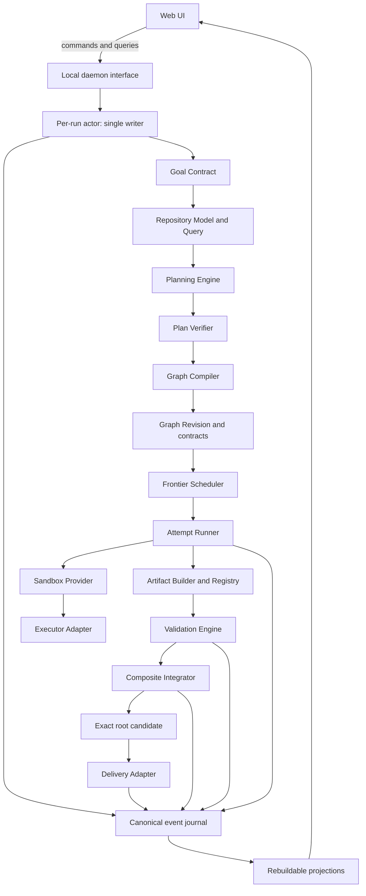

# ManyHands Correctness-First System Redesign Implementation Plan

> **For Claude:** REQUIRED SUB-SKILL: use the repository's TDD and plan-execution
> workflow to implement this plan one stage at a time. Read this document in full
> before changing production code.

**Goal:** Rebuild ManyHands around semantic software boundaries, exact scoped
artifacts, explicit hierarchical integration, durable single-owner execution and
verifiable outcomes, so that large task trees are useful when the work actually
supports them.

**Architecture:** ManyHands remains a local modular monolith. A durable run daemon
owns every mutation and coordinates pure domain modules for repository modeling,
planning, graph compilation, scheduling, execution, validation and integration.
The web application becomes a command/query client. Planning is progressive and
repository-driven; execution transports declared artifacts rather than whole
child commits; every attempt runs in an explicitly classified sandbox and every
adopted result is proven on an exact candidate.

**Tech Stack:** TypeScript, Zod, Node.js 22+, pnpm workspace, Vitest, Next.js,
Git, JSONL event journals, content-addressed artifact manifests and pluggable
local sandbox/executor adapters.

---

## 0. Authority, status and rules for implementation agents

### 0.1 Authority

This document is the single normative source for the redesign starting on
2026-08-12. It replaces the former architecture decisions, ADRs, system/design
specifications, core-pillar documents and the 2026-08-05 implementation plan.
Those documents were removed because they described mutually incompatible
targets and, in several cases, presented partial behavior as complete.

The remaining sources have narrower authority:

1. `PRODUCT.md` defines product purpose, users and stable experience principles.
2. This document defines target architecture, domain language, implementation
   order and exit criteria.
3. `docs/agents/` defines local agent workflow only.
4. `docs/tesis/` contains academic material and attributable historical
   evidence. It never defines current behavior and must not be rewritten to
   match the new architecture.
5. Source code, tests and persisted runs describe the current implementation,
   not the target. A passing test can characterize legacy behavior without
   making that behavior desirable.

If this plan conflicts with historical evidence, preserve the evidence and
follow this plan for future implementation. If the implementation contradicts
this plan, record the difference as a transition gap; do not weaken the plan to
match the code.

### 0.2 Required reading and execution protocol

Before implementing any stage, the agent must:

1. Read this document completely.
2. Confirm the actual Git root and inspect `git status --short` and
   `git diff HEAD`.
3. Read the productive path and tests named by that stage.
4. Write or identify the stage's characterization tests.
5. For every behavioral change, produce a regression that fails for the right
   reason before changing production code.
6. Implement the smallest vertical replacement that satisfies the new
   interface.
7. Remove the superseded path once no productive caller needs it. Compatibility
   code must have a named consumer and an explicit retirement stage.
8. Run the narrow tests, affected typechecks/builds and then `pnpm test` in full
   on the exact tree being handed off.
9. Preserve unrelated modifications and historical evidence. Never use global
   `stash`, `reset` or `clean`.
10. Match each modified file's committed line-ending convention and inspect
    `git diff --numstat` before committing.

### 0.3 Freeze on expensive experiments

No large live-model benchmark, five-run longitudinal series or wide-graph run is
authorized by this plan until Stage 12 says the architecture is eligible. Until
then, development uses pure unit tests, repository fixtures, recorded model
replays, real-Git integration tests and process/sandbox tests. A live model may be
used only by an explicitly opt-in smoke test after its prerequisites are green.

### 0.4 What this plan is not

- It is not a request to maximize node count.
- It is not a rewrite of the entire repository in one branch.
- It is not permission to delete thesis/demo evidence.
- It does not make model output authoritative.
- It does not promise hostile-code isolation until the sandbox capability tests
  pass.
- It does not introduce microservices, a remote queue, Kubernetes or a database
  server. The product is local and single-user.

---

## 1. Executive diagnosis

The failed demonstration was partly an experimental-design failure and mostly a
system-design failure.

The tasks and oracles were too small and mechanical to establish useful graph
scale, architectural coherence or product quality. The successful graphs had
only one or two leaves while token consumption increased sharply. Passing those
oracles demonstrated that selected control-plane paths could produce, validate
and deliver code; it did not demonstrate that ManyHands could design a coherent
application, construct a deep hierarchy, coordinate substantial siblings or
integrate a large result.

The stronger finding is in the implementation. ManyHands currently has a
sophisticated operational shell around an under-specified engineering model:

- planning reduces the repository to a broad path inventory and generic file
  observations;
- a leaf is accepted mainly from path count and the presence of a test;
- relationships and seam descriptions are synthesized from read/write path
  intersections;
- the productive route projects a semantic plan back through a legacy work
  breakdown before compiling;
- contracts advertise artifact kinds that the runtime cannot materialize;
- every output is transported as an entire commit;
- composites integrate late but do not normally own planned shared edits;
- benchmark-specific nouns and methods reached production prompts and
  validation heuristics;
- a Next.js process owns long-running jobs through in-memory promises;
- liveness repair and durable fencing compensate for that process topology;
- agent profiles bypass approvals and can run with host-level access, while a
  worktree is described too loosely as sandboxing.

This is why adjusting a threshold or asking for more children will not fix the
system. It would produce more path partitions and more whole-commit conflicts,
not better software boundaries.

The redesign therefore follows one governing statement:

> ManyHands optimizes for independently implementable and hierarchically
> verifiable product increments. Tree size is an observed consequence of real
> boundaries, never a target or a success metric.

---

## 2. Findings that the redesign must correct

### F1. Repository grounding is structurally shallow

The current productive planning host projects indexed files into generic
observations and initializes the root with an effectively repository-wide read
set. Import relationships are incomplete in the fast index, and useful symbol,
export, test and boundary information is not presented as a queryable model.
Each recursive planning call receives broad evidence again.

**Consequence:** cost scales with repeated inventory, while semantic knowledge
does not. The planner knows file names but cannot reliably reason about public
interfaces, ownership, callers, tests, schemas or integration hotspots.

**Required correction:** build one immutable `RepositoryModel` and expose it to
planning through budgeted queries and stable evidence references. A prompt is a
projection of that model, not the model itself.

### F2. Planning models paths rather than software responsibilities

The current cut contract primarily contains objective, criteria and read/write
paths. Seams, compatibility and validation are then synthesized from those
paths. A source-file extension can determine a seam kind, and a generic
repository validation can stand in for a semantic obligation.

**Consequence:** architectural language in the graph can be post-hoc decoration
over file overlap. It cannot guarantee that siblings agree on behavior,
idempotency, errors, data shape or public API.

**Required correction:** a planned unit must declare an observable outcome,
owned responsibility, grounded repository surface, produced/consumed artifacts,
interface semantics, validation obligations, uncertainty and parent integration
obligation. Exact runtime IDs and mechanics remain the Graph Compiler's job.

### F3. The current leaf predicate forces tiny or arbitrary trees

`RecursivePlanner` stops when scope is below a fixed path budget and the unit
writes a test. Production passes a single path threshold. During the discarded
demonstration, temporary patches also added test paths automatically and inferred
independence from trigger words; those patches were removed during the baseline
cleanup. The model is still not asked whether another architectural cut would
improve verification, risk isolation or parallel delivery.

**Consequence:** small repositories collapse to one leaf, while lowering the
threshold merely creates more arbitrary nodes. Prompt wording and path counts
still substitute for a formal contract that can prove independence.

**Required correction:** leaf feasibility and split desirability are distinct.
A leaf must be coherent, bounded, grounded and verifiable. A split must have an
explicit reason and an integration recipe. Natural-language trigger words never
create independence.

### F4. Planning has multiple competing representations

The productive path creates a recursive tree, projects it to `SemanticPlan`,
projects that plan into a legacy `WorkBreakdown`, applies policy and projects
again for compilation/metrics. The documentation previously claimed one
canonical representation while production still crossed the compatibility
shape.

**Consequence:** defaults and semantics can drift at each translation; agents
cannot tell which shape is authoritative; tests validate adapters rather than
the real boundary.

**Required correction:** `SemanticPlan` is the only planning-domain output.
`GraphRevision` is the only runtime graph output. The Graph Compiler is the one
intentional transformation between those two different domains. No
`SemanticPlan -> WorkBreakdown -> SemanticPlan` path may remain productive.

### F5. The conflict model forbids normal shared work

The current planner expects globally disjoint leaf writes. This avoids textual
collisions but makes shared types, route registries, package manifests, barrels,
migrations and configuration difficult or impossible to allocate. Pairwise
`ConflictConstraint` edges also grow quadratically.

**Consequence:** a real integration concern is either rejected at planning or
discovered late by Git. The architecture says the parent owns integration, but
the parent lacks a normal planned implementation phase for shared files.

**Required correction:** nodes claim named resources. Shared interface work is
performed contract-first; shared integration files belong to the composite.
The scheduler compares resource keys rather than materializing an all-pairs
matrix.

### F6. Artifact contracts and transport disagree

Schemas permit logical, file, manifest and commit artifacts. Runtime
materialization supports logical no-op and whole-commit cherry-pick; integration
rejects non-commit artifacts. One candidate commit is registered for every
produced artifact of a node.

**Consequence:** a contract that names a file subset still transports all
changes in the commit. Transitive changes, duplicate ancestry, empty
cherry-picks and unrelated conflicts cross node boundaries.

**Required correction:** commit SHA is provenance, not artifact kind. Every
materializable artifact has a content-addressed manifest describing exact paths,
preimages and postimages. Execution bases apply only required manifests.

### F7. Integration is a merge step rather than planned engineering work

Composite integration applies child commits, optionally repairs conflicts and
validates. It does not begin with a first-class integration contract that owns
shared edits and seam-level tests.

**Consequence:** clean cherry-pick can be mistaken for compatibility, and shared
work has no normal owner. Large graphs defer semantic incompatibility to the
root, where the repair context and blast radius are largest.

**Required correction:** every composite has an `IntegrationContract`, resource
claims, validation obligations and an immutable integration attempt. It builds a
new candidate from exact child artifacts and proves the composite before its
artifact is adoptable.

### F8. Validation has strong custody but weak semantic attribution

Exact candidate sandboxes, evidence matrices, baselines and negative controls
are valuable. The weakness is upstream: criteria and validation references are
often inferred from paths, so a command can be proven to have passed without
proving that it meaningfully covers the user's requirement.

**Required correction:** acceptance criteria originate in a versioned
`GoalContract`; child obligations refine but never silently replace them. Every
evidence binding identifies criterion, obligation, exact selector and candidate.
Composite and root validation run against the combined result.

### F9. Production contains benchmark-specific policy

The productive executor and test-integrity validator contain special handling
for `backorders` and the exact operation `currentBackorders()`.

**Consequence:** experiment repairs have become global behavior, prompt size
grows, generality is compromised and later thesis evidence is biased.

**Required correction:** production code may not contain benchmark-domain nouns
or expected fixture methods. A source-hygiene test enforces this. Fixtures remain
in tests and evidence only.

### F10. Long-running execution has the wrong process owner

The web application starts background promises stored on `globalThis`. A web
restart loses them. Reads can trigger liveness reconciliation and cancellation.
Leases, fences, heartbeats, process tables, takeovers and cache reconciliation
then compensate for an avoidable ownership topology.

**Required correction:** a dedicated local daemon owns commands, run actors,
processes and journals. The web process is stateless with respect to execution.
Queries have no domain side effects.

### F11. Worktree isolation is not execution sandboxing

The environment allowlist reduces secrets but explicitly does not sandbox the
agent. Current profiles can select `danger-full-access` or skip permission
checks, while host identity directories are forwarded for authentication.

**Required correction:** model four independent guarantees—checkout isolation,
process/resource isolation, filesystem/network permissions and Git input
identity. Executor profiles declare measured sandbox capabilities. Unsafe local
execution is explicit and never described as isolated.

### F12. Legacy and current modules coexist without a retirement boundary

Large legacy planners, executors and integration implementations remain exported
alongside V2 modules. Some package READMEs describe frameworks or pools that are
not on the productive route.

**Required correction:** each migration stage publishes a reachability test and
deletes the superseded implementation after callers move. No permanent V3/V2/V1
stack and no compatibility adapter without an identified historical reader.

---

## 3. Product and system requirements

### 3.1 Functional requirements

The redesigned system must:

1. Accept a software goal, explicit acceptance criteria, constraints, quality
   attributes and an immutable repository target.
2. Inspect the exact base tree and produce a queryable repository model with
   declared coverage and uncertainty.
3. Produce a semantic hierarchical plan whose nodes correspond to real product
   or architecture boundaries.
4. Explain why each unit is a leaf or why each composite is split.
5. Compile exactly one semantic plan revision into exactly one executable graph
   revision and versioned contracts.
6. Support bounded, local plan expansion and amendments without invalidating
   unrelated work.
7. Dispatch only nodes whose exact inputs, resources, decisions and executor
   capabilities are ready.
8. Execute every attempt against an exact base in a classified sandbox.
9. Inspect changes from Git, enforce scope/resource ownership and create
   orchestrator-owned candidate commits.
10. Produce exact artifact manifests and materialize only declared artifacts.
11. Validate leaf, composite, root and delivery candidates against obligations
    appropriate to each level.
12. Integrate bottom-up, including planned parent-owned edits and seam tests.
13. Recover according to observed cause and preserve immutable failed attempts.
14. Continue independent work while a local decision is pending.
15. Survive a web restart without affecting a run and recover deterministically
    from a daemon crash.
16. Present plan, activity, decisions, evidence and delivery without inventing
    state in the UI.
17. Deliver exactly the tree that was finally validated.

### 3.2 Non-functional requirements

#### Correctness and reproducibility

- Every adopted result is attributable to an exact input fingerprint.
- Every materialized artifact is verified by digest and preimage.
- Every lifecycle transition is derived from durable facts.
- Replaying an event journal produces the same domain projection.
- Re-running a deterministic failed attempt with an identical fingerprint is
  forbidden unless the recovery policy explicitly identifies new evidence.

#### Cost control

- Offline tests and recorded replays are the default development loop.
- Planning context is retrieved per unit under a recorded budget; it is not a
  repeated full-repository dump.
- Fan-out is bounded by useful independence and runtime budget.
- Token, duration, context mass, retries and integration cost are recorded per
  attempt and composite.
- A metric not observed is `unknown`, never zero.

#### Scale

- Repository modeling must handle monorepos without embedding the whole index in
  a prompt.
- Scheduling resource conflicts must be proportional to claims, not all node
  pairs.
- Event append and normal projection updates must not rewrite full history.
- Graph depth has no product target; practical bounds come from planning and
  execution budgets and are reported when reached.

#### Security

- Repository content, model output, paths, commands and browser inputs are
  untrusted.
- No unattended attempt runs under an executor profile below the configured
  minimum sandbox capability.
- Credentials are scoped to one executor/attempt and are absent from prompts,
  diffs and durable logs.
- Validation commands come from trusted repository/config sources and compiled
  recipes, never from agent prose.
- Delivery publishes only the validated final manifest.

#### Maintainability

- Domain packages do not depend on Next.js, React, a model SDK or a specific CLI.
- Each module has one narrow external interface; internal adapters are not
  re-exported by default.
- There is one representation of each concept at each seam.
- A migration is incomplete while both old and new productive paths remain.

#### User experience

- The graph tells the real causal story of the run.
- Pending human decisions block only affected work.
- Candidate, verified, stale, failed and delivered remain distinct.
- The canvas does not move in response to run activity.
- WCAG 2.2 AA and reduced motion remain required.

---

## 4. Architectural invariants

These invariants are stronger than implementation convenience. A change that
violates one is incorrect even if a narrow test passes.

### Domain and authority

- **I1 — Run as product unit.** A run transforms one immutable goal/target into
  one attributable delivered result or one explained adverse outcome.
- **I2 — One writer.** Exactly one run actor in the daemon may append domain
  facts for a run. Web handlers, background timers and queries never mutate run
  state directly.
- **I3 — Events are facts.** The event journal is canonical; snapshots, list
  indexes and UI models are rebuildable projections.
- **I4 — Framework independence.** Domain contracts do not contain Next.js,
  React Flow, LangGraph, Claude or Codex types.

### Planning and graph

- **I5 — One planning representation.** `SemanticPlan` is the sole output of
  planning. `GraphRevision` is the sole executable graph. Only the Graph Compiler
  transforms between them.
- **I6 — Grounded claims.** Every repository-specific planning statement points
  to repository evidence or is explicitly marked hypothetical/unknown.
- **I7 — Semantic leaves.** Path count and test presence may inform capacity but
  can never, alone, establish leafhood.
- **I8 — Justified cuts.** Every composite records at least one valid split
  reason and a concrete integration obligation.
- **I9 — Hierarchy differs from readiness.** `parentId` means integration
  ownership. `ArtifactRequirement` means material availability. `SeamBinding`
  means compatibility. `ResourceClaim` controls exclusion. None substitutes for
  another.
- **I10 — Local evolution.** An amendment invalidates only attempts whose exact
  inputs changed.

### Execution and artifacts

- **I11 — Immutable attempts.** A retry or repair is a new attempt with lineage;
  failed evidence is never overwritten.
- **I12 — Exact bases.** Every attempt records the base tree, consumed artifact
  digests, contract revisions, context digest, executor profile and sandbox
  capability in its fingerprint.
- **I13 — Orchestrator-owned commits.** Agents edit files; the orchestrator
  inspects, stages and creates all candidate commits.
- **I14 — Scoped transport.** A consumer receives only declared artifact
  contents. A whole commit is never silently substituted for a path-scoped
  artifact.
- **I15 — Supported kinds only.** A materializable artifact kind cannot enter an
  approved graph unless a materializer and round-trip contract test exist.
- **I16 — Shared ownership is explicit.** Shared files/resources belong to a
  contract-first producer or a composite integrator, not multiple concurrent
  leaves.

### Validation, integration and delivery

- **I17 — Evidence has attribution.** A passing command without an explicit
  criterion/obligation binding proves no product criterion.
- **I18 — Validation is hierarchical.** Leaf success is not transitive. Every
  composite and the root validate their exact combined candidate.
- **I19 — Integration is an attempt.** Composite integration has an immutable
  base, inputs, diff, candidate, evidence and failure classification.
- **I20 — Git cleanliness is insufficient.** A conflict-free apply is not proof
  of contract or behavioral compatibility.
- **I21 — Exact delivery.** `completed` requires a receipt for the same tree and
  commit named by the final validated manifest.

### Safety and operations

- **I22 — Worktree is not sandbox.** Checkout isolation and host security are
  reported separately.
- **I23 — Capability honesty.** The UI and journal expose the effective sandbox,
  network and credential policy of every attempt.
- **I24 — Cause-based recovery.** The system never applies a universal retry
  count to unrelated failure classes.
- **I25 — Read-only queries.** Reading a run cannot cancel, resume, repair or
  otherwise advance it.
- **I26 — No benchmark knowledge in production.** Product code and generic
  prompts contain no benchmark-domain nouns, expected fixture methods or oracle
  answers.

---

## 5. Canonical domain language

Use these terms consistently in code, tests, UI and future documentation.

**Goal Contract**

The immutable statement of desired behavior, acceptance criteria, constraints,
quality attributes and protected oracle references for a run. Avoid: raw prompt
when referring to the accepted requirement.

**Repository Snapshot**

The immutable identity of the target repository at one exact commit/tree and
index schema version.

**Repository Model**

The structured, evidence-bearing interpretation of a Repository Snapshot:
packages, modules, symbols, imports, public interfaces, tests, commands,
resources, inferred ownership and coverage.

**Planning Evidence**

A stable reference to repository content or analysis that supports a planning
claim. It contains identity and digest; it is not pasted prose.

**Semantic Plan**

The canonical, versioned planning result. It describes outcomes,
responsibilities, boundaries, artifacts, seams, validation and integration
intent without runtime scheduling mechanics.

**Work Unit**

A node in a Semantic Plan. A Work Unit is either a leaf-sized implementation
responsibility or a composite responsibility that owns children and their
integration.

**Leaf**

A Work Unit that one agent can implement as a coherent, bounded and independently
validatable change against exact inputs.

**Composite**

A Work Unit that owns a meaningful product/architecture result assembled from
children. It owns the shared integration surface and validates the combined
result.

**Planning Frontier**

The set of approved but not yet expanded composite units whose contracts permit
local expansion. Avoid: incomplete graph when the incompleteness is deliberate
and represented.

**Graph Revision**

The immutable executable projection of one Semantic Plan revision. It contains
runtime node identities, typed relations and references to versioned contracts.

**Resource Claim**

A node's declared use of a named resource with mode `shared_read`,
`exclusive_write` or `integration_write`. It replaces pairwise conflict edges as
the scheduling primitive.

**Seam Contract**

The versioned observable agreement that lets separately implemented work meet:
signature/schema plus relevant semantics, compatibility and verification.

**Artifact Contract**

The versioned description of an output that another node can consume. It defines
content selectors and materialization; it is not a commit.

**Artifact Manifest**

The immutable, content-addressed record of one produced artifact, including
source candidate, exact paths/blobs, preimages, postimages and digest.

**Candidate**

A Git commit/tree created by the orchestrator from one attempt. It is not
adoptable until its contracts and evidence pass.

**Attempt**

One immutable execution against an exact `InputFingerprint`. Implementation,
repair and integration are distinct attempt purposes with explicit lineage.

**Execution Base**

The exact tree constructed from the run base and declared input artifacts for
one attempt.

**Validation Obligation**

A versioned statement of what must be demonstrated for one criterion at one
hierarchy level.

**Evidence Matrix**

The attribution of exact observations to validation obligations on one exact
candidate.

**Adoption**

The durable decision that a fresh, verified artifact may satisfy graph
requirements. Executor exit code never implies adoption.

**Integration Attempt**

The composite-owned attempt that materializes child artifacts, performs planned
shared edits if necessary and validates the combined candidate.

**Amendment**

A versioned, evidence-backed proposed change to plan, graph or contracts. It
states impact and preserved work before it is applied.

**Run Actor**

The daemon-owned serialized command processor for one run. It is the only domain
writer for that run.

**Diagnostic Trace**

Provider output, prompt references, timings and logs useful for diagnosis but not
authoritative for lifecycle or correctness.

---

## 6. High-level target architecture



### 6.1 Deployment topology

The target is one local installation with two processes:

- `apps/daemon`: durable process owner, composition root and local command/query
  endpoint;
- `apps/web`: Next.js presentation process and static assets.

All domain logic remains in packages. This is not a network microservice split:
the daemon exists because process ownership is a real seam. Development may run
both from one launcher, but restarting the web process must not restart or take
ownership of runs.

### 6.2 Dependency direction

```text
apps/web -------------> run query/client contracts
apps/daemon ----------> run-engine + concrete adapters

run-engine -----------> run-coordinator, planner, scheduler,
                         execution-core, run-store, trace-store
run-coordinator ------> task-graph, contracts, shared
decomposer -----------> repository-index, contracts, task-graph, shared
scheduler ------------> task-graph, contracts, shared
execution-core -------> contracts, repository-index, shared, trace-store
task-graph -----------> contracts, shared
repository-index -----> shared
run-store ------------> run-coordinator domain events, shared
```

`apps/web` must stop importing execution adapters and composing the run engine.
`packages/orchestrator-graph` is retired after its useful driver behavior moves
behind the `run-engine` interface. No package may depend on `apps/*`.

### 6.3 Deep modules and their external interfaces

| Module | External interface | Complexity hidden |
|---|---|---|
| Repository Model | `inspect`, `query`, `buildContextPack` | parsing, caching, relevance, coverage |
| Planning Engine | `plan`, `expand`, `amend` | model tools, local repair, budgeting |
| Graph Compiler | `compile` | IDs, contracts, resource claims, graph checks |
| Scheduler | `selectFrontier` | readiness, resources, budgets, fairness |
| Run Engine | `submitCommand`, `queryRun` | actors, recovery, dispatch, adoption |
| Attempt Runner | `executeAttempt` | base, sandbox, CLI, Git inspection |
| Validation Engine | `validateCandidate` | recipe, baseline, controls, attribution |
| Composite Integrator | `integrate` | artifact application, shared edits, seam checks |
| Event Store | `append`, `read`, `snapshot` | durability, CAS, upcasting, recovery |

Callers and tests use these interfaces. Internal adapters are injected and are
not exposed merely to make tests easy.

---

## 7. End-to-end run flow

### 7.1 Intake and planning

1. The web sends `create_run` with target, goal, criteria and configuration to
   the daemon.
2. The daemon validates the request, resolves the exact base commit/tree and
   appends `run.created` with a `GoalContract` digest.
3. The Repository Model inspects that exact snapshot. It records coverage,
   warnings and capability evidence.
4. The Planning Engine queries relevant packages, symbols, tests and boundaries.
   It may ask a human only when an answer changes behavior, architecture, scope,
   risk or acceptance.
5. Planning creates a top-level semantic architecture and expands units until
   the approved execution horizon contains feasible leaves and represented
   planning-frontier composites.
6. The Plan Verifier checks outcome coverage, seam sufficiency, resource
   ownership, leaf feasibility, integration obligations and uncertainty.
7. The Graph Compiler creates one immutable `GraphRevision` and all referenced
   contracts directly from the accepted `SemanticPlan`.
8. The user reviews and approves that exact revision. The approval includes the
   bounded auto-expansion policy for frontier composites.

### 7.2 Progressive expansion

An unexpanded composite is not an executable leaf. When its parent contract and
available repository knowledge make expansion useful, the run actor invokes
`PlanningEngine.expand(unitId)`.

The result is auto-adoptable only when it stays inside the approved envelope:

- parent objective and criteria are unchanged;
- no new external seam or protected resource is introduced;
- write/resource envelope does not expand;
- risk and cost remain within approved policy;
- parent integration obligation remains satisfiable.

Otherwise the expansion becomes an `Amendment` and requires approval. Already
adopted work remains fresh when its fingerprints do not change.

The first implementation may expand the entire plan before execution while the
domain model and events already represent frontiers. Overlapping planning and
execution is a later optimization, not a prerequisite for correctness.

### 7.3 Leaf execution

1. Scheduler computes ready nodes from approved graph, fresh artifacts,
   decisions, resources, executor capability and budget.
2. The run actor persists the selection before dispatch.
3. `ExecutionBaseBuilder` constructs an exact tree from run base plus only the
   required artifact manifests.
4. `AttemptRunner` creates an ephemeral workspace and sandbox, then passes a
   context projection and contract to the selected executor.
5. The agent edits files but does not commit.
6. The orchestrator inspects Git status/diff, validates resource and path scope,
   stages permitted changes and creates a candidate commit.
7. `ArtifactBuilder` extracts exact output manifests from that candidate.
8. `ValidationEngine` validates the exact candidate in a separate clean
   workspace and builds the Evidence Matrix.
9. The run actor reloads current inputs, recomputes freshness and either adopts
   the artifacts or records the attempt as stale/rejected.

### 7.4 Composite integration

1. A composite becomes ready when required child artifacts are fresh and its
   integration resources are available.
2. Its exact integration base is built from parent base and declared child
   manifests.
3. Deterministic application checks preimages and ordering. A mismatch is a
   classified integration input failure, not an arbitrary merge failure.
4. If the `IntegrationContract` owns shared edits, an integration executor makes
   those edits under the parent's resource claims.
5. The orchestrator creates the composite candidate and validates seam,
   integration and parent criteria on the combined result.
6. The composite produces new scoped artifacts and/or a candidate-tree manifest
   for its parent.

### 7.5 Root and delivery

The root integration attempt builds the complete candidate, runs global build,
regression, end-to-end and required quality checks, then emits a
`FinalArtifactManifest`. Delivery is a separate adapter operation. It publishes
that exact commit/tree, verifies the destination and appends a matching receipt.
Only then is the run `completed`.

---

## 8. Canonical data model

The types below are normative shapes, not copy-paste-complete code. Exact schema
syntax belongs in `packages/contracts` and `packages/task-graph`; fields may be
split into named subtypes while preserving the semantics and single-source rule.

### 8.1 Goal Contract

```ts
type GoalContract = {
  id: string;
  revision: number;
  goal: string;
  acceptanceCriteria: Array<{
    id: string;
    statement: string;
    required: boolean;
    level: "product" | "quality" | "constraint";
    protectedReferences?: string[];
  }>;
  constraints: string[];
  qualityAttributes: Array<{
    kind: "security" | "accessibility" | "performance" |
          "compatibility" | "maintainability" | "operability";
    statement: string;
  }>;
  target: {
    repositoryId: string;
    baseCommit: string;
    treeSha: string;
  };
  digest: string;
};
```

Criteria are never created from a test file name. Child criteria may refine a
parent criterion, but the parent remains responsible for proving the original
statement on the integrated result.

### 8.2 Repository Model and evidence

```ts
type RepositoryModel = {
  snapshot: RepositorySnapshotRef;
  packages: PackageBoundary[];
  modules: ModuleBoundary[];
  symbols: SymbolRecord[];
  relationships: ImportRelationship[];
  publicInterfaces: PublicInterfaceRecord[];
  tests: TestRelationship[];
  commands: RepositoryCommand[];
  resources: RepositoryResource[];
  conventions: ConventionRecord[];
  diagnostics: RepositoryDiagnostic[];
  coverage: CoverageReport;
  digest: string;
};

type PlanningEvidenceRef = {
  id: string;
  snapshotId: string;
  kind: "file" | "symbol" | "relationship" | "test" |
        "command" | "convention" | "diagnostic";
  locator: string;
  digest: string;
  confidence: "high" | "medium" | "low";
};
```

The public query seam is budgeted and evidence-returning:

```ts
interface RepositoryQuery {
  searchGoalTerms(input: GoalTermsQuery): Promise<EvidencedResult[]>;
  inspectBoundary(ref: string): Promise<BoundaryView>;
  relatedSymbols(refs: string[]): Promise<SymbolView[]>;
  dependencyNeighborhood(refs: string[], depth: number): Promise<GraphView>;
  relatedTests(refs: string[]): Promise<TestView[]>;
  validationCapabilities(refs: string[]): Promise<ValidationCapabilityView>;
  readExcerpts(refs: ContentRef[], budget: ContextBudget): Promise<Excerpt[]>;
}
```

Every query reports cost, truncation and unknowns. The planner cannot request an
unbounded `allFilesWithContents` operation.

### 8.3 Semantic Plan

```ts
type SemanticPlan = {
  id: string;
  revision: number;
  goalContract: ContractRef;
  repositorySnapshot: RepositorySnapshotRef;
  rootUnitId: string;
  units: Record<string, WorkUnit>;
  seams: Record<string, PlannedSeam>;
  artifacts: Record<string, PlannedArtifact>;
  decisions: PlanningDecisionRecord[];
  evidence: PlanningEvidenceRef[];
  status: "ready" | "needs_input" | "rejected";
  digest: string;
};

type WorkUnit = {
  id: string;
  parentId?: string;
  role: "leaf" | "composite";
  title: string;
  objective: string;
  boundary: {
    kind: "application" | "package" | "module" | "domain" |
          "vertical_slice" | "cross_cutting";
    refs: PlanningEvidenceRef[];
  };
  outcomes: PlannedOutcome[];
  criteria: CriterionRefinement[];
  repositorySurface: RepositorySurface;
  resourceIntents: PlannedResourceIntent[];
  consumes: string[];
  produces: string[];
  seamRefs: string[];
  validation: PlannedValidationObligation[];
  uncertainty: PlanningUncertainty[];
  granularity: GranularityDecision;
  expansion: "leaf" | "expanded" | "frontier";
  integration?: PlannedIntegration;
};
```

The plan does not contain scheduler waves, attempt IDs, candidate commits,
runtime artifact digests or duplicated compiled scopes.

### 8.4 Granularity Decision

```ts
type GranularityDecision = {
  disposition: "leaf" | "split" | "frontier";
  feasibility: {
    coherentResponsibility: boolean;
    boundedContext: "yes" | "no" | "unknown";
    boundedChangeSurface: "yes" | "no" | "unknown";
    independentlyValidatable: "yes" | "no" | "unknown";
    unresolvedArchitectureDecision: boolean;
  };
  splitReasons: Array<
    "capacity" | "independent_delivery" | "parallelism" |
    "risk_isolation" | "integration_boundary" | "specialization"
  >;
  expectedBenefits: string[];
  expectedCosts: string[];
  integrationObligationId?: string;
  evidenceRefs: string[];
  confidence: "high" | "medium" | "low";
};
```

`split` is invalid without a reason, evidence and parent integration obligation.
`leaf` is invalid when a feasibility field is `no`. `unknown` may produce a
frontier, targeted inspection or human decision; it is never silently treated as
`yes`.

### 8.5 Executable Graph Revision

```ts
type GraphRevision = {
  graphId: string;
  revision: number;
  semanticPlan: { id: string; revision: number; digest: string };
  rootId: string;
  nodes: Record<string, TaskNode>;
  artifactRequirements: ArtifactRequirement[];
  seamBindings: SeamBinding[];
  resourceClaims: ResourceClaim[];
  contractRefs: ContractRef[];
  createdAt: string;
};

type ResourceClaim = {
  id: string;
  nodeId: string;
  resourceKey: string;
  mode: "shared_read" | "exclusive_write" | "integration_write";
  phase: "implementation" | "validation" | "integration" | "delivery";
  source: "planner" | "compiler" | "repository_policy";
  evidenceRefs: string[];
  confidence: "high" | "medium" | "low";
};
```

Resource keys are normalized names such as `package:contracts`,
`module:billing`, `file:src/index.ts`, `schema:orders` or
`service-port:localhost:3100`. The compiler may generate claims from exact
paths/configuration, but a risk scorer cannot create a functional dependency.

### 8.6 Contracts per node

Every executable node references one immutable bundle:

```ts
type NodeContractBundle = {
  task: TaskContract;
  change: ChangeContract;
  context: ContextContract;
  consumes: ArtifactContract[];
  produces: ArtifactContract[];
  seams: SeamContract[];
  validation: ValidationContract;
  integration?: IntegrationContract;
  revision: number;
  digest: string;
};
```

`ChangeContract` owns adoption boundaries and resource claims. `ContextContract`
defines initial context and discovery policy. Reading a newly discovered normal
source file is not the same as gaining permission to modify it. Protected paths,
secrets and oracle files remain hard-denied.

### 8.7 Artifact Contract and Manifest

Supported initial artifact kinds are deliberately small:

- `change_set`: exact file/blob changes against a known base tree;
- `interface_snapshot`: a change set designated as a shared contract baseline;
- `candidate_tree`: a complete tree produced by a composite/root;
- `evidence_bundle`: non-materializable evidence references.

No other kind enters the schema until a materializer and tests exist.

```ts
type ArtifactManifest = {
  id: string;
  contract: ContractRef;
  kind: "change_set" | "interface_snapshot" |
        "candidate_tree" | "evidence_bundle";
  producerNodeId: string;
  producerAttemptId: string;
  inputFingerprint: string;
  sourceCandidate: { commitSha: string; treeSha: string };
  baseTreeSha: string;
  entries: Array<{
    path: string;
    operation: "add" | "modify" | "delete" | "rename";
    previousPath?: string;
    beforeBlobSha?: string;
    afterBlobSha?: string;
    mode?: string;
  }>;
  contentDigest: string;
  evidenceMatrixId: string;
  status: "candidate" | "verified" | "adopted" | "stale" | "rejected";
};
```

Materialization verifies base tree compatibility and every declared preimage.
It may use a binary Git patch internally, but the manifest remains the canonical
description. An artifact with undeclared paths is rejected before adoption.

### 8.8 Attempt and fingerprint

```ts
type Attempt = {
  id: string;
  runId: string;
  nodeId: string;
  purpose: "implementation" | "repair" | "integration" | "validation";
  ordinal: number;
  lineage?: { retryOf?: string; repairOf?: string };
  inputFingerprint: string;
  baseManifestId: string;
  contractDigest: string;
  contextDigest: string;
  executorProfileDigest: string;
  sandboxCapabilityDigest: string;
  consumedArtifactDigests: string[];
  state: "prepared" | "running" | "candidate" | "validated" |
         "failed" | "stale" | "cancelled";
};
```

The fingerprint includes all fields that can change eligibility. The global
graph revision is provenance but does not invalidate an unrelated node by
itself; referenced node/contract/resource revisions do.

### 8.9 Evidence and final result

An evidence observation must include exact candidate, command/static proof,
selectors, output digest, environment digest and criterion/obligation IDs.
`satisfied` is impossible without an applicable observation. Composite evidence
may reuse a physical test execution for several obligations only when the recipe
declared those bindings before execution.

The final manifest contains the exact root commit/tree, all adopted root artifact
digests, goal contract digest, graph/contract revisions, evidence matrix and
delivery target. A delivery receipt must echo and verify the same tree.

---

## 9. Detailed module design

### 9.1 Repository Model

**Location:** evolve `packages/repository-index`.

**Responsibility:** turn an exact Git snapshot into a structured model and serve
bounded evidence queries. It does not decide work units.

**Required implementation:**

- Preserve exact commit/tree identity and cache by identity plus schema/profile.
- Parse package/workspace manifests and entrypoints.
- Extract TS/JS imports, exports, symbols and public signatures. Add coverage
  metadata for extensions/languages not fully parsed.
- Link tests to source using imports, naming conventions, configured projects and
  explicit test runner metadata.
- Identify schemas, migrations, generated files, shared registries, barrels,
  lockfiles and other integration hotspots as resources.
- Record conventions from repository evidence, never from benchmark wording.
- Provide a relevance service seeded by goal terms, affected symbols, dependency
  neighborhoods and tests.
- Return excerpts lazily with byte/token budgets and content digests.
- Keep unknown/partial results explicit and deterministic.

**Interface rules:** callers ask questions; they never receive the full model in
one default prompt. Query results return stable evidence references. Index timing
and cache-hit diagnostics are telemetry, not domain semantics.

**Failure behavior:** parser failure degrades only the affected file/language and
records coverage. Missing evidence for a required boundary blocks or asks for
targeted inspection; it never becomes low risk.

### 9.2 Planning Engine

**Location:** replace the productive route inside `packages/decomposer`.

**External interface:**

```ts
interface PlanningEngine {
  plan(input: PlanningRequest, signal: AbortSignal): Promise<PlanningResult>;
  expand(input: ExpansionRequest, signal: AbortSignal): Promise<PlanningResult>;
  amend(input: AmendmentPlanningRequest, signal: AbortSignal): Promise<PlanningResult>;
}
```

`PlanningResult` is `ready(SemanticPlan)`, `needs_input(DecisionDraft[])` or
`rejected(PlanningFinding[])`.

**Internal phases:**

1. **Goal analysis:** map product criteria and quality constraints without
   inventing repository facts.
2. **Impact discovery:** query likely modules, public interfaces, tests and
   resources.
3. **Architecture pass:** identify stable boundaries, shared contracts,
   integration hotspots and uncertainties.
4. **Unit expansion:** propose a bounded fan-out, normally 2–5 children, for one
   composite.
5. **Granularity decision:** evaluate leaf feasibility and split value.
6. **Plan verification:** run deterministic and model-assisted critics over the
   complete local proposal.
7. **Local repair:** return exact findings to the same planning context with a
   bounded retry budget. Preserve accepted ancestors/siblings.

The planner may use read-only repository tools. It must not receive every file as
static prompt context, modify the target, execute arbitrary commands or declare
runtime success.

### 9.3 Granularity policy

Granularity is a structured decision, not a scalar threshold.

#### Leaf feasibility gate

A unit is feasible as a leaf only when:

- it owns one coherent observable responsibility;
- expected context and change surface are bounded;
- dependencies and public contracts needed to start are available;
- it has at least one meaningful local validation obligation;
- unresolved architecture decisions do not affect siblings or the parent;
- one configured executor can reasonably complete it under budget;
- discarding/retrying it does not invalidate unrelated work.

Tests can be created by the leaf, but a predeclared test path is not required to
prove leafhood. Expected tool trajectory, impacted symbols/modules, repository
mass and uncertainty are better capacity signals than raw path count.

#### Valid split gate

A split is valid only when:

- every child has a distinct responsibility and output;
- parent criteria remain covered by parent integration obligations and child
  refinements;
- every child can begin from declared inputs or an explicit contract-first
  producer;
- resource ownership is unambiguous;
- the parent owns all shared integration work;
- the parent can state how the combined result will be validated;
- expected handoff/integration cost does not obviously dominate the benefit.

#### Decision order

1. If leaf is infeasible, request a semantic split or reject with the exact
   reason.
2. If leaf is feasible and no valid split exists, keep a leaf.
3. If a split enables independent delivery, meaningful parallelism, risk
   isolation or an explicit integration boundary, preserve it.
4. If evidence is insufficient but the parent envelope is stable, create a
   planning frontier and inspect later.
5. Never split simply to reach a depth/fan-out target.

Initially this is categorical and evidence-based. An expected-cost model may be
added only after enough comparable attempts exist. It must use measured units
(tokens, elapsed time, retries, integration attempts), publish calibration data
and retain an `unknown` state. The former uncalibrated utility score may remain
only in historical evidence, not in productive decisions.

### 9.4 Plan Verifier and Graph Compiler

**Location:** `packages/decomposer/src/compiler` initially; expose narrow
`verifyPlan` and `compilePlan` interfaces.

The verifier checks semantic truth available before execution:

- all product criteria have a root obligation;
- child refinements point to known parent criteria;
- leaves are feasible and composites have integration obligations;
- seams contain observable semantics and compatibility checks;
- artifact contracts have producers, consumers and supported kinds;
- resource ownership has no unexplained concurrent exclusive writers;
- contract-first producers precede their consumers;
- protected/oracle paths cannot enter write scopes;
- unknowns are surfaced with appropriate severity;
- planning frontiers remain inside approved envelopes.

The compiler performs mechanics:

- stable IDs and revisions;
- node contract bundles;
- `parentId`, `ArtifactRequirement`, `SeamBinding`, `ResourceClaim`;
- exact scope/resource normalization;
- validation obligation identities;
- integration contracts;
- graph acyclicity and reference validation;
- deterministic digesting.

The compiler does not call a model and does not repair semantic omissions. It
returns findings linked to semantic unit/evidence IDs. It never projects through
`WorkBreakdown` or accepts parallel lists of ownership/scopes/artifacts.

### 9.5 TaskGraph and Resource Claims

**Location:** evolve `packages/task-graph`; consume claim evaluation from
`packages/scheduler` or a small pure module.

The graph retains hierarchy, artifacts and seams. Pairwise
`ConflictConstraint[]` is replaced by `ResourceClaim[]` in the new schema.
Compatibility readers may upcast historical graphs into conservative claims for
replay, but productive compilation emits only claims.

Conflict rule:

```text
shared_read + shared_read       -> compatible
shared_read + exclusive_write   -> serialize unless a frozen seam permits read
exclusive_write + exclusive_write -> invalid or serialize by explicit ownership
integration_write               -> owned by the composite integration phase
unknown claim confidence        -> conservative scheduling and visible warning
```

Claims are indexed by resource key, making conflict evaluation proportional to
claims on relevant resources. The graph does not materialize every conflicting
pair. Historical pairwise relations remain readable only in the replay adapter.

### 9.6 Scheduler

**Location:** evolve `packages/scheduler`.

**External interface:**

```ts
interface FrontierScheduler {
  selectFrontier(input: SchedulerInput): SchedulerDecision;
}
```

The input is a pure snapshot: approved graph, adopted artifact digests,
decisions, active attempts and resources, executor/sandbox capacity, budget,
pause state and circuit breakers. The output lists selected nodes and an
explanation for every non-selected candidate.

Readiness requires:

- current node/contract revisions;
- all required artifacts fresh and materializable;
- compatible seam baseline where execution can proceed contract-first;
- no pending decision affecting the node;
- an available executor profile meeting required capabilities;
- resource claims compatible with active and newly selected nodes;
- budget and wall-clock allowance;
- no prior adoption for the same fingerprint.

Selection maximizes useful critical-path progress under the cap. It does not
maximize node count and does not introduce barriers: after any attempt settles,
the run actor records facts and recomputes the frontier. The durable term should
be `frontier.selection`; `wave` may remain only as a legacy event upcast or UI
historical label until migrated.

### 9.7 Artifact Builder, Registry and Execution Base

**Location:** `packages/execution-core/src/artifacts` and `src/base` initially;
metadata persistence remains in `packages/run-store`.

`ArtifactBuilder` compares candidate to exact base, selects only contract-owned
entries and produces a manifest plus content-addressed payload. It handles add,
modify, delete, rename, mode changes and binary files. It rejects output paths
not covered by the contract.

`ArtifactMaterializer`:

1. verifies manifest schema/digest;
2. verifies required base tree or each preimage blob;
3. applies only declared entries;
4. verifies resulting postimage blobs and modes;
5. records a composition step;
6. leaves a clean deterministic tree or fails without partial adoption.

`ExecutionBaseBuilder` deduplicates identical manifests by digest and refuses
incompatible preimages. It never traverses predecessor commits looking for
implicit changes. The resulting `ExecutionBaseManifest` is part of the attempt
fingerprint.

### 9.8 Attempt Runner and executor context

**Location:** deepen `packages/execution-core` behind `AttemptRunner`.

Responsibilities in order:

1. Materialize execution base.
2. Create ephemeral workspace.
3. Provision declared dependencies under policy.
4. Create sandbox and attempt-specific credential context.
5. Build a compact executor context from contracts and evidence refs.
6. Invoke `AgentExecutor` under process supervision.
7. Inspect Git state independently of stdout.
8. Enforce protected paths, resource claims and change contract.
9. Create orchestrator candidate or classified failure.
10. Build artifact manifests and request validation.
11. Dispose/archive according to evidence policy.

The generic implementation prompt contains principles, not benchmark fixes. It
must tell the agent the observable outcome, constraints, consumed artifacts,
owned resources, validation expectations and exact prior findings for a repair.
It must not prescribe fixture-specific method names.

A repair is a new attempt. The failed candidate may be committed to a quarantined
ref and used as the repair base, making the repair reproducible without adopting
it. Physical workspace reuse is an optimization only if the same logical state
and evidence guarantees are proven; it is not the initial design.

### 9.9 Sandbox, credentials and process supervision

**Location:** new internal modules under
`packages/execution-core/src/sandbox`, then adapters by platform/profile.

```ts
interface SandboxProvider {
  capabilities(): SandboxCapabilities;
  create(input: SandboxRequest): Promise<SandboxSession>;
}
```

Capabilities are factual:

```ts
type SandboxCapabilities = {
  filesystem: "worktree_only" | "declared_mounts" | "host_visible";
  process: "isolated_tree" | "supervised_only";
  network: "none" | "provider_only" | "allowlist" | "host";
  hostIdentity: "ephemeral" | "brokered" | "inherited";
  enforcement: "os" | "executor_native" | "advisory";
};
```

Profiles:

- `strong`: OS/container-enforced files/processes, explicit network and
  ephemeral/brokered identity;
- `workspace`: executor-native workspace confinement and supervised processes;
- `unsafe_local`: host-visible execution, explicit operator opt-in only.

Immediate migration removes unconditional bypass flags. The target default for
unattended writes must meet the configured minimum; an executor without that
capability is unavailable, not silently downgraded.

`CredentialBroker` builds an attempt-specific home/config with only required
provider material. Long-lived host `HOME`/`USERPROFILE` is not forwarded as the
general solution. Secrets are never serialized in events or traces.

The Process Supervisor owns process groups/job objects, timeouts and verified
termination. The daemon epoch and attempt ID are recorded with every process.
On supported platforms, daemon death should terminate descendants by OS
construction; startup reconciliation remains a second line of defense.

### 9.10 Validation Engine

**Location:** deepen `packages/execution-core/src/validation` behind one
`ValidationEngine` interface.

The engine takes candidate, prior base, `ValidationContract`, Repository Model
capabilities and sandbox policy. It compiles a recipe without model-written
commands, validates in a separate clean workspace and returns a complete Evidence
Matrix.

Evidence layers:

- leaf: change scope, static checks, focused tests and local criteria;
- composite: child artifact integrity, seam compatibility, integration tests and
  parent refinements;
- root: all product criteria, build, regression, end-to-end and required quality
  attributes;
- delivery: selected final checks plus exact tree identity.

Test integrity remains generic: detect deleted/disabled tests, `only`, unjustified
skip, assertion weakening and baseline behavior. Domain-specific public surfaces
belong in the Goal/Validation Contract or external oracle, never a regex in the
validator.

An external oracle is protected input to the run and executes outside agent
write scope. Its result is attributable to the exact final candidate but does not
rewrite internal evidence retroactively.

### 9.11 Composite Integrator

**Location:** replace whole-commit behavior in
`packages/execution-core/src/integration`.

The integrator is a deep module with one operation:

```ts
interface CompositeIntegrator {
  integrate(input: IntegrationAttemptInput, signal: AbortSignal):
    Promise<IntegrationAttemptResult>;
}
```

It receives exact parent base, child artifact manifests, parent integration
contract, parent resource claims and validation contract. It materializes child
artifacts deterministically, performs parent-owned shared edits when required,
creates a composite candidate and validates it.

Conflict classes and responses:

| Class | Meaning | Response |
|---|---|---|
| preimage | artifact does not apply to declared base | stale/replan; never force |
| resource | ownership contract is inconsistent | graph amendment |
| textual | exact child changes overlap unexpectedly | integration repair or amendment |
| seam | public contract/semantics disagree | contract amendment or repair |
| behavioral | combined candidate fails obligations | integration repair |
| environment | checks could not execute | resource recovery |
| internal | invariant/store/materializer defect | fail closed and diagnose |

A repair gets actual manifests, diffs, seams, obligations and findings. It does
not receive a generic “fix merge” prompt. A second identical deterministic
failure escalates or amends rather than consuming another blind retry.

### 9.12 Run Engine and daemon

**Location:** create `packages/run-engine` and `apps/daemon`.

`RunEngine` is the application module. `apps/daemon` supplies filesystem, Git,
process, executor, sandbox and persistence adapters plus a local transport.

Each run has an actor/mailbox:

```ts
interface RunEngine {
  submit(command: RunCommand): Promise<CommandReceipt>;
  query(runId: string): Promise<RunProjection>;
  events(runId: string, after: number): AsyncIterable<RunEventEnvelope>;
}
```

The daemon acquires one installation lock with PID, process start identity and
nonce. Within it, the run actor serializes commands and event appends. A
repository resource manager prevents incompatible delivery/mutation across runs;
it is not a second writer for run state.

Command handling is idempotent by `commandId`. The receipt means the command was
durably accepted, not that its long operation completed. The actor advances from
events and schedules effects; effect completion returns facts through the actor
mailbox.

No API route calls `startRunBackgroundTask`, stores promises on `globalThis` or
mutates liveness during a GET.

### 9.13 Persistence and crash recovery

**Location:** preserve and simplify `packages/run-store`.

Keep:

- append-only versioned event envelopes;
- expected-sequence/idempotency checks;
- final-line recovery and corruption rejection;
- immutable attempt/artifact records;
- atomic snapshots and upcasters;
- diagnostics separated into `trace-store`.

Change:

- only the daemon event-store adapter may append productive events;
- replace `RunRecord` lifecycle authority with a rebuildable run index;
- remove read-path reconciliation side effects;
- remove cross-host fencing once the daemon single-owner invariant and migration
  tests prove it redundant;
- retain a simple durable daemon/installation lock and repository resource lock
  where they protect different real resources.

Daemon startup recovery:

1. acquire and validate installation ownership;
2. verify journals and load snapshots/tails;
3. reconcile process records using PID plus creation identity;
4. terminate or quarantine descendants from an older daemon epoch;
5. mark in-flight attempts interrupted with cause `daemon_crash`;
6. rebuild projections and resource ownership;
7. apply recovery policy and recompute planning/execution frontier;
8. resume only work whose inputs are still exact.

A web restart has no recovery path because it has no execution ownership.

### 9.14 Recovery policy

Recovery maps observed cause to a change that could alter the outcome:

| Cause | Automatic response |
|---|---|
| provider/network/rate transient | same attempt inputs, bounded retry with backoff |
| auth/binary/sandbox unavailable | suspend affected executor; request environment correction |
| process crash with no candidate | one retry if environment changed or evidence says transient |
| deterministic code/test failure | repair attempt based on failed candidate and exact findings |
| context exhaustion | revise context/granularity, not identical retry |
| wrong contract/decomposition | local amendment and fingerprint invalidation |
| undeclared dependency/resource | amendment with discovery evidence |
| scope violation | reject candidate; amend only with justified authority |
| artifact preimage mismatch | mark stale and rematerialize/replan |
| sibling integration conflict | integration attempt/repair, not leaf reruns by default |
| flaky validation | classify flaky; do not upgrade to clean evidence |
| daemon crash | interrupt physical effects, rebuild and redispatch fresh work |
| internal invariant failure | fail closed; no automatic semantic repair |

Every retry records what changed. If nothing changed and the failure is
deterministic, the retry is invalid.

### 9.15 Decisions and amendments

Decisions are durable domain objects with affected scope, evidence, options,
expected revision and impact. They block only nodes whose readiness depends on
them.

An amendment contains:

- trigger and evidence;
- prior and proposed semantic plan/graph revisions;
- contract/resource changes;
- attempts/artifacts becoming stale;
- work preserved;
- whether it fits the approved expansion envelope;
- decision options when human judgment is necessary.

Applying an amendment never rewrites old revisions or evidence.

### 9.16 Web application

**Location:** `apps/web` becomes a daemon client and projection renderer.

The web process may:

- submit versioned commands;
- query snapshots and stream ordered events;
- derive presentation state from shared selectors;
- display graph, contracts, resources, attempts, evidence and decisions;
- request operator actions.

It may not:

- instantiate planner, executor, validator or driver implementations;
- own long-running promises or process registries;
- reconcile liveness during a query;
- infer lifecycle from logs/stdout;
- optimistically mark domain decisions resolved;
- present unsafe local execution as sandboxed.

Planning UI must show, for each cut, feasibility, split reasons, evidence,
resource ownership and integration obligation. The graph supports hierarchy and
execution/resource lenses without duplicating state. Result UI centers the exact
candidate and Evidence Matrix. Existing no-auto-recenter, accessibility and
truthful-state rules remain.

### 9.17 Observability and cost accounting

Domain events record decisions and identities; traces record verbose provider
details. Required measurements per planning/attempt/integration operation:

- model/executor/profile and prompt/context digest;
- input/output/cache tokens when available;
- wall and active duration;
- context files/bytes/tokens supplied and discovered;
- changed resources and artifact bytes;
- retries/repairs and causes;
- validation duration and command digests;
- integration inputs, conflicts and repair cost;
- ready/selected concurrency and critical-path contribution;
- sandbox capability actually used.

These metrics are observations. They do not become policy thresholds until a
separate calibration change names its dataset, units and validation.

---

## 10. Contract-first planning and conflict prevention

### 10.1 When a contract-first node is required

Create a contract-first producer when two or more prospective children need a
new or changed public interface before they can work independently. Examples:

- shared TypeScript types or exported interface;
- HTTP route/request/response schema;
- database schema or migration contract;
- event payload;
- plugin/registry interface;
- design-system component contract.

The producer creates an `interface_snapshot` with its contract tests. Consumers
have `ArtifactRequirement`s on that snapshot and may then execute concurrently
if their remaining resource claims are compatible.

Do not create a skeleton task merely to increase depth. Existing stable
interfaces can serve as the baseline directly.

### 10.2 Ownership of shared files

Shared registries, root exports, package manifests and global configuration are
owned by exactly one of:

1. a contract-first producer, when needed before children;
2. the composite integrator, when needed only to combine children;
3. one leaf, when it is genuinely that leaf's responsibility and other nodes do
   not write it.

Two siblings never receive concurrent exclusive ownership. Serializing two
writers is a fallback only when their responsibilities cannot be redesigned; it
does not make duplicated ownership semantically clean.

### 10.3 Avoiding quadratic constraints

Resource claims are indexed:

```text
resourceKey -> active claims + ready claims
```

Selection examines nodes sharing a key. A package-level claim can cover many
files without generating pair edges. More precise symbol/file claims can reduce
false serialization when the Repository Model has high-confidence evidence.

### 10.4 Dynamic discoveries

During execution, an agent may discover that it needs an undeclared resource or
artifact. It may read normal code according to context policy but cannot adopt
new writes. It emits `dependency.discovered` or `resource.discovered` with exact
evidence. The run actor decides whether a local amendment is safe. This prevents
the planner from needing omniscience while preserving explicit ownership.

---

## 11. Security design

### 11.1 Trust boundaries

Untrusted inputs:

- repository content and instructions within it;
- LLM/provider output;
- executor stdout/stderr and status channels;
- paths and commands read from disk or API;
- browser requests;
- candidate changes;
- external tool output.

Trusted only after verification:

- normalized Goal Contract accepted by the user;
- exact Git object identities;
- domain events appended by the current run actor;
- artifact/evidence digests verified at their seams;
- compiled validation recipes from allowed sources.

### 11.2 Required controls

- Argument arrays; no shell interpolation for internal Git/process calls.
- Path normalization, realpath/symlink checks and deny-wins protected paths.
- Separate sandbox for attempt and validation.
- Process group/job ownership and verified termination.
- Ephemeral or brokered executor identity.
- Explicit network policy recorded per attempt.
- Secret redaction before persistence plus secret scan before adoption/delivery.
- Orchestrator-owned staging and commits.
- Artifact preimage/postimage verification.
- Exact final-manifest delivery.
- Command IDs, event sequence and daemon epoch checks.

### 11.3 Capability honesty during transition

Until a platform adapter proves strong isolation, the product must label the
effective profile accurately. Existing worktree + environment reduction is
`unsafe_local` or, where executor-native confinement is verified, `workspace`.
Documentation, UI and thesis claims must not call it a secure sandbox.

---

## 12. Module disposition: preserve, replace, create and retire

| Current area | Disposition | Target |
|---|---|---|
| `packages/repository-index` | deepen | exact Repository Model + query/relevance |
| `packages/decomposer` | replace productive internals | Planning Engine + Verifier + direct Compiler |
| `packages/contracts` | evolve | Goal/node/change/context/seam/artifact/validation/integration contracts |
| `packages/task-graph` | evolve schema | hierarchy + requirements + seams + resource claims |
| `packages/conflict-risk` | absorb/retire after migration | evidence for resource claims; no pairwise matrix product |
| `packages/scheduler` | preserve core, replace input model | pure frontier selection over claims |
| `packages/execution-core` | deepen and split internally | base, sandbox, attempt, artifacts, validation, integration adapters |
| `packages/orchestrator-graph` | retire | useful driver semantics move to `packages/run-engine` |
| `packages/run-coordinator` | preserve domain | commands/events/reducer/policies; no infrastructure |
| `packages/run-store` | preserve and simplify | daemon-owned journal and rebuildable projections |
| `packages/trace-store` | preserve | diagnostics only |
| web run hosts | remove composition ownership | daemon client adapters |
| `apps/web` | preserve presentation | command/query client and truthful projections |
| — | create | `packages/run-engine` application module |
| — | create | `apps/daemon` durable composition root |

The table names target ownership, not permission to move everything at once.
Each stage below makes one productive seam real and then deletes the replaced
path.

---

## 13. Implementation strategy

### 13.1 Migration method

Use branch-by-abstraction only at real seams:

1. Characterize the current productive caller.
2. Define the new narrow interface in the owning package.
3. Write an in-memory/fake adapter when a real external seam exists.
4. Implement the new path behind that interface.
5. Move the productive caller.
6. Prove reachability has moved.
7. Delete old implementation and tests that only exercise it.

Do not maintain old and new domain representations with bidirectional syncing.
When compatibility is needed for historical journals/graphs, it is a one-way
reader at the persistence boundary and is forbidden in new writes.

### 13.2 Test pyramid

From cheapest to most expensive:

1. schema and pure invariant tests;
2. repository fixture/model tests;
3. planning stub and recorded-replay tests;
4. graph/compiler property tests;
5. real-Git artifact/materialization tests;
6. process, daemon crash and sandbox escape tests;
7. deterministic end-to-end tests with fake executors;
8. opt-in one-model smoke;
9. controlled product experiments only after eligibility.

Default `pnpm test` must never call a model, install target dependencies from the
network or require a browser.

### 13.3 Per-stage delivery rule

Every stage ends with:

- its new tests green;
- `pnpm test` fully green on the exact tree;
- affected package typechecks;
- package builds when public exports changed;
- web typecheck/build when web consumes changed packages;
- source reachability scan and dead-path deletion;
- updated status section in this plan;
- one focused commit unless the user explicitly requests another structure.

---

## 14. Detailed implementation stages

### Stage 0 — Documentation reset and experimental freeze

**Goal:** establish one source of truth and stop spending live-model budget on a
known-invalid architecture.

**Files:**

- Create: `docs/plans/2026-08-12-correctness-first-system-redesign.md`
- Rewrite: `docs/README.md`, `CONTEXT-MAP.md`, `README.md`, `AGENTS.md`,
  `CLAUDE.md`, `docs/agents/domain.md`
- Rewrite package READMEs to reference this plan.
- Delete superseded `docs/DECISIONS.md`, `docs/adr/`, `docs/core-pillars/`,
  `docs/design/`, `docs/system/`, `docs/development/` and the older plan.
- Preserve: `PRODUCT.md`, `docs/agents/`, `docs/tesis/`.
- Delete the generated `docs/demo/` series after the operator judged it
  non-representative. Its architectural findings remain captured in sections 1
  and 2; its screenshots, journals and generated targets are not a benchmark.

**Verification:**

- all remaining Markdown links resolve;
- no remaining authoritative document references deleted architecture paths;
- `docs/tesis/` source content is unchanged;
- `git diff --numstat` shows no accidental line-ending rewrite.

**Status:** completed by the documentation change that introduced this plan.

### Stage 1 — Characterize the productive route and remove benchmark leakage

**Goal:** create enforceable architectural guardrails before changing domain
models.

**Files:**

- Create: `tests/architecture/productive-route.test.ts`
- Create: `tests/architecture/production-source-hygiene.test.ts`
- Create: `tests/architecture/package-boundaries.test.ts`
- Create: `packages/execution-core/src/executor/instruction-policy.ts`
- Modify: `packages/execution-core/src/v2/node-executor.ts`
- Modify: `packages/execution-core/src/validation/test-integrity.ts`
- Modify: `packages/execution-core/src/index.ts`

**TDD sequence:**

1. Write a test that scans productive source (`apps/*/src`, `packages/*/src`)
   and fails on the known benchmark nouns/methods. Exclude tests, fixtures and
   historical evidence explicitly.
2. Run it and confirm failure names `backorders` and `currentBackorders` in the
   current productive files.
3. Add generic instruction/validation policy based only on contracts and
   evidence bindings.
4. Delete benchmark-specific branches.
5. Add a productive-route test that traces the API composition root to the
   current planner/driver and records the starting migration map.
6. Add package-boundary tests that forbid web client code from importing new
   infrastructure modules and forbid domain packages from importing apps.
7. Run narrow tests, execution-core typecheck/build and full `pnpm test`.

**Exit criteria:**

- production source contains no fixture-domain term;
- behavior requested by a contract can still be represented generically;
- current productive route is executable as a test artifact, not a prose claim.

### Stage 2 — Canonical Goal, planning and resource contracts

**Goal:** introduce the target language without yet replacing runtime execution.

**Files:**

- Create: `packages/contracts/src/goal-contract.ts`
- Create: `packages/contracts/src/change-contract.ts`
- Create: `packages/contracts/src/context-contract.ts`
- Create: `packages/contracts/src/integration-contract.ts`
- Rewrite/evolve: `artifact-contract.ts`, `seam-contract.ts`,
  `validation-contract.ts`, `contract-bundle.ts`, `index.ts`
- Create: `packages/task-graph/src/resource-claim.ts`
- Modify: `packages/task-graph/src/graph-revision.ts`, `validate-v2.ts`,
  `graph-reducer.ts`, `index.ts`
- Create: `tests/goal-contract.test.ts`
- Create: `tests/node-contract-bundle-vnext.test.ts`
- Create: `tests/task-graph-resource-claims.test.ts`
- Create: `tests/contract-supported-artifact-kinds.test.ts`

**TDD sequence:**

1. Specify Goal Contract identity, criterion refinement and protected refs.
2. Specify that every new artifact kind requires a registered materializer
   capability.
3. Specify resource claim normalization and compatibility.
4. Specify composite integration ownership and required validation.
5. Implement schemas/types and pure validators.
6. Add a one-way adapter for historical graph/contracts only where an existing
   fixture reader needs it; prohibit the adapter from new productive writes.
7. Keep current runtime schema operational until Stage 5 moves the compiler.

**Exit criteria:**

- target concepts have one schema each;
- no production caller creates equivalent parallel arrays;
- historical reads remain explicit and tested;
- package and full gates pass.

### Stage 3 — Repository Model and budgeted query interface

**Goal:** replace path inventory grounding with a structured, queryable model.

**Files:**

- Create: `packages/repository-index/src/repository-model.ts`
- Create: `packages/repository-index/src/query.ts`
- Create: `packages/repository-index/src/relevance.ts`
- Create: `packages/repository-index/src/resources.ts`
- Modify: `fast-indexer.ts`, `source-parser.ts`, `snapshot.ts`, `index.ts`
- Create fixtures under `tests/fixtures/repository-model/`
- Create: `tests/repository-model.test.ts`
- Create: `tests/repository-query-budget.test.ts`
- Create: `tests/repository-import-topology.test.ts`
- Create: `tests/repository-resource-catalog.test.ts`
- Modify existing repository index/cache tests.

**TDD sequence:**

1. Fixture with packages, imports, exports, tests, barrel, config and migration.
2. Prove current fast index cannot answer required import/test/resource queries.
3. Implement deterministic extraction and coverage diagnostics.
4. Implement relevance seeded by goal terms and dependency neighborhoods.
5. Implement byte/token/query budgets and stable evidence refs.
6. Test cache invalidation by commit plus model schema/profile.
7. Test partial language/parser coverage returns `unknown`, never false empty.

**Exit criteria:**

- planner can retrieve a relevant subgraph without listing all paths;
- imports/tests/resources are represented with evidence;
- query truncation and coverage are visible;
- cold/hot performance is measured but not allowed to weaken correctness.

### Stage 4 — Planning Engine V3 and progressive semantic plans

**Goal:** replace the current path-cut productive planner with a semantic,
repository-tool-using planning engine.

**Files:**

- Create: `packages/decomposer/src/planner/planning-engine.ts`
- Create: `packages/decomposer/src/planner/work-unit.ts`
- Rewrite: `packages/decomposer/src/planner/semantic-plan.ts`
- Create: `packages/decomposer/src/planner/unit-expander.ts`
- Create: `packages/decomposer/src/planner/repository-tools.ts`
- Create: `packages/decomposer/src/planner/plan-verifier.ts`
- Create: `packages/decomposer/src/planner/granularity-decision.ts`
- Create: `packages/decomposer/src/planner/planning-result.ts`
- Modify provider adapters to implement a narrow cut/tool protocol.
- Create: `tests/planning-engine.test.ts`
- Create: `tests/planning-granularity-v3.test.ts`
- Create: `tests/planning-frontier.test.ts`
- Create: `tests/planning-contract-first.test.ts`
- Create/update recorded transcripts under `tests/fixtures/planning/v3/`.

**Required fixture scenarios:**

- small cohesive vertical change remains one leaf;
- large module splits for capacity without claiming parallelism;
- two independent features split with disjoint resources;
- two consumers of a new interface receive a contract-first producer;
- shared barrel/package manifest belongs to parent integration;
- uncertain public contract produces `needs_input` or frontier;
- a requested deep tree with no real boundaries is rejected as an artificial
  split;
- depth at least three emerges from nested integration boundaries;
- a bad proposal is repaired locally without discarding accepted siblings.

**TDD sequence:**

1. Implement domain objects and verifier with stub planner output.
2. Implement categorical granularity decisions.
3. Implement budgeted repository tool adapter.
4. Implement unit-by-unit expansion and local repair.
5. Add recorded replay from one real planner only after stub tests pass.
6. Keep the old planner reachable only through an explicit comparison harness.
7. Do not move production yet; Stage 5 compiles and Stage 6 switches the host.

**Exit criteria:**

- no leaf decision is based solely on path count/test existence;
- every cut has reason, evidence and integration obligation;
- no regex over goal wording creates formal independence;
- context budget is recorded per unit;
- planning-only suite runs without network.

### Stage 5 — Direct Graph Compiler and resource-based graph

**Goal:** compile `SemanticPlan` directly into runtime contracts and remove
legacy projection from the new path.

**Files:**

- Rewrite: `packages/decomposer/src/compiler/graph-compiler.ts`
- Rewrite/evolve: `contract-compiler.ts`, `validation-obligations.ts`,
  `acceptance-allocation.ts`
- Delete after callers move: `semantic-plan-projection.ts` and obsolete
  `candidate-plan.ts`/`schema.ts` compatibility paths not used by replay.
- Modify task-graph/compiler critics.
- Create: `tests/graph-compiler-v3.test.ts`
- Create: `tests/graph-compiler-integration-ownership.test.ts`
- Create: `tests/graph-compiler-resource-claims.test.ts`
- Create: `tests/semantic-plan-single-representation.test.ts`

**TDD sequence:**

1. Compile fixtures from Stage 4 into exact expected graph/contracts.
2. Assert no WorkBreakdown projection is called.
3. Compile resource claims, supported artifact contracts, seam bindings and
   integration contracts.
4. Reject unexplained shared writers and unsupported artifact kinds.
5. Compile root/composite hierarchical obligations without duplicating child
   ownership.
6. Add property tests for stable IDs/digests and graph acyclicity.
7. Remove old productive projections and their implementation-detail tests.

**Exit criteria:**

- one direct `SemanticPlan -> GraphRevision` transformation;
- GraphRevision has claims rather than generated all-pairs conflicts;
- every composite has an executable integration contract;
- every requirement references a materializable artifact kind.

### Stage 6 — Switch productive planning and retire the old planner route

**Goal:** make Planning Engine V3 the only productive planner before changing
artifact execution.

**Files:**

- Rewrite: `apps/web/src/lib/server/runs/v2/planning-host.ts` temporarily, or
  introduce the run-engine planning host if Stage 9 has already landed in the
  same integration branch.
- Modify: `run-coordinator-host.ts`, planning event mapping and approval
  projection.
- Modify: `packages/decomposer/src/index.ts` exports.
- Delete: productive reachability to `RecursivePlanner`, granularity selector,
  legacy work breakdown and path-derived relations.
- Create: `tests/planning-v3-productive.test.ts`
- Create: `tests/planning-v3-events.test.ts`
- Update: approval and cockpit planning projection tests.

**TDD sequence:**

1. Make a host-level test fail because the current host embeds all repository
   paths and projects through legacy structures.
2. Wire Repository Query, Planning Engine, Verifier and direct Compiler.
3. Persist semantic plan identity, frontier/uncertainty and cut explanations.
4. Ensure plan approval refers to exact plan/graph revisions.
5. Add a reachability test forbidding productive imports of retired modules.
6. Delete unreachable production code; keep only named historical replay
   adapters.

**Exit criteria:**

- real run planning cannot invoke the old path;
- root context is relevant and budgeted;
- plan inspector can explain semantic cuts/resources/integration;
- all planning tests and full suite pass without live model calls.

### Stage 7 — Scoped artifact protocol and exact base materialization

**Goal:** stop using whole commits as the implicit handoff between nodes.

**Files:**

- Create: `packages/execution-core/src/artifacts/manifest.ts`
- Create: `packages/execution-core/src/artifacts/builder.ts`
- Create: `packages/execution-core/src/artifacts/materializer.ts`
- Create: `packages/execution-core/src/artifacts/content-store.ts`
- Rewrite: `base/artifact-materializer.ts`, `execution-base-builder.ts`,
  `execution-base-manifest.ts`
- Evolve: `packages/run-store/src/artifact-store.ts`
- Create: `tests/artifact-manifest.test.ts`
- Create: `tests/artifact-builder-real-git.test.ts`
- Create: `tests/artifact-materializer-real-git.test.ts`
- Rewrite: `tests/execution-base-builder.test.ts`

**Required cases:** add/modify/delete/rename/mode/binary; two artifacts from one
candidate; unrelated candidate changes excluded; duplicate digest; wrong
preimage; stale base; partial apply cleanup; Windows path normalization.

**TDD sequence:**

1. Demonstrate that current `files` contract transports unrelated commit paths.
2. Define manifest schemas and content digest.
3. Build manifests from Git objects, not stdout.
4. Materialize exact entries and verify before/after blobs.
5. Make base builder consume manifests only.
6. Keep source candidate commit for provenance and evidence.
7. Reject legacy commit artifact in new graph execution; historical replay uses
   a compatibility reader outside the new productive path.

**Exit criteria:**

- declared path subsets are physically enforced;
- no new productive artifact has kind `commit`;
- candidate commit remains traceable as provenance;
- integration can combine disjoint child manifests without cherry-picking their
  entire commits.

### Stage 8 — First-class integration attempts and hierarchical evidence

**Goal:** make composites own planned shared work and prove each combined level.

**Files:**

- Rewrite: `packages/execution-core/src/integration/manifest.ts`
- Replace/retire: `integration/agent.ts` behind the new interface.
- Create: `integration/integrator.ts`, `integration/conflict-classifier.ts`
- Modify: `v2/node-executor.ts` or its replacement attempt orchestration.
- Modify validation recipe/evidence code for composite obligations.
- Create: `tests/composite-integrator.test.ts`
- Create: `tests/composite-shared-resource.test.ts`
- Create: `tests/hierarchical-evidence.test.ts`
- Rewrite real-Git integration tests to use artifact manifests.

**TDD sequence:**

1. Reproduce whole-commit conflict with unrelated paths.
2. Integrate scoped manifests deterministically.
3. Execute parent-owned shared edit under `integration_write` claims.
4. Validate seam and parent obligations on exact combined candidate.
5. Produce parent artifact/candidate-tree manifest.
6. Implement cause-specific repair with a new immutable attempt.
7. Delete whole-commit cherry-pick path from productive integration.

**Exit criteria:**

- composite integration is visible as its own attempt/evidence;
- clean application without semantic proof remains unverified;
- shared files have one planned owner;
- child success is revalidated at parent/root.

### Stage 9 — Attempt Runner decomposition and generic repair

**Goal:** replace the giant V2 executor with deep modules and immutable repair
attempts.

**Files:**

- Create: `packages/execution-core/src/attempt/attempt-runner.ts`
- Create: `attempt/candidate-builder.ts`, `attempt/change-enforcer.ts`,
  `attempt/repair-input.ts`
- Create: `validation/validation-engine.ts`
- Move existing helpers behind these interfaces without speculative packages.
- Reduce exports in `packages/execution-core/src/index.ts`.
- Create: `tests/attempt-runner.test.ts`
- Create: `tests/repair-attempt-lineage.test.ts`
- Create: `tests/execution-core-public-interface.test.ts`
- Migrate V2 node executor tests to interface-level behavior.

**TDD sequence:**

1. Characterize productive attempt outcomes and Git side effects.
2. Extract candidate creation and change enforcement behind one interface.
3. Extract validation behind one interface.
4. Make repair create a new attempt from a quarantined failed candidate and
   exact findings.
5. Move integration to `CompositeIntegrator`.
6. Shrink public exports; delete old executor/integration paths once unreachable.

**Exit criteria:**

- caller invokes one attempt interface;
- execution, Git inspection, validation and integration have separate internal
  responsibilities;
- no mutable failed-attempt evidence;
- no benchmark-specific or accumulated one-off prompt branches.

### Stage 10 — Sandbox capabilities and credential isolation

**Goal:** make execution safety factual and enforceable before live autonomous
runs resume.

**Files:**

- Create: `packages/execution-core/src/sandbox/types.ts`
- Create: `sandbox/provider.ts`, `sandbox/policy.ts`,
  `sandbox/credential-broker.ts`
- Create adapters appropriate to supported platforms/executors only after a
  capability spike proves them.
- Modify: executor profiles and `agent-env.ts`; remove unconditional bypass.
- Create: `tests/sandbox-policy.test.ts`
- Create: `tests/sandbox-filesystem-escape.test.ts`
- Create: `tests/sandbox-process-lifecycle.test.ts`
- Create: `tests/credential-broker.test.ts`
- Create opt-in platform integration tests under `tests/platform/`.

**TDD sequence:**

1. Assert current profiles report host-visible/unsafe behavior.
2. Remove claims of strong isolation and require explicit unsafe opt-in.
3. Implement capability negotiation and minimum policy.
4. Implement attempt-specific credential home/broker.
5. Prove filesystem escape, process survival and network behavior for each
   claimed profile. A missing proof lowers the capability classification.
6. Thread capability digest into fingerprints/events/UI.

**Exit criteria:**

- no productive default passes `danger-full-access` or skips permissions
  unconditionally;
- every executor advertises tested capabilities;
- unsafe local mode is explicit and visible;
- host credentials/config are not inherited broadly;
- validation uses an equal or stronger isolation profile than implementation.

### Stage 11 — Durable Run Engine and daemon ownership

**Goal:** remove long-running ownership from Next.js and establish one writer by
construction.

**Files:**

- Create package: `packages/run-engine/`
- Create app: `apps/daemon/`
- Create: run actor, mailbox, effect dispatcher, recovery supervisor,
  repository resource manager and local transport.
- Modify: `packages/run-coordinator` ports/events only where domain facts require
  extension.
- Simplify: `packages/run-store` authority interface.
- Create: `tests/run-engine.test.ts`
- Create: `tests/run-engine-command-idempotency.test.ts`
- Create: `tests/run-daemon-web-restart.test.ts`
- Create: `tests/run-daemon-crash-recovery.test.ts`
- Create: `tests/run-daemon-single-writer.test.ts`

**TDD sequence:**

1. Characterize web-owned background task loss.
2. Implement pure run actor with fake effects and event store.
3. Implement durable command acceptance and idempotency.
4. Implement effect completion through actor mailbox.
5. Implement daemon lock/epoch and startup recovery.
6. Compose existing planner/scheduler/attempt/validator/integrator adapters.
7. Demonstrate web process restart while a fake long attempt continues.
8. Demonstrate daemon crash interrupts/reconciles and resumes only fresh work.

**Exit criteria:**

- no productive run lifetime depends on web/globalThis;
- exactly one append owner per run is mechanically enforced;
- GET/query has no mutation side effect;
- run journals reconstruct after crash;
- old leases/fences are retained until tests prove them redundant, then removed
  in the same stage or Stage 13.

### Stage 12 — Web migration to daemon client

**Goal:** make web a truthful command/query client without execution authority.

**Files:**

- Create: `apps/web/src/lib/run-client/`
- Replace server run composition routes with daemon client adapters.
- Remove: `runner-state.ts`, web process ownership registries and query-triggered
  liveness mutation after all callers move.
- Update run projections for planning frontier, resource claims, sandbox
  capability and integration attempts.
- Create/update API contract, projection and browser fixture tests.

**TDD sequence:**

1. API test: command receipt vs completed effect are distinct.
2. Query test: repeated GET produces no new event or mutation.
3. Restart test: web reconnects from cursor and displays live daemon state.
4. UI tests: cut rationale/resources/integration; exact evidence; safety profile.
5. Browser fixture test: no auto viewport movement on events.
6. Remove direct web dependencies on execution/decomposer adapters.

**Exit criteria:**

- web imports only client/domain presentation contracts needed to render;
- no planner/executor/driver is instantiated in web;
- queries and streams recover gaps deterministically;
- UI remains WCAG 2.2 AA and state-honest.

### Stage 13 — Legacy removal and architecture closure

**Goal:** delete transitional code and prove the target dependency graph.

**Candidates for deletion after reachability proof:**

- productive `RecursivePlanner`/path-cut policy and derived path seams;
- WorkBreakdown/candidate planning schemas not needed for historical import;
- pairwise conflict matrix/constraint productive path;
- commit artifact materializer and whole-commit integration path;
- giant V2 executor after all responsibilities move;
- `packages/orchestrator-graph` after driver callers move;
- web runner/liveness ownership, mutation fences/takeovers made redundant by the
  daemon topology;
- stale package exports and implementation-detail tests;
- any dependency used only by deleted code.

**Tests:**

- dependency graph/cycle test;
- forbidden import/reachability test;
- public package surface snapshots;
- historical event/graph upcast replay;
- full deterministic E2E from goal fixture to delivery receipt.

**Exit criteria:**

- one productive implementation per responsibility;
- compatibility only at explicit historical read boundaries;
- package names/readmes match actual responsibilities;
- full verification suite passes from a clean install/build;
- source LOC reduction and removed mechanisms are recorded without using LOC as
  a correctness claim.

### Stage 14 — Controlled evaluation eligibility

**Goal:** establish that spending model tokens can now answer meaningful
questions.

#### Gate A — no-model architecture tests

- semantic planning fixtures cover small, deep, parallel, contract-first and
  shared-integration cases;
- exact artifacts round-trip through real Git;
- composites validate combined candidates;
- daemon/web restart and daemon crash tests pass;
- sandbox capability tests pass for the chosen profile;
- no benchmark leakage test passes;
- full project gates pass.

#### Gate B — one live planning smoke

One planner call sequence against a medium fixture verifies tool use, context
budgets, semantic plan shape and direct compilation. No coding executors run.
Record the transcript once for replay. Failure returns to the responsible module;
do not patch the benchmark wording.

#### Gate C — one two-leaf end-to-end smoke

Use a target with:

- one contract-first or existing interface;
- two genuinely independent implementations;
- one parent-owned shared integration edit;
- focused leaf tests and one composite test;
- an external exact-candidate oracle.

The purpose is to prove artifact transport and integration, not graph size.

#### Gate D — medium graph

Only after C passes, run a 4–6 leaf, depth 2–3 target containing a deliberate
resource overlap and local amendment. Require bounded tokens and a predeclared
stop rule.

#### Gate E — new thesis series

Design and preregister a new experiment. Do not reuse the old five-run claim as
if comparable. The experiment must separately evaluate:

- outcome quality;
- semantic plan quality;
- useful parallelism;
- integration correctness;
- recovery;
- cost.

Node count/depth are descriptive variables, never the primary outcome.

---

## 15. Verification commands

Use the narrowest test first. At every stage closure run:

```bash
pnpm test
pnpm -r --filter "./packages/*" typecheck
pnpm --filter @manyhands/web exec tsc --noEmit
pnpm build
pnpm web:build
```

Once `apps/daemon` and `packages/run-engine` exist, add their typecheck/build to
the workspace recursion and a daemon smoke command that uses fake executors.

For documentation-only changes, verify links and diff instead of running product
builds. For source changes, no stage closes without the full `pnpm test` on the
exact handoff tree.

Suggested architecture checks:

```bash
pnpm vitest run tests/architecture
pnpm vitest run tests/repository-model.test.ts tests/repository-query-budget.test.ts
pnpm vitest run tests/planning-engine.test.ts tests/planning-granularity-v3.test.ts
pnpm vitest run tests/artifact-materializer-real-git.test.ts
pnpm vitest run tests/composite-integrator.test.ts tests/hierarchical-evidence.test.ts
pnpm vitest run tests/run-daemon-crash-recovery.test.ts
```

Do not invent filenames or commands before their stage creates them; this list
defines the intended test surface.

---

## 16. Risk register and mitigations

| Risk | Consequence | Mitigation |
|---|---|---|
| Redesign becomes another parallel architecture | more drift | switch productive caller and delete old path per stage |
| Semantic planner still hallucinates boundaries | invalid plans | repository tools, evidence refs, verifier, unknown state |
| Progressive planning complicates runtime | new lifecycle bugs | represent frontier now; overlap planning/execution only later |
| Resource claims over-serialize | lost parallelism | start conservative, improve precision from evidence, measure |
| Resource claims under-specify conflicts | integration failures | parent ownership, hierarchical validation, discovery amendments |
| Artifact manifests mishandle Git edge cases | corrupted bases | real-Git round-trip suite including binary/rename/mode/preimage |
| Daemon migration weakens current safety | duplicate writers | preserve fencing until single-writer crash tests prove retirement |
| Sandbox unavailable on a platform | unsafe autonomy | capability classification, explicit unsafe opt-in, fail closed |
| Credential broker breaks CLI auth | executor unavailable | profile-specific integration tests; never fall back to full HOME |
| Planner context retrieval omits critical code | wrong boundary | evidence coverage, uncertainty, agent read discovery and amendment |
| Hierarchical validation duplicates cost | high tokens/time | deduplicate exact physical commands with explicit multi-binding |
| New experiment repeats oracle weakness | misleading thesis | preflight both directions and separate plan/product/cost outcomes |

---

## 17. Rejected alternatives

### Tune the existing path/test thresholds

Rejected because it changes node quantity without improving semantic ownership,
artifacts or integration.

### Force minimum depth or fan-out

Rejected because it rewards artificial coordination and makes node count a
Goodhart metric.

### Ask one model for a complete perfect DAG

Rejected because repository understanding is incomplete, plan validation becomes
an expensive all-or-nothing gate and later discoveries invalidate broad work.

### Let every sibling edit shared files and rely on merge repair

Rejected because conflict-free Git application is not semantic compatibility and
repair cost grows toward the root.

### Continue transporting full commits

Rejected because commits are provenance snapshots, not faithful representations
of individual artifact contracts.

### Keep execution in Next with stronger leases

Rejected because leases cannot make a hot-reloaded presentation process a good
owner of hours-long process trees. A daemon removes the cause rather than adding
coordination around it.

### Replace the local monolith with distributed services

Rejected because ManyHands is local/single-user and the problem is ownership and
interfaces, not independent service scaling.

### Trust the executor's own summary or exit code

Rejected because changed files, candidate identity and success must be derived
from Git, contracts and independent evidence.

---

## 18. Definition of completion for the redesign

The redesign is complete only when all statements below are demonstrated by
current code and tests:

1. A single authoritative document and domain vocabulary remain.
2. Productive planning uses a budgeted Repository Query and one Semantic Plan.
3. Graph compilation is direct and resource-based.
4. Small cohesive tasks stay leaves; deep/wide trees emerge on fixtures with real
   boundaries.
5. Shared contract and integration ownership are explicit.
6. Artifact transport is scoped and content-addressed; commits are provenance.
7. Every composite performs and validates an integration attempt.
8. Repair/retry creates immutable lineage and changes something causally
   relevant.
9. A daemon, not Next.js, owns runs and process trees.
10. Web restart is irrelevant to execution; daemon crash recovery is tested.
11. Sandbox capability is enforced and reported honestly.
12. No benchmark-specific policy exists in production.
13. Legacy productive paths and redundant coordination are deleted.
14. Full tests, package/web typechecks and builds are green.
15. Gates A–D pass before a new thesis series begins.

Passing the old five demonstration oracles is neither necessary nor sufficient
for this completion definition.

---

## 19. Current implementation gap summary

This table is the starting status. Agents update it only with attributable tests
and commits; they do not mark a target complete because a similarly named legacy
class exists.

| Capability | Start status | Target stage |
|---|---|---|
| Exact repository snapshot/cache | partial | 3 |
| Import/test/resource Repository Model | missing/partial | 3 |
| Budgeted repository query for planner | missing | 3–4 |
| Single canonical Semantic Plan path | incompatible | 4–6 |
| Semantic leaf/split decision | incompatible | 4 |
| Progressive frontier | missing | 4–6 |
| Direct Graph Compiler | incompatible | 5 |
| Resource claims instead of pair conflicts | missing | 2, 5 |
| Scoped artifact manifests/materializer | missing | 7 |
| Exact candidate validation/evidence custody | implemented, preserve | 8–9 |
| Semantic criterion attribution | partial | 4, 5, 8 |
| First-class composite integration | partial/incompatible | 8 |
| Immutable repair attempts | partial/incompatible | 9 |
| Executor-native/OS sandbox capability | incompatible | 10 |
| Durable daemon/run actor | missing | 11 |
| Event journal and replay | implemented, simplify | 11 |
| Web as command/query client only | incompatible | 12 |
| Legacy route retirement | missing | 13 |
| Controlled evaluation eligibility | not eligible | 14 |

---

## 20. References used to inform the design

These are comparative inputs, not authorities over ManyHands:

- SWE-agent's agent-computer interface and repository interaction:
  https://swe-agent.com/latest/background/aci/
- SWE-agent paper: https://arxiv.org/abs/2405.15793
- Anthropic, building a multi-agent research system:
  https://www.anthropic.com/engineering/multi-agent-research-system
- OpenHands runtime/sandbox architecture:
  https://docs.openhands.dev/openhands/usage/architecture/runtime
- OpenHands sandbox providers:
  https://docs.openhands.dev/openhands/usage/sandboxes/overview
- OpenAI Codex subagents:
  https://developers.openai.com/codex/subagents
- OpenAI Codex worktrees:
  https://developers.openai.com/codex/app/worktrees
- OpenAI Symphony specification:
  https://github.com/openai/symphony/blob/main/SPEC.md

The common lesson is bounded independence, isolated context, explicit ownership,
durable evidence and validation of the combined result. None of these systems
establishes that a larger tree is inherently better.
