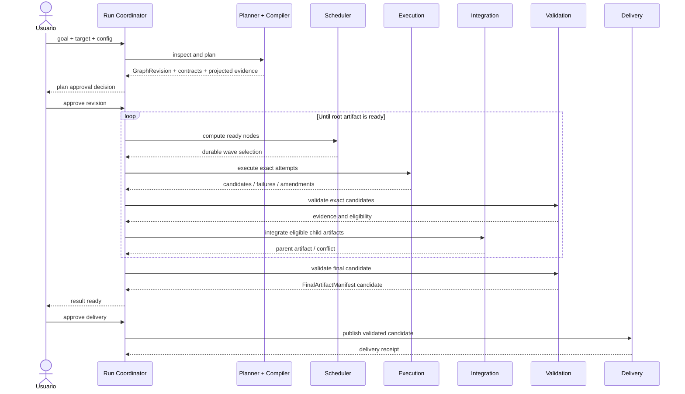

# ManyHands — especificación del sistema vigente

> Esta carpeta define los contratos que implementa el sistema actual. Para
> afirmar que un caso concreto funciona se inspeccionan código, tests y
> persistencia; la especificación no sustituye esa evidencia.

## Flujo completo

## Etapas

1. **Intake:** objetivo y target inmutables.
2. **Repository inspection:** estructura, convenciones, riesgos y baseline.
3. **Planning:** breakdown semántico y preguntas importantes.
4. **Graph compilation:** relaciones, contratos, scopes y validación.
5. **Approval:** revisión/versionado del plan.
6. **Scheduling:** readiness y waves persistidas.
7. **Execution:** intentos aislados sobre inputs exactos.
8. **Validation:** evidencia sobre commits candidatos.
9. **Integration:** composición bottom-up y reparación acotada.
10. **Delivery:** validación del candidato exacto y publicación.

## Índice

| Documento | Contrato |
|---|---|
| [`01-task-graph.md`](01-task-graph.md) | forma y semántica del grafo |
| [`02-contracts.md`](02-contracts.md) | obligaciones entre nodos, agentes y validación |
| [`03-decomposer.md`](03-decomposer.md) | inspector, planner, compiler y critics |
| [`04-run-executor.md`](04-run-executor.md) | coordinator, lifecycle y recuperación |
| [`05-worktree-layer.md`](05-worktree-layer.md) | bases, worktrees, commits y git |
| [`06-agent-executors.md`](06-agent-executors.md) | seam de agentes y procesos |
| [`07-context-and-scope.md`](07-context-and-scope.md) | grounding, contexto y límites de escritura |
| [`08-result-pipeline.md`](08-result-pipeline.md) | validación, Evidence Matrix y outcome |
| [`09-composer.md`](09-composer.md) | integración, repair y delivery |
| [`10-web-app.md`](10-web-app.md) | comandos, eventos y experiencia web |
| [`11-artifact-registry.md`](11-artifact-registry.md) | artefactos, manifests y freshness |
| [`12-scheduler.md`](12-scheduler.md) | readiness, waves y presupuesto |
| [`13-conflict-risk.md`](13-conflict-risk.md) | señales de conflicto y restricciones |
| [`14-repository-index.md`](14-repository-index.md) | modelo estructural del repositorio |
| [`security-boundary.md`](security-boundary.md) | amenazas, leases y aislamiento |

## Reglas transversales

- El dominio no depende de frameworks.
- Todo input adoptable tiene identidad y fingerprint.
- Todo efecto relevante produce un evento durable en su frontera real.
- Todo success está respaldado por evidencia.
- Las decisiones bloquean alcance, no el run entero por defecto.
- La UI no es fuente de estado.
- `completed` significa verificado y entregado.

## Implementación de referencia

- `packages/run-coordinator`: comandos, eventos, reducer, lifecycle, decisions,
  outcomes y políticas de recuperación.
- `packages/decomposer`: `PlanningModule`, canonical SemanticPlan, política de
  `ExecutionCut` y Graph Compiler; el planner anterior queda para compatibilidad.
- `packages/task-graph` y `packages/contracts`: grafo tipado y obligaciones
  versionadas.
- `packages/orchestrator-graph` y `packages/execution-core`: driver, bases,
  intentos, validación, integración y delivery.
- `packages/run-store`: event journal JSONL canónico, fencing, snapshots
  descartables y registros inmutables de attempts/artifacts.
- `apps/web`: composition root, commands/queries y proyección del workspace.

El registro JSON usado para listar runs y conservar metadata es una proyección
operativa. El lifecycle se reconstruye desde `*.events.v2.jsonl`; los snapshots
`*.snapshot.v2.json` se pueden regenerar y las trazas no gobiernan estado.

## Límites verificados

La suite E2E cubre el recorrido completo hasta delivery y sus recuperaciones. La
auditoría productiva del 18 de julio verificó además planning greenfield y
streaming progresivo con Claude Code CLI. La granularidad incremental del
adapter de Codex continúa dependiendo del stdout de la CLI y debe tratarse como
parcial hasta una prueba dedicada.

## Glosario mínimo

- **Composite:** nodo dueño de integrar outputs hijos.
- **Leaf:** unidad ejecutable e independientemente verificable.
- **Seam:** frontera compatible compartida por producer/consumers.
- **Artifact:** output material o lógico con identidad, digest y producer.
- **Attempt:** ejecución inmutable de una hoja contra inputs exactos.
- **Candidate:** commit producido pero todavía no adoptado.
- **Evidence:** prueba vinculada a un criterio.
- **Fresh:** producido contra las revisiones vigentes.
